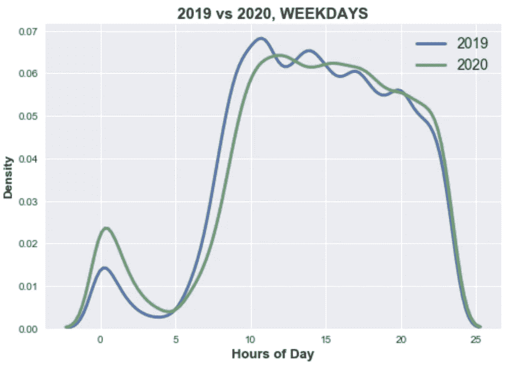

# 在家重新编辑—探索数据

> 原文：<https://towardsdatascience.com/redditing-from-home-exploring-the-data-2303bcf5c58c?source=collection_archive---------64----------------------->


由 [Unsplash](https://unsplash.com?utm_source=medium&utm_medium=referral) 上的 [chuttersnap](https://unsplash.com/@chuttersnap?utm_source=medium&utm_medium=referral) 拍摄

## 【Redditors 熬夜的时间越来越晚了吗？用 Python 来了解一下吧。

毫无疑问，这个疫情打乱了我们的计划。我现在正在 12 点写这篇介绍，时不时地，我必须提醒自己今天是日历上的哪一天。

这个问题激起了我的好奇心——还有多少人经历过这个问题？作为一个长期的 Redditor，我想知道在这个非常时期，像 Reddit 这样的网站的使用模式是否会有所不同。毫无疑问，人们醒得更晚，睡得更晚——他们白天的作息略有改变，甚至被打乱。WFH，即学生在家学习，消除了通勤时间，这是社交媒体消费的重要黄金时间。

发现我的祖国 subreddit [r/singapore](https://www.reddit.com/r/singapore/) 上的用户将如何改变他们的习惯肯定会很有趣。人们将如何着手分析这一点？

# 1.我们从一个假设开始

可以提出一个简单的假设:新加坡 Redditors 会熬夜到更晚，在晚上参与更多，而工作日早上的活动会减少。

**我们还可以提出第二个假设:**在新冠肺炎疫情期间，工作日和周末之间的使用模式差异将会缩小。本质上，工作日和周末将开始看起来一样。

## 假设

考虑到起作用的各种因素，我们可以做一些假设:

1.  在此期间，大部分 Redditors 将呆在家里。
2.  在选定的时间段内，由于新冠肺炎病毒引起的习惯变化将保持不变，假设封锁措施没有发生剧烈变化。

## 选择我们的数据集

Reddit 是巨大的。考虑到 r/Singapore subredit 上的大量每日提交内容，以及数据收集的限制，我们需要一个良好的数据分析范围。一个理想的选择:每日线程钉在子编辑的顶部。

**你看，每天早上 6 点，会自动创建一个每日主题供用户发表评论。用户被允许分享他们生活中的任何事情:从他们的通勤，到他们的人际关系，甚至他们工作中的老板。**


在这里，这些对话的性质是无忧无虑的，如果在网上看到一条*【早上好】*的信息，也不会令人惊讶。这些对话在一天内轻松积累了 1000 多条评论。

现在，如果我们收集新冠肺炎时期的所有这些帖子，并与之前的时期进行比较，看看评论的分布有什么不同，也许会出现一些有趣的模式。

# 2.数据收集

让我们首先决定调查的时间段。鉴于锁定措施在 2020 年 4 月初开始实施，如果我们认为用户习惯的改变需要一些时间才能生效，我们可以提前一周到 4 月中旬。我们比较了以下时间段:

1.  **2020 年 4 月 13 日至 2020 年 5 月 24 日***【6 周】*
2.  **2019 年 4 月 15 日至 2019 年 5 月 26 日** *(6 周)*

6 周的时间应该是一个足够大的数据集。我们将其与一年前的同一时间段进行比较，节省了几天的差异，因为我们希望该数据集也从周一开始。选择使用 2019 年的数据而不是 2020 年的开始月份是因为评论模式中可能存在**季节性**。这种季节性的一个例子是:学生由于年中考试而熬夜。

为了收集数据，我们需要某种 API 来提取数据。为此，我们可以使用 Reddit API 或 Pushshift API。

## 用 PRAW 刮螺纹

就个人而言，我更喜欢 Reddit API 提取线索的搜索功能。Python Reddit API 包装器(PRAW)易于使用，同时允许每分钟多达 30 个请求。

在**导入 PRAW** 之后，我们在使用每个月各自的线程标题进行搜索之前，定义了 r/singapore 子编辑。下面是我们第一次搜索的例子:

```
import praw**#define subreddit**
subreddit = reddit.subreddit('singapore')**#make a search**
apr2019 = subreddit.search('random discussion and small questions April 2019')
```

在进行了所有相关的搜索之后，我们创建了一个**字典**来存储每个线程的细节。然后，我们开始添加到这本字典。

***注*** *:我在代码中把每个* ***线程*** *称为一个* `submission` *。它们的意思是一样的。*

```
submissions_dict = { 'title':[], 'created_utc': [], 'comms_num': [], 'id':[]}for submission in generator:
      submissions_dict['title'].append(submission.title)
      submissions_dict['created_utc'].append(submission.created_utc)
      submissions_dict['comms_num'].append(submission.num_comments)
      submissions_dict['id'].append(submission.id)
```

最后，我们将这个字典存储在一个**熊猫**数据帧中:

```
import pandas as pd
submissionsRaw = pd.DataFrame(submissions_dict)
```

是时候使用我们的数据框架了！以下是对新增栏目的简要总结:

1.  `**timestamp**` **:** 我们使用`fromtimestamp`方法来获得实际的日期时间
2.  `**year**` **:** 来源于我们新的`timestamp`栏目
3.  `**dayOfWeek**` **:** 使用`weekday`方法导出
4.  `**typeOfDay**` **:** 使用`dayOfWeek`，我们将日子分为工作日/周末。我们也可以通过假设工作日的公共假日本质上和周末一样来做一些调整。耶稣受难日就是一个例子。

我们将看到一个大致的数据框架，如下所示:


## 第一眼:周末的评论比工作日少

在排除了不在我们分析时间范围内的帖子后，我们最终会有一个名为`submissions.`的数据框架。让我们快速浏览一下**数据透视表，按照`year`和`dayOfWeek`列对**进行分组，并找出一周中每天的平均评论数:


似乎平均来看，2020 年的评论数有所增加。从我们制作的突出显示中，我们可以看出**评论在一周的开始**、**是最高的，而周末的评论数量最低。**

有意思！你可能会认为情况正好相反…..

## 使用 Pushshift API 抓取注释

如果你认为我们结束了…不，还没有。我们仍然需要每个评论被写的确切时间！

我们将使用 Pushshift API 来收集评论。现在，Reddit API 可以做同样的事情，但是每个线程提取接近 1000 条评论(我们有大约 80 条)会相当慢。使用 Pushshift，您需要的只是惟一的线程 ID，它会在一个 JSON 文件中返回所有的注释:


在检查是否有空值之后，我们总结并在数据集中找到了超过 83，000 条评论。

# 3.让我们开始吧！

*恭喜你坚持住了！最艰难的部分已经过去了。收集数据总是花费最长的时间，但这确实是最重要的部分。现在更有趣的部分来了:**让我们观察一下我们的数据的分布。***

我们将实验三种不同类型的图表，探索它们的优缺点。

## 小提琴情节

Violin 图是查看数据集中多个分布的好方法。我们将通过按照一天的类型来分离我们的数据，并查看一天中几个小时的数据分布来了解如何做到这一点。我们将使用 Seaborn 绘图:

```
sns.violinplot(x='subm_typeOfDay', y='comment_hour', hue='subm_year', data=commentsDf, split=True)
```


似乎我们的小提琴看起来更像鱼，而不是！但这并不奇怪。很自然，在凌晨 3 点到 6 点之间几乎没有人会醒着发表评论(也许除了我)。

以上信息并不像我们希望的那样丰富。这是因为 violin 图是平滑的，只是为了给出数据的整体形状，并给我们一个粗略的想法。然而，我们可以比较这些峰值，以查看哪些时间具有更高的概率密度，我们可以看到 **2020 工作日似乎在午夜**具有更高的峰值。

但即使知道了这一点，还是很难给出一个数字。精确的点被添加，并使用一个你可以轻松操作的带宽进行平滑。通过添加一个参数`bw`，您可以看到如果将带宽降低到默认值以下会发生什么:

```
sns.violinplot(x='subm_typeOfDay', y='comment_hour', hue='subm_year', data=commentsDf, split=True, **bw =0.05**)
```


这几乎没有任何帮助。

不过，我还是有点喜欢下面的情节:

```
sns.violinplot(x='subm_year', y='comment_hour', hue='subm_typeOfDay', palette='Set2', data=commentsDf, split=True)
```


你可以看到 2019 年的数据在工作日和周末之间有相对不同的形状。工作日午夜的活动比周末少。

**而 2020 年的数据看起来更加对称。**我们鱼的尾巴看起来*几乎* *完美。我们的第二个假设是 Redditors 几乎分辨不出工作日和周末的区别，这个假设可能是正确的。*

但形状只是形状。让我们潜得更深！

## 直方图

直方图在查看单个条柱时更好，在本例中，条柱是一天中的小时。如果你没有注意到，我们之前的图中的小提琴实际上超过了 0-24 小时，这发生在我们使用概率密度的时候。所以这并不是最理想的表现，但也够烦人的了。

我们现在将使用 Matplotlib 的直方图，同时使用“seaborn”样式使其不那么难看:

```
**plt.hist**(comments19['comment_hour'], bins = bins, alpha = 1, edgecolor = 'white', label = '2019')
**plt.hist**(comments20['comment_hour'], bins = bins, alpha = 0.66, edgecolor = 'white', label = '2020')
```


为了让眼睛更容易看到，我们可以将 2020 年的数据叠加在 2019 年的数据上，降低其不透明度以进行比较。**我们注意到，2019 年只有早上 6 点到 9 点有更多的评论。**一天其他区间，2020 评论较多。然而，有些事情不太对劲。如果评论的增长是由用户的增长推动的会怎样？

让我们通过比较每个区间的**相对频率**来使其更加公平:

```
plt.hist(comments19['comment_hour']/3, bins = bins, alpha = 1, edgecolor = 'white', label = '2019', **density = True**)
plt.hist(comments20['comment_hour']/3, bins = bins, alpha = 0.66, edgecolor = 'white', label = '2020', **density = True**)
```


*现在*，我们可以更有信心地说:**2020 年，Redditors 在早上 6 点到下午 3 点之间的评论会更少。**

**他们也在晚上发表更多评论！**让我们一小时一小时地深入研究这个问题:


趋势随之而来。**2020 年夜间评论增多，早起鸟评论减少。同样令人着迷的是，从上午 11 点到下午 12 点仍然存在一个间隙！2020 年的人是不是醒的越来越晚，甚至过了晚上 12 点？或者午餐时间重新编辑不再是一件事，因为我们可以在家里任何时候休息？**

不过有一点是不变的，那就是从下午 3 点到 12 点的评论频率。我想那里的习惯并没有真正改变，因为那时几乎每个人都已经醒了。

我们现在可能忽略的一件事是，我们用一周中的所有日子来比较 2019 年和 2020 年。这不太公平。人们应该被允许在周末睡懒觉*(不做判断)*。

**让我们只比较工作日:**


差异仍然存在！

好吧，那么我们的第二个假设呢？通过我们的小提琴图，我们注意到 2020 年的数据在工作日和周末的分布更加对称。让我们试着用直方图来证明这一点，把 2019 年和 2020 年放在一起:

```
fig,ax = plt.subplots(1,2, figsize = (18,8), sharey= True)
```


我已经讲了一天的后半部分，重点是从午夜到 12 点。让我们仔细看看每年的工作日和周末有什么不同。当我们将周末叠加在工作日之上时，我们会注意到:

1.  在 2020 年的凌晨，工作日和周末模式之间的差距更短。注意 2019 年午夜的评论几乎是两倍。现在的情况并非如此。
2.  在 2020 年的早晨，差距也在缩小。
3.  2019 年的峰值频率大约在中午 11 点至 12 点之间，2020 年的工作日没有明显的峰值。

简而言之，工作日和周末的差别已经缩小了。

## 内核密度图

作为一个额外的视角，让我们以曲线的形式探索直方图的变化。我们将使用 Seaborn 来绘制内核密度图:

```
**sns.distplot**(comments19[comments19['subm_typeOfDay'] == 'weekday']['comment_hour'], hist = False, kde = True, kde_kws = {'linewidth': 3}, label = '2019')
**sns.distplot**(comments20[comments20['subm_typeOfDay'] == 'weekday']['comment_hour'], hist = False, kde = True, kde_kws = {'linewidth': 3}, label = '2020')
```



我们的观察仍然有效，现在我们有了数据的鸟瞰图。请注意午夜的差距，以及随后 2020 年曲线如何在凌晨 5 点后稍微向右移动，因为它在中午慢慢攀升到一个平台。

如果我们只看 2020 年:


工作日和周末之间的差距也变小了，尤其是在午夜。

# 4.结束的

我们用 Python 抓取了数据，并使用了 3 种不同类型的图表来查看 Reddit 评论的分布。

## 结论

1.  假设 1:确实现在新加坡 Redditors 晚上评论多，早上评论少。
2.  假设 2:工作日和周末的差别在午夜后最小！

## 走向

我们如何改进这一分析？以下是我们未来可以做的事情:

*   分析**变化率**。随着时间的推移，周末和工作日之间的差距是否在慢慢缩小？
*   有多少**独立用户**熬夜越来越晚？每晚的附加评论都来自同样的几个人吗？
*   刮掉子编辑上除每日线程之外的**其他来源**。
*   **文本挖掘**评论，生成最频繁的词和二元模型，比较 2019 年和 2020 年。

感谢您的阅读！