# 使用聚类重新定义 NBA 球员分类

> 原文：<https://towardsdatascience.com/redefining-nba-player-classifications-using-clustering-36a348fa54a8?source=collection_archive---------23----------------------->

## 篮球分析/机器学习

## 用层次聚类定义 NBA 球员

资料来源:unsplash.com

篮球已经存在了一百多年，随着这项运动的发展，新的规则和条例也随之而来，球员们也是如此。NBA 现在已经到了这样一个时代，控球后卫抢下 10 个以上的篮板，中锋在三分线上有效地投篮，7 英尺高的球员擅长成为主要的控球者，而低于 6 英尺 6 的球员作为中锋获得上场时间。球员们已经开始扩展他们的技能组合，以在整个球场上保持统治地位。这些球员已经不能用他们踢哪个位置来定义了。然而，在这个篮球的无位置时代，球队仍然局限于将球员归类到传统位置，将他们限制在过去球员的角色上。本文旨在提供一种新的方法，使用无监督学习方法将球员定义到某些类别中。

# 数据

所有使用的数据来源于 NBA.com 的[，由 2018-2019 NBA 赛季各种记录的游戏内球员统计数据组成。总共收集了 530 个数据点和 336 个特征，包括球员数据、一般统计、高级统计、防守统计、争抢统计、打法统计和传球统计。少于 12 分钟/场和少于 10 场比赛的球员被淘汰，这使得数据点数量减少到 388。](https://www.nba.com/stats/)

# **降维**

维度的诅咒可能是一件令人畏惧的事情。这不仅使模型更难解释，还会导致过度拟合。合理的假设是，并非所有的特征都给出了关于数据的有价值的信息，而一些特征给出了由另一个特征给出的类似信息。这里的数据集有 336 个要素，当然不是所有要素都与本项目相关。

[特征选择/降维](/feature-selection-techniques-in-machine-learning-with-python-f24e7da3f36e#:~:text=Feature%20Selection%20is%20the%20process,learn%20based%20on%20irrelevant%20features.)是任何数据科学管道中的重要一步。这里[皮尔逊相关](https://en.wikipedia.org/wiki/Pearson_correlation_coefficient)和[方差膨胀因子](https://en.wikipedia.org/wiki/Variance_inflation_factor)用于将特征数量从 336 减少到 87。

# **主成分分析**

[主成分分析](/a-one-stop-shop-for-principal-component-analysis-5582fb7e0a9c)是另一种流行的降维方法，一种在不丢弃任何特征的情况下设法保留所有信息的方法。特征选择已经将 336 个特征减少到 87 个，丢弃更多的特征可能对模型有害。PCA 的使用在保留所有信息和简化模型之间取得了完美的平衡。这里使用 Sci-Kit 学习库进行 PCA。下表显示了每个主成分解释的差异。

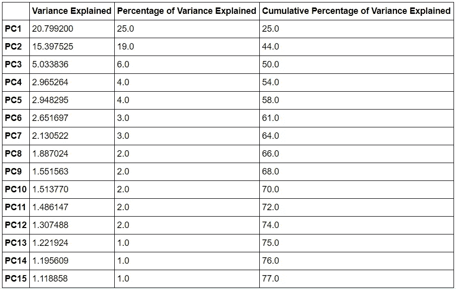

作者图片

PC1、PC2 和 PC3 加起来解释了数据产生的总变化的将近一半。用数据解释大约 60%的方差是一个很好的分界点，是模型复杂性和可解释性之间的完美平衡。前 6 个主成分成功解释了数据产生的约 61%的方差。后续组件的影响可以忽略不计，因为这些特征解释的差异较小。

# **解读主成分**

主成分通过使用它们的特征值来解释。具有高正特征值的特征意味着该组件与该特征具有高度正关联。具有高负特征值的特征意味着该组件与该组件具有高负关联。

## **PC1**

PC1 解释了数据产生的 25%的方差，因此在球员聚类中非常重要。下表显示了具有最高绝对特征值的前 20 个特征。

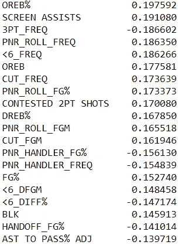

作者图片

PC1 似乎会奖励以下玩家:

*   抢很多篮板，
*   在[拾取&滚动](https://en.wikipedia.org/wiki/Pick_and_roll)期间创建屏幕并向篮筐滚动，
*   在离篮筐 6 英尺的地方有很强的防守冲击力，
*   争夺 2 分的尝试，
*   冲向篮筐，
*   做很多积木，
*   而且有很高的投篮命中率。

PC1 似乎会惩罚以下玩家:

*   在三分线附近防守频率高
*   并在挡拆时处理球。

高 PC1 值表明球员主要在篮筐附近打球。假设中心的 PC1 值较高是安全的。

## **PC2**

PC2 对方差有很大的贡献。下表显示了具有最高绝对特征值的前 20 个特征:

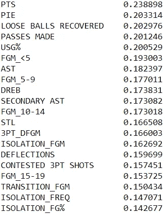

作者图片

PC2 与几乎所有形式的进攻都有积极的联系。特别是，高度评价以下玩家:

*   得了很多分，
*   具有高玩家冲击效率，
*   具有高使用率，
*   并通过隔离战术得分

高 PC2 值表明玩家是精英且高效的。人们可以假设全明星球员的 PC2 值会很高。PC2 重视进攻和防守的影响

## **PC3**

从 PC3 开始，与 PC1 和 PC2 相比，主成分在解释数据集产生的差异方面做得不太好，因此在区分玩家方面没有太大影响。下表显示了具有最高绝对特征值的前 20 个特征:

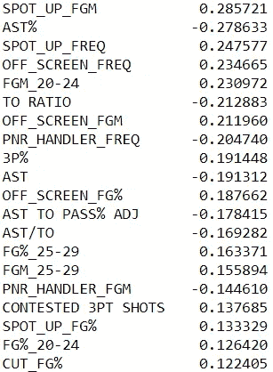

作者图片

PC3 似乎会奖励那些:

1.  做很多定点投篮，
2.  拍了很多屏幕外的照片，
3.  投篮距离篮筐超过 20 英尺，
4.  争夺 3 分的尝试，
5.  并且有很高的 3 分率

PC3 惩罚有下列行为的运动员:

1.  助攻很多，
2.  犯了很多错误，
3.  并在挡拆时处理球

高 PC3 值表明该球员投篮次数多，投篮距离超过 20 英尺，是高效的 3 分射手。

## **PC4**

下表显示了具有最高绝对特征值的前 20 个特征:

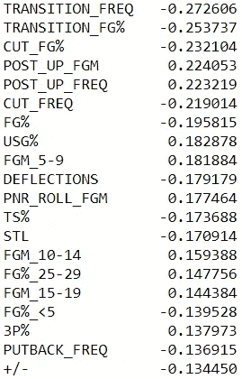

作者图片

PC4 似乎奖励那些:

1.  贴了很多，
2.  具有高使用率，
3.  得分距离篮筐超过 5 英尺，
4.  在挡拆时朝篮筐滚过去，
5.  并且有很高的 3 分率

PC4 似乎对以下玩家不利:

1.  通过过渡得分，
2.  冲向篮筐，
3.  投篮命中率和命中率高，
4.  产生偏转，
5.  后退，
6.  并且具有高+/-

高 PC4 值表明球员可以从篮下突破 5 英尺。拥有高 PC4 的球员可以在任何地方得分，无论是靠近篮筐，中距离还是三分线。

## **PC5**

下表显示了具有最高绝对特征值的前 20 个特征:

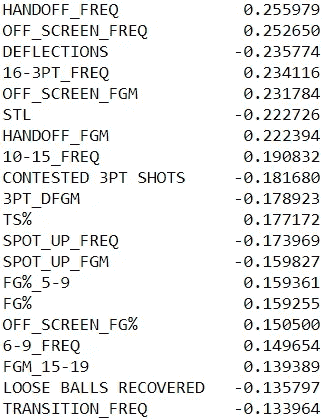

作者图片

PC5 似乎奖励那些:

1.  从移交和屏幕外得分，
2.  在距离篮筐 6 英尺以外有很高的防守频率，
3.  且具有高投篮命中率和真实投篮命中率

PC5 似乎惩罚那些:

1.  制造偏差和抢断
2.  争夺三分球，
3.  在三分线附近有防守冲击，
4.  拍摄特写镜头，
5.  回收松散的球，
6.  并通过过渡得分

高 PC5 值表明该球员主要在远离篮筐的地方打球，投篮命中率高，防守影响力低。PC5 高的玩家是占优势的射手，对游戏的其他方面没有正面影响。

## **PC6**

下表显示了具有最高绝对特征值的前 20 个特征:

作者图片

PC6 似乎会奖励那些:

1.  在距离篮筐 6 英尺以外有很高的防守冲击力，
2.  提起诉讼，
3.  多传球

PC6 惩罚进攻冲击力大的球员。高 PC6 值意味着球员在外线有巨大的防守影响力。

# **层次聚类**

这里的目标是重新定义玩家的分类。根据球员的位置对他们进行分类是一个过时的系统，在现代游戏中不应该有一席之地。但是，如果不是位置，那么应该用什么来分类那些玩得相似的球员呢？聚类是一种流行的方法，用于对标签未知的相似数据进行分组。这里，[层次聚类](https://www.kdnuggets.com/2019/09/hierarchical-clustering.html)用于根据可用数据对玩家进行分组。

## **霍普金斯试验**

在对数据进行聚类之前，进行了 [Hopkins 测试](https://en.wikipedia.org/wiki/Hopkins_statistic)来验证数据的空间随机性。这样做是为了确保我们的数据实际上是否显示出聚类趋势。(随机生成的数据点没有聚类倾向)。

*H0:数据点由非随机、均匀分布产生*

*H1:数据点随机生成*

通过进行霍普金斯试验，观察到 p 值为 0.3。因此，有一些证据来拒绝零假设，因此，有证据来推断数据点具有聚类趋势。

## **联动**

在尝试了不同的链接方法后， [Ward linkage](https://en.wikipedia.org/wiki/Ward%27s_method) 似乎在对手头数据进行聚类方面做得最好。下面是可视化聚类方法的树状图。

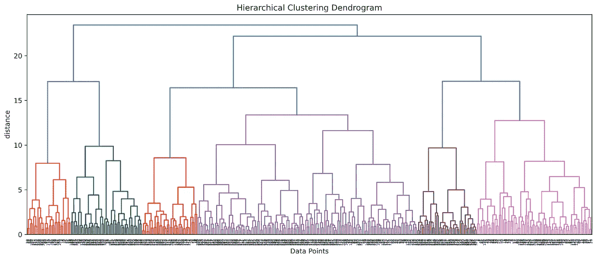

作者图片

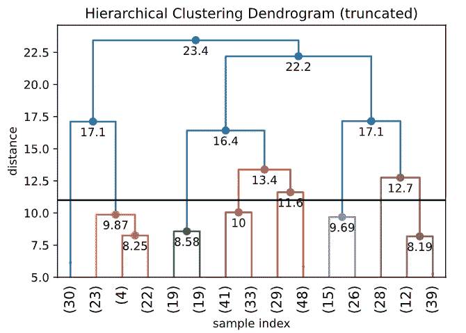

作者图片

直觉思维和[启发式](https://en.wikipedia.org/wiki/Heuristic_(computer_science))方法用于确定对数据进行分组所需的合适的聚类数。下面是肘图。

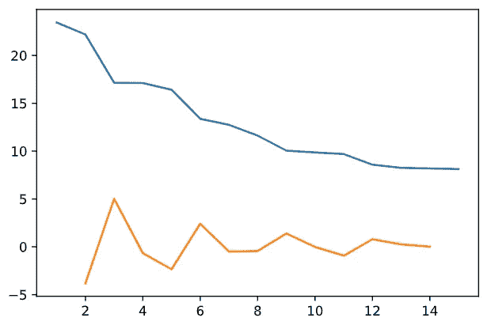

肘图(图片由作者提供)

从肘图中可以观察到，2、6 和 9 个集群在创建好的集群方面做得很好。只有 2 或 6 个集群胜过了对我们的数据进行精心分组的努力。因此，数据被分为 9 类。

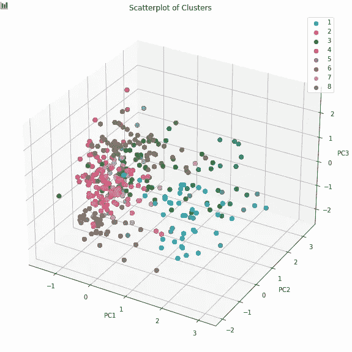

在三维平面上可视化集群(图片由作者提供)

# **解释集群**

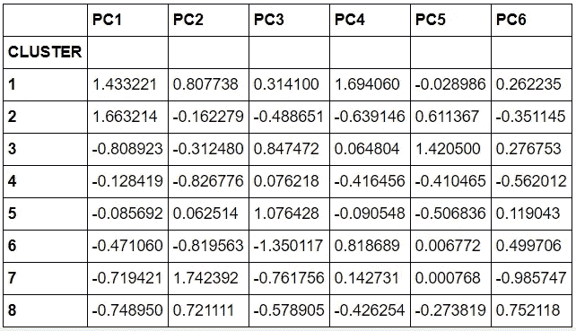

每个聚类中主成分的平均值(图片由作者提供)

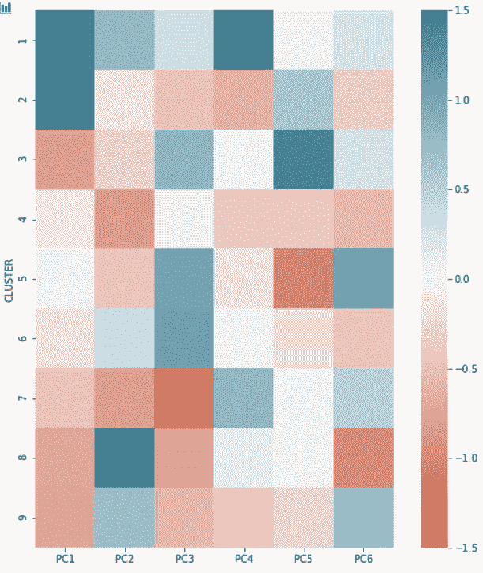

每个集群中主要组件的热图。(图片由作者提供)

## **集群 1——精英现代大人物**

集群 1 具有高 PC1、PC2 和 PC4，以及负 PC5。这意味着集群 1 中的球员大多在距离篮筐 6 英尺内打球，效率高，得分多，可以伸展地板，投篮距离篮筐 6 英尺以上。该集群中值得注意的参与者:

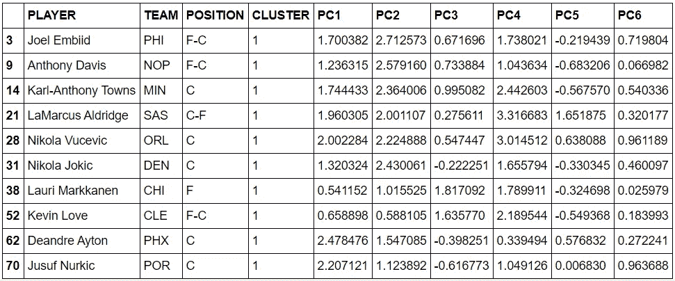

作者图片

## **集群 2——传统的大人物**

簇 2 的平均 PC1 值最高，PC4 值最低。集群中的球员在离篮筐 6 英尺以内打球，有很高的防守冲击力。然而，他们不能伸展地板，投篮距离篮筐超过 6 英尺。该集群中值得注意的参与者:

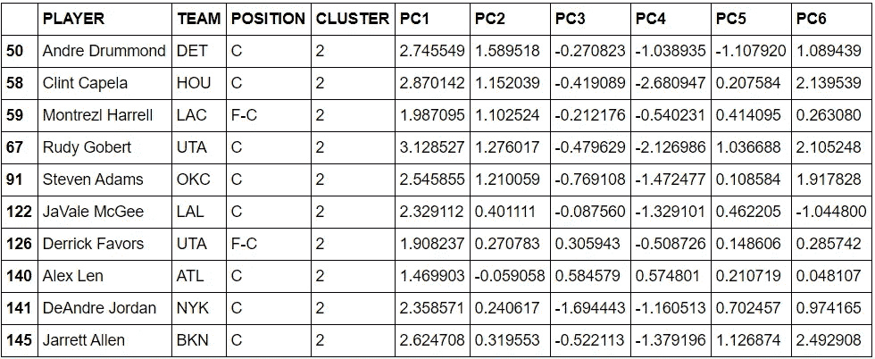

作者图片

## **第三组——精英三分射手**

聚类 3 具有最高的平均 PC5 值、高 PC3 和最低的平均 PC1 值。集群 3 的球员在外围活动，是高效的射手。他们很少靠近篮筐抢篮板。该集群中值得注意的参与者:

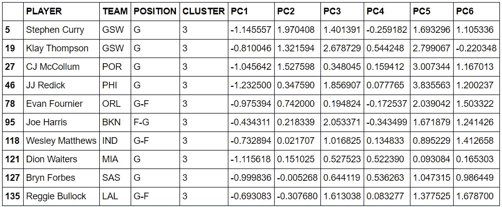

作者图片

## **集群 4——角色扮演者**

聚类 4 在所有主成分中具有非常低的值。这个集群中的玩家不是任何特定类别的精英。他们只有在 PC3 有正的平均值，这可能表明他们在外线打球，是不错的射手。他们的平均 PC2 值最低，表明他们得分较低，效率不高。该集群中值得注意的参与者:

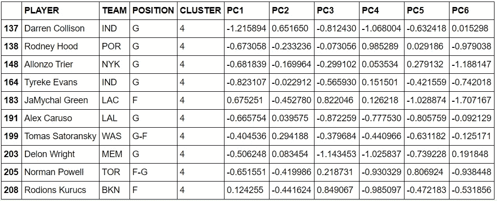

作者图片

## **集群 5**–3 和 D 玩家

聚类 5 具有高的平均 PC3 和 PC6 值以及最低的平均 PC5 值。这个集群中的球员是高效率的射手，他们在外线有很高的防守影响力。该集群中值得注意的参与者:

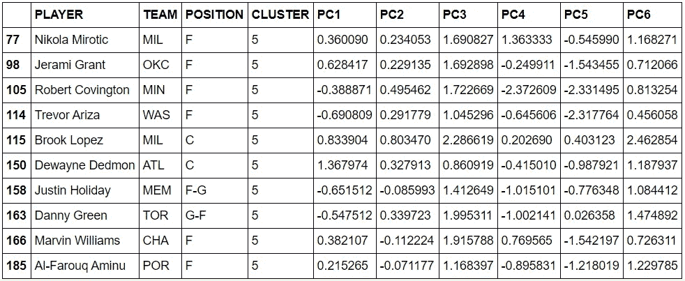

作者图片

## **集群 6**–3 级计分器

聚类 6 具有最高的平均 PC3 值。除了 PC2 和 PC3，该聚类中的平均主成分值为负。这个集群中球员都是射手，对得分有一定的影响。他们不一定只在三分线外得分。该集群中值得注意的参与者:

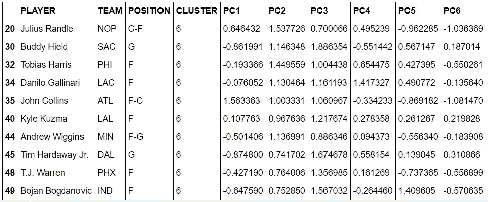

作者图片

# **第 7 组——得体的控球者**

聚类 7 具有最低的平均 PC3 和非常低的平均 PC2 值。它具有高平均 PC4 值。这个集群中的球员效率很低，在三分线内打球，但远离篮筐，使用率很高。这可能表明他们手中有很多球，但并没有真正得分。该集群中值得注意的参与者:

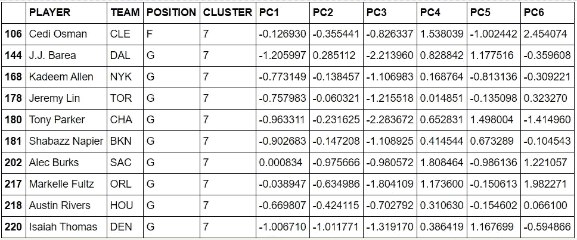

作者图片

## **集群 8 —** 精英全明星

聚类 8 具有最高的 PC2 值和最低的 PC6 值。集群 8 中的玩家获得大量的分数，并且效率最高。他们在一场比赛中负责得分。该集群中值得注意的参与者:

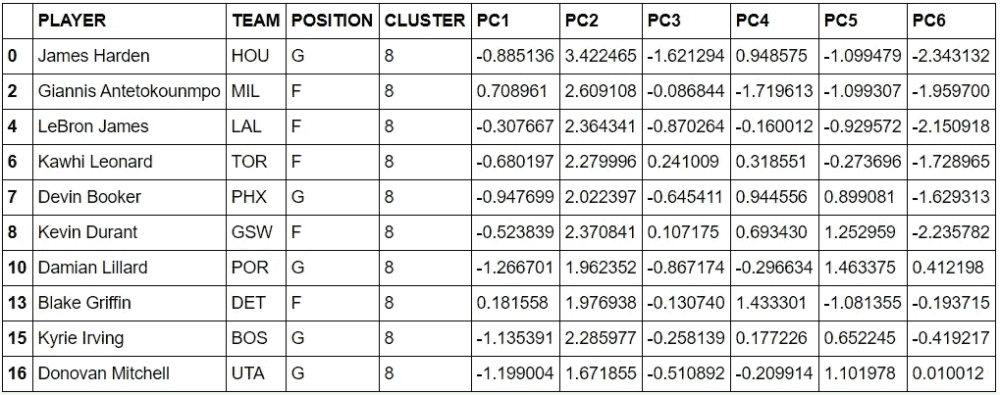

作者图片

## **集群 9 —** 双向外线球员

聚类 9 具有高的平均 PC6 值和相当高的平均 PC2 值。这些球员在进攻和防守上都是高效的球员。他们得分很多，加强了外围防守。该集群中值得注意的参与者:

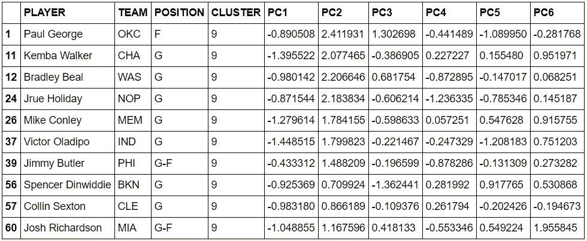

作者图片

# **检查集群的有效性**

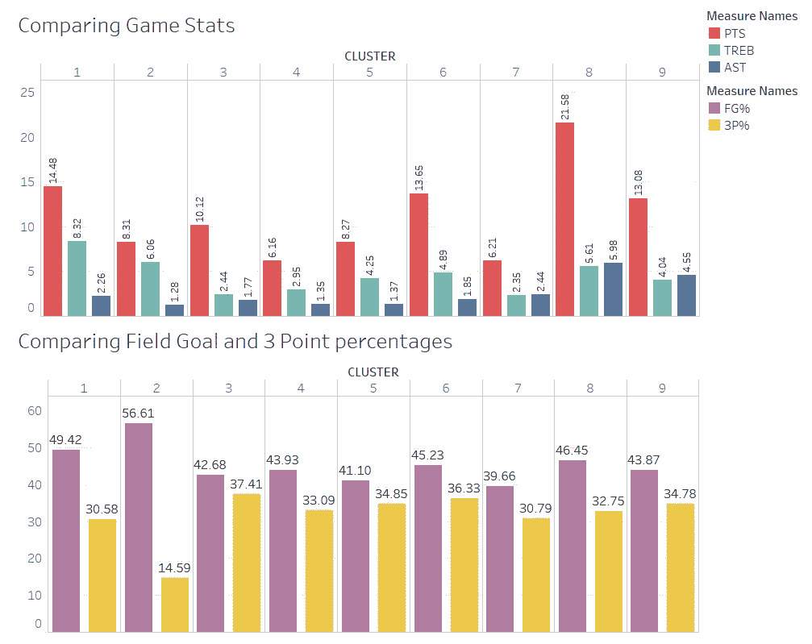

作者图片

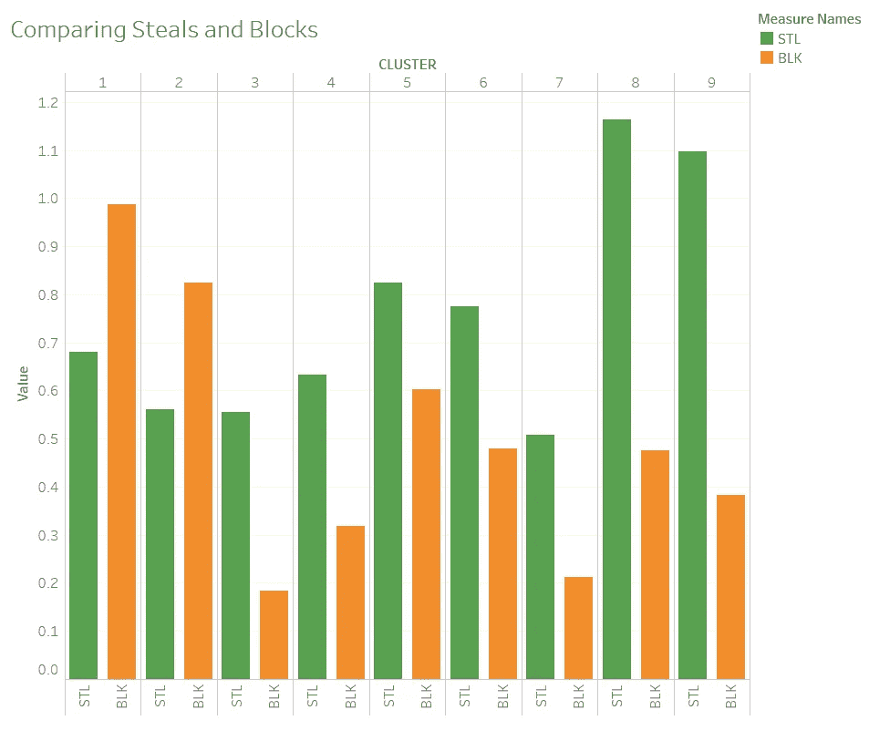

作者图片

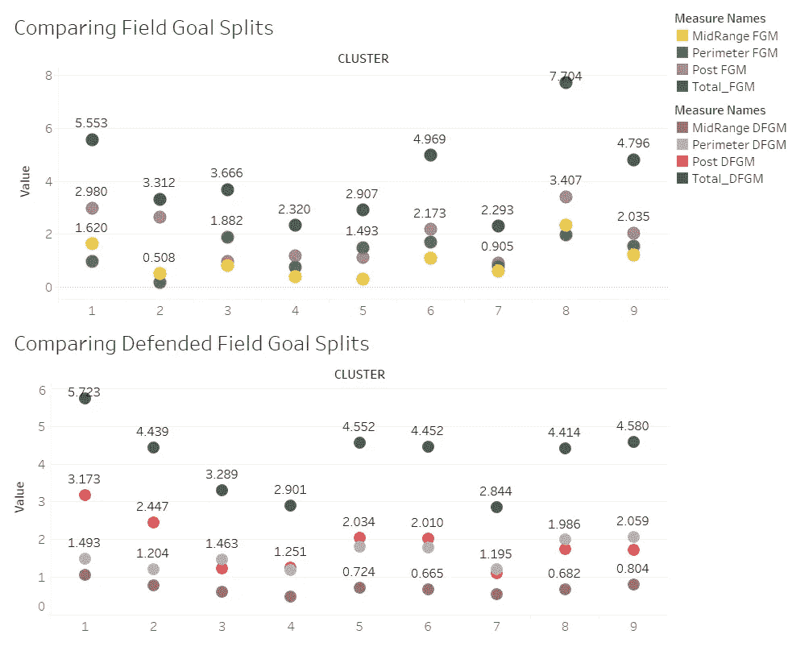

作者图片

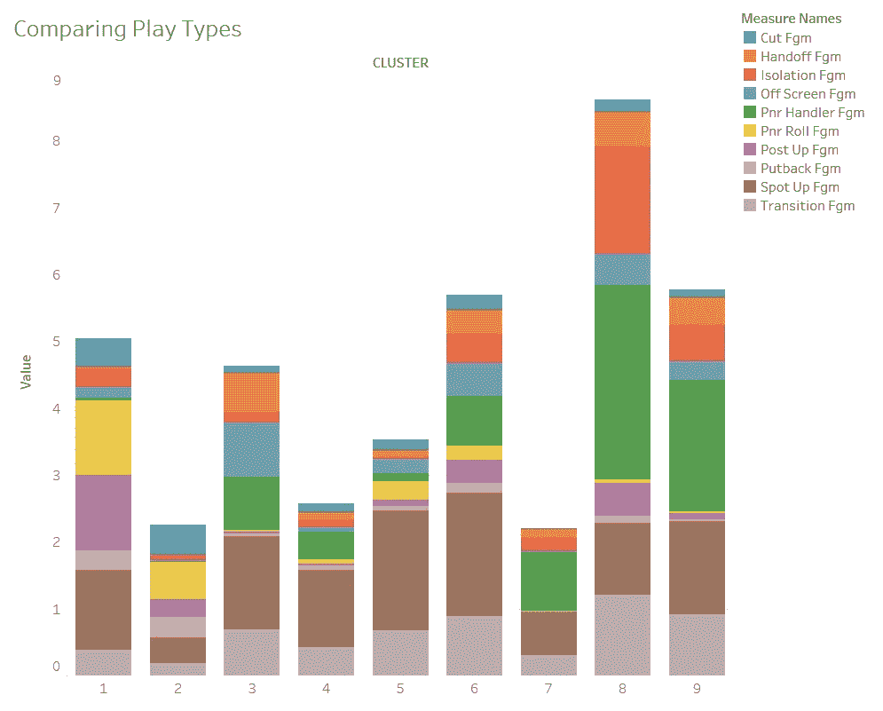

比较聚类中的各种统计数据(图片由作者提供)

## **集群 1**

集群 1 具有以下特征:

*   第二高的分数/游戏
*   场均最高篮板数
*   每场比赛最高平均盖帽数
*   平均投篮命中率第二高
*   第二高的投篮命中率
*   防守投篮得分/比赛得分最高
*   集群 1 的大部分进攻来自挡拆、补位和定点投篮

所有这些特征在精英大人物中非常普遍

## **集群 2**

集群 2 具有以下特征:

*   第二高的篮板数/场
*   第二高的区块/游戏
*   最高投篮命中率
*   最低 3 个百分点
*   每场比赛投篮命中率高
*   每场比赛第二高的防守投篮命中率
*   集群 2 的大部分进攻来自挡拆和切入

所有这些特征在**传统的大人物中非常普遍。**

## **集群 3**

聚类 3 具有以下特征:

*   最高 3 个百分点
*   每场比赛第二高的外围投篮命中率
*   集群 3 的大部分进攻来自于传球、场外投篮、处理挡拆和定点投篮。

所有这些特征在精英三分射手中非常普遍。

## **集群 4**

聚类 4 具有以下特征:

*   每场比赛得分最少
*   场均进球总数第二低
*   集群 4 的大部分进攻来自定点投篮

所有这些特质在**角色扮演者**中非常普遍。

## **集群 5**

聚类 5 具有以下特征:

*   高 3 个百分点
*   高抢断/比赛
*   高周界投篮/比赛
*   高位和外围防守投篮/比赛
*   集群 5 的大部分进攻来自定点投篮

所有这些特征在 3 号和 4 号球员(3 分和防守球员)中非常普遍

## **集群 6**

聚类 6 具有以下特征:

*   高分/游戏
*   高篮板/比赛
*   高场和 3 分百分比
*   每场比赛相对较高的内线和外线投篮命中率
*   与其他集群相比，高定位投篮、持球、挡拆、离屏、隔离、交接、切入和过渡投篮得分

所有这些特质在 3 级评分者中非常普遍。

## **集群 7**

聚类 7 具有以下特征:

*   非常低的分数/游戏
*   相对较高的助攻/场
*   最少的投篮命中率
*   每场比赛的最低投篮命中率
*   每场比赛防守投篮得分最低
*   集群 7 的大部分进攻来自于处理挡拆和定点投篮。

所有这些特征在正派的控球者中非常普遍。

## **集群 8**

聚类 8 具有以下特征:

*   最高分/游戏
*   最高助攻/场
*   高篮板/比赛
*   高投篮命中率
*   最高抢断/场
*   每场比赛的最高投篮命中率
*   高防守投篮得分/比赛
*   集群 8 的大部分进攻来自于隔离和挡拆。

所有这些特征在精英全明星中非常普遍。

## **第九集群**

聚类 9 具有以下特征:

*   高分/游戏
*   第二高的助攻数/场
*   高 3 个百分点
*   场均抢断第二高
*   每场比赛最高的外围防守投篮得分
*   集群 9 的大部分进攻来自于挡拆

所有这些特质在**周边双向玩家**中非常普遍。

# **解说**

通过层次聚类，得到了 9 个聚类，用一种新的眼光来描述球员。每个集群都有来自传统位置的玩家组合。有了这样的分类，球队不再局限于根据位置选择球员，而是可以扩大选择互补球员的范围。团队也可以通过让某些球员根据他们所属的群体打不同的位置来进行试验。

# **潜在的改进**

把玩家仅仅归为一类有点不合理。为每个玩家建立一个二级集群对于团队来说非常有帮助，同时可以创建一个协作良好的团队。

希望你喜欢这本书。你可以在我的 [GitHub](https://github.com/A-Jyad/NBAPlayerClustering) 上找到所有数据和脚本。请随时通过 [LinkedIn](https://www.linkedin.com/in/ahmed-jyad/) 联系我。为了获得更多有趣的 NBA 分析阅读，尝试使用机器学习分析 NBA 自由球员。