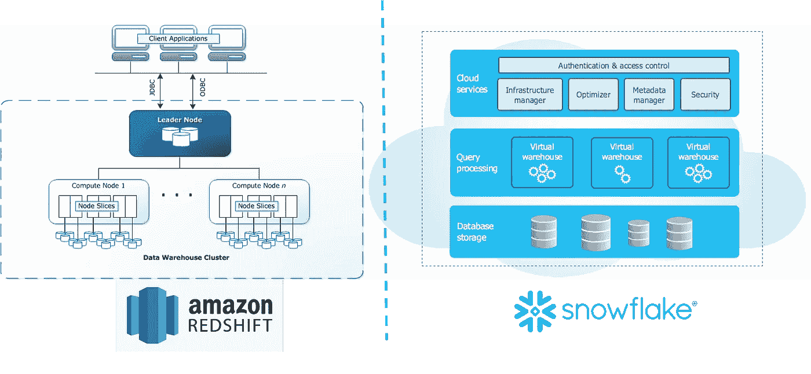
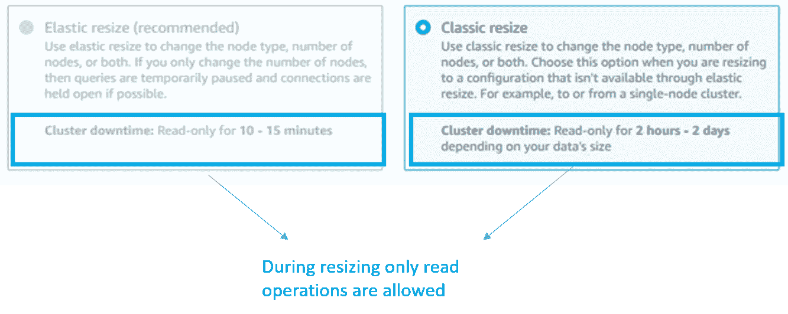
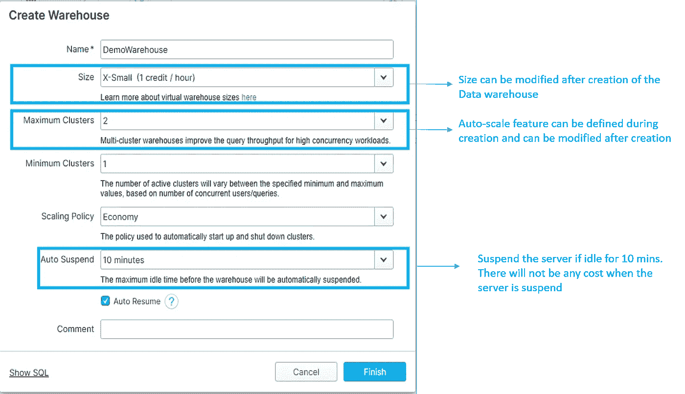
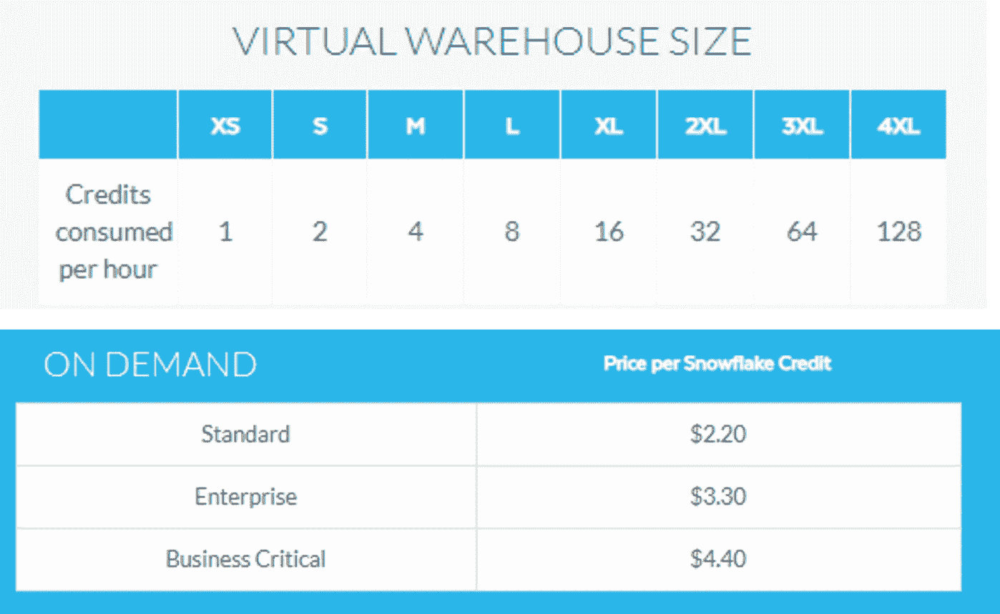
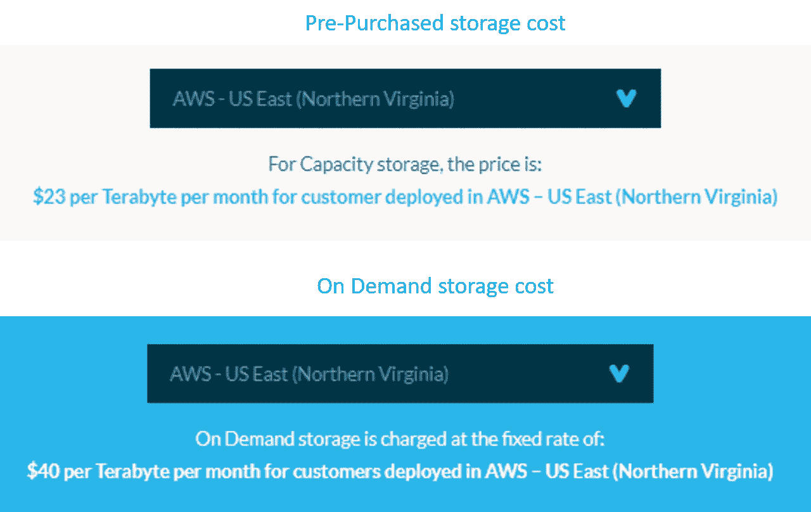
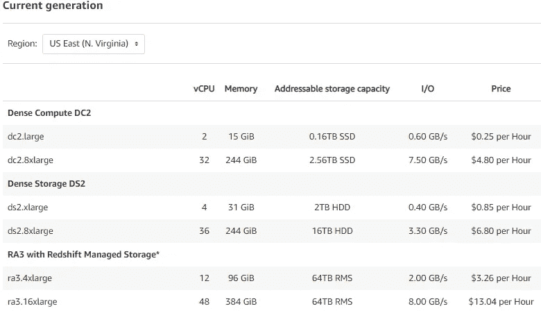
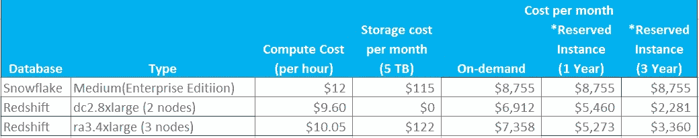

# 红移还是雪花！

> 原文：<https://towardsdatascience.com/redshift-or-snowflake-e0e3ea427dbc?source=collection_archive---------32----------------------->

## 需要知道的重要事情…

毛里西奥·古铁雷斯在 [Unsplash](https://unsplash.com?utm_source=medium&utm_medium=referral) 上拍摄的照片

当谈到在云上建立数据仓库时，nowflake 和 Redshift 是数据库的两个明显选择。在本文中，我试图展示我在使用这些领先的云数据库时所学到的东西。

# 1.体系结构

红移的核心成分是星团。群集可以有一个或多个存储数据的计算节点。领导者节点将任务分解为多个任务节点，每个任务节点并行工作。每个任务节点都有自己的存储和计算单元。

另一方面，雪花保持存储和计算独立，并集中存储数据，所有计算单元都可以访问。每个计算集群都在本地存储一部分数据以供处理。将存储与计算分开的优势在于，在性能瓶颈期间，可以添加更多计算，而不会影响现有工作负载。

架构比较

使雪花脱颖而出的关键架构差异之一是，雪花将其数据作为微分区文件(大小为 16 MB)存储在由雪花管理的 AWS S3(如果选择 AWS 云)上。它的元数据跟踪所有的微分区文件，并使雪花能够提供像[时间旅行](https://docs.snowflake.com/en/user-guide/data-time-travel.html)这样的功能，在几秒钟内克隆一个 TB 大小的表。所有这些都是可能的，因为底层数据(即文件)不会受到影响，而是完全由元数据控制，元数据包含逻辑模式与物理存储的映射。

# 2.表演

两个数据库共享以下功能:

*a.* ***列式数据存储*** *减少了从表中读取的数据量，显著减少了磁盘 I/O*

*b .****MPP****(大规模并行处理)架构*

*c .将压缩后的数据存储到****reduce disk I/O****，在查询执行过程中得到解压缩*

*d .查询结果得到* ***在 leader 节点缓存*** *以防红移，雪花在 compute 节点(本地磁盘)缓存查询结果。这避免了对数据执行重复查询*

*e. Redshift 提供了多种* ***技术来优化*** *数据库性能，如分布/排序键、分区和数据分布风格。然而，雪花没有提供任何优化技术。这可能对人们有好处，他们发现这很复杂，但也夺走了专家的机会。*

# 3.可量测性

通过在现有集群中添加或删除节点，可以增加或减少红移。在调整大小操作期间，*集群将以只读模式*可用。但是，自动缩放功能在 Redshift 中不可用

红移调整大小选项

雪花可以无缝地自动扩展其计算单元，而不会对现有工作负载产生任何影响。这是可能的，因为数据存储在计算集群之外。因此，数据不需要在群集间混洗，扩展速度很快，不会出现任何写入中断。

雪花大小调整选项

# 4.定价

雪花将“存储”和“计算”分开，用于成本计算。它以“信用”为单位来衡量**计算成本**。$积分值因计算规模和使用情况而异。

下表解释了成本是如何计算的。

雪花定价图

例如，一个中型虚拟仓库(企业版)1 小时的使用将花费 **4 个信用点* $3.30= $13.2**

**存储成本**有两种变化，即按需容量和预购容量。预购容量是经济高效的，因为它需要提前承诺使用量。下图显示 1 TB 存储按需存储的月成本几乎是预购存储的两倍

存储成本选项

Redshift 还提供按需和保留实例定价，根据实例类型和规模，1 年期可获得 20%-40%的折扣，3 年期可获得 50%-75%的折扣

红移群集节点有最大存储限制，这意味着应该添加一个节点来满足更多的存储需求。

红移价格图表

很难比较红移和雪花的成本，因为雪花不公开其服务器的配置。在下表中，对雪花中型 DW 和红移 DC 2.8 XL large 进行了指示性成本比较。但是，实际成本取决于使用情况和计划。红移提供保留实例，可以节省大量成本，而雪花自动暂停功能优化了服务器的使用，非常划算。

红移和雪花的价格比较

**红移有保留实例价格*

# 结论

红移和雪花都反映了云构建架构，并提供云数据平台。如果你计划采用一个，有几个参数你需要考虑的基础上短期或长期使用。

如果**生态系统**是 AWS 的重磅产品，并且您希望利用与其他 AWS 服务(如 CloudWatch、Cloud Trail、Glue Catalog 等)的无缝集成，那么 Redshift 会获得额外的积分。红移光谱是一个附加功能，可以帮助查询 S3 数据，而无需加载到红移中。虽然雪花通过“外部表”提供了同样的功能，但它在刷新元数据方面有一些[限制](https://docs.snowflake.com/en/user-guide/tables-external-s3.html#limitations-of-automatic-refreshing-of-external-tables-using-amazon-sqs)。

如果您是一个拥有多个部门的大型组织，并且需要临时读取数据，那么雪花可以提供更加灵活和经济高效的**工作负载管理**。由于其架构，不同的用户群体可以拥有单独的计算单元，其中一个计算单元的性能问题不会影响其他计算单元。此外，自动挂起功能可以将未使用的集群置于睡眠状态。

如果您的组织经常遇到意想不到的峰值，并且需要**频繁地扩大/缩小规模，**那么雪花最适合，因为您可以在几秒钟内调整集群的大小或添加/删除集群，而不会影响任何正在运行的进程。

*谈到* ***维护*** *，红移需要一些内务处理活动，如“分析”来更新统计数据，以及“清空”来重新排序行和回收空间，以保持性能完好。但是，Snowfla* ke 不需要这样的维护任务。