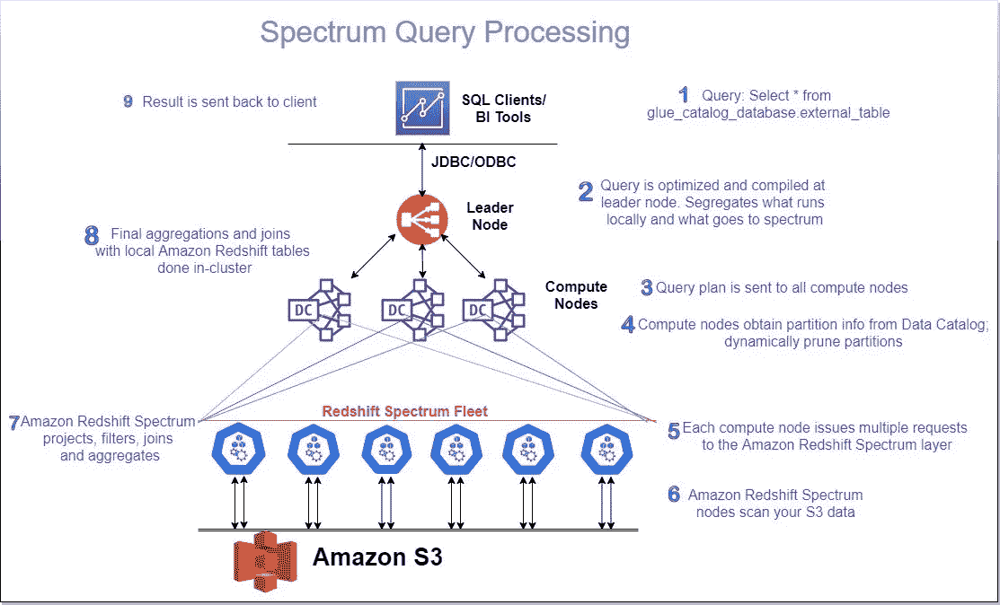
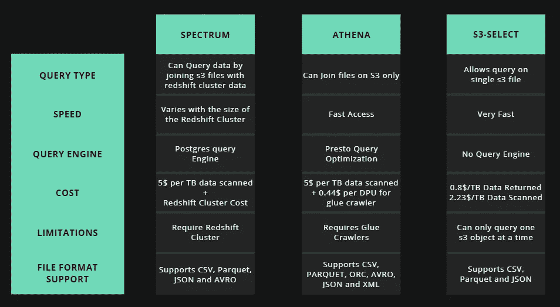

# 深入探究红移光谱及其内部结构

> 原文：<https://towardsdatascience.com/redshift-spectrum-f7ad968db6ef?source=collection_archive---------20----------------------->

## 完整的图片

## 红移光谱的内部功能以及何时在 Athena、Spectrum 或 s3 之间选择-选择通过 s3 查询数据

卡斯帕·卡米尔·鲁宾在 [Unsplash](https://unsplash.com?utm_source=medium&utm_medium=referral) 上的照片

AWS 在 2013 年推出了红移，在红移成功后，出现了清理被冷数据占据的簇的需求。但是，如果您也想访问您的冷数据呢？不经常，但可能一年一次。但是，您愿意为在您的集群中保存冷数据而支付集群空间费用吗？您很少使用这些冷数据，而且这些冷数据的大小会随着时间的推移而不断增加。

不，没错，没有人想用冷数据填满他们的集群。因此，红移星团最大的问题是以最小的代价查询冷数据。为了解决这个问题，AWS 在 2017 年推出了红移频谱，允许您查询存储在 s3 上的数据，并提供将 s3 数据(即冷数据)与红移数据(即热数据)连接起来的功能。

这节省了大量的集群空间，可以帮助您节省集群的总体成本，并且有了更多的可用空间，您可以提高查询性能，并为查询的执行提供更多的空间。

## 红移光谱的内部结构:

AWS Redshift 的查询处理引擎对于内部表(即位于 Redshift 集群或热数据中的表)和外部表(即位于 s3 存储桶或冷数据上的表)的工作方式是相同的。

要使用频谱访问驻留在 S3 的数据，我们需要执行以下步骤:

1.  创建胶水目录。
2.  创建指向 s3 数据的外部表。

> 没有必要运行爬虫，如果你想更新分区信息，只需运行 msck 修复表 table_name。

当我们使用 spectrum 查询外部表时，查询的生命周期是这样的:

1.  查询在集群的领导者节点中被触发，在该节点中查询被优化，并且领导者节点确定是否在本地运行哪个部分来访问热数据，以及什么进入频谱。
2.  查询计划被发送到计算节点，其中的表对信息和元数据进行分区(如果从粘合目录中提取的话)。
3.  称为 **Spectrum Fleet** 的多个受管计算节点与集群相关联，用于对外部数据集执行查询。
4.  Spectrum fleet 处理数据并将其发送回 leader 节点，在那里与热数据进行连接。
5.  leader 节点为我们提供了所需的输出。

红移谱中的查询生命周期

## 光谱车队

Spectrum fleet 有点棘手，我们需要了解它，以便为我们的工作负载管理选择最佳策略。

spectrum 机群由位于 VPC 内的多个托管计算节点组成，仅当您对外部数据执行查询时才可用。因此，这些计算节点完全由 AWS 在幕后管理。

现在问题来了，有多少计算节点可用于运行查询？如果您有 2 个节点红移集群，您能运行超过 10 TB 数据的频谱查询吗？对于外部表，计算节点的数量是无限的吗？

所以答案是**不**

> ***你没有得到无限的计算，但分配给特定频谱查询的节点数等于你的红移集群大小的 10 倍。***

如果您使用 2 节点红移集群，那么 AWS 将分配不超过 20 个节点来运行您的光谱查询。同样，对于 20 个节点的集群，您最多可以获得 200 个节点。

节点数量的分配通过以下方式确定:

1.  当我们查询外部数据时，leader 节点将生成一个优化的逻辑计划，并由此生成一个物理计划。
2.  现在，基于这个物理计划，redshift 确定处理结果所需的计算量，并分配必要的计算节点来处理查询。
3.  如果您的查询需要的节点数超过最大限制，redshift 将分配允许的最大节点数，如果这不能满足您的计算要求，查询将失败。

## S3 文件格式和压缩

红移谱可以查询超过 ***orc*** ， ***rc*** ， ***avro*** ， ***json* ， ***csv*** ， ***sequencefile*** ， ***parquet，*** 和**的数据 Amazon 建议使用分栏文件格式，因为它占用的存储空间更少，处理和过滤数据的速度更快，我们可以始终只选择所需的栏。要了解有关支持的文件格式、压缩和加密的更多信息，请访问[此处](https://docs.aws.amazon.com/redshift/latest/dg/c-spectrum-data-files.html)。

## 查询优化

要优化查询性能，您应该考虑以下几点:

1.  使用分栏文件格式，这将防止对分栏进行不必要的扫描。
2.  用正确的分区数量更新您的 glue 目录。
3.  编写您的查询以使用有资格被推送到红移光谱图层的过滤器和聚合。下面是一些可以通过子句、比较条件和模式匹配条件推送到红移谱层**的操作的例子，比如 LIKE** 、**聚合函数，比如 COUNT、SUM、AVG、MIN、MAX。**
4.  避免无法推至红移光谱图层的操作，包括 DISTINCT 和 ORDER BY。

要了解更多关于查询优化的信息，请访问[这里](https://docs.aws.amazon.com/redshift/latest/dg/c-spectrum-external-performance.html)。

## 监视

redshift 提供了两种系统视图来查看外部查询的性能:

1.  **SVL _ S3 查询**:提供段和节点切片级别的频谱查询细节。
2.  **SVL_S3QUERY_SUMMARY** :跟踪集群上迄今为止触发的所有频谱查询，包括处理的文件数、扫描的字节数(有助于确定查询产生的成本)

要了解更多关于查询优化的信息，请访问[这里](https://docs.aws.amazon.com/redshift/latest/dg/c-spectrum-metrics.html)。要解决查询错误，请访问此处的。

## 费用

根据扫描的数据量收取频谱费，即每 TB 数据 5 美元。

> *欲了解红移光谱性能详情，请访问本博客*[*https://AWS . Amazon . com/blogs/AWS/Amazon-Redshift-Spectrum-exabyte-scale-in-place-queries-of-S3-data/*](https://aws.amazon.com/blogs/aws/amazon-redshift-spectrum-exabyte-scale-in-place-queries-of-s3-data/)

## 选择光谱，雅典娜和 S3-选择

## 雅典娜:

当没有红移集群正在运行，并且您想要对驻留在 s3 中的数据执行分析查询时，应该考虑 Athena。或者您的数据与红移集群中的数据不相关，并且您不想对集群数据执行任何连接。与雅典娜相关的一些要点是:

1.  雅典娜是无服务器的。
2.  Athena 使用 Presto 查询引擎来优化查询。
3.  Athena 要求首先使用 glue 爬虫对数据进行爬行，这增加了它的总体成本。
4.  Athena 的总成本为每 TB 扫描的数据 5 美元+使用 glue crawlers 对数据进行爬行的每小时每 DPU 0.44 美元。

## S3-选择:

如果您只想过滤掉一个 s3 对象的数据，S3 选择非常有用。这提供了仅查询单个 s3 对象的功能，并且能够过滤数据。S3 选择功能包括:

1.  不需要服务器来运行对 s3 对象的查询。
2.  一次只能查询一个对象。
3.  可以在 Spark 应用程序中使用，以应用谓词下推。(相信我，如果您正在读取 csv 数据，这将提高您的速度)
4.  费用为返回数据 0.8 美元/TB，扫描数据 2.23 美元/TB。

## 红移光谱:

红移光谱只有在你已经是红移用户的情况下才应该考虑。如果您已经在红移集群上运行工作负载，那么应该使用红移频谱。红移谱填补了查询驻留在 s3 上的数据以及集群数据的空白。

Spectrum、Athena 和 s3-select 之间的比较

## 摘要

如果您希望查询驻留在 s3 上的数据并在 s3 和红移集群数据之间建立关系，红移光谱是一个很好的选择。它速度快、功能强大，而且非常经济高效。可以使用 BI 工具或 SQL workbench 查询 s3 数据。

红移光谱是一个非常强大的工具，但却被每个人忽略了。

我希望你喜欢这篇文章。

敬请关注更多内容。

参考资料:

[1] [红移光谱文档](https://docs.aws.amazon.com/redshift/latest/dg/c-using-spectrum.html)