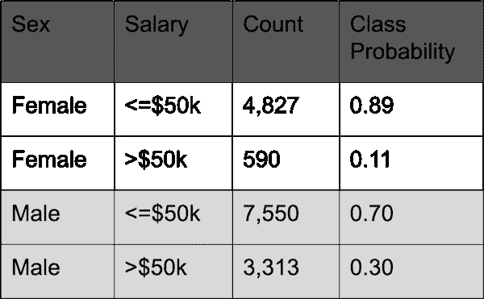
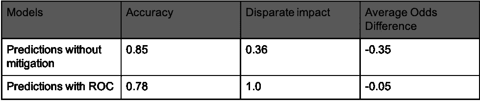

# 利用基于拒绝选项的分类减少人工智能偏差

> 原文：<https://towardsdatascience.com/reducing-ai-bias-with-rejection-option-based-classification-54fefdb53c2e?source=collection_archive---------51----------------------->

## 后处理阶段中偏差减轻的一个例子

[斯蒂夫·约翰森](https://unsplash.com/@steve_j?utm_source=medium&utm_medium=referral)在 [Unsplash](https://unsplash.com?utm_source=medium&utm_medium=referral) 上拍照

最近，我[开始](/how-to-tackle-ai-bias-ec39313ccacf?source=email-9bfcef3ebec4-1586530787969-layerCake.autoLayerCakeWriterNotification-------------------------fb98caee_cbeb_4f3d_975e_ac2ab2b36400&sk=0cd7318ea075d7dea801f776fd622cfe)撰写一系列文章，探索人工智能中的偏见，以及在工作流程中更详细地减轻偏见的不同方法。在我的前两篇博客中，我介绍了在建模的[预处理](/reweighing-the-adult-dataset-to-make-it-discrimination-free-44668c9379e8)阶段中作为一种缓解技术的重新加权，以及在机器学习工作流的[处理中](/reducing-bias-from-models-built-on-the-adult-dataset-using-adversarial-debiasing-330f2ef3a3b4)(模型训练)阶段中的对抗性去偏置。

机器学习(ML)管道中的第三个阶段称为后处理，我们可以在其中进行干预以减少偏差。后处理算法是可应用于模型预测的缓解步骤。关于公平性和校准[1]，监督学习中的机会均等[2]和区分感知分类的决策理论[3]是学术文献中提出的不同后处理偏差缓解技术。

在这篇文章中，我将重点探讨基于拒绝选项分类(ROC)的歧视感知分类技术的决策理论。在这种方法中，假设当模型对预测最不确定时，即在决策边界(分类阈值)附近，会发生最大的区分。因此，通过利用分类器的低置信区域来减少区分并拒绝其预测，我们可以减少模型预测中的偏差。

例如，对于 0.5 的分类阈值，如果模型预测是 0.81 或 0.1，我们将认为模型确定其预测，但是对于 0.51 或 0.49，模型不确定所选择的类别。在 ROC 中，对于在决策边界周围具有最高不确定性的模型预测，当有利的结果被给予特权群体或不利的结果被给予非特权群体时，我们修改它们。

这种方法的优点是您可以在建模工作流的最后阶段直接介入。这对于在预测时(或在部署环境中)，受保护的或敏感的属性可用的情况是有价值的。此外，这种方法以及一般的后处理技术提供了在不修改学习阶段的情况下进行缓解的选项，因此不受任何特定学习算法的限制。此外，这种方法也适用于不同的公平性定义。

像以前一样，为了证明这项技术可以用来减少偏差，我使用了成人数据集[4]。该数据集中的二元目标是个人收入是高于还是低于 5 万美元。它包含了几个在美国受法律保护的特征，但是为了简单起见，在这篇文章中，我将把重点放在性上。从下表中可以看出，男性是享有特权的群体，有 30%的可能性获得积极的结果(>50k)，而女性群体有 11%的可能性获得积极的结果。

如前一篇博客中所述，不同的影响度量(DI)是对数据中歧视的一种度量。分数为 1 表示数据集是无歧视的。当在成人数据集上计算男性和女性时，得分为 0.36。

为了评估效果，我在测试数据的模型预测上应用了 IBM 工具包【5】中 ROC 技术的可用实现。对于这个例子，我使用了统计平价差(这个指标与 DI 相同，但不是一个比率，而是两个概率之间的差)。为了简化与我之前的[博客](/reducing-bias-from-models-built-on-the-adult-dataset-using-adversarial-debiasing-330f2ef3a3b4)的比较，除了 DI 之外，我还将平均优势差作为另一个指标来进一步分析这些模型预测中的偏差。如前所述，平均优势差计算了非特权群体和特权群体预测的假阳性率和真阳性率的平均值之差。

实验结果表明了重新称重方法在减少歧视方面的有效性，如下表所示:

正如我们所看到的，模型准确性下降了 0.07，但这种技术能够显著提高 DI 得分，并将平均优势差几乎降至零。为了减少偏差，决策者应该考虑准确性和公平性之间的权衡。

与对抗性去偏置等内处理方法相比，实验表明，内处理技术比 ROC 等后处理技术在减少偏置方面更有效。然而，如果我们将 ROC 技术应用于招聘算法，并以与我们实验中相同的 DI 得分 1.0 结束，它将满足美国就业法规定的 4/5 规则(DI 得分至少为 0.8)。

# 参考资料:

[1] Pleiss，g .，Raghavan，m .，Wu，f .，Kleinberg，j .，和 Weinberger，K. Q. (2017)。论公平与校准。神经信息处理系统进展，5680-5689 页。

[2]莫里茨·哈特、埃里克·普莱斯和纳蒂·斯雷布罗。监督学习中的机会均等。神经信息处理系统进展，2016 年。

[3]卡米兰，f .，卡里姆，a .，张，X. 2012。区分感知分类的决策理论。在*IEEE 数据挖掘国际会议论文集(ICDM 2012)* 中，Zaki M. J .，Siebes A .，Yu J. X，b .，Webb G. I. & Wu X .(编辑)。IEEE 计算机学会，924–929

[4]“成人——UCI 机器学习。”5 月 1 日。1996 年，【http://archive.ics.uci.edu/ml/datasets/Adult】T2。

[5] R. K. E .贝拉米*等人*。“AI Fairness 360:一个用于检测和减轻算法偏差的可扩展工具包”，载于 *IBM 研发杂志*，第 63 卷，第 4/5 期，第 4:1-4:15 页，2019 年 7 月 1 日-9 月。