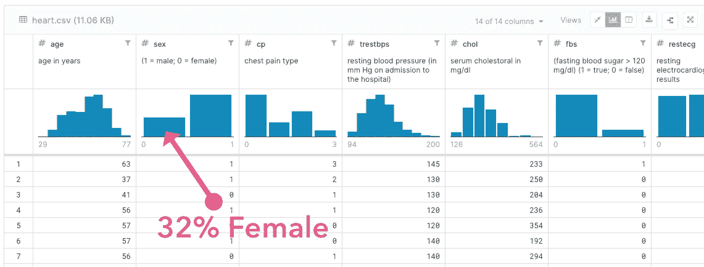
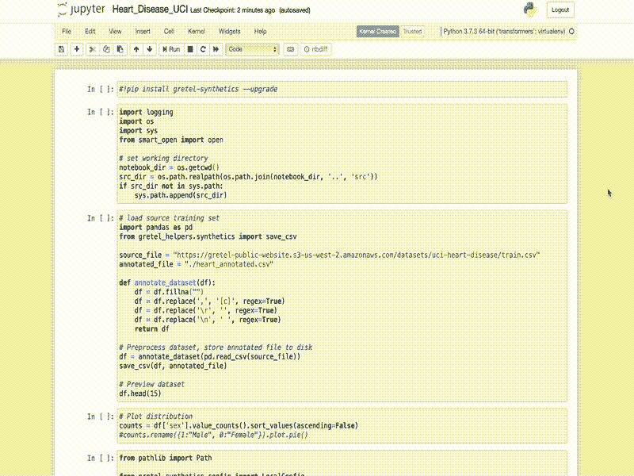
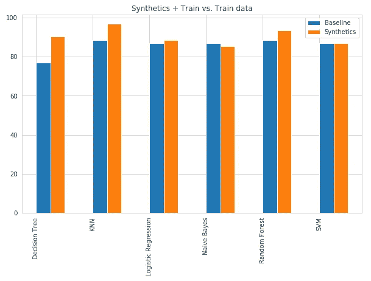
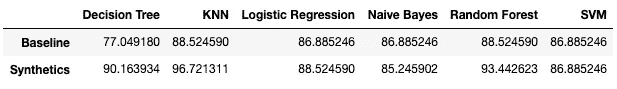

# 用合成数据减少人工智能偏差

> 原文：<https://towardsdatascience.com/reducing-ai-bias-with-synthetic-data-7bddc39f290d?source=collection_archive---------58----------------------->

## [公平和偏见](https://towardsdatascience.com/tagged/fairness-and-bias)

## 生成人工记录以平衡有偏差的数据集并提高整体模型准确性

在这篇文章中，我们将探索使用[合成数据](https://en.wikipedia.org/wiki/Synthetic_data)来增强 Kaggle 上一个受欢迎的健康数据集，然后训练表现和概括更好的 AI 和 ML 模型，同时减少[算法偏差](https://en.wikipedia.org/wiki/Algorithmic_bias)。

来源:Kubkoo，via iStockPhoto

由[加州大学欧文分校](https://archive.ics.uci.edu/ml/datasets/Heart+Disease)发布的[心脏病数据集](https://www.kaggle.com/ronitf/heart-disease-uci)是数据科学竞赛网站 [Kaggle](http://kaggle.com) 上排名前 5 的数据集之一，列出了 9 个数据科学任务和 1014+个由数据科学家创建的笔记本内核。它是一系列健康 14 属性，并标有患者是否患有心脏病，使其成为一个很好的预测数据集。

Kaggle 上的 UCI 心脏病数据集概述

快速浏览数据集显示，男性患者记录占整个数据集的 68%，女性患者记录仅占 32%。由于男性与女性患者的比例为 2 比 1，这可能导致数据集上训练的算法过度索引男性症状，并对女性患者进行不良诊断。在训练数据中，没有什么可以替代平等的群体代表性，尤其是在医疗保健领域。如果没有这些，我们如何尽可能减少输入数据中的偏差？

> "通过用合成记录扩充训练集，我们能减少性别偏见并提高 ML 的准确性吗？"

为了测试我们的论文，我们将使用 [Gretel.ai](https://gretel.ai) 的开源[合成数据库](https://github.com/gretelai/gretel-synthetics)来生成额外的女性患者记录，以尝试补偿有偏差的训练数据。我们希望这将有助于分类器提高对男性和女性患者心脏病的预测，并更好地推广未知数据。然后，我们可以在 Kaggle 上通过 ML 算法运行合成数据集，将结果与训练集进行比较。

Kaggle 上的一个顶级数据科学笔记本(由 forks 开发，链接如下)在 UCI 数据集上运行了一系列 6 种分类算法，并比较了所得模型的准确性。笔记本将原始数据集分割成训练(80%)和测试(20%)分割，我们将它们保存到磁盘上作为`[train.csv](https://gretel-public-website.s3-us-west-2.amazonaws.com/datasets/uci-heart-disease/train.csv)`和`[test.csv](https://gretel-public-website.s3-us-west-2.amazonaws.com/datasets/uci-heart-disease/test.csv)`。我们将使用 train.csv 来训练我们的合成模型，并使用 test.csv 来验证笔记本中的 6 种分类算法的结果。

 [## 心脏病-分类(机器学习)

### 使用 Kaggle 笔记本探索和运行机器学习代码|使用来自 UCI 心脏病研究中心的数据

www.kaggle.com](https://www.kaggle.com/cdabakoglu/heart-disease-classifications-machine-learning) 

# 训练合成数据模型

要生成自己的合成记录，请通过谷歌合作实验室(点击[此处](https://colab.research.google.com/github/gretelai/gretel-synthetics/blob/master/examples/research/heart_disease_uci.ipynb))启动 Gretel-synthetics，或者直接在我们的 [Github](https://github.com/gretelai/gretel-synthetics/blob/master/examples/research/heart_disease_uci.ipynb) 上查看笔记本。单击 Colaboratory 中的“Run all”下载从 Kaggle 导出的训练数据集，训练模型，并生成新的患者记录以扩充原始训练数据。

为您的合成数据模型配置以下设置-请注意，我们通过 15 个时期的训练和 256 个隐藏单元找到了泛化与模型准确性之间的良好平衡。请注意，在此配置中，不需要使用差异隐私进行培训，因为数据集已经被取消标识。

UCI 数据集的最佳合成数据模型配置

为了测试关于算法偏差的理论，我们在笔记本上添加了一个非常简单的自定义验证器，它只接受由我们的合成模型生成的女性记录(第 1 列-性别等于 0)。

简单的合成记录验证器，只接受由模型生成的“女性”患者数据记录

我们现在准备在我们的输入数据上训练一个合成数据模型，并使用它来生成 111 个女性患者数据记录，以增加我们的训练集。

创建合成的女性患者记录以添加到训练数据集(点击[此处](https://colab.research.google.com/github/gretelai/gretel-synthetics/blob/master/examples/research/heart_disease_uci.ipynb)在 Google Colab 中运行！)

合成模型很快学会了数据的语义，并在 10 个时期内训练到 95%以上的准确度。接下来，下载生成的数据集，让我们在 Kaggle 上运行它！

# 进行实验

现在，让我们转到 Kaggle 并运行分类笔记本(进行最少的编辑以允许原始模型和我们的增强模型运行)。为了方便起见，您可以在此处加载修改后的笔记本。默认情况下，它将与我们生成的测试集一起运行。要使用您自己的数据集，请将上一步生成的数据集上传到 Kaggle 笔记本。

 [## 心脏病-分类(机器学习)

### 使用 Kaggle 笔记本探索和运行机器学习代码|使用来自多个数据源的数据

www.kaggle.com](https://www.kaggle.com/redlined/heart-disease-classifications-machine-learning) 

# 结果

正如我们在下面看到的，创建并向训练集添加合成生成的患者记录提高了 6 种分类算法中 5 种算法的准确性，实现了**KNN 96.7%的总体准确性(高于 88.5%)** ，随机森林 93%，决策树分类器相对于非合成数据集上训练的模型提高了 13%。由于算法强烈假设所有特征都是独立的(因此是朴素的),并且合成数据模型可能学习并重放了训练数据中的相关性，因此朴素贝叶斯的准确性可能会下降。

合成的平均准确率:90.16%，原始的:85.79%。平均改善率:4.37%

整体模型性能(基线与基线+综合)

最后，查看按性别划分的模型准确性结果，女性的原始模型准确性平均值为 84.57%。通过增加女性患者数据记录和训练相同的模型，准确率提高到 90.74%。有趣的是，男性患者数据预测准确率也从 86.61%提高到 90.71%。

> 6.17%的女性心脏病患者现在可以被准确诊断！

# 结论

在 [Gretel.ai](https://gretel.ai) ，我们对使用合成数据来增强训练集以创建 ML 和 ai 模型的可能性感到非常兴奋，这些模型可以更好地概括未知数据，并减少算法偏差。我们很乐意听到你的用例——欢迎在评论中联系我们进行更深入的讨论， [twitter](https://twitter.com/gretel_ai) 或 [hi@gretel.ai](mailto:hi@gretel.ai) 。关注我们，用合成数据跟上最新趋势！

有兴趣在自己的数据集上进行训练吗？Gretel-synthetics 是免费开源的，你可以通过[合作实验室](https://camo.githubusercontent.com/52feade06f2fecbf006889a904d221e6a730c194/68747470733a2f2f636f6c61622e72657365617263682e676f6f676c652e636f6d2f6173736574732f636f6c61622d62616467652e737667)在几秒钟内开始实验。