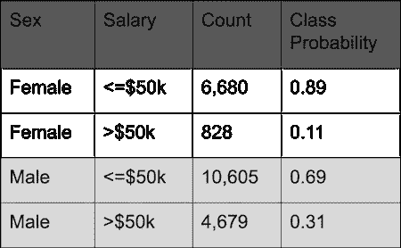
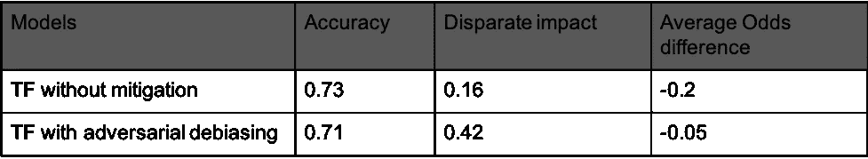

# 使用对抗性去偏差减少模型偏差

> 原文：<https://towardsdatascience.com/reducing-bias-from-models-built-on-the-adult-dataset-using-adversarial-debiasing-330f2ef3a3b4?source=collection_archive---------22----------------------->

## 处理阶段偏差缓解的一个例子

玛丽安·博斯在 [Unsplash](https://unsplash.com?utm_source=medium&utm_medium=referral) 上的照片

最近，我[开始](/how-to-tackle-ai-bias-ec39313ccacf?source=email-9bfcef3ebec4-1586530787969-layerCake.autoLayerCakeWriterNotification-------------------------fb98caee_cbeb_4f3d_975e_ac2ab2b36400&sk=0cd7318ea075d7dea801f776fd622cfe)撰写一系列文章，探索人工智能中的偏见，以及在工作流程中更详细地减轻偏见的不同方法。在之前的[博客](/reweighing-the-adult-dataset-to-make-it-discrimination-free-44668c9379e8?source=email-9bfcef3ebec4-1586898230635-layerCake.autoLayerCakeWriterNotification-------------------------69938872_94b8_4c59_bda0_ec47396b9398&sk=1a42df4fda2bf8dceaee361ef306c6db)中，我们讨论了一种在机器学习工作流程的预处理阶段使用重新加权示例来减轻偏差的技术。

机器学习(ML)管道中的第二个阶段是我们可以干预以减少偏差的阶段，称为处理中。处理中描述了算法学习过程中的一组干预和强制约束。带有公平性约束的分类[1]、偏见消除器正则化[2]和对抗性去偏置[3]是目前从学术文献中提出的不同的处理中偏见减轻技术。

在这篇文章中，我将重点探讨对抗性去偏见。在对抗性去偏置中，你建立了两个模型。首先是预测你的目标，基于你已经对训练数据采取的任何特征工程和预处理步骤。第二个模型是对手，它试图根据第一个模型的预测来预测敏感属性。理想情况下，在没有偏见的情况下，这种对立模型不应该能够很好地预测敏感属性。因此，对抗模型引导原始模型的修改(通过参数和加权)，这削弱了对抗模型的预测能力，直到它不能基于结果很好地预测受保护的属性。

这种方法的第一个优点是，您可以在建模工作流的学习阶段直接介入。此外，它可以应用于分类和回归，与重新加权不同，我们上周探讨了重新加权，并将您的建模选项限制为可以处理权重的方法，这可以应用于任何建模方法，包括基于梯度的学习模型。此外，这种方法也适用于不同的公平性定义。

像以前一样，为了证明这项技术可以用来减少偏差，我使用了成人数据集[4]。该数据集中的二元目标是个人收入是高于还是低于 5 万美元。它包含了几个在美国受法律保护的特征，但是为了简单起见，在这篇文章中，我将把重点放在性上。从下表中可以看出，男性是享有特权的群体，有 30%的可能性获得积极的结果(>50k)，而女性群体有 11%的可能性获得积极的结果。

如前一篇博客中所述，不同的影响度量(DI)是对数据中歧视的一种度量。分数为 1 表示数据集是无歧视的。当在成人数据集上计算男性和女性时，得分为 0.36。

为了评估对抗性去偏置技术的效果，我训练了两个 Tensorflow (TF)模型，一个没有任何缓解，另一个使用了该技术在[IBM toolkit](https://github.com/IBM/AIF360)【5】中的可用实现。除了 DI 之外，我还将平均优势差作为另一个指标来进一步分析这些模型预测中的偏差。平均优势差计算非特权组和特权组预测的假阳性率和真阳性率的平均值之差。

实验结果表明了重新称重方法在减少歧视方面的有效性，如下表所示:

在模型准确性仅下降 2%的情况下，这种技术能够显著提高 DI 评分，并将平均优势差几乎降至零。

与从训练数据中移除敏感属性或预处理技术等简单方法相比，实验表明，处理中技术在减少偏差方面更有效。然而，如果我们将对抗性去偏置技术应用于招聘算法，并以与我们实验中相同的 DI 得分 0.42 结束，它仍将远远低于美国就业法规定的 4/5 规则(DI 得分至少为 0.8)。

# 参考资料:

[1] L. Elisa Celis、Huang、Vijay Keswani 和 Nisheeth K. Vishnoi。具有公平性约束的分类:一种具有可证明保证的元算法。《公平、问责和透明会议论文集》，FAT* '19，2019 年。

[2] T. Kamishima、S. Akaho、H. Asoh 和 j .佐久法史。带有偏见消除器正则化器的公平感知分类器。数据库中的机器学习和知识发现，第 35–50 页，2012。

[3] B. H. Zhang，b .，M. Mitchell，“用对抗性学习减少不必要的偏见”，ACM 人工智能与社会会议，2018 年

[4]“成人——UCI 机器学习。”5 月 1 日。一九九六年，[http://archive.ics.uci.edu/ml/datasets/Adult](http://archive.ics.uci.edu/ml/datasets/Adult)。

[5] R. K. E .贝拉米*等人*。“人工智能公平 360:一个用于检测和减轻算法偏差的可扩展工具包”，载于 *IBM 研发杂志*，第 63 卷，第 4/5 期，第 4:1-4:15 页，2019 年 7 月 1 日-9 月。