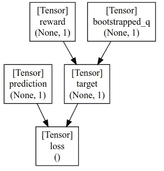

# 将 Tensorflow 调试时间减少 90%

> 原文：<https://towardsdatascience.com/reducing-tensorflow-debugging-time-by-90-percent-41e8d60f9494?source=collection_archive---------19----------------------->

## 介绍可应用于 Tensorflow 代码的 VeriTensor 代码方法，以提高调试效率。

来自 Pixabay 的[图片](https://pixabay.com/illustrations/scan-system-bug-virus-malware-3963099/)

如果你被困在付费墙前，使用[好友链接](/reducing-tensorflow-debugging-time-by-90-percent-41e8d60f9494?sk=a47e01af4a84a59c3fc4357967f0c8ff)。

Tensorflow 代码很难调试。我过去常常花数周时间调试我的代码。更糟糕的是，大多数时候，我不知道如何继续——我可以看到我的代码没有学习，但我不知道这是因为模型没有学习能力，还是因为实现有 bug。如果是后者，bug 在哪里？

这是很多机器学习从业者面临的挫败感。本文介绍了我为调试张量流代码而设计的 VeriTensor 方法。VeriTensor 基于合同方法的[设计。它包括三种技术。这种方法将我的调试时间从数周减少到数小时，提高了 90%以上。更好的是，在我完成调试后，我知道代码中没有错误。多棒的感觉啊！](https://en.wikipedia.org/wiki/Design_by_contract)

# 通过断言的规范

有效调试的关键是编写规范来定义代码的正确性。规格说明描述了代码应该做什么，实现描述了代码如何做。一段代码只有在其规格说明方面才是正确的。在 Python 中，使用断言来编写规范，如下面清单中的第 2 行和第 4 行所示。

但是你说，写断言是非常困难的。我同意你的观点。我花了 15 年时间用断言验证代码。我开发了基于断言的技术，微软将其包含在必应搜索引擎中。我知道规格有多复杂。这就是为什么当我开发 VeriTensor 时，我确保它是实用的。

> 有效调试的关键是通过断言告诉调试器代码应该做什么。

# 绝对张量方法

VeriTensor 包括 3 种技术。您可以在编写 Tensorflow 代码后应用它们。这意味着这些技术是现成的，你不需要从头开始使用它们。

## **技术 1:张量形状断言**

当你引入张量时，你需要写断言来检查它们的形状。关于张量形状的不正确假设经常会导致棘手的错误。而 [TensorFlow 的广播](https://www.tensorflow.org/performance/xla/broadcasting)机制可以把它们隐藏的很深。

例如，在一个回归算法中，比如深度 Q 网络(DQN)，你有一个来自神经网络的*预测*张量，一个*目标*张量和一个*损失*张量:

*预测*代表预测值。*目标*张量代表期望值，由*奖励*张量和*自举 _q* 张量计算得出， *gamma* 为浮点数。*损失*张量将我们的训练损失表示为均方误差。

现在我们为引入的张量添加断言，如下面的清单所示。这些断言检查*预测*和*目标*的形状在*批量大小*和*动作尺寸方面必须相同。这些是 DQN 算法中使用的一些量。如果你不熟悉他们，不要担心。这里重要的是，我们编写断言来检查张量形状。最后，由于*损失*评估为一个数字，断言声明其形状为[]。*

如果张量的形状与期望值不匹配，你会得到断言违反。你不会相信你的形状断言经常被违反！

## 技巧 2:张量依赖性

Tensorflow 程序是一个计算图。所以你需要确保你正确地构建了张量图。如果张量 B 的值依赖于张量 A 的值(例如 B=A+1)，那么在图中应该有一条从节点 B 到节点 A 的边。

您可以使用 TensorBoard 可视化您的张量流图。然而，理解这个图是困难的，因为现实的张量图通常有数百个节点和边。下图显示了典型的张量板可视化。

这里的关键见解是:要检查你的张量图的结构，你只需要可视化你引入的张量之间的关系。你可以把许多张量组合成一个节点。例如，在具有许多变量的多层神经网络中，每个变量都是一个张量。但是你只需要把整个网络想象成一个单独的节点。

我开发了一个 Python 包， *VeriTensor，*来简化张量图可视化。我将很快对这个包进行开源。它包含一个类 *TensorGroupDependency。这个类允许你只注册你想要可视化的张量。它为注册的张量生成一个新的、小得多的可视化。*

下一个清单显示了如何使用 *TensorGroupDependency。*您首先调用 *add* 方法来注册张量。然后调用*generate _ dot _ re presentation*方法给你一个可视化。该可视化仅显示了已注册的张量及其相关性。

第 1 行到第 5 行创建了一个张量依赖图对象，并注册了要可视化其关系的张量。第 8 行和第 9 行用[点](https://en.wikipedia.org/wiki/DOT_(graph_description_language))语言生成并打印这些张量依赖关系，可以用图形方式呈现:

让我们来理解上面的依赖关系图:

*   图中的节点代表一个张量或一组张量(例如神经网络中的所有变量)。
*   如果 B 中至少有一个张量依赖于 A 中的一个张量，那么从节点 B 到节点 A 就有一条有向边。在我们的例子中，*损失*张量依赖于*预测*和*目标*张量。所以从预测节点和目标节点到丢失节点有两条有向边。
*   在每个节点中，你看到它的种类，比如【张量】、【占位符】、【变量】。
*   在每个节点中，您还可以看到张量形状，例如(None，1)，这意味着二维张量，第一维是动态长度 None，第二维是长度 1。而*损失*张量有 shape()，因为它是标量。

为了检查图结构的正确性，你需要解释为什么每条边都存在。这意味着解释那些张量之间的依赖关系。如果你无法解释某些边的存在，那么你脑海中的想法和你构建的实际图形之间就存在差异。这通常意味着一个错误。

一旦解释了所有的边，就可以通过调用 *generate_assertions* 方法来生成描述图的断言，如上面代码片段中的第 12 行所示。下面的清单显示了生成的断言。它们描述了相同的依赖图。它们将成为您代码的一部分，并将在所有未来的执行中被检查:

顺便说一下，如果您在 Tensorflow 代码中仔细设计了名称作用域，并在 TensorBoard 可视化中执行了严格的折叠，您可以得到与上面的库相同的东西。但是我认为图书馆很好，因为:

1.  最有可能的是，你没有仔细设计你的名字范围——我说的对吗？
2.  有了这个库，您可以生成那些张量依赖断言，这将有助于您在所有未来的执行中进行调试。

## 技术 3:张量方程评估

到目前为止，您已经验证了您定义的张量之间的依赖关系。最后一步是检查张量是否执行了正确的数值计算。例如，方程 B = A +1 和 B = A -1 都引入了从 B 到 A 的依赖关系，因此它们的依赖图是相同的。但是你需要指定 B=A+1 是正确的实现。使用张量方程评估对算法中的每个方程执行此操作:

*   在每个优化步骤中，通过在*会话中添加张量来评估所涉及的张量。*
*   在 numpy 中用那些张量求值写出相同的等式，以计算所需的值。然后断言期望值与实际值相同。

下一个列表显示了对*损失*张量的张量方程评估。 *session.run* 对 *parameter_update_operations，*这是你通常拥有的东西，就像梯度下降步骤。除了这些通常的工作，现在 *session.run* 还评估*预测*、*目标*和*损失*张量。你可以从这三个张量计算出期望的损失。最后，您在第 4 行和第 5 行断言实际损失等于期望损失。注意，第 4 行和第 5 行是在 Python 世界中。在 Python 世界里，你可以使用循环，调用任意函数；这比在张量流世界里容易多了。

# 这些技术是否有效和实用？

我们已经将这些技术应用于我们所有的张量流学习者。下表报告了我们验证五个模型所花费的时间以及我们发现的错误数量。

表 1。使用断言技术检测到的错误

“学习模块”列列出了机器学习模型的名称。这些是深度强化学习中的演员-评论家算法。

“编码时间”列报告了我们为这些学习者编写代码所花费的时间，以小时为单位。我们总共花了 24 小时。

“验证时间”列报告了我们在验证中花费的时间。这包括编写断言、运行代码、观察断言违规和修复检测到的错误。我们总共花了 5 个小时。换句话说，验证需要多付出 20%的努力。

“Bugs detected by”列是对每种断言技术的细分。它显示了花费在每项技术上的时间百分比以及检测到的 bug 数量。总的来说，我们仅在 5 小时内就发现了 23 个错误。更重要的是，在应用了这些技术之后，我们知道我们的代码是正确的。

我们可以清楚地看到 VeriTensor 在检测 bug 方面是有效的。

# 为什么 VeriTensor 对检测 bug 有效？

首先，它们要求您通过断言来定义代码的正确性。编写规范并不是一个新想法，但 VeriTensor 使它变得切实可行:

*   形状断言要求你写下你引入的张量的形状——很简单！
*   张量依赖只需要你关注你引入的张量。这个阶段不需要检查数值运算。这将图形从数百个节点减少到十几个，使人类调查变得切实可行。自动生成断言减少了写下断言所需的时间。
*   在张量方程求值中，你检查 Python 世界中的每一个方程。Python 世界比 Tensorflow 世界简单多了。

第二，在 Tensorflow 中找到 bug 的来源是一件令人畏惧的事情。人们花大部分时间定位错误的来源。一旦我们知道了根源，修复 bug 通常就很容易了。当按顺序应用时，绝对张量技术可以帮助你定位断层。当你在张量依赖阶段遇到问题时，你知道所有涉及的张量都有正确的形状。当你对一个张量方程有问题时，你知道依赖结构是正确的。简而言之，你可以更好地关注和定位每一个问题。

第三，VeriTensor 将 Tensorflow 代码调试从一门艺术变成了一个软件工程过程。如果您遵循一个简单的待办事项列表，该过程将确保代码是正确的:

1.  为你引入的所有张量写一个形状断言。
2.  解释这些张量之间的所有依赖边，并自动生成结构化断言。
3.  写一个断言来检查算法中的每个等式。

验证和/或测试代码时的一个常见问题是知道如何进行以及何时停止。你从代码的哪一部分开始？应该检查哪些方面？你怎么知道你已经测试够了呢？

我们的三项技术消除了这些疑虑。你一个一个地应用它们，每种技术都有有限的和可管理的步骤。步骤的数量受到你在代码中引入的张量和方程的数量的限制——通常在十几个左右。最后，你知道你的代码是正确的。这是一个工程过程，不是一门艺术，不要忽视这样一个工程过程的力量。当人们知道确切的步骤时，他们会更有效率。

> 不要忽视这样一个工程过程的力量。当人们知道确切的步骤时，他们会更有效率。

# 验证代码正确性，而不是性能

我需要说明的是，VeriTensor 验证代码的正确性。它不评估代码的性能。正确性意味着你实现的代码符合你的想法。性能是它学习有意义模型的能力。性能通常通过绘制损失、交叉验证、测试数据来衡量。

只有在确定了代码的正确性之后，您才应该查看代码的性能。我称之为先正确后性能原则。否则，你需要担心糟糕的性能是因为学习算法不够好还是代码中存在一些 bug。显然你想要后者，但是你将很难证明你的代码没有错误。

> 先正确后性能原则:只有在确定了代码的正确性之后，才考虑代码的性能。

可悲的是，我看到许多人使用的模式是使用性能指标来驱动调试。当他们的代码没有学习时，他们通过绘制损失函数来开始调试。这违反了先正确后性能的原则，因此无法有效地发现 bug。这是因为:

1.  性能指标是渐进定向的，而不是单调的。例如，损失函数应该随时间而降低。但是在任何时间点，包括你正在调试的时间点，这些数字都可能上升或下降。没有一个正确的值会让你很难识别出是否有问题。将这与断言进行比较:当存在断言违规时，您知道事情是错误的。
2.  即使您可以看到性能指标明显是错误的，它们也不会告诉您错误源自哪里。将其与 VeriTensor 的故障定位支持进行比较。你分阶段发现 bugs 张量形状阶段、张量依赖阶段、张量值阶段。在每个阶段，你都可以专注。
3.  在您修复了 bug 之后，很难为该 bug 编写回归测试。这是因为 bug 的起源和性能度量的症状离得很远。将这与使用断言的测试用例编写体验进行比较。你只需要把主学习循环变成一个学习时间步长更小的单元测试，就可以使测试更快地终止。您可以使用真实输入或随机输入。

# 支持我

如果你喜欢我的故事，如果你考虑通过这个链接成为一名灵媒会员来支持我，我将不胜感激:[https://jasonweiyi.medium.com/membership](https://jasonweiyi.medium.com/membership)。

我会继续写这些故事。

# 视频演示

一年半前，我在 Tensorflow 深潜活动上展示了 VeriTensor。这个演讲很受欢迎。这是演示文稿。

在那之后的 20 个月里，我将 VeriTensor 应用于我所有的机器学习代码，它一次又一次地工作。希望对你也有帮助。