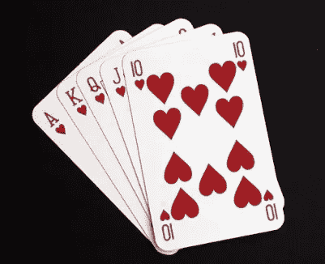

# 通过转换数据来降低人工神经网络的复杂性

> 原文：<https://towardsdatascience.com/reducing-the-artificial-neural-network-complexity-by-transforming-your-data-37ff50d94562?source=collection_archive---------37----------------------->


艾莉娜·格鲁布尼亚克在 [Unsplash](https://unsplash.com?utm_source=medium&utm_medium=referral) 上的照片

## 难以分类的数据集中的一个实际例子

## 介绍

降低模型复杂性的需求可能源于多种因素，通常是为了降低计算要求。然而，复杂性不能任意降低，因为经过多次反复的训练和测试，这是一个提供良好结果的模型。关于这一主题的研究非常活跃，例如，[Koning 等人，2019 年]针对用于系外行星探测的 CNN 提出了一个解决方案:

> 卷积神经网络(CNN)的可训练参数太多，影响了计算性能…我们提出并检验了两种降低 AstroNet 复杂性的方法…第一种方法只对 AstroNet 的层数进行了战术性减少，而第二种方法也通过高斯金字塔修改了原始输入数据

第二种方法(修改或转换输入数据)很常见。根据[谷歌的机器学习速成班](https://developers.google.com/machine-learning/crash-course/ml-intro)，完成转换[主要有两个原因](https://developers.google.com/machine-learning/data-prep/transform/introduction):

1.  **强制转换**:使数据与算法兼容，例如将非数字特征转换为数字特征。
2.  **质量转换**:帮助模型更好的执行，例如归一化数字特征。

[Koning et al .，2019]提出的这种转型，以及本文提出的这种转型，就属于第二类。

## 目标

我为[扑克手数据集](https://archive.ics.uci.edu/ml/datasets/Poker+Hand)【Cattral 等人，2007】提供了一种线性数据转换，并展示了这种转换如何帮助降低[多层感知器](https://scikit-learn.org/stable/modules/neural_networks_supervised.html) (MLP)神经网络的模型复杂性，同时保持分类器的准确性并减少高达 50%的训练时间。扑克手数据集是公开可用的，并且在 [UCI 机器学习知识库](http://archive.ics.uci.edu/ml)【Dua 等人，2019】中有非常好的记录。

在[之前的](https://medium.com/@walintonc/a-good-machine-learning-classifiers-accuracy-metric-for-the-poker-hand-dataset-44cc3456b66d)故事中，我谈到了扑克手数据集。3 层 MLP 表现相对较好。今天，我向大家展示，通过理解我们正在处理的数据并对其进行转换，使其更适合我们试图解决的问题，用一个不太复杂的模型实现同等的准确性是可能的。

## 数据集描述

这个特殊的数据集对人类非常友好。它使用 11 维描述扑克手牌，明确列出每张牌的花色和等级，以及相关的扑克手牌。每个数据实例包含 5 张卡片。

**编码**

以下是数据集编码描述。详情请点击[链接](https://archive.ics.uci.edu/ml/datasets/Poker+Hand)。

**组曲** : **1** :红心、 **2** :黑桃、 **3** :方块、 **4** :梅花
**排位** : **1** : Ace、 **2** :2、…、 **10** :十、 **11** :千斤顶、**12**

****示例****

**红桃同花顺的一种编码(使用该模型可以有多种表示法)是:
***数据*** : 1，1，1，10，1，11，1，12，1，13，9
***解释*** :红桃-Ace、红桃-10、红桃-Jack、红桃-皇后、红桃-王、红桃-同花顺**

****

**皇家同花顺照片:[格雷姆 Main/MOD](https://commons.wikimedia.org/wiki/File:A_studio_image_of_a_hand_of_playing_cards._MOD_45148377.jpg)**

# **转换**

**这种变换是基于这样的事实，即牌(在一手牌中)出现的顺序并不重要(对一手牌进行分类)，并且对一手牌进行分类的一个更重要的属性是出现在一手牌中的具有相同等级或花色的牌的数量(即基数)。原始数据集模型人为地强调了卡片出现的顺序(样本是 5 张卡片的有序列表),并且它没有显式地编码每个套件或等级的基数。前提是，通过使该属性在数据中显式可用，与使用隐藏了该属性的原始模型时的相同神经网络相比，神经网络能够更好地对数据集进行分类。**

****线性变换****

**下面是从原来的 11D 空间到新的 18D 空间的**线性变换**。线性变换是优选的，因为它降低了计算要求。新的维度和描述包括:**

****属性 1 到 13:**13 个等级，即 1:王牌，2:二，3:三，…，10:十，11:杰克，12:女王，13:国王。
**属性 14 到 17:**4 组，即 14:红心，15:黑桃，16:方块，17:梅花
**域**:【0–5】。每个维度代表手中的级别或套件基数。
**最后一个维度**:扑克手[0–9](不变)。**

****编码和示例****

**以下是皇家同花顺的转换示例。**

****以原始尺寸表示(11D):****

*****数据*** : 1，1，1，10，1，11，1，12，1，13，9
***编码*** :红心-Ace，红心-10，红心-杰克，红心-皇后，红心-国王，皇家-同花顺**

****新维度中的表示(18D):****

*****数据*** *:* 1，0，0，0，0，0，0，0，1，1，1，5，0，0，0，9
***编码*** *:* 第 1 列= **1 Ace** ，第 2 至第 9 列=无(无该套牌)，第 10 至第 13 列= **1 十张**，.**

**下图显示了这个特定示例的视觉转换。**

****

**从 11D 到 18D 的线性变换(*作者图片)***

**新模型以相同的方式表示任何给定的 5 张牌的组合，而不管顺序如何，并且**明确地公开了对扑克手有用的信息，例如相同等级的牌的数量。****

## **工具**

****Scikit-learn** 、 **Numpy** 和 **Seaborn** 分别用于机器学习、数据处理和可视化。**

## **代码在哪里？**

**一个带有 MLP、可视化和线性变换的 Jupyter 笔记本在这里是。每个实验的**分类报告**和**混淆矩阵**也包含在 Jupyter 笔记本中。**

# **结果**

**在我的[之前的](https://medium.com/@walintonc/a-good-machine-learning-classifiers-accuracy-metric-for-the-poker-hand-dataset-44cc3456b66d)故事中，我展示了一个 MLP，它有**个 100 个神经元的 3 个隐藏层**个**，**个 **alpha=0.0001** ，**学习率=0.01** 使用原始数据集，达到了 **~78%的准确率**。这些超参数是在对大范围的值进行广泛的网格搜索后发现的。因此，将基于这些相同的值进行以下测量。**

## **韵律学**

**MLP 精度用**F1**宏平均度量来测量。对于扑克手数据集来说，这是一个合适的指标，因为它很好地处理了这个数据集极度不平衡的事实。**sci kit-了解**的[文档](https://scikit-learn.org/stable/modules/model_evaluation.html#precision-recall-f-measure-metrics):**

> **F-measure 可以解释为精度和召回率的加权调和平均值……在不经常出现的类仍然很重要的问题中，宏平均可能是突出其性能的一种方法**

**[**分类报告**](https://scikit-learn.org/stable/modules/generated/sklearn.metrics.classification_report.html) 显示不同的实验。它包含宏观平均 F1 指标等。**

**此外，测量并报告 **MLP 训练时间**。**

## **原始数据的 3 个隐藏层 MLP**

****复杂度**:每个隐层有 100 个神经元。**

****精度**:对于 3 层 MLP 和原始数据(还没有应用转换)，在 F1-score 宏观平均中得到一个 **~80%的精度**。参考[之前的](https://medium.com/@walintonc/a-good-machine-learning-classifiers-accuracy-metric-for-the-poker-hand-dataset-44cc3456b66d)帖子，了解这个结果是如何实现的。**

****训练时间** : 20+秒**

****分类报告****

```
 precision    recall  **f1-score**   support
           0       1.00      0.99      0.99    501209
           1       0.99      0.99      0.99    422498
           2       0.96      1.00      0.98     47622
           3       0.99      0.99      0.99     21121
           4       0.85      0.64      0.73      3885
           5       0.97      0.99      0.98      1996
           6       0.77      0.98      0.86      1424
           7       0.70      0.23      0.35       230
           8       1.00      0.83      0.91        12
           9       0.04      0.33      0.07         3
    accuracy                           0.99   1000000
   **macro avg       0.83      0.80      0.78   1000000**
weighted avg       0.99      0.99      0.99   1000000
```

## **具有转换数据的 2 个隐藏层 MLP**

**在这个实验中，通过丢弃一个 100 个神经元的隐藏层来降低模型的复杂性，并且使用转换的(18D)数据。其他一切都保持不变。**

****精度:**对于数据转换后的二层 MLP，可以观察到 **~85%的精度**。**

****训练时间**:10-15 秒**

```
 precision    recall  **f1-score**   support 0       1.00      1.00      1.00    501209
           1       1.00      1.00      1.00    422498
           2       1.00      1.00      1.00     47622
           3       0.97      1.00      0.98     21121
           4       1.00      0.99      1.00      3885
           5       1.00      0.98      0.99      1996
           6       0.83      0.48      0.61      1424
           7       1.00      0.41      0.58       230
           8       0.38      0.75      0.50        12
           9       0.50      1.00      0.67         3 accuracy                           1.00   1000000
 **macro avg       0.87      0.86      0.83   1000000**
weighted avg       1.00      1.00      1.00   1000000
```

## **1 个隐藏层 MLP，包含转换后的数据和原始数据**

****精度:** 单层 100 个神经元，经过**变换**数据的 MLP 达到了 **~70%的精度**。使用**原始**数据集，它达到了 **~30%的准确率**。**

****训练时间** :
对于转换后的数据集约 10 秒，对于原始数据约 12 秒。**

## **其他实验**

**随意看看 [Jupyter 笔记本](https://github.com/walintonc/ml/tree/master/pokerhand)，里面有这些和其他实验的代码和结果。**

# ****结论****

**通过应用一个简单的线性变换，使数据集对人类不太友好，但对 ML 更友好，我证明了一个更简单的 MLP 模型在更少的计算时间内提供了等效的结果。具体来说，100 个神经元的隐藏层被移除，而不损害分类器的性能。结果表明，神经网络的精度与更复杂模型的精度相当或更好，训练时间减少了 25%到 50%。**

# **参考**

**卡特拉尔和奥帕彻(2007 年)。**扑克手数据集**[https://archive.ics.uci.edu/ml/datasets/Poker+Hand](https://archive.ics.uci.edu/ml/datasets/Poker+Hand)
卡尔顿大学计算机科学系。
智能系统研究小组**

**Dua d .和 Graff c .(2019 年)。**http://archive.ics.uci.edu/ml**UCI 机器学习资源库[。加州欧文:加州大学信息与计算机科学学院。](http://archive.ics.uci.edu/ml)**

**[塞巴斯蒂安·科宁](https://arxiv.org/search/cs?searchtype=author&query=Koning%2C+S)，[卡斯帕·格里芬](https://arxiv.org/search/cs?searchtype=author&query=Greeven%2C+C)，[埃里克·波斯特马](https://arxiv.org/search/cs?searchtype=author&query=Postma%2C+E) (2019) **降低人工神经网络复杂性:系外行星探测案例研究**。[https://arxiv.org/abs/1902.10385](https://arxiv.org/abs/1902.10385v1)**