# 以交互作用为代价减少细胞神经网络的碳足迹——深度方向和点方向卷积

> 原文：<https://towardsdatascience.com/reducing-the-carbon-foot-prints-of-cnns-at-the-cost-of-interactions-depthwise-pointwise-conv-5df850ea33a4?source=collection_archive---------37----------------------->

***作者:sour adip Chakraborty&Rajesh Shreedhar Bhat***

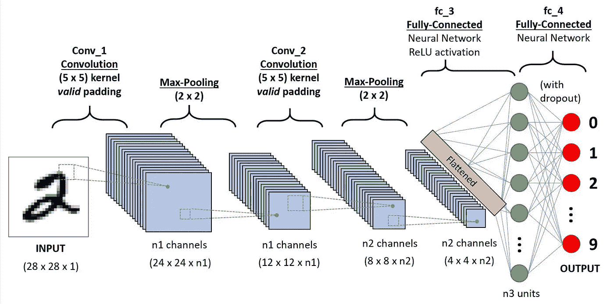

**图 1:对手写数字进行分类的 CNN 序列**

*卷积神经网络* **(CNN 的)**在图像分类任务中极其成功，甚至在几个复杂的视觉分类领域中超过了人类的表现。

强大的 CNN 的成功之旅始于 *ImageNet 大规模视觉识别挑战 2。*ImageNet 大规模视觉识别挑战赛，或 ***ILSVRC*** ，是一项年度比赛，使用来自 ***ImageNet*** 数据集的子集，该数据集由超过 20，000 个类别的图像组成，这些类别包括“*车辆*”、“*果实*”、“*动物*”等。拥有超过数百张图片。

*ILSVRC* 挑战导致了深度卷积神经架构的发展(*图 1* )，该架构在庞大的 Imagenet 数据集中产生了最先进的结果。我们非常熟悉的 Imagenet 模型以及我们使用 ***迁移学习*** 在各种任务中使用的 Imagenet 模型都是 *ILSVRC 挑战赛的直接产物，如 AlexNet、VGGNet、ResNet、GoogleNet、*等。

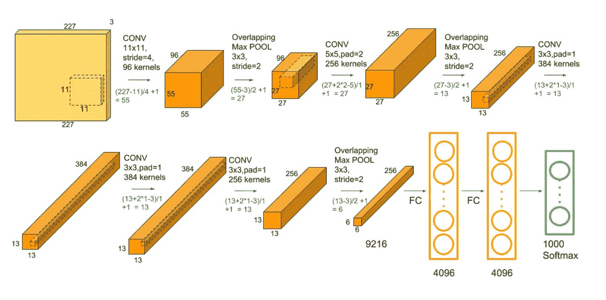

**图 2: AlexNet CNN 标准架构**

话虽如此，但不容忽视的事实是，这种高精度是以非常复杂的深层架构和大量参数为代价的。

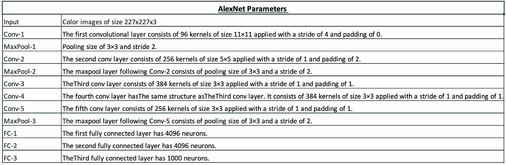

**图 3: AlexNet CNN 图层&参数表**

如图 2 和图 3 所示，像 ***AlexNet*** 这样的架构需要数百万个参数来训练，以给出最先进的结果。尽管考虑到我们现在拥有的计算资源，这看起来没什么大不了的，但从环境的角度来看，这是危险的。

此外，迁移学习的出现大大减少了可训练参数的数量，尽管乘法的数量保持不变。此外，在涉及新域或与训练分布完全不同的域的任务中，我们需要微调整个网络的参数，这是一个大问题。

## 深度神经模型的能量和策略考虑

由 *Emma Strubell，Ananya Ganesh 和 Andrew McCallum* 发表的论文《***@ ACL’2019***中关于 NLP 中深度学习的能源和政策考虑》受到了很多关注，从那以后，在监测和减少深度神经模型的碳排放方面发生了重大的研究工作。

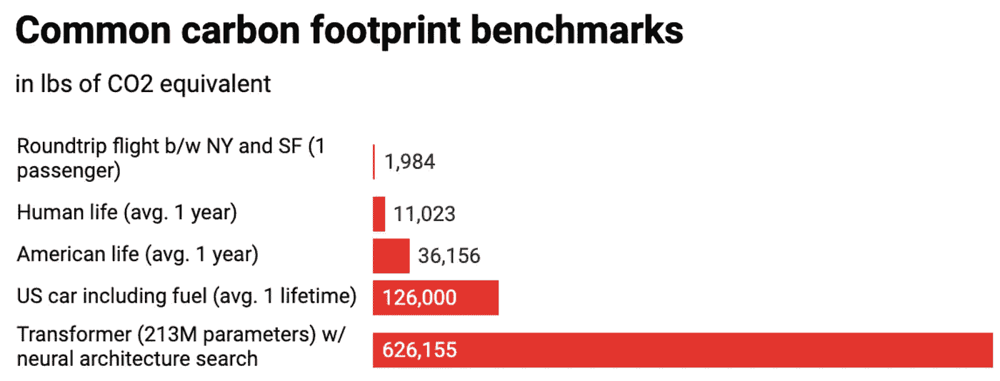

**图 4:图表:麻省理工技术评论，来源:Strubell 等人。铝**

马萨诸塞大学阿姆赫斯特分校的研究人员观察到，训练深度神经模型排放的碳相当于五辆汽车，这在深度学习社区引起了深切关注。在博客“*单个人工智能的碳排放量是一辆汽车的近 5 倍”*中，作者提到了运行非常深的网络对环境的其他一些担忧和影响。

话虽如此，尽管神经模型的总碳排放量现在可能不是一个大问题，但随着模型的复杂性和模型参数的数量呈指数增长，它将在未来成为一个大问题。

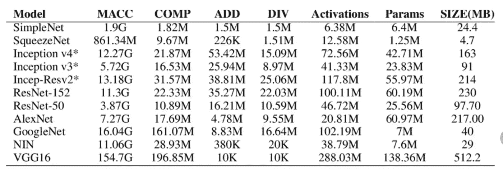

**图 5a: ImageNet CNN 模型及参数总数**

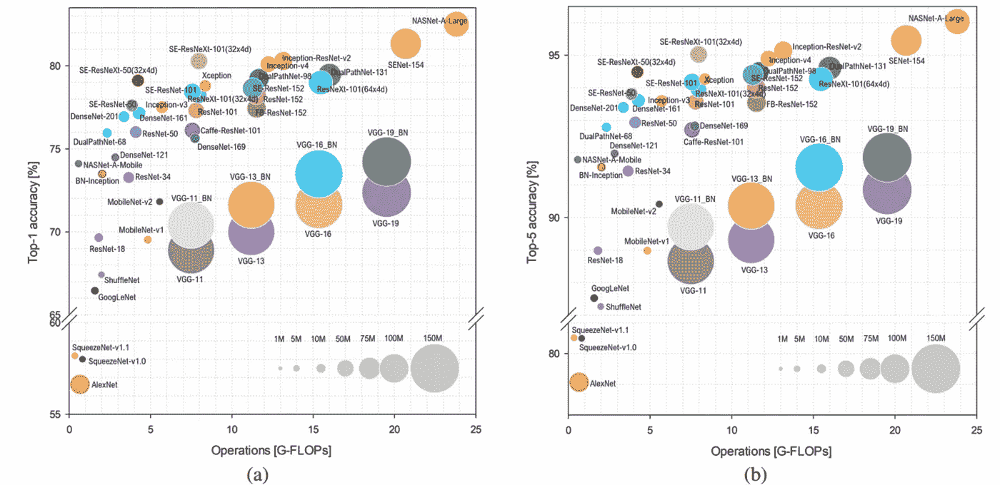

**图 ImageNet 模型的准确性&复杂性可视化**

从图 5a 和 5b 可以清楚地看出，在 ImageNet CNN 模型中有大量的参数，这些参数以百万计，并且需要大量的时间和计算来从零开始训练模型。因此，在下一节课中，我们将讨论如何使用**深度方向可分离卷积**来降低 CNN 模型中卷积运算的计算量，这种卷积已在现代 CNN 架构中使用，以降低模型的复杂性。

## 减少卷积层的计算——深度方向可分离卷积

在深入研究*深度可分卷积*之前，让我们先了解并计算正常卷积运算的计算。

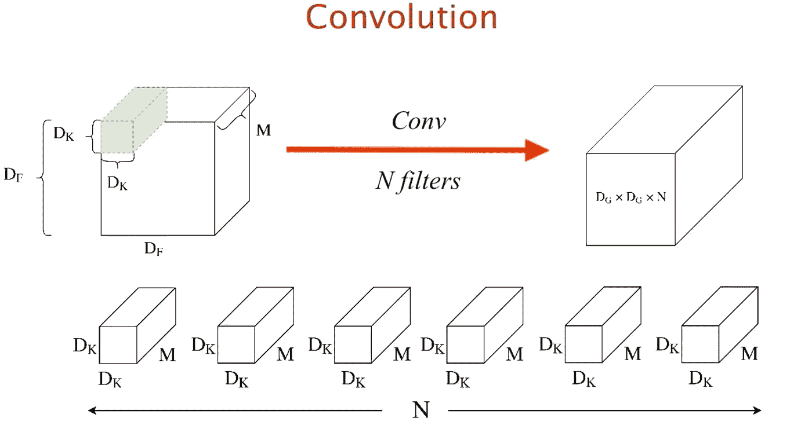

**图 6:普通卷积运算，输入&输出尺寸&滤波器**

假设输入特征图的尺寸为 **Df *Df *M，**，其中 **M** 是滤波器的数量/深度， **Df *Df** 是特征图的宽度和高度。让我们假设，我们正在用大小为 **Dk*Dk*M** 的 **N** 个滤波器进行卷积，因此输出特征图将具有 **Dg*Dg*N.** 的形状

因此，现在我们将通过估计乘法的*次数来估计卷积运算的计算复杂度。*由于乘法是一种比加法更昂贵的运算，它可以告诉我们模型的复杂性。因此，让我们估计一下这个例子的乘法次数*(图 6)*

一个实例的乘法次数= **Dk * Dk * M = Dk * M .** 现在，我们需要在整个输入上滑动滤波器，从输出维度可以清楚地看出，已经执行了沿宽度的 **Dg** 卷积和沿高度的 **Dg** 卷积，结果乘法总数为: **Dg * Dk * M.**

因为有 **N 个**这样的滤波器，所以整个输入的乘法总数=**Dg * Dk * M * N———(1)**

**深度方向可分离卷积-减少计算:**

现在让我们深入研究*深度可分卷积*的架构和计算，以及它如何减少乘法次数。因此，深度方向的可分离卷积可以分成两个部分:

1.  **深度方向卷积:滤波阶段**

在这种情况下，卷积最初应用于单个输入通道，而不是像正常卷积那样跨越深度。

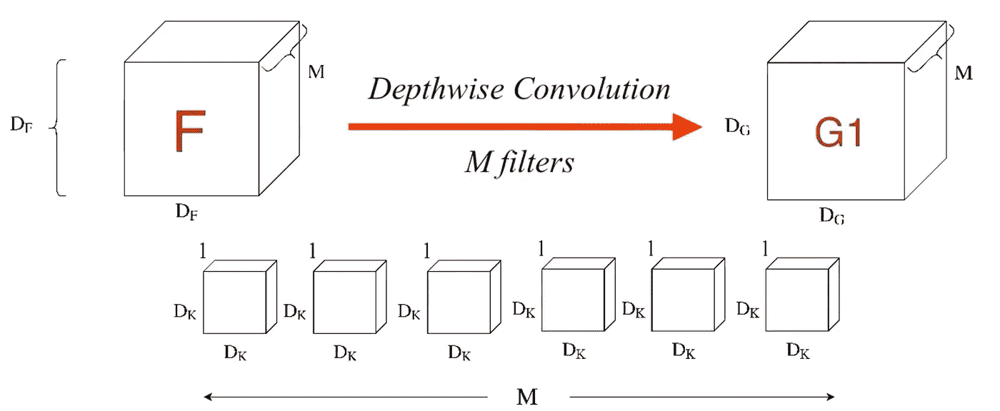

**图 7:深度方向卷积中的卷积运算**

如图 7 所示，卷积滤波器的尺寸为 **Dk*Dk*1，**应用于相同的输入，但是一次仅应用于一个通道，因此需要 **M** 这样的内核/滤波器，而每个内核的卷积数量沿着输入的宽度保持相同的 **Dg** ，沿着输入的高度保持相同的 **Dg** 。

所以，一个滤波器的乘法次数=**Dk * Dk * Dg * Dg**=**Dk * Dg。**由于有 **M 个**这样的滤波器，所以乘法总数将是 **Dk *Dg *M.**

最后，与每个核卷积后的输出将具有尺寸 **Dg *Dg** ，并且有 **M 个**这样的核，它们将使得最终输出具有形状 **Dg*Dg*M.**

**2。逐点卷积:组合阶段**

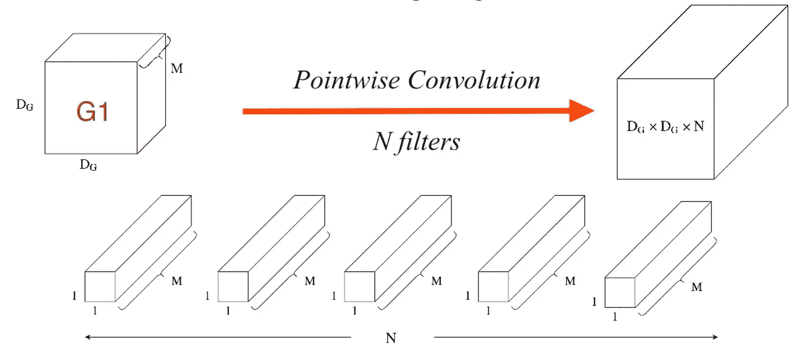

**图 8:逐点卷积中的卷积运算**

深度方向可分离卷积的下一阶段是通过*逐点卷积*的组合阶段。因此，这里的输入是来自前一阶段的输出，其形状为 **Dg*Dg*M.** 。在这种情况下，每个内核的形状为 **1*1*M** ，其应用于整个输入，并保持输入的*高度和宽度*，如图 8 所示。因此，来自这样一个内核的输出将是 **Dg*Dg** 的形状。应用 **N** 这样的内核将导致期望形状的输出，即 **Dg*Dg*N.**

因此，输入维上一个内核的乘法次数为。=**Dg * Dg * M**=**Dg * M .**既然有 N 个这样的核，那么乘法的总数= **Dg *M*N**

因此，在深度方向和点方向卷积之后，我们获得了所需的输出，乘法总数为:

**Dk * Dg * M+Dg * M * N = M * Dg(Dk+N)————( 2)**

现在让我们比较深度方向可分离卷积和标准卷积中的乘法:

**标准卷积中的乘法/深度方向可分离卷积中的乘法= rho**

**ρ=(Dg * Dk * M * N)/(M * Dg(Dk+N))**

**ρ****=**(**Dk * N)/(Dk+N)—————( 3)**

因此，在正常情况下，让我们取一个非常标准的值 **Dk** 和 **N** 来理解乘法运算的减少。对于 **N = 1024，Dk = 3，rho = (9*1024)/(1024+9) = 8.9 ~ 9。**

因此，它几乎将计算量减少了 9 倍，这在参数数以百万计时是非常巨大的，并且这仅仅是一次卷积运算。现在，想象一下，当卷积层数更多时(任何标准 ImageNet 模型都是如此),效果会有多好。这已经在 MobileNets 中非常成功地实现了，mobile nets 是一类用于移动和嵌入式视觉应用的快速有效的模型。

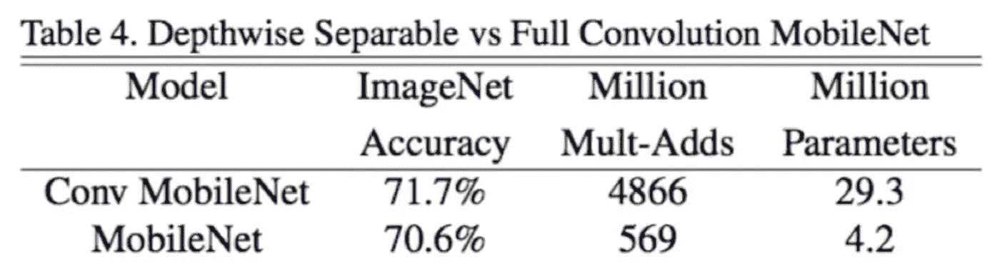

**图 9:对 MobileNets 使用深度方向卷积前后的比较**

> 从图 9 中可以清楚地看出，模型参数的数量已经显著减少，而精度没有太大下降，这使得该架构如此特别。现在，让我们来理解和讨论通过深度方向可分离卷积以减少计算为代价而导致的信息损失。

# 以减少计算为代价的信息损失——深度方向可分卷积

基本上，深度方向卷积与标准卷积的主要区别在于，在深度方向，滤波器应用于特征图的高度和宽度，而不是深度。随后使用逐点卷积，进行深度范围内的特征组合。

而在标准卷积中，核同时在所有维度上操作，因此它们被联合学习，这有助于它们有效地捕捉所有可能的信息和交互。

> 因此，我们可以推断，在深度方向可分离卷积中，可能存在某些未被有效捕获的相互作用。(因为卷积运算是对每个维度分别进行的，然后再进行组合，所以在这个过程中可能无法准确地捕捉到跨维度的相互作用。)

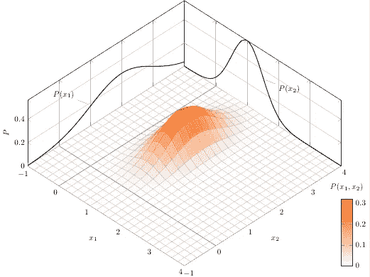

**图 10:联合和边际概率分布**

让我们从二元分布的角度来理解这种情况。假设我们有两个变量 ***x1 & x2*** ，pdf 为 ***P(x1) & P(x2)。*** 因此，如果我们必须理解变量的联合行为，我们应该研究变量的联合分布***【P(x1，x2)*** 从而能够捕捉所有可能的变异来源。但是，如果我们用边边角角即***【P(x1)&【P(x2)****后来的结合边边角角的信息来评论联合行为，那就不准确了。*

*因此，我们知道，由于设计*深度方向可分离卷积*的方式，可能会丢失一些相互作用。但是，正如我们在图 9 中观察到的，尽管丢失了信息，但准确性并没有显著降低，这表明相互作用可能对解释响应变量(y)没有多大帮助。*

***最终想法:***

*我们希望这篇文章能够让你理解减少计算和减少碳足迹的重要性，同时从环境的角度训练深度模型。*

*我们还解释了深度方向可分离卷积如何在模型复杂性和准确性之间有效地折衷。*

* [## Souradip Chakraborty —数据科学家—沃尔玛印度实验室| LinkedIn

### 我是一名有抱负的统计学家和机器学习科学家。我探索机器学习、深度学习和…

www.linkedin.com](https://www.linkedin.com/in/souradip-chakraborty/)  [## 专家|谷歌开发者

### 机器学习我是 Souradip Chakraborty，目前在沃尔玛实验室担任数据科学家(研究)

developers.google.com](https://developers.google.com/community/experts/directory/profile/profile-souradip_chakraborty)  [## Rajesh Shreedhar Bhat —中等

### 阅读 Rajesh Shreedhar Bhat 在媒体上的文章。数据科学家—沃尔玛实验室| Kaggle 竞赛专家|…

medium.com](https://medium.com/@rajesh_bhat) 

# 参考资料:

1.  Emma stru bell Ananya Ganesh**Andrew McCallum**的论文'[*NLP*](https://www.aclweb.org/anthology/P19-1355.pdf)'中深度学习的能源和政策考虑，ACL'2019。
2.  Zayan Guedim 的博客“ [*单个人工智能的碳排放量比一辆汽车*](https://edgy.app/a-single-ai-carbon-emission-is-nearly-5x-greater-than-a-car?pfrom=science&fp=a7) ”高出近 5 倍。
3.  博客' [*卷积神经网络中的参数数量和张量大小(CNN)* '](https://www.learnopencv.com/number-of-parameters-and-tensor-sizes-in-convolutional-neural-network/) 作者[Satya mal lick](https://www.learnopencv.com/author/spmallick/)&[Sunita Nayak](https://www.learnopencv.com/author/snayak/)。
4.  [Andrew G. Howard](https://arxiv.org/search/cs?searchtype=author&query=Howard%2C+A+G) 等论文' [*MobileNets:用于移动视觉应用的高效卷积神经网络* '](https://arxiv.org/abs/1704.04861)
5.  关于 [*深度可分卷积*](https://www.youtube.com/watch?v=T7o3xvJLuHk) *的精美视频讲座。*
6.  博客'[对监督学习问题应用 PCA 的风险和注意事项'](/risks-and-caution-on-applying-pca-for-supervised-learning-problems-d7fac7820ec3)。*