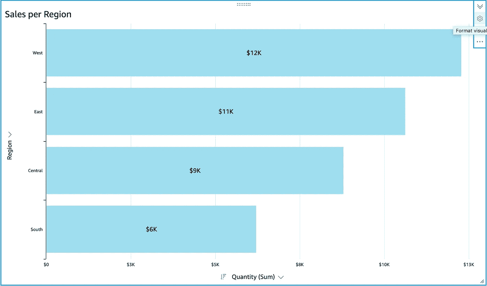
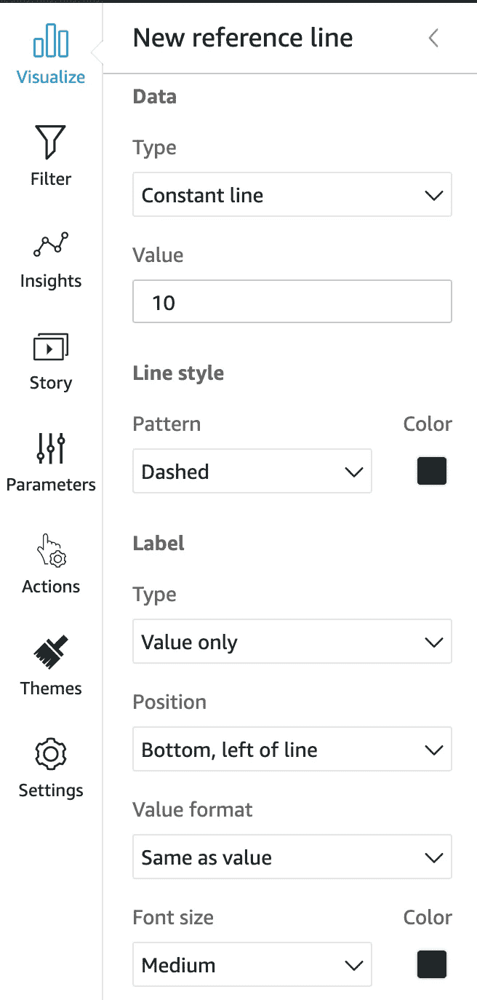
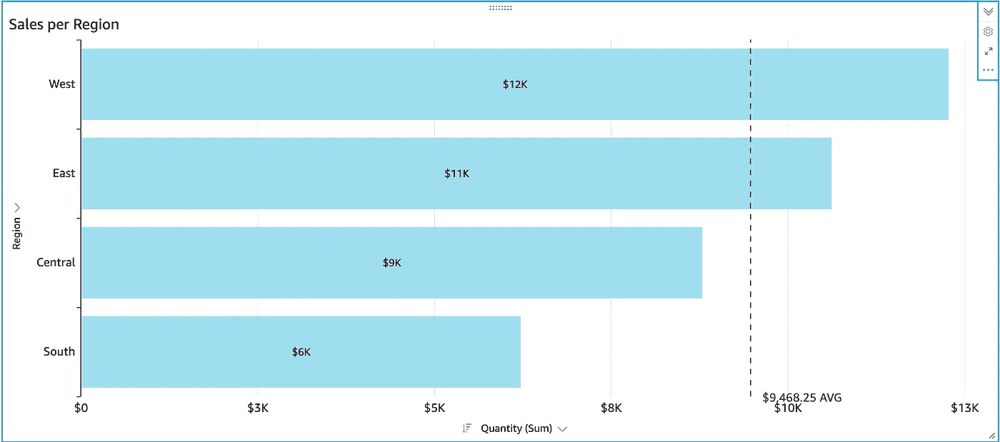
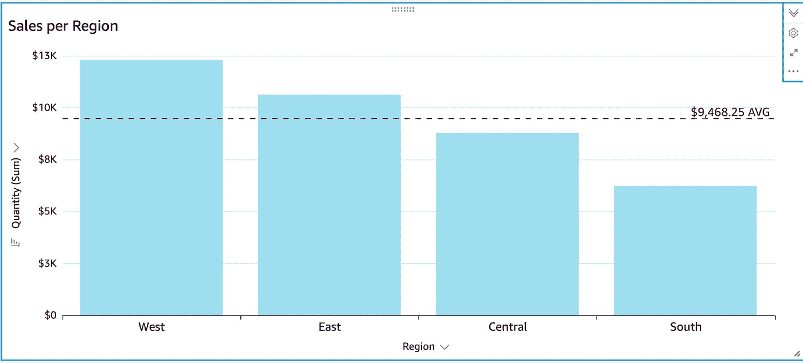
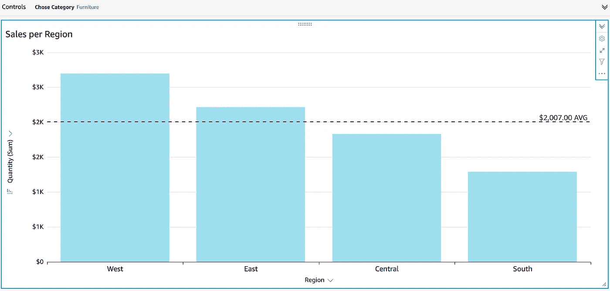

# QuickSight 中的参考线

> 原文：<https://towardsdatascience.com/reference-lines-in-quicksight-9e09bd97910c?source=collection_archive---------49----------------------->

## 快视提示公司

## 一步一步的过程

Miguel A. Amutio 在 [Unsplash](https://unsplash.com/s/photos/metrics?utm_source=unsplash&utm_medium=referral&utm_content=creditCopyText) 上拍摄的照片

前几天，我在 AWS QuickSight 的仪表板上工作，创建了一个条形图。当我打开我的视觉设置标签，我看到一个新的部分:“参考线”。

我真的很兴奋，因为我过去喜欢画面上的参考线，所以我试了一下。您将在这里找到一个逐步的过程，以及对该功能在此阶段的局限性的一些想法。

我将在本文的所有例子中使用超级商店数据集。

# 什么是参考线？

参考线是图形中用户定义的垂直线或水平线。它用于轻松地将数据点与该参考进行比较。

例如，您可以查看季度至今的销售额，并有一个显示季度目标的参考线。你将能够快速评估你是否已经完成了目标。

另一个例子是，如果您查看跨团队的收入，将参考线设置为平均值，这样您就可以很容易地知道哪个团队高于/低于平均值。

用于参考线的数据可以是一个固定的数字(例如:一个目标)，也可以是一个计算出来的数字(例如平均值、中值、最大值、最小值……)。

# 如何在 AWS QuickSight 中创建参考线？

在 QuickSight 中，参考线可用于 3 种视觉类型:

*   折线图
*   条形图
*   组合图表

创建图表后，单击图表右上角的“Format Visual”图标，这将打开屏幕左侧的“Format Visual”窗格。

来自作者的 QuickSight 截图。

来自作者的 QuickSight 截图。

“格式可视化”窗格允许您格式化标题、X 和 Y 轴以及数据标签。现在…创建参考线！

点击参考线菜单，然后点击“添加新线”打开创建一条线。

然后提示您选择线路设置。

第一部分包含您想要显示的数据:常数行或计算行。

*   对于常量，将要求您输入一个值
*   对于计算，将要求您提供哪一列(即字段)和哪一级别的汇总以及您要计算的计算(平均值、最小值、最大值或百分位数)。

*请注意，您可以根据图表中没有的字段添加计算线！*

菜单的其余部分包括线条样式(全、点或虚线以及颜色)；以及标签类型、位置、值格式和字体大小。

最后，我得出了这样一个条形图。在此过程中，我还格式化了轴和数据标签。

来自作者的 QuickSight 截图。

# 第一印象

你可能会在上面的图表中注意到的第一件事是，自动定位不是很好；文本和值离 x 轴太近。没什么大不了的，但是可读性可以更好。

解决这个问题的一个方法是对这个图形使用垂直布局。我不喜欢因为那样的原因而不得不改变我的 viz 选择，但是嘿——读起来更好。所以由你来决定在你的用例中什么是最重要的。

来自作者的 QuickSight 截图。

然后，我尝试在选项卡上添加一个参数，看看平均值是否会自动重新计算。确实如此。那很酷。

来自作者的 QuickSight 截图。

我认为这个功能是对 AWS QuickSight 的一个很好的补充。我曾经是 Tableau 中参考线的忠实粉丝，所以我很高兴看到 QuickSight 团队的崛起！

当然，我希望能够在线上或线下着色，或者创建像 Tableau 一样的乐队，但我相信有一天我会发现它在 QuickSight 中直播。它总是充满惊喜。

享受使用参考线的乐趣。