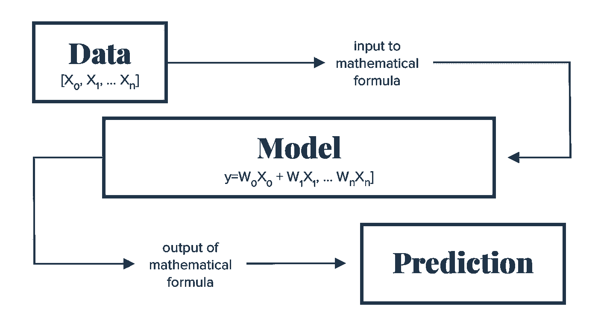
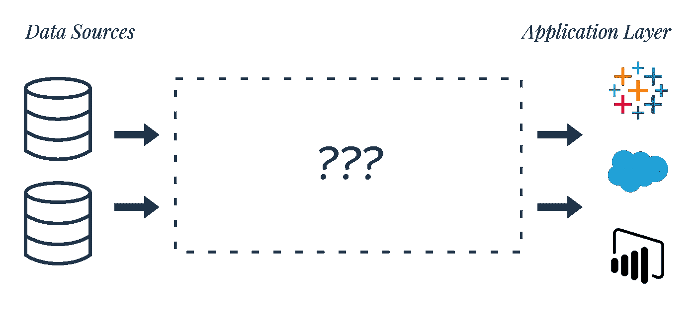
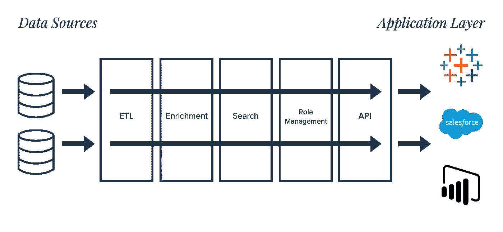
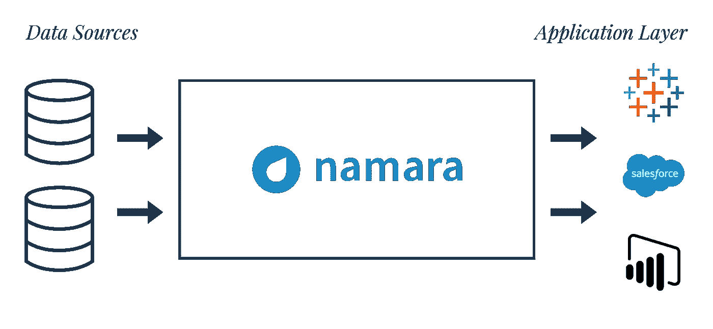
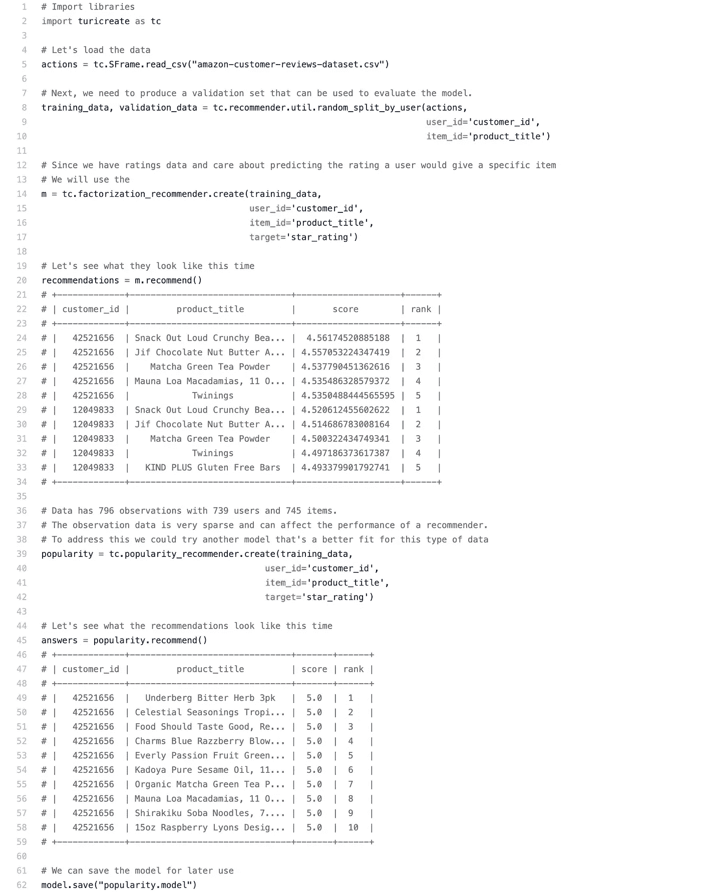

# 提炼数据是训练机器学习的关键

> 原文：<https://towardsdatascience.com/refined-data-is-the-key-to-train-machine-learning-29f863e671f1?source=collection_archive---------48----------------------->

预测模型的好坏取决于为其提供燃料的数据，这意味着它们需要精确、标准化的数据才能获得有意义的结果。

所有的机器智能都是由数据驱动的。这不是突破性的，甚至不是新闻——我们几十年前就知道数据的价值了。然而，并不是所有的数据都是平等的，我们将从优先考虑流入数据质量的角度来看待执行机器学习产品。

机器学习(ML)是人工智能的一个特定子集，在图像识别、自然语言处理和专家系统等广泛的关键应用中发挥着关键作用。

ML 解决了单纯用数值手段无法解决的问题，主要是通过有监督或无监督的学习:

*   在监督学习*、*中，使用一组带标签的输入数据和对数据的已知响应(输出)来训练算法。它通过比较实际输出和正确输出来发现错误。
*   在无监督学习中，该算法使用一组未标记的输入数据来探索数据并找到其中的一些结构。

**机器学习工作流程概述:**

机器学习工作流程示例，从原始数据到预测

第一步涉及数据收集，但这只是构建预测性解决方案的一部分，下一步是数据准备，这一步常常被忽视。

**机器学习发展的阶段包括:**

1.  数据收集
2.  数据准备
3.  发展假设
4.  模型构建
5.  模型部署
6.  模型评估

## 机器学习的现状

IDC 发布了他们的[**AI in 2020 and beyond predictions**](https://www.forbes.com/sites/gilpress/2019/11/22/top-artificial-intelligence-ai-predictions-for-2020-from-idc-and-forrester#2d004c10315a)，其中他们假设智能自动化的有效使用将需要在 it 需要支持的数据清理、集成和管理方面做出巨大努力。

数据清理是一项费力的手动任务，一直困扰着数据专业人员。如果没有使用自动化高效清理数据的有效方法，组织将无法实现其数字化转型目标。[IDC future escape](https://www.idc.com/getdoc.jsp?containerId=US45599219)[报告](https://goto.webcasts.com/starthere.jsp?ei=1262205&tp_key=fe4bacf7f2)指出，解决遗留系统中过去的数据问题可能是一个巨大的进入障碍，尤其是对大型企业而言，这显示了采用数字战略中普遍存在的困难。

根据晨星公司的数据，仅去年一年，组织 [**预计在数字化转型项目中投资 1.3 万亿美元**](http://news.morningstar.com/all/business-wire/BWIPREM20171215005055/idc-forecasts-worldwide-spending-on-digital-transformation-technologies-in-2018-to-reach-13-trillion-in-2018.aspx) 。麦肯锡后来宣布 [**这些项目中有 70%失败**](https://www.mckinsey.com/industries/retail/our-insights/the-how-of-transformation) 。对于那些在家里记账的人来说，这些失败给企业造成了超过 9000 亿美元的损失。无论投资损失有多大，组织都无法承受数字化转型的持续失败。干净、标准化的数据对于释放数字化转型工作的价值至关重要，但是以您需要的状态获得您想要的数据是繁琐、耗时且昂贵的。

上图中突出显示了一个常见的误解，即一旦所有数据都在一个公共位置，我们就可以将它插入任何我们想要的位置。但是这个过程并没有那么简单。来自不同来源的数据缺乏一个共同的标准，位于数据之上的应用程序无法完全实现，因为在数据(有湖或没有湖)和企业应用程序之间存在巨大的障碍。细化的数据需要以可靠、可重复、可预测的格式出现。

在基层，为了释放这种价值，需要克服的操作障碍使创新慢如蜗牛。在许多组织中，数据专业人员将 80%的时间花在清理和准备数据上，而不是花在分析和建模上。数据专业人员不应承担数据准备的保管任务。没有自动化层，有些任务很难，有些更难，其余的几乎不可能。

## "数据专业人员不应该承担数据准备的保管任务."

预测模型的好坏取决于它们所基于的数据，因此它们需要由精炼、标准化的数据推动，以产生既实用又代表现实的结果。

## 典型的数据提炼过程是复杂的

当我们看到提炼野外发现的数据的过程时，这并不像将数据插入 BI 层或可视化工具那样简单。通常有许多步骤，如下图所示:

一旦数据最终变得干净且可用，下一步就是选择一种算法。算法的几个特征之间存在权衡，例如训练速度、预测准确性和内存使用。随着 AutoML 的兴起，算法选择也趋向于自动化。如果你不熟悉自动化机器学习系统，你可以[在这里阅读](https://www.kdnuggets.com/2017/01/current-state-automated-machine-learning.html)，但一般来说，有了一个精确的数据集，AutoML 系统可以为你设计和优化机器学习管道。

现在我们已经介绍了 ML 工作流，让我们通过构建一个由精化数据和 AutoML 支持的简单产品推荐系统来尝试应用一些讨论的概念。

## 战略必须赶上人才

许多组织担心数据方面的人才短缺，但问题的根源通常是战略短缺。无论团队有多大，数据多样性对每个人来说都是一个障碍。有[很多平台](https://www.dataquest.io/blog/free-datasets-for-projects/)，你可以在那里找到构建机器学习系统的资源，还有很多地方可以找到一些最常用的[数据集](https://elitedatascience.com/datasets)。数据管理平台通过自动化大部分保管工作，包括数据集细化，允许更快的模型就绪部署( [**以及其他优势**](https://blog.thinkdataworks.com/better-data-management-solution) )。

## 简化的数据准备和处理

通过 Namara 输入数据处理与将原始数据转化为可用资产相关的保管任务。工作流程再次简化，如第一幅图所示:

在这个例子中，我们将检查一个使用 [Namara](https://app.namara.io/#/) 提炼的[亚马逊客户评论数据集](https://app.namara.io/#/data_sets/0a81e83f-b260-49a9-8cfb-13a1ce6e03b5?organizationId=5cb4b5c109554420684874ca)样本。对于协同过滤方法，精确的历史数据足以进行预测。上图中突出显示的步骤，ETL、丰富、搜索、角色管理和 API，都是由平台处理的。

现在我们有了现成的数据，让我们选择一个算法。我们有很多方法可以解决这个问题。不过，现在让我们保持简单，使用 [Turi Create](https://github.com/apple/turicreate) 来简化 Python 中机器学习模型的开发。

**AutoML —代码**

一旦构建完成，就可以进行模型评估和部署了。我们还可以绘制图表和可视化来描述数据——如您所见，在进行分析时，我们看到的只是冰山一角。

## 总结一下

如前所述，70%的数字化转型努力失败了，这表明在预测性解决方案和数据策略方面存在严重的错位问题。预测模型的好坏取决于为其提供燃料的数据，因此它们需要精确、标准化的数据，以获得有意义的结果。组织必须采用并利用数据管理策略( [think DataOps](https://blog.thinkdataworks.com/want-to-be-data-driven-better-start-thinking-about-dataops) )以及 AutoML 系统来释放数据的价值。这将使我们能够更高效、更准确、更大规模地提供见解。

*原载于*[*https://blog.thinkdataworks.com*](https://blog.thinkdataworks.com/machine-learning-powered-by-refined-data)*。*