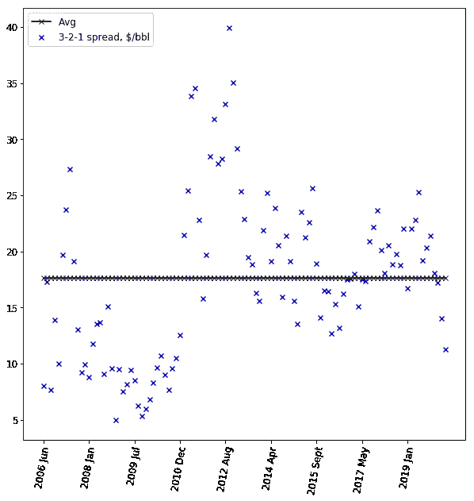
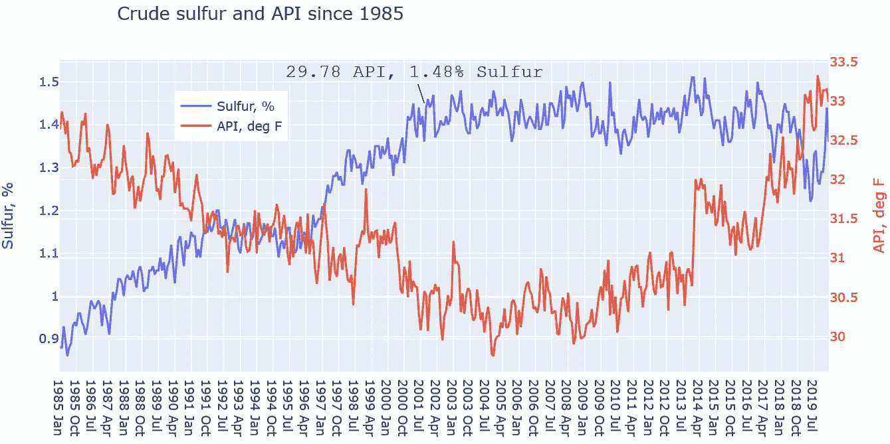
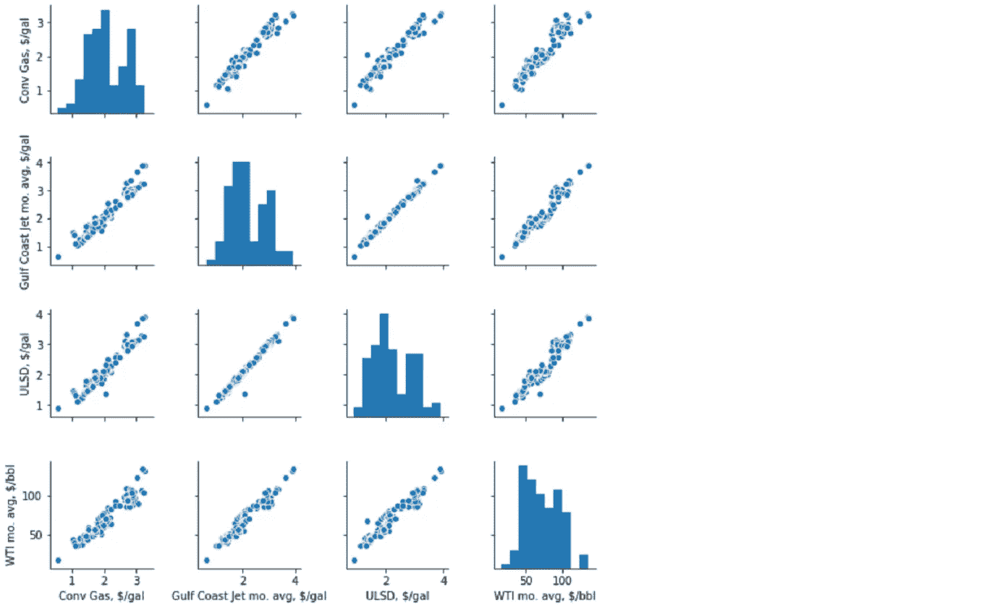
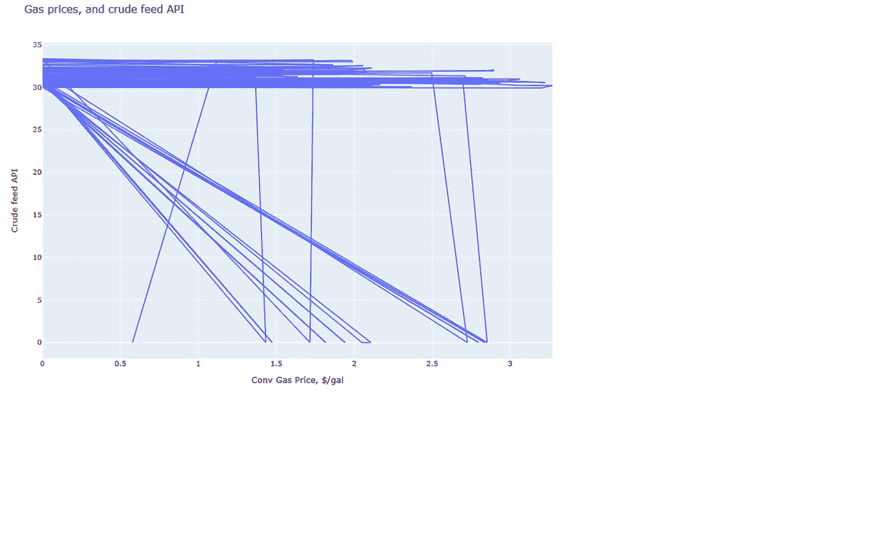
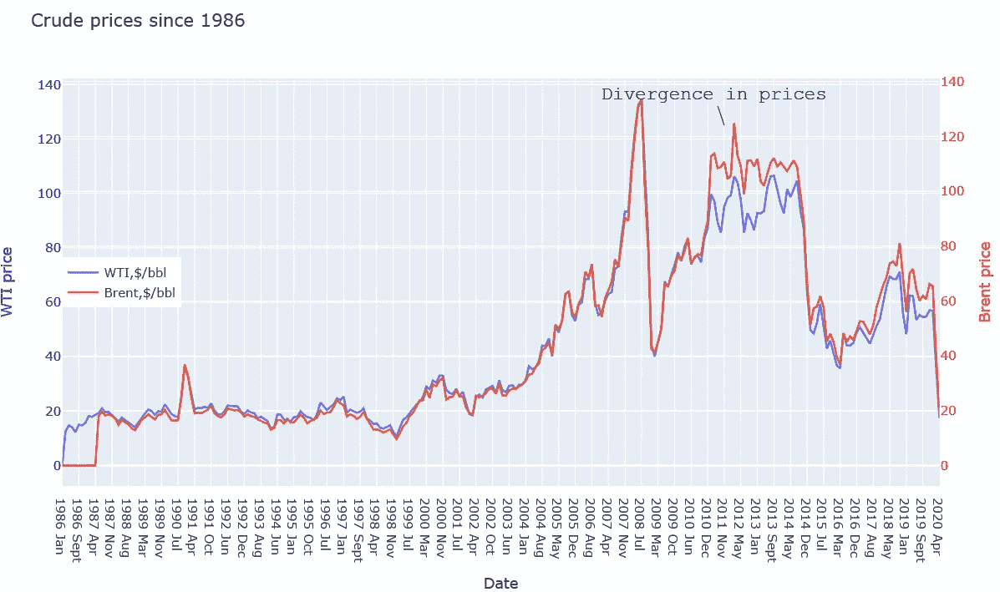

# 多年来的精炼利润

> 原文：<https://towardsdatascience.com/refining-margins-over-the-years-21827d04b9a4?source=collection_archive---------42----------------------->

## 多年来，原油加工和精炼燃料的价格如何变化，它们之间的关系如何？


斯科特·罗杰森在 [Unsplash](https://unsplash.com?utm_source=medium&utm_medium=referral) 上拍摄的照片

在我的上一篇文章中，我们看到墨西哥湾沿岸在很大程度上负责美国的炼油加工。那么，*为什么*炼油厂将原油加工成成品油？认识产品和原油之间的利润。

与往常一样，请注意，以下可视化中使用的所有数据均可从美国能源信息管理局公开获得。

一家炼油厂的毛利追踪“价差”，即成品油价格和原油价格之间的差额。让我们将常用的 3–2–1 价差定义为((2 *汽油价格)+(1 *柴油价格)—(3 *原油价格))/ 3

下面的代码计算裂纹扩展，然后创建一个随时间变化的散点图，以及计算的平均值—见代码后的图表

```
# Calculate 3-2-1 spread, using Conventional Gas, ULSD, and West Texas Intermediate crude pricesPost2006['3-2-1, WTI-base'] = (2*Post2006['Conv Gas, $/gal']*42 
+ Post2006['ULSD, $/gal']*42 
- (3*Post2006['WTI mo. avg, $/bbl'])) / 3# Plot spread and average over timeplt.figure(figsize=(10,10))plt.scatter(Post2006['Date'],Post2006['3-2-1, WTI-base'], c='b', marker='x', label='3-2-1 spread, $/bbl')y_mean = [np.mean(Post2006['3-2-1, WTI-base'])]*len(Post2006['Date'])plt.plot(Post2006['Date'],y_mean, c='black, marker='x', label='Avg')plt.legend(loc='upper left', fontsize=12)
plt.xticks(np.arange(0, 100, step=12), rotation=80, fontsize=12)
plt.yticks(fontsize=12)
plt.show()
```



作者使用 EIA 的公开数据得出的利润率的改进趋势

上面的图表告诉我们什么？提炼 3 桶原油以生产和销售 2 桶汽油和 1 桶柴油的净利润平均为每桶原油 17.50 美元。

什么是*关于允许炼油厂制造燃料的原油？原油可以被认为是轻质和重质化学成分的混合物——在极端情况下，轻质成分最终成为点燃我们烧烤炉的液化石油气，而重质成分最终成为道路焦油中的沥青。*

*在两种极端情况的中间，重组分和轻组分被混合以制造发动机燃料，如汽油、柴油和喷气燃料。*

*原油混合物中的轻组分越多，原油就越“轻”。原油越轻，其 API 比重就越高。同样:原油中重质成分越多，API 比重越低。*

*这些年来，美国炼油厂的原油 API 比重如何变化？下面的代码用于生成下图*

```
*# 1st, create two separate scatter plots on two separate axesAPI = pg.Scatter(x=crudesulfurandAPI['Date'], y=crudesulfurandAPI['Crude sulfur, %'], name = 'Sulfur, %')Sulfur = pg.Scatter(x=crudesulfurandAPI['Date'], y=crudesulfurandAPI['API'],
                        # Specify axis
                        yaxis='y2', name = 'API, deg F')# 2nd, define layout with axis titles, figure title, and image dimensions.layout = pg.Layout(height=500, width=900,
                   title='Crude sulfur and API since 1985',
                   # Same x and first y
                   xaxis=dict(title='Date'),
                   yaxis=dict(title='Sulfur, %', color='blue'),
                   # Add a second yaxis to the right of the plot
                   yaxis2=dict(title='API, deg F', color='red',
                               overlaying='y', side='right'),
                   )# Last, attribute layout to figure and add annotation
fig = pg.Figure(data=[API, Sulfur], layout=layout)fig.add_annotation(
            x=200,
            y=1.45,
    font=dict(
            family="Courier New, monospace",
            size=18,
            color="black",
            ),
            text="29.78 API, 1.48% Sulfur")# Finally, update location of legendfig.update_layout(legend=dict(x=0.15, y=0.9), title=dict(x=0.15, y=0.9))*
```

**

*1985 年以来原油比重和含硫量的变化趋势。由作者使用 EIA 数据创建*

*从 80 年代中期到 2008 年中期，美国炼油厂原油的红色 API 比重一直在下降，当时达到 29.8。此时，美国炼油厂开始看到北达科他州巴肯页岩油田的高 API 比重轻质原油涌入。*

*你会观察到硫的蓝色趋势。我们将在另一篇文章中关注这一点，但就目前而言，原油中的高硫意味着炼油厂需要去除更多的硫，以最大限度地减少有害的毒素释放。一般来说，重质和酸性原油比轻质和低硫原油便宜。*

*3–2–1 的差价取决于原油价格和成品油价格。就我们的目的而言，让我们考虑精炼产品:汽油、喷气燃料和超低硫柴油(ULSD)。将这些价格追溯到 2006 年，并与原油价格进行对比，得出了以下双图。*

**

*Seaborn pairplot 由作者创建，使用 EIA 的公开数据。*

*那真是令人大饱眼福！*底线:**

**汽油、喷气燃料和 ULSD 价格都显示出与原油价格有很强的线性相关性。它们也彼此线性相关，即所有燃料价格通常一起变化。**

**汽油、ULSD 和喷气燃料的直方图都显示了两个峰值——表明出现了两个常见的峰值。这些是夏季(四月中旬到八月)和冬季(每隔一个月)的价格点。**

*在继续之前，有一点需要注意:WTI 或西德克萨斯中质油是原油的两个主要价格标志之一，另一个是布伦特原油。关于这一点的更多信息，请见本文末尾。*

*从上面我们学到的一切，加工原油的 API 可以通过汽油价格来预测吗？毕竟，较轻的原油——即较高的 API——有助于生产更多的汽油。因此，油价上涨难道不会导致炼油厂加工更多高 API 原油吗？如果我们将数据追溯到 2006 年，我们会发现什么？*

**

*Woah …没有关联。这表明炼油厂能够处理不同类型的原油原料，以维持其目标气体、柴油和喷气发动机产量。**在下一篇文章中，让我们使用数据可视化进一步评估炼油厂配置。***

*在我离开之前，这里有一张 WTI 原油价格对比布伦特原油价格的图表，可以追溯到 80 年代中期。现在你理解的关键点是:从历史上看，这些标记相互接近，所以我目前并不关心在分析中使用哪个标记。*

**

*这里有一个有趣的地方。你会注意到，从 2011 年开始，价格出现了背离。这是怎么回事？随着页岩原油涌入市场——还记得原油 API 如何在上述趋势中开始向上发展吗——美国原油价格标志跌至国际基准布伦特原油以下。*

*为什么布伦特也不蘸呢？难道所有原油价格都不应该因供应过剩而下跌吗？不会，因为美国以外的市场最初不允许进口美国原油，直到 2014 年出口禁令取消。*

*这里是完整的[回购](https://github.com/Ranga2904/Refining-Economics/tree/master)的链接。*

*下期帖子再见！一如既往，欢迎任何反馈。*