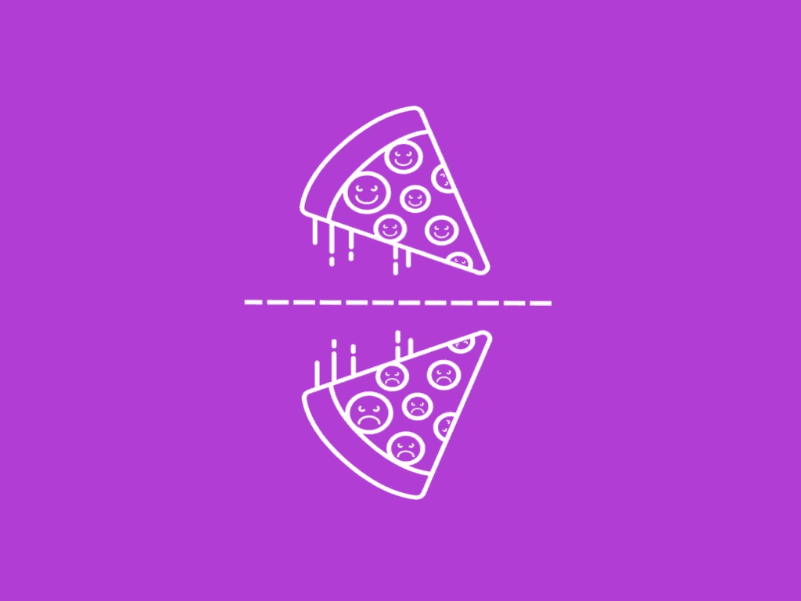

# 反映和比较餐馆评论的不同情感分类模型

> 原文：<https://towardsdatascience.com/reflecting-and-comparing-different-sentiment-classification-models-for-restaurant-reviews-d109105b2cb7?source=collection_archive---------56----------------------->

各种用于情感分类的预处理模型和技术将会在之前文章的实验基础上进行讨论和比较



反映和比较餐馆评论的不同情感分类模型

在这篇文章中，我将比较以前用于情感分类的模型，并讨论基于手头的数据，结果可能会有什么不同。我将使用在我以前的帖子中使用的情感分类方法的结果，如下所示:

1.  [带弓的情感分类](https://medium.com/swlh/sentiment-classification-with-bow-202c53dac154)
2.  [使用 TF-IDF 对餐馆评论进行情感分类](https://medium.com/swlh/sentiment-classification-for-restaurant-reviews-using-tf-idf-42f707bfe44d)
3.  [使用单词嵌入的情感分类(Word2Vec)](https://medium.com/swlh/sentiment-classification-using-word-embeddings-word2vec-aedf28fbb8ca)
4.  [使用 Doc2Vec 对评论进行情感分类](https://medium.com/swlh/sentiment-classification-for-reviews-using-doc2vec-660ba594c336)
5.  [使用 PyTorch 中的逻辑回归进行情感分类](/sentiment-classification-using-logistic-regression-in-pytorch-e0c43de9eb66)
6.  [使用 PyTorch 中的前馈神经网络进行情感分类](https://medium.com/swlh/sentiment-classification-using-feed-forward-neural-network-in-pytorch-655811a0913f)
7.  [在 PyTorch 中使用 CNN 对餐馆评论进行情感分类](https://medium.com/@dipikabaad/sentiment-classification-using-cnn-in-pytorch-fba3c6840430)

在所有这些帖子中，Yelp 餐馆评论数据集被用作输入数据，只有部分数据集被用于实验，以更快地获得结果并快速建立模型原型。在情感分类中，模型被训练来检测三种情感——积极的、中性的和消极的。


由[迪皮卡·巴德](https://medium.com/u/cb4f6856d71b?source=post_page-----d109105b2cb7--------------------------------)提供的按情感分类的餐馆评论示例

# 预处理技术

在[弓](https://medium.com/swlh/sentiment-classification-with-bow-202c53dac154)的第一篇帖子中，我已经详细解释了可以用于预处理的各种方法。解释了删除停用词，但没有使用。对于情感分类问题，这是非常重要的，因为像“not”这样的停用词如果被移除，会改变句子的情感。

```
I did not like the food.--- After Stop words removalI like food.
```

停用词起重要作用的情况应在分析期间保留，并应用作特征输入。

对于标记化，我们使用 Gensim 的`[simple_preprocess](https://radimrehurek.com/gensim/utils.html)`,它易于使用，并以一种干净的方式给出了更快的句子标记化方法，其中它删除了标点符号，并将大小写改为小写并返回标记。构建原型更快，但是在标点符号可以添加重要信息(如表情符号或单词的大写字母)来强调感觉的情况下。这可以在模型中使用，在这种情况下，可以使用 BOW post using regex 中提到的自定义标记化。这可以改进你试图在更大范围内预测情绪水平的模型，比如从 1 到 10 的评分。

我们知道，语言是由互相派生的词组成的，或者由于语法上的不同原因，经常与不同的后缀或前缀结合在一起。获得词根，以便在创建唯一单词的字典时，其大小更小，这对抗了机器学习模型的维数灾难。这样做的目的是在保留模型所需的所有基本信息的同时，最大限度地减少特征的数量。词干化和词汇化是实现这一目标的常用方法。

波特词干分析器用于所有这些方法中的词干分析。词干提取确实得到了词根，但是忽略了它在语言中的实际存在。另一方面，词汇化是将单词简化为其规范形式或词典形式或一组单词的引用形式([词汇](https://www.datacamp.com/community/tutorials/stemming-lemmatization-python))。

```
are, is -> bestood -> stand
```

这需要更多的步骤，但是可以看出，它可以减少唯一单词的数量，因为它可以适当地将其简化为词根形式。下面的代码展示了如何实现词汇化。词性标注有助于获得更好的词根，因为它可以相应地应用语法规则。

**输出:**


# 模型比较

使用的模型从简单的机器学习技术到用于情感分类的深度学习方法。以 BOW 为输入特征的前向神经网络得到的结果最好。就平均准确度而言，CNN 和逻辑回归也非常接近。这是一种很好的测试方式，我们发现使用复杂的方法，如 CNN，可以有效地提取复杂的特征，但对于情感分类来说，在句子中存在一些单词集表示评论的情感。因此，CNN 并没有给这个模型增加更多的价值。如果数据集包括许多描述情绪的复杂短语，那么 CNN 将有助于提取这些短语。像复杂方法一样使用更多的 CNN 资源可能不是这种情况下的最佳解决方案。最好对它进行测试，看看较小数据集的结果如何，也可以在完整的数据集上进行测试。如果它比其他简单的方法更好，那么我选择它用于生产，否则我通常更喜欢一个资源较少的方法，它可以给出足够好的结果。

在下面的图表中，我列出了在以前的文章中使用的情感分类的不同方法的平均准确率。


[迪皮卡·巴德](https://medium.com/u/cb4f6856d71b?source=post_page-----d109105b2cb7--------------------------------)之前的情感分类实验结果

就准确性改进而言，与使用简单的 BOW 或 TF-IDF 相比，Word2Vec 嵌入捕获语义并不那么有用。正如你所看到的，它可以极大地减少用于机器学习模型的特征数量。在所用的例子中，BOW/TF-IDF 的特征尺寸为`30056`，而 Word2Vec 的特征尺寸为`1000`。简单的 Word2Vec 平均向量被用于评论的分类，与使用 Doc2Vec 相比，这被证明给出了更好的结果。这种情况可能并不总是如此，因为 Doc2Vec 在算法方面更胜一筹，可以对整个文档进行归纳。Doc2Vec 生成高效且高质量的分布式向量，该向量捕获精确的句法和语义单词关系([参考](https://papers.nips.cc/paper/5021-distributed-representations-of-words-and-phrases-and-their-compositionality.pdf))。因此，测试这两种方法并比较结果总是一个好的决定。

在 BOW 和 TF-IDF 之间，结果表明 BOW 比 TF-IDF 表现得更好，虽然不显著，但显然使用 TF-IDF 模型并没有改善分类模型。TF-IDF 比 BOW 涉及更多的计算，因此在选定一种方法之前最好先测试一下。TF-IDF 降低了在整个语料库中频繁出现并且不是文档所独有的单词的权重。这种方法似乎不能很好地解决与评论相关的情感分类问题，其中正面和负面的词出现在大多数文档中。当用作前馈神经网络或逻辑回归的输入时，如果您已经使用简单的分类模型测试和比较了 BOW、TF-IDF、Word2Vec 或 Doc2Vec 等多种方法，则可以节省一些训练时间。如果您想做进一步的实验，可以尝试将这些作为 PyTorch 中模型的输入。

前馈神经网络对于给定的数据表现良好。对于神经网络，可以测试前面帖子中提到的不同的激活、优化、损失函数，看看这个结果是否有所改善。你可以试着用不同的学习速率、时期、其他非线性激活函数如`tanh`、`sigmoid`等进行测试。、其他优化算法如`Adam`、`RMSProp`等。有很大的空间进行实验，并获得比以前的帖子更好的结果。

我已经在实验中展示了如何快速为情感分类问题建立模型。在这篇文章中，我展示了我是如何比较并计划以不同的顺序使用不同的方法来获得可能的最佳结果的。

情感分类系列到此结束。我的目标是将相关的主题分组，这是我的第一个系列。我将继续出版，因为我正在探索新的主题。看好这个空间！:)

一如既往——愉快的实验和探索！