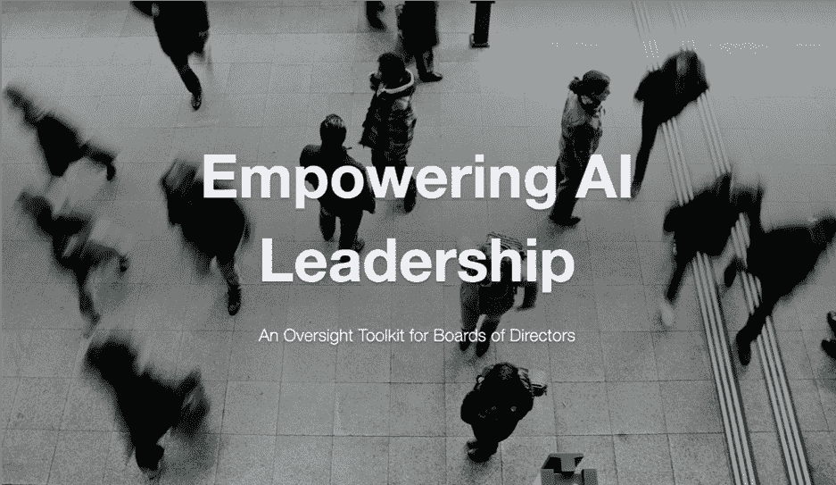
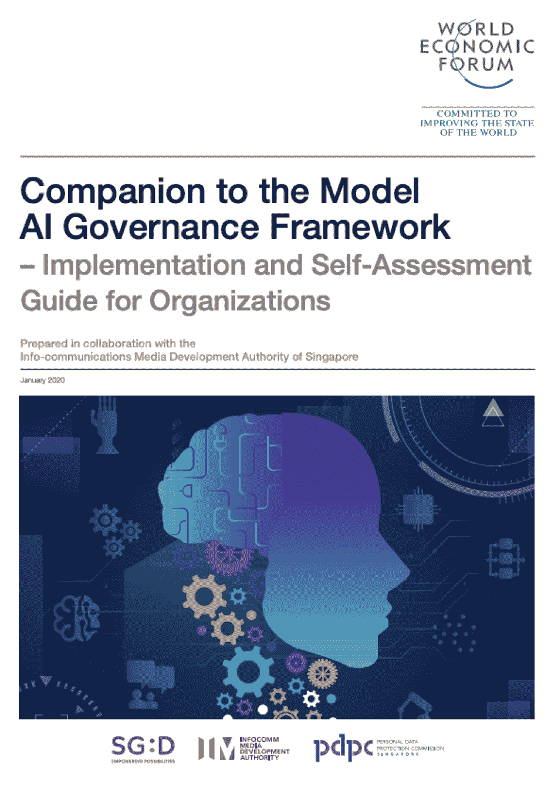

# 从 2020 年达沃斯世界经济论坛看人工智能

> 原文：<https://towardsdatascience.com/reflections-on-ai-from-davos-2020-world-economic-forum-49a3964e08d?source=collection_archive---------28----------------------->

## 人工智能叙事正从问题走向行动，并找到解决方案来管理人工智能的潜在风险和伦理

2020 年 1 月 22 日，世界经济论坛全球人工智能委员会的一些成员在达沃斯开会

在讨论如何在超十亿参数的深度神经网络中让 AI 变得可解释时，你对一个诺贝尔奖得主说什么？这是我第一次去达沃斯，恰逢世界经济论坛(WEF)庆祝其第 50 届年会。这里的环境非常完美:一个田园诗般的山城，周围是白雪皑皑的群山，天空清澈湛蓝。世界上的精英们戴着他们设计的太阳镜成群结队地出来了。我在一个小时内发现了高级政府部长、亿万富翁、科技巨头和摇滚明星。在这里，我与诺贝尔奖得主约瑟夫·斯蒂格利茨(Joseph Stiglitz)进行了交谈，并确保我们的精品人工智能管理咨询公司[最佳人工智能实践](https://medium.com/u/1e986fd5599e?source=post_page-----49a3964e08d--------------------------------)得到了最高级别的代表。我们讨论了人工智能的可解释性，这是每个人都在谈论的话题。虽然斯蒂格利茨教授从学术角度提出了担忧，但我从不同的角度处理这个问题:为正在努力解决人工智能道德问题的董事会带来实用工具，以及如何证明人工智能风险的管理。

经济学奖得主约瑟夫·斯蒂格利茨与作者[西蒙·格林曼](https://medium.com/u/828eed16d402?source=post_page-----49a3964e08d--------------------------------)

## **世界经济论坛全球人工智能委员会**

我是 WEF 全球人工智能委员会的成员。我参加了由谷歌中国前首席执行官、投资人、《人工智能的超能力》一书的作者李开复博士和微软总裁布拉德·史密斯主持的理事会会议。该委员会由高级政府代表、全球机构如[联合国](https://medium.com/u/3e33f42d2bd?source=post_page-----49a3964e08d--------------------------------)和[联合国儿童基金会](https://medium.com/u/9cfe9541ba9c?source=post_page-----49a3964e08d--------------------------------)、行业机构如 IEEE、科技巨头如 [IBM](https://medium.com/u/4fc26a87d76?source=post_page-----49a3964e08d--------------------------------) 、 [Salesforce](https://medium.com/u/f4fb2a348280?source=post_page-----49a3964e08d--------------------------------) 和[埃森哲](https://medium.com/u/6bed5c3458af?source=post_page-----49a3964e08d--------------------------------)、领先的人工智能学者、杰出的 Will.i.am 以及少量人工智能初创公司组成。

## **利益相关者资本主义**

今年达沃斯的主题是利益相关者资本主义，推动企业超越单一的成功指标(股东回报)，将客户、员工、合作伙伴和整个社会纳入考量。这发生在我们都面临财富不平等、政治不稳定和全球可持续发展挑战的时候。虽然美国总统特朗普在达沃斯的演讲中忍不住挖苦了 17 岁的格里塔·图恩伯格，但毫无疑问，可持续发展和气候变化是世界上最强大的议程的首要问题。这是那些真正控制这个星球的人的一次不可思议的聚会。尽管人们抱怨停在机场的私人飞机数量创纪录的虚伪，但我不禁感到一种乐观，即那些能够改变世界的人正围绕正确的议程凝聚起来。

讨论的重点是技术在帮助实现许多联合国可持续发展目标(SDG)方面可以发挥的作用，包括气候行动、良好的健康、优质教育、性别平等和减少不平等。Alphabet-Google 的首席执行官[桑德尔·皮帅](https://medium.com/u/d329f4843d82?source=post_page-----49a3964e08d--------------------------------)指出了人工智能技术的重要性，并说道:

> “人工智能是我们人类正在研究的最深刻的事情之一。它比火或电更深刻。

虽然可能有点夸张，但毫无疑问，人工智能将融入社会结构，影响国家、政府、机构、公司和人民。据[埃森哲](https://www.accenture.com/us-en/insight-artificial-intelligence-future-growth)称，未来三年全球人工智能支出预计将达到 520 亿美元，并将在未来十五年内帮助主要经济体的 GDP 增长率翻一番。

## **平衡人工智能的机会与风险**

但正如皮查伊也说的，“毫无疑问”人工智能需要被监管。与任何新技术的引入一样，机会需要与风险相平衡。例如，面部识别技术现在是一种站在变得无处不在的风口浪尖上的商品。它给社会带来了巨大的好处。通过识别已知的罪犯和恐怖分子，它可以使我们更加安全。它可以通过加快机场的身份识别来简化我们繁忙的生活。但这也会危及我们的隐私权。它可以被坏人用来挑出个人或种族群体进行迫害。政府和非营利组织在识别和管理这些风险方面可以发挥作用。企业可以发挥作用。学者可以发挥作用。公民领袖可以发挥作用。这需要在多边基础上进行。我们需要在全球范围内赋予人工智能领导力，以帮助解决这些风险。

人工智能的大部分叙事都被恐惧所主导。对人工智能的存在主义恐惧。对我们工作的恐惧。担心人工智能从根本上来说是不公正的，缺乏道德和内在偏见。随着面部识别变得无处不在，人工智能将意味着我们隐私的丧失。这种说法在达沃斯的许多会议上被重复。但不是每个人都简单地问问题，讨论最终转向了潜在的解决方案。

在过去的一年里，世界已经发生了变化。人工智能也(终于)在前进，从实验走向实际应用。汇丰全球商业银行首席执行官 Barry O'Bryne 谈到了该公司如何拥有 300 多个人工智能用例，重点是改善客户旅程。扩大人工智能规模的举措迫使我们所有人都要解决这样的问题:我们如何在现实世界中最好地管理人工智能。

## **赋能人工智能领导委员会工具包**

为此，WEF 在达沃斯推出了授权人工智能领导委员会工具包。正如[WEF 人工智能和机器学习负责人凯·弗斯-巴特菲尔德](https://medium.com/u/6922499e8353?source=post_page-----49a3964e08d--------------------------------)所说

> “我们的研究发现，许多高管和投资者不了解人工智能可以为他们做什么，以及他们可以设置什么参数来确保技术的使用是道德和负责任的。”

该工具包旨在帮助公司董事会了解人工智能的价值，并确保负责任地使用人工智能，在其治理和合规实践中提供风险管理的实用工具。我们，在[最佳实践人工智能](http://www.bestpractice.ai/)，与 IBM、埃森哲和 BBVA 等其他公司一起，是这个工具包的主要贡献者。工具包可以在这里免费获得。

## **AI 治理框架**

WEF 还推出了更新的人工智能治理框架，为组织提供实施和自我评估指南。该框架的实施由新加坡政府牵头。大赦国际很荣幸被邀请为这项工作提供投入。

## **人工智能健康检查和合规性框架**

我们还在达沃斯宣布与律师事务所 [Simmons & Simmons](https://www.simmons-simmons.com/) 和 [Jacob Turner](https://www.fountaincourt.co.uk/people/jacob-turner/) 合作，推出最全面的人工智能健康检查和合规服务之一，Jacob Turner 是 Fountain Court Chambers 的律师，也是《R[obot Rules:Regulating Artificial Intelligence](https://www.amazon.com/Robot-Rules-Regulating-Artificial-Intelligence/dp/3319962345)的作者。这将有助于组织确保负责任和值得信赖地使用人工智能。更多信息可在[这里](https://www.simmons-simmons.com/en/publications/ck5cp2geo1qll0a53x5iz91mf/ai-healthcheck-and-compliance-framework)找到。

最佳实践 AI 与喷泉法庭的西蒙斯&西蒙斯 LLP 和雅各布特纳合作，提供一个健康检查和合规框架

## **Workday 和道德人工智能指南**

我喜欢总部位于加州 SaaS 的财务、人力资源和规划公司 Workday 与 WEF 联合发布的关于如何让你的公司合乎道德的内容。正如他们所说:

1.定义“人工智能伦理”的含义

2.将道德人工智能构建到产品开发和发布框架中。

3.创建跨职能专家小组

4.将客户协作引入负责任的人工智能的设计、开发和部署。

5.对机器学习中的偏差采取生命周期方法。

6.要透明。

7.授权你的员工设计负责任的产品

8.分享你所知道的，向业内其他人学习。

WEF 全球人工智能委员会在达沃斯召开会议，继续关注如何平衡人工智能带来的机遇和风险管理。我们回到了人工智能伦理的重要性，以及超越高级原则到实际政策和实施的需要。

总而言之，现在的问题是，我们如何让人工智能在规模上变得真实可信。我期待着看到人工智能叙事弧如何在明年取得进展。

## 关于西蒙·格林曼

西蒙·格林曼(Simon Greenman)是最佳实践人工智能公司(Best Practice AI)的合伙人，这是一家人工智能管理咨询公司，帮助公司利用人工智能创造竞争优势。西蒙是世界经济论坛**全球人工智能委员会的成员；**AI 专家常驻[seed camp](https://medium.com/u/ce257490d611)；并担任伦敦哈佛商学院校友天使会主席。他在欧洲和美国的数字化转型领域拥有 20 年的领导经验。请通过[直接给他发邮件](mailto:simon@bestpractice.ai)或[联系，在 LinkedIn](https://www.linkedin.com/in/simongreenman/) 或 [Twitter](https://twitter.com/sgreenman/) 上找到他，或在[媒体](https://medium.com/u/828eed16d402)上关注他。