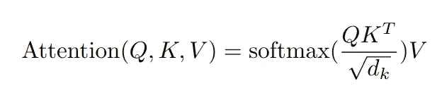
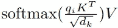
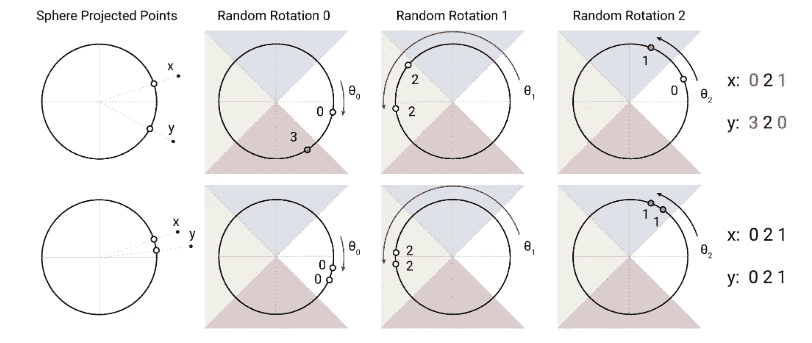
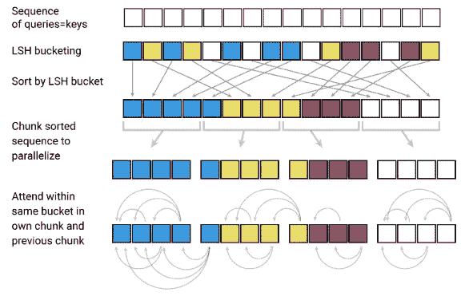
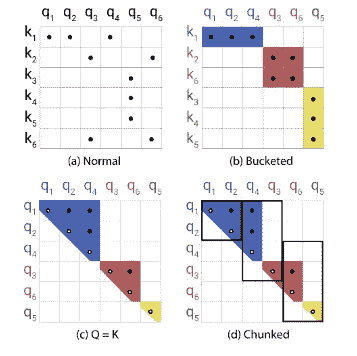
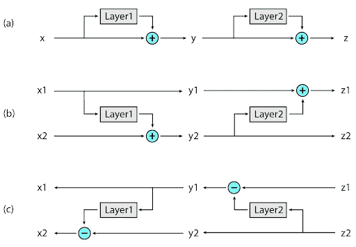
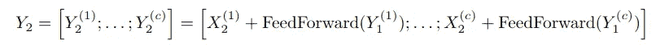
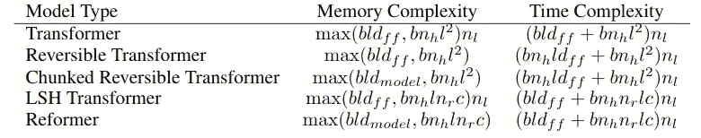
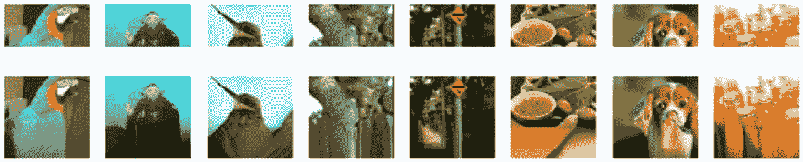

# 改革家:高效的变压器

> 原文：<https://towardsdatascience.com/reformer-the-efficient-transformer-dd9830164703?source=collection_archive---------37----------------------->

## 了解基于变压器的自监督架构

Denys Nevozhai 在 [Unsplash](https://unsplash.com?utm_source=medium&utm_medium=referral) 上拍摄的照片

[变压器](/transformers-explained-65454c0f3fa7) ( [瓦斯瓦尼等人。艾尔。](https://arxiv.org/abs/1706.03762))很棒，它关注更长的上下文，它提供了 rnn 没有的并行计算，最重要的是，它们拥有最先进的结果。

在这篇文章中，我们将讨论改革者模型，它是由 Google Research 在论文[Reformer:The Efficient Transformer](https://arxiv.org/abs/2001.04451)中提出的。该模型本质上解决了转换器模型的一些效率约束，并提出了转换器的改进版本，该版本实现了[位置敏感散列(LSH)](https://en.wikipedia.org/wiki/Locality-sensitive_hashing) 和[可逆层](https://arxiv.org/abs/1707.04585)以使模型更加高效。我们将在本帖接下来的部分更详细地讨论这些。

# 变压器的低效率

尽管是最先进的，变压器非常昂贵(w.r.t .内存)。其中最著名的变形金刚是[伯特](https://medium.com/swlh/bert-pre-training-of-transformers-for-language-understanding-5214fba4a9af) ( [德夫林等人。艾尔。](https://arxiv.org/abs/1810.04805))，也是针对最大允许序列长度 512 进行训练的。为了进一步说明这一点，我们举一个与本文中相同的例子:

报道的最大变压器配置有 64 层，每层有 0.5B 个参数。假设我们想为一个长度为 64K 的序列训练一个转换器。这里，0.5B 参数占 2GB 内存。此外，批量大小为 8 的 1024 维嵌入权重占 64K x 1K x 8 = 0.5B 个浮点，这也是 2GB 的内存。现在，如果我们要为单个层训练这个模型，我们可以很容易地在单个 GPU 上训练它，但是，还有 63 层要附加。此外，训练 BERT 的语料库需要 17GB 来存储。

鉴于上述情况，以下是原始变压器中解决的问题:

1.  **N 层需要比单层多 N 倍的内存**，这是因为每层的**输入都需要存储用于反向传播**。
2.  ***d _ ff******(中间前馈层的深度)与*d _ model**相比相当大****，因此占用大量内存。**
3.  **长度为 L 的序列的注意力计算在**计算和空间复杂度**中都考虑了 **O(L )** 。**

**在接下来的章节中，我们将看到 Reformer 如何克服这些问题。**

# **区分位置哈希(LSH)注意**

****

**Vaswani 等人。艾尔。”**

**这是原始 Transformer 模型中按比例缩放的点积注意力。这里，实际的嵌入首先被激活到 3 个不同的向量中，即查询(Q)、密钥(K)和值(V)(对于每个令牌)。然后获得查询和键的矢量点积，告诉**每个矢量对获得给定矢量**有多大贡献(基本上是注意)。关于自我关注的更多内容，你可以阅读我关于变形金刚的博客。**

## **记忆有效注意**

**主要问题在于 QKᵀ的任期。假设查询和键的形状分别为 **( *batch_size，seq_length，d_model* )** 。现在，QKᵀ会产生一个 **( *batch_size，seq_length，seq_length* )** 的形状。因此，即使批量大小为 1，64K 长度的序列将具有 64k×64k 大小的矩阵(16GB 内存)的 QKᵀ项。**

**好吧，这个问题的解决方法是，我们可以分别计算每个查询 *q_i* 的关注度，而不是整个 Q 项，即**

****

**通过[重整器文件](https://arxiv.org/abs/2001.04451)进行内存高效关注**

**这听起来效率很低，因为这在某种程度上剥夺了变压器的并行处理能力。然而，你会惊讶地知道，LSH 的注意力(我们即将看到)补偿了这一部分。**

## **Q = K**

**在变压器的原始实现中，使用 3 组不同的权重(线性层)来激活 Q、K 和 V。相反，作者建议对查询和键使用相同的权重。这被称为共享 QK 模式。**

> **事实证明，共享 QK 并不影响变形金刚的性能**
> 
> **— [重整器纸](https://arxiv.org/abs/2001.04451)**

## **LSH 注意了**

**因此，我们讨论了分别计算每个查询的关注度，这似乎很低效，因为它不是并行的。但是如果我们从长度为 64K 的完整序列中取出 32 或 64 个最接近给定查询的键，然后由 T2 计算它们的关注度，会怎么样呢？这正是 LSH 注意力所做的。让我们看看 LSH 是如何工作的:**

**为了清楚地了解这一点，我们先来快速讨论一下向量空间的作用。因此，在转换器的第一层，我们本质上将给定序列中的每个记号映射到一个“向量”。这表明我们正在将所有的标记映射到一个公共的向量空间，其中词汇表中所有标记的向量表示共存。现在，在一种语言上训练这些映射，使得**相似或相关标记的向量表示彼此更接近**，而**不相关的标记彼此远离**(参考消息，我们可以使用距离度量来测量这些向量的相关性；例如余弦距离)。**

****

**通过[重整器纸](https://arxiv.org/abs/2001.04451)进行角度位置敏感散列**

**将我们之前讨论的向量空间中的任意两个向量视为两点 x 和 y。我们认为这个假想的圆(实际上是球体)包含这些点(比如说，这个圆就是向量空间)。然后，我们将圆分成 4 部分(4 个散列桶),并随机旋转该分区，即随机旋转圆。我们在这里有两个观察结果(参考图):**

1.  **在第一种情况下(向上)，向量(点)彼此相对**远**。因此，在随机旋转时，向量很可能**以高概率**在不同的桶中结束。**
2.  **而在第二种情况下(向下),向量彼此明显地**更接近**。所以你可以看到，他们更有可能**以高概率**结束在同一个桶里。**

> **如果附近的向量很有可能获得相同的散列，而远处的向量则不会，则将每个向量 x 分配给散列 h(x)的散列方案被称为位置敏感的。**
> 
> **— [重整器纸](https://arxiv.org/abs/2001.04451)**

**在重整器中，这是通过取大小为( *d_k，b/2* )的随机矩阵 *R* 来实现的，其中 *d_k* 是密钥向量的大小， *b* 是桶的数量。并且向量 x 的散列函数 h 被给定为:**

> **h(x)= arg max([xR；-xR ])**

**其中*【a；b ]* 是串联。所以通过拥有 *xR* 和 *-xR* ，我们实质上是在 *x* 上进行随机投影。直观来说，我们是取 *b* 大小为 *d_k* 和**的向量(桶)评估 x 所属的桶**。**

****

**LSH 通过[关注改革家论文](https://arxiv.org/abs/2001.04451)**

**上图描述了在转化炉中实现的 LSH 注意的流程。**

1.  **使用我们刚刚讨论的 **LSH** 方案，将查询/键(查询=键)向量分配给它们各自的桶。**
2.  **我们**根据它们的桶对**查询/关键向量进行排序。**
3.  **由于哈希桶的大小可能不均匀，因此很难进行批处理。因此，采用的方法是，取固定大小的**块**加偏移量 1；即，我们取大小为 *m 的块*和**来计算来自相同桶和相同块以及一个块回**的向量的关注度。通常，块的大小是 *2l / b* ，其中 *l* 是序列长度。**

*   **对于因果屏蔽(或前瞻屏蔽)，首先，获取查询/关键向量的位置 id，根据桶式排序顺序进行排序，然后通过比较这些位置 id，计算屏蔽。**
*   **此外，相似的向量有可能落在不同的桶中。为了解决这个问题，我们可以用不同的散列函数执行 ***n 轮*** 轮散列**。****

****

**通过[改革者论文](https://arxiv.org/abs/2001.04451)LSH 注意的每一步上的注意向量的行为和稀疏性**

# **可逆变压器**

****

**Gomez 等人的常规剩余连接(a) v/s RevNets (b)、(c)的比较。艾尔。通过[谷歌人工智能博客](https://ai.googleblog.com/2020/01/reformer-efficient-transformer.html)**

**我们利用前面讨论过的 LSH 注意解决了注意计算中的记忆问题。然而，当涉及到变形金刚消耗的内存时，还有另一个主要的关注点。在前馈层中，通常有一个变压器，其 *d_ff* 值为～4K，层数为～16。此外，每层的**输入需要被存储用于反向传播**。在这样的设置中，序列长度为 64K，我们最终仍然会得到不切实际的 16GB 内存范围。**

**因此，为了解决这个问题，Reformer 借用了 RevNets(可逆残差神经网络)的思想，这是 Gomez 等人在[中提出的。艾尔。](https://arxiv.org/abs/1707.04585)为了理解这种架构，请看上图:**

**(A)**ResNet 中的常规跳过连接:**我们获取输入，计算层值(实际上是一个函数)，并将其添加到原始层输入中。在图中，x 和 y 的值需要存储在内存中用于反向传播。所以:**

> ****y = x + F(x)****
> 
> ****z = y + G(y)****

**(b)**RevNet 中的前向传递:**其思想是允许从下一层的输入中恢复任一层的输入；即**

> ****y1 = x1；****
> 
> ****y2 = z2 = x2 + F(x1)****
> 
> ****z1 = y1 + G(y2)****

**(c)**RevNet 中的反向传递:**现在，我们可以使用以下公式轻松地重建各层的输入:**

> ****x1 = y1 = z1g(y2)****
> 
> ****x2 = y2 F(x1)= z2f(x1)****

**因此，很明显，我们可能会重建输入值，而不是存储它们用于反向传播和节省内存。**

**最后，可逆变压器实现如下:**

> ****Y1 = X1 +注意(X2)****
> 
> ****Y2 = X2 +前馈(Y1)****

# **拆分 d_ff**

**最后，我们处理具有 *d_ff* 输出单元的中间前馈层，其中 *d_ff* 与 *d_model* 相比相当大(一般为~4K)。**

**考虑具有 64K 令牌的序列，在标准转换器中，所有输出都是并行计算的，因此权重占用更多内存。虽然前馈**输出是针对整个序列**、**并行计算的，但它不一定是**，因为任何给定令牌向量的输出都独立于其他向量。**

**因此，重整者建议分块处理该层:**

****

**通过[重整器纸](https://arxiv.org/abs/2001.04451)在中间前馈层分块处理序列**

> **利用分块+可逆层，重整器模型的层输入记忆与层数无关。**

# **总结一下**

1.  **注意力计算-记忆问题通过使用 LSH 注意力来克服。**
2.  **通过使用可逆层解决了层输入存储问题。**
3.  **具有 *d_ff* 输出单元的高维前馈层可以通过分块处理输入序列来中和。**

# **结果**

****

**通过[重整器论文](https://arxiv.org/abs/2001.04451)比较各种变压器架构的复杂性**

**在哪里，**

*****b*** = >批量， ***l*** = >序列长度， ***d_ff*** = >中间前馈的尺寸， ***n_h*** = >头数， ***n_l*** = >层数，【T20**

**重整器可以用于从部分图像生成完整的图像:**

****

****顶部:**用作重整器输入的图像片段。**下图:**“已完成”的全帧图像。原始图像来自 [Imagenet64 数据集](https://arxiv.org/abs/1707.08819)通过[谷歌人工智能博客](https://ai.googleblog.com/2020/01/reformer-efficient-transformer.html)。**

> **有趣的事实:这个重整器非常高效，它可以在一个只有 16GB 内存的 GPU 上处理长达 100 万字的文本序列。**
> 
> ****有趣的事实:Reformer 可以在一台设备上一次性处理整部小说。****

# **结论**

**在这篇(很长的)文章中，我们深入讨论了重整器模型。我们看到了它在变压器中解决了哪些效率缺陷，以及如何克服这些缺陷。**

**[这里是](https://github.com/google/trax/tree/master/trax/models/reformer) [Google trax](https://github.com/google/trax) 提供的重整器代码的 Github 库的链接。**

**这是一个 Colab 笔记本，用于谷歌的[图像生成演示](https://colab.research.google.com/github/google/trax/blob/master/trax/models/reformer/image_generation.ipynb)，另一个用于[文本生成演示](https://colab.research.google.com/github/google/trax/blob/master/trax/models/reformer/text_generation.ipynb)。**

**[这里是 huggingface 的 API 文档](https://huggingface.co/transformers/model_doc/reformer.html)的链接，用于重整器实施和预训练重量。**

# **参考**

**重整器纸:[https://arxiv.org/abs/2001.04451](https://arxiv.org/abs/2001.04451)**

**RevNets 论文:[https://arxiv.org/abs/1707.04585](https://arxiv.org/abs/1707.04585)**

**变压器纸:[https://arxiv.org/abs/1706.03762](https://arxiv.org/abs/1706.03762)**

** [## 改革家:高效的变压器

### 理解连续数据——如语言、音乐或视频——是一项具有挑战性的任务，尤其是当有…

ai.googleblog.com](https://ai.googleblog.com/2020/01/reformer-efficient-transformer.html)  [## 变形金刚解释

### 对谷歌 Transformer 模型的详尽解释；从理论到实施

towardsdatascience.com](/transformers-explained-65454c0f3fa7)**