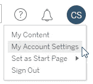
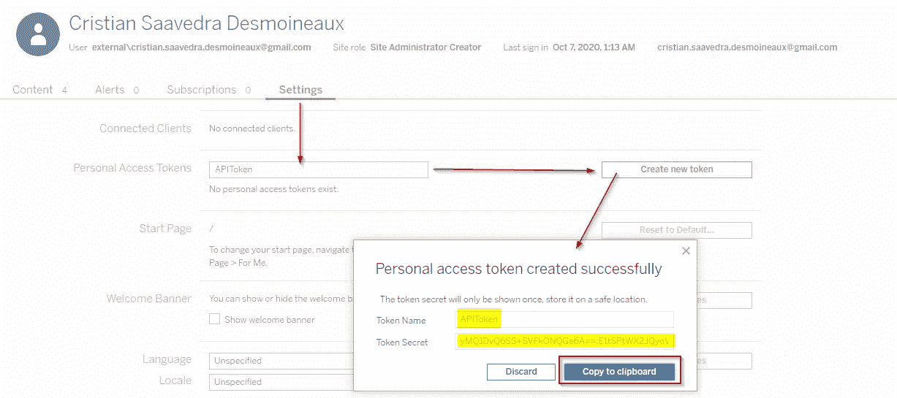
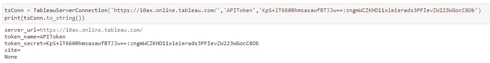
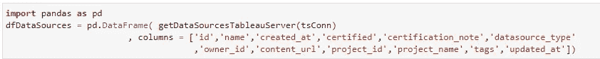
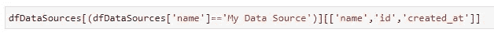

# 使用 Python 自动刷新 Tableau 数据源

> 原文：<https://towardsdatascience.com/refresh-tableau-server-data-source-and-workbooks-using-python-4baa99cc3b93?source=collection_archive---------13----------------------->

## 了解如何使用 Tableau 服务器客户端(TSC)更新数据源和工作簿

假设您希望您的仪表板在数据可用的正确时刻准备好。在这种情况下，您会发现使用一个**计划**任务是不够的，因为您不知道填充过程何时结束！

唯一缺失的部分是一个在触发事件发生后刷新仪表板的自动化过程，比如在执行了 **ETL** 的最后一步之后，或者当你把**新文件加载**到亚马逊 S3 桶中时。

我将解释如何使用 Python 刷新或更新现有的 **Tableau 数据源**和**工作簿**来解决这些问题。我建议查看这个[以前的帖子](/automate-getting-tableau-server-users-with-rest-api-and-python-228fe6e7677f)来看看其他用例。

下面的代码显示了如何获取 ID 并执行数据源或工作簿刷新。

如果没有安装 Python，我推荐使用 Miniconda。你可以在[这篇文章中看到更多细节。](/configuring-jupyter-notebook-in-windows-subsystem-linux-wsl2-c757893e9d69)

# 为 Python 安装 REST API 库

首先，您需要使用 pip 安装 Tableau 服务器客户端(TSC ),这是位于[https://Tableau . github . io/Server-Client-python/docs/# install-TSC](https://tableau.github.io/server-client-python/docs/#install-tsc)的文档中推荐的

```
pip install tableauserverclient
pip install tableauserverclient --upgrade
```

# 配置个人访问令牌

我们将使用[个人访问令牌或 PAT](https://help.tableau.com/current/server/en-us/security_personal_access_tokens.htm) 进行连接。下一步是到右上角的 Tableau 服务器，选择我的帐户设置。



向下滚动并复制个人访问令牌的令牌密码



如果您没有看到个人访问令牌选项，您可以尝试使用链接激活，用您的站点替换<site>:</site>

```
[https://10ax.online.tableau.com/?personalAccessTokensEnabled=true#/site/<site>/home](https://10ax.online.tableau.com/?personalAccessTokensEnabled=true#/site/cristiansaavedradev226290/home)
```

# 关系

为了简化，我用变量创建了类**TableauServerConnection**:

*   【服务器 _ 网址】https://10ax.online.tableau.com/，完整的 HTTP 地址如[一样](https://10ax.online.tableau.com/)
*   **token_name** 是之前制作的令牌的标识名
*   **令牌 _ 秘密。这是尚未创建的令牌的秘密文本**
*   **地点。**它的是站点名称。如果需要连接到缺省值，则让它为空。

您的连接将如下所示:

```
tsConn = TableauServerConnection('https://10ax.online.tableau.com/','APIToken','copyHereTheTokenSecret')
```



# 数据源

下一步是连接到 Tableau 服务器并刷新现有的数据源。要做到这一点，你需要身份证。因为不容易找到它，所以我创建了函数**getdatasourcestableuserver**，它列出了使用先前连接的所有数据源。

我将使用 Python Pandas 来搜索 ID，用**返回的列表创建一个数据框**函数:



那么你可以得到过滤数据帧的 ID 如下:



然后您可以使用**refreshdatasourcetableuserver**按 ID 刷新数据源，如下所示:


接下来的几行是有魔力的。如果你想知道更多关于正在做的事情，你可以在[文档页面](https://tableau.github.io/server-client-python/docs/api-ref#data-sources) **找到信息。**

```
refresh datasource = server.datasources.get_by_id(datasource_id)
refreshed_datasource = server.datasources.refresh(datasource)
```

# 工作簿

在某些情况下，您有一个工作簿连接到数据源，同时，他的数据源也需要刷新。

与上一步一样，工作簿需要 ID 来执行刷新。为了便于 ID 的搜索，以与上一步相同的方式使用函数**getWorkBooksTableauServer**。

要刷新工作簿，请按 ID 使用**refreshdatasourcetableuserver**函数，如下所示:


# 谢谢

最后，我要感谢 Carlos Lobera，他把我介绍给了 **Evan Slotnick** 、 **Anir Agarwal** 和 **Elliott Stam** ，他们打开了 Tableau Server 日常任务自动化的大门。

特别感谢 **Timothy Vermeiren** 和 **Francisco Pagliaricci** 使用 URL 激活个人访问令牌。

[快乐万岁！](https://medium.com/@cristiansaavedra)

# 有用的资源

[](https://tableau.github.io/server-client-python/docs/) [## 开始

### 使用 Tableau 服务器客户端(TSC)库来提高您在与 Tableau 服务器 REST 交互时的工作效率…

tableau.github.io](https://tableau.github.io/server-client-python/docs/) [](https://help.tableau.com/current/api/rest_api/en-us/REST/rest_api.htm) [## Tableau 服务器 REST API

### 通过 Tableau Server REST API，您可以使用 HTTP 以编程方式管理和更改 Tableau 服务器资源。的…

help.tableau.com](https://help.tableau.com/current/api/rest_api/en-us/REST/rest_api.htm) [](https://help.tableau.com/current/server/en-us/security_personal_access_tokens.htm) [## 个人访问令牌

### 个人访问令牌为 Tableau 服务器用户提供了创建长期身份验证令牌的能力。代币…

help.tableau.com](https://help.tableau.com/current/server/en-us/security_personal_access_tokens.htm)