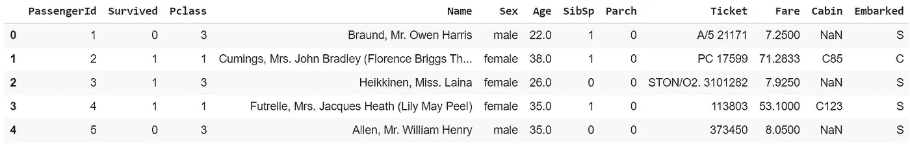
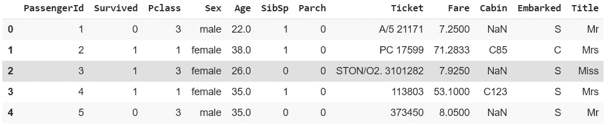

# Python 正则表达式简介

> 原文：<https://towardsdatascience.com/regex-with-python-b4c5ca7c1eba?source=collection_archive---------42----------------------->


罗曼·维涅斯在 [Unsplash](https://unsplash.com/s/photos/focus?utm_source=unsplash&utm_medium=referral&utm_content=creditCopyText) 上的照片

## 从概念到应用

假设您想基于给定的查询搜索某样东西。如果只靠一根弦，是得不到想要的。那么，如何在海量信息中寻找你需要的东西呢？

当然，你需要一个能识别你想找的字符串的模式。为此，我们可以使用正则表达式(Regex)。

在本文中，我将向您展示它的概念和应用，以解决数据科学中的问题，特别是使用 Python 预处理文本。

# 概述

我将这篇文章分为两个部分:

*   **正则表达式的概念**
*   **正则表达式的应用**

# 正则表达式的概念

正则表达式是一种特殊类型的字符串，可以用来匹配字符串中的术语或单词。

它由特殊字符序列组成，因此我们可以根据需要使用它来匹配任何术语。这里有几个您可以使用的特殊字符，

*   点号(。)匹配字符串中的任何字符，
*   脱字符号(^)匹配字符串的开头，
*   美元符号($)匹配字符串的结尾，
*   星号(*)匹配零个或多个重复的前一个字符的模式，
*   加号(+)匹配前一个字符的一次或多次重复，
*   问号(？)匹配前一个字符的 0 次或 1 次重复，
*   花括号{m，n}将匹配前一个字符的 m 或 n 个重复，
*   如果要使用标点符号，将使用反斜杠(\)，但它也是一个特殊字符。例如，要匹配$，您应该在字符前添加一个反斜杠，如“\$ ”,
*   方括号([ ])可用于仅包含与字符串匹配的某些字符。假设你想找到包含 a、I 和 r 的单词，你可以使用像[air]这样的模式。

回想一下反斜杠有几个特殊的序列。如果你想包含所有的单词或数字，而不是把它们都写在方括号内，这是非常有用的。你可以使用这些序列，例如，

*   \d 将匹配任何数字
*   \s 将匹配空白字符
*   \w 将匹配任何字符
*   \D 将匹配除数字以外的内容
*   \S 将匹配除空白以外的内容
*   \W 将匹配除字符以外的内容

对于这些特殊字符，您可以根据想要提取的术语来组合它们。例如，您想要从 tweets 列表中检索标签，您可以使用类似“#\w+”的模式。

组合模式是可能的，因为有一条规则说，

> 如果一个模式与另一个模式结合，就会产生另一个模式。

# 正则表达式的应用

在您了解了正则表达式的概念之后，现在让我们看看如何应用它来操作文本。

第一个是删除我们不用于处理文本的术语。假设您想要对 tweets 集合进行文本挖掘。因此，在挖掘推文之前，你必须首先对它们进行预处理，因为我们希望高效地进行计算，并避免其中任何无意义的信息。例如，你有一条这样的推文，

```
**#Nasional Wapres: Jumlah Orang Miskin Bertambah Gara-Gara Pandemi Covid-19 https://t.co/sJvig4w7LL**
```

有几个术语你想删除，如提及，标签，链接等。在 Python 中，我们可以使用 re 库中的一个名为 sub 的方法来删除它们。

我们可以在函数中设置参数，比如正则表达式格式的模式，用来替换术语的字符串，以及我们想要处理的最后一个字符串。这是关于这个功能的一瞥，

```
**re.sub(pattern, replacement, data)** 
**- pattern: the pattern on regex format 
- replacement: the replacement string for terms that suits the pattern 
- data: a variable or a string that want to process**
```

通过使用这个函数，我们可以像这样使用它，

```
import re**# The raw tweet**
tweet = "#Nasional Wapres: Jumlah Orang Miskin Bertambah Gara-Gara Pandemi Covid-19 [https://t.co/sJvig4w7LL](https://t.co/sJvig4w7LL)"**# Preprocessing using Regex**
tweet = re.sub("#\w+", "", tweet)
tweet = re.sub("https*.+", "", tweet)print(tweet)
**# Here is the result,
#  Wapres: Jumlah Orang Miskin Bertambah Gara-Gara Pandemi Covid-19**
```

我想展示的另一个例子是在 string 中搜索和检索一个子串。在这种情况下，我将从数据科学中被称为“hello world”的数据集中选取一个示例。这是泰坦尼克号数据集。

对于那些不知道的人来说，这是一个用作 Kaggle 比赛介绍的数据集。这个竞赛的目标是根据与一名乘客相对应的数据来预测该乘客是否幸存。数据集看起来像这样，



它由几列组成，描述乘客的人口统计数据、票价、姓名，还有“幸存”列，描述乘客是否幸存。在这种情况下，让我们关注“名称”列。让我们来看几个例子，

```
**0                               Braund, Mr. Owen Harris
1     Cumings, Mrs. John Bradley (Florence Briggs Th...
2                                Heikkinen, Miss. Laina
3          Futrelle, Mrs. Jacques Heath (Lily May Peel)
4                              Allen, Mr. William Henry
5                                      Moran, Mr. James
6                               McCarthy, Mr. Timothy J
7                        Palsson, Master. Gosta Leonard
8     Johnson, Mrs. Oscar W (Elisabeth Vilhelmina Berg)
9                   Nasser, Mrs. Nicholas (Adele Achem)
10                      Sandstrom, Miss. Marguerite Rut
11                             Bonnell, Miss. Elizabeth
12                       Saundercock, Mr. William Henry
13                          Andersson, Mr. Anders Johan
14                 Vestrom, Miss. Hulda Amanda Adolfina
15                     Hewlett, Mrs. (Mary D Kingcome) 
16                                 Rice, Master. Eugene
17                         Williams, Mr. Charles Eugene
18    Vander Planke, Mrs. Julius (Emelia Maria Vande...
19                              Masselmani, Mrs. Fatima
Name: Name, dtype: object**
```

根据上面的样品，你发现了什么规律吗？如果细看，每个名字都有自己的称谓，比如先生、太太、小姐。，师傅。等。我们可以提取这些作为一个新的特征，称为“标题”。这个标题与其他术语的不同之处在于，它包含了点标点符号。因此，我们可以使用模式提取它。

我们如何从每个名字中提取标题？我们可以使用 re 库中一个名为 search 的函数。使用该函数，我们可以根据给定的模式提取术语。它需要模式和字符串列表。代码看起来像这样，

```
**def get_title(x):
  # Searching matched patterns
  x = re.search('\w*\.', x).group()
  # Removing dot punctuation to ease the analysis process
  x = re.sub('\.', '', x)
  return x****train['Title'] = train['Name'].apply(get_title)
train = train.drop('Name', axis=1)
train.head()**
```

确保在字符串中搜索完一个术语后，用一个名为 group 的方法将函数链接起来。或者看起来像这样，

```
**# If you don't use group method, it will show this**
<_sre.SRE_Match object; span=(8, 11), match='Mr.'>
```

如果你做的正确，结果会是这样的，



下面是搜索功能及其方法的摘要，

```
**re.search(pattern, data)
parameters:
 - pattern: The pattern that suits what we want to find
 - data: The data that we used. It could be string or list of strings
methods:
 - group: it returns a string or more.**
```

# 结论

这就是我们如何使用 Python 使用正则表达式来处理文本，因此我们可以通过删除无意义的信息来获得更有意义的见解。我也向你展示了它的概念和一些应用。我希望这篇文章对你有用，如果你有任何意见，请写在下面的评论区。

还有一件事，回想一下我上面的代码，我写的模式就像一个普通的字符串。但是为了确保您已经编写了一个正则表达式模式，请在引用的模式前添加“r”字符，就像这样，

```
**# You can write like this
re.sub("#\w+", "", tweet)****# Or like this (Focus on the r)
re.sub(r"#\w+", "", tweet)**
```

就这样，谢谢你。

## 参考

[1][https://docs.python.org/3/library/re.html](https://docs.python.org/3/library/re.html)
【2】[https://www.kaggle.com/c/titanic](https://www.kaggle.com/c/titanic)