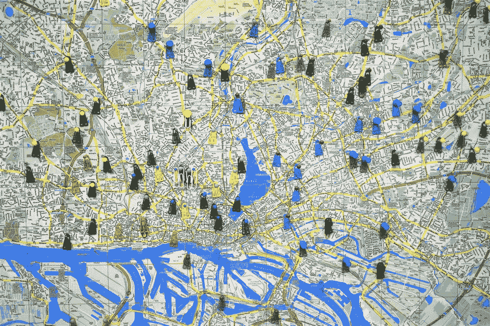
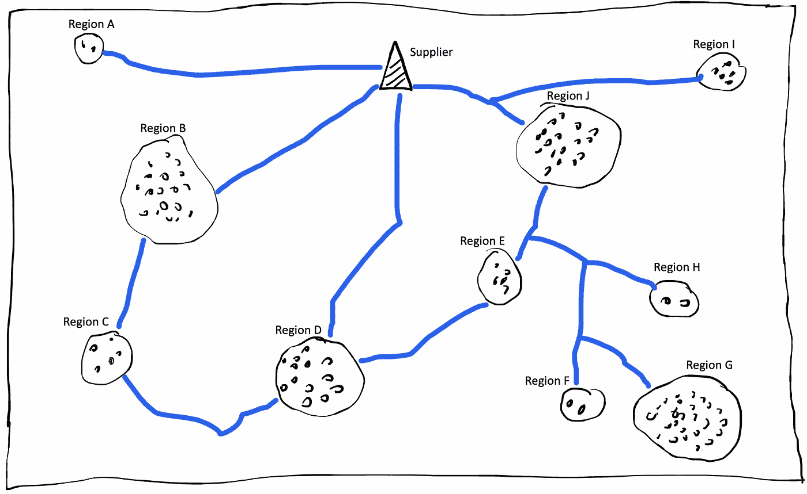
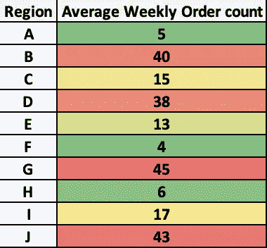
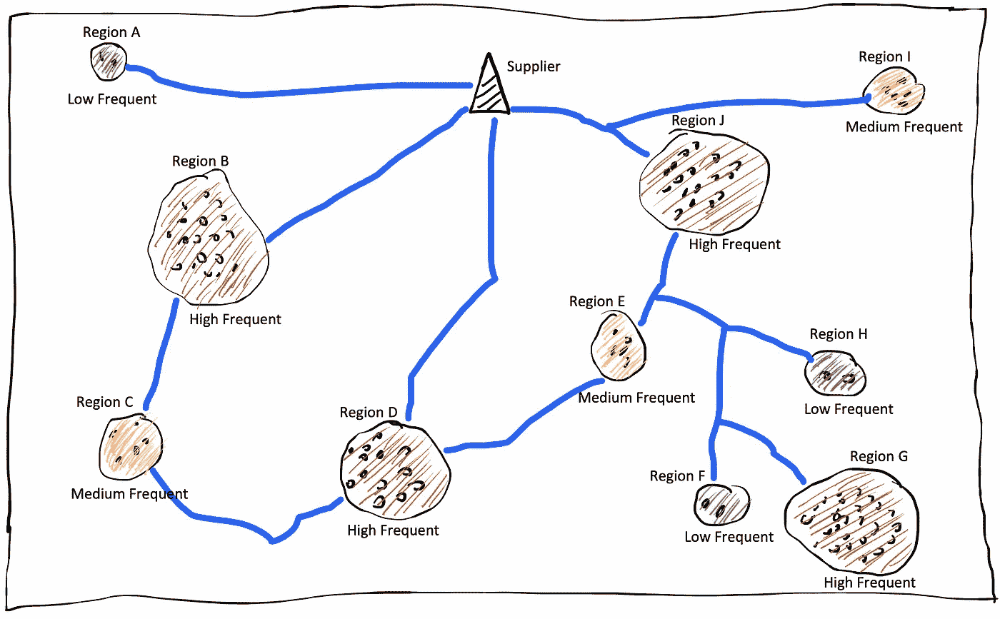
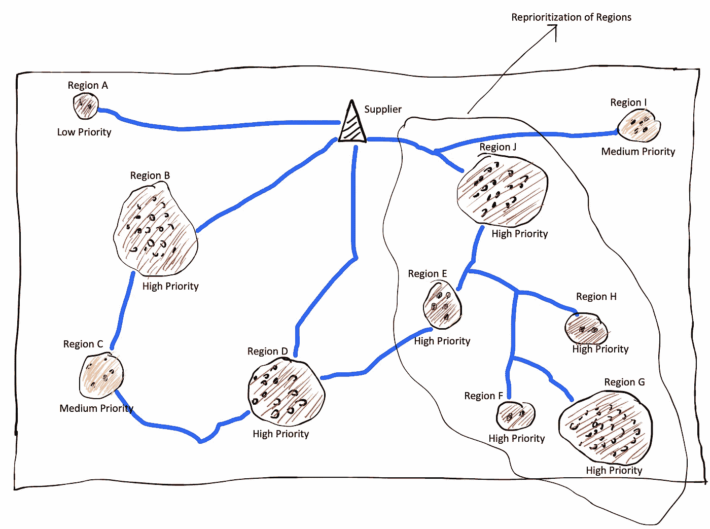

# 区域优先排序算法:帮助企业确定要服务的顶级区域

> 原文：<https://towardsdatascience.com/region-prioritisation-algorithm-helping-business-identify-top-regions-to-serve-20864133cc51?source=collection_archive---------37----------------------->

## 使企业能够将服务划分为高、中、低优先级区域，以提供更智能、更好的服务



图片由[瓦尔德马·布兰德](https://unsplash.com/@waldemarbrandt67w)在 [Unsplash](https://images.unsplash.com/photo-1560532806-dbb46d88b494?ixlib=rb-1.2.1&ixid=eyJhcHBfaWQiOjEyMDd9&auto=format&fit=crop&w=1950&q=80) 上拍摄

目前，由于疫情，许多供应商和在线服务服务于选定的地区，这些地区可能是主要的销售贡献者。此外，当有人开始一项新业务时，他们希望专注于几个可以获得最大利润的地区，并考虑以后的扩张。很多时候，供应商会关闭低利润地区，那里的 T4 投资回报率很低。

所有上述情况都需要根据区域的重要性/优先级/对业务的贡献来确定区域。通过这篇博客，我打算提出一个简单、直观、可扩展的算法，并且很好地按照重要性划分区域。我还将提出一个度量标准，可以量化算法在区分区域优先级方面的有效性。

# 区域优先算法

所提出的算法包括三个步骤:

## 1.频率计数

第一步包括统计来自每个地区的订单频率。根据业务类型和运营方式，可以根据邮政编码、城市或州来定义区域。

同样，根据业务类型和运营方式，频率可以是每天、每周或每月。



图:供应商和服务区域的位置图

蓝线表示图中的路线。圆圈代表不同的地区，并用圆点表示订单。

在上图中，我们有一个供应商和 10 个地区(A-J)。下表总结了每周的订单频率:



图:各地区每周平均订单频率

## 2.分类为高、中或低频率区域

按订单频率(从步骤 1 开始)对区域进行排序，并将它们分为高、中和低频区域。

```
Normally, my selection criteria goes like90-100th percentile of Frequency ~ High-frequency region
75-90th percentile of Frequency ~ Medium-frequency region
<75th percentile of Frequency ~ Low-frequency region**This percentile used for region selection is a hyperparameters which can be tuned as per the Business, its type and needs.**
```



图:基于供应商位置图频率的区域分类

## 3.重新安排区域的优先次序

这最后一步是算法的核心。在这里，我们根据优先级对区域进行聚类，然后将一些区域从一个聚类移到另一个聚类，以得出最终的排名。

## A.初始化

*   用步骤 2 中的所有高频区域初始化高优先级区域。
*   用步骤 2 中的所有中频率区域初始化中优先级区域。
*   用步骤 2 中的所有低频区域初始化低优先级区域。

## B.更改区域优先级

对于所有高优先级区域存储路线中的中间点(以某个间隔)，有[地图 API](https://docs.mapbox.com/api/)提供了这一点。找出属于中低优先级区域的区域与所有这些中间点的距离。如果最短距离小于阈值(< 5 英里~示例)，则将该区域移动到高优先级聚类中。该距离可以是地图距离(道路距离)或其他距离，如[哈弗森](https://en.wikipedia.org/wiki/Haversine_formula)。

> 主要原因是，如果在高优先级区域的路由中或附近存在中或低优先级区域，则可以在服务高优先级区域的同时以最小的努力来服务它。

同样，将位于路径上或中等优先级区域附近的区域从低优先级聚类移动到中等优先级聚类。

作为该步骤的结果，区域‘E’、‘H’和‘F’移动到高优先级区域，因为它们在高优先级区域‘G’的路线中或附近。直觉是‘E’、‘H’、‘F’可以用最小的努力与高优先级区域‘G’一起服务。最终的供应商位置图如下所示:



订单优先排序后的最终供应商位置图

# 量化算法的有效性

为了量化所提出的算法的有效性，我们设计了一个度量“优先化增益”。优先化收益被定义为销售覆盖率与距离覆盖率的比率。

比方说，在对区域进行优先排序并只为高优先级区域提供服务后，我们将与实际值的差距缩小到了 40%,销售额与实际值的差距缩小到了 80%。在这种情况下,“优先化收益”将是:

```
Prioritization Gain = 0.80/0.40 = 2.28
```

“优先级增益”值越高，算法的性能越好。

# 结论

在这篇博文中，我们设计了一个简单且可扩展的区域优先级算法，来帮助企业识别最优先(最有利可图)的区域，以便更好地服务。此外，我们直观地分析了它是如何工作的，并定义了一个度量标准来衡量它的有效性。

> 如果你有任何疑问，请联系我。我很想知道你是否正在研究一些路线优先排序或基于图的算法，这篇博文很有帮助。

***我的 Youtube 频道更多内容:***

[](https://www.youtube.com/channel/UCg0PxC9ThQrbD9nM_FU1vWA) [## 阿布舍克·蒙戈利

### 嗨，伙计们，欢迎来到频道。该频道旨在涵盖各种主题，从机器学习，数据科学…

www.youtube.com](https://www.youtube.com/channel/UCg0PxC9ThQrbD9nM_FU1vWA) 

> ***关于作者-:***
> 
> Abhishek Mungoli 是一位经验丰富的数据科学家，拥有 ML 领域的经验和计算机科学背景，跨越多个领域并具有解决问题的思维方式。擅长各种机器学习和零售业特有的优化问题。热衷于大规模实现机器学习模型，并通过博客、讲座、聚会和论文等方式分享知识。
> 
> 我的动机总是把最困难的事情简化成最简单的版本。我喜欢解决问题、数据科学、产品开发和扩展解决方案。我喜欢在闲暇时间探索新的地方和健身。在 [**中**](https://medium.com/@mungoliabhishek81) 、**[**Linkedin**](https://www.linkedin.com/in/abhishek-mungoli-39048355/)**或**[**insta gram**](https://www.instagram.com/simplyspartanx/)**关注我，查看我[以前的帖子](https://medium.com/@mungoliabhishek81)。我欢迎反馈和建设性的批评。我的一些博客-********

*   ******每个数据科学家都应该避免的 5 个错误******
*   ******[以简单&直观的方式分解时间序列](/decomposing-a-time-series-in-a-simple-and-intuitive-way-19d3213c420b?source=---------7------------------)******
*   ******[GPU 计算如何在工作中真正拯救了我？](https://medium.com/walmartlabs/how-gpu-computing-literally-saved-me-at-work-fc1dc70f48b6)******
*   ******信息论& KL 分歧[第一部分](/part-i-a-new-tool-to-your-toolkit-kl-divergence-5b887b5b420e)和[第二部分](/part-2-a-new-tool-to-your-toolkit-kl-divergence-736c134baa3d)******
*   ******[使用 Apache Spark 处理维基百科，创建热点数据集](/process-wikipedia-using-apache-spark-to-create-spicy-hot-datasets-1a59720e6e25)******
*   ******[一种基于半监督嵌入的模糊聚类](/a-semi-supervised-embedding-based-fuzzy-clustering-b2023c0fde7c)******
*   ******[比较哪种机器学习模型表现更好](/compare-which-machine-learning-model-performs-better-4912b2ed597d)******
*   ******[分析 Fitbit 数据，揭开疫情封锁期间身体模式变化的神秘面纱](/analyzing-fitbit-data-to-demystify-bodily-pattern-changes-amid-pandemic-lockdown-5b0188fec0f0)******
*   ******[神话与现实围绕关联](/myths-and-reality-around-correlation-9b359456d8e1)******