# LSTM 网络和时间序列数据预测未来价格

> 原文：<https://towardsdatascience.com/regression-analysis-lstm-network-to-predict-future-prices-b95dc0db6fcc?source=collection_archive---------18----------------------->

## 加密货币和神经网络

## 使用每小时数据的神经网络和时间序列价格预测

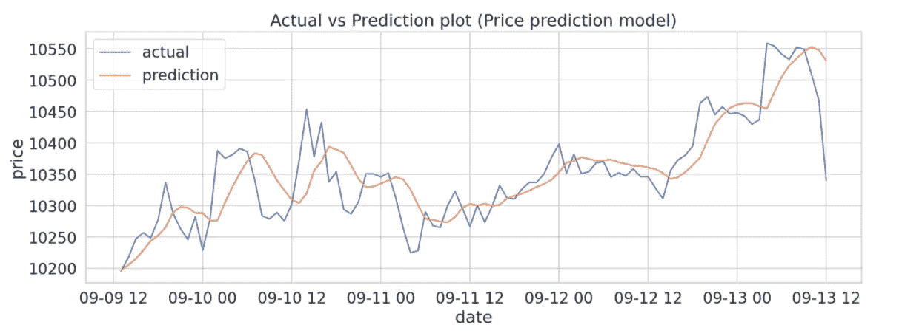

作者图片

[https://sarit-maitra.medium.com/membership](https://sarit-maitra.medium.com/membership)

***来自《走向数据科学》编辑的提示:*** *虽然我们允许独立作者根据我们的* [*规则和指导方针*](/questions-96667b06af5) *发表文章，但我们不认可每个作者的贡献。你不应该在没有寻求专业建议的情况下依赖一个作者的作品。详见我们的* [*读者术语*](/readers-terms-b5d780a700a4) *。*

T21:由于时间序列的高波动性以及随机运动的非线性，股票价格的预测是一项相当具有挑战性的工作。这里，我们手头的问题是一个价格预测问题，我们试图预测一个范围内定义的数值(大约从 9000 到 12500)。这个问题符合回归分析框架。我们将使用神经网络架构来尝试解决这里的问题。

我们将在这里建立一个深度神经网络，为我们做一些预测，并使用它来预测未来的价格。让我们加载每小时的频率数据。

# 数据加载:

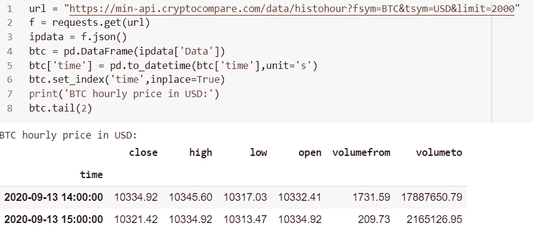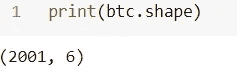

我们总共有 2001 个数据点用美元表示比特币。我们对预测未来日期的收盘价感兴趣。

当我们看到一个时间序列时，我们总是想知道当前时间步长的值是否会影响下一个时间步长。

```
plt.figure(figsize = (15,5))
plt.plot(btc.close)
plt.title('BTC Close price (Hourly frequency)')
plt.xlabel ('Date_time')
plt.ylabel ('Price (US$')
plt.show()
```

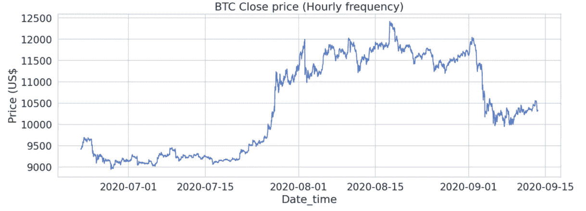

这里我们将使用 LSTM 网络，它有能力捕捉序列中的长期相关性(例如，今天的价格和两周前的价格之间的相关性)。此外，这里使用的单变量系列仅考虑该系列的接近价格。

让我们使用 MinMax scaler 将价格数据标准化。

## **数据缩放:**

```
scaler = MinMaxScaler() 

close_price = btc['close'].values.reshape(-1, 1) # The scaler expects the data to be shaped as (x, y)
scaled_close = scaler.fit_transform(close_price)
scaled_close = scaled_close[~np.isnan(scaled_close)] # reshaping data after removing NaNs
scaled_close = scaled_close.reshape(-1, 1) 
# reshaping data after removing NaNs
```

## LSTM 的数据处理:

LSTMs 需要三维数据形状；所以我们需要把数据拆分成:[batch_size，sequence_length，n_features]的形状。我们还想保存一些数据用于测试。

让我们建立一些序列。序列的工作方式类似于向前行走验证方法，其中将定义初始序列长度，随后将向右移动一个位置以创建另一个序列。这样，重复该过程，直到使用了所有可能的位置。

```
SEQ_LEN = 100 
# creating a sequence of 100 hours at position 0.
def to_sequences(data, seq_len):
d = []
for index in range(len(data) - seq_len):
d.append(data[index: index + seq_len])
return np.array(d)
def preprocess(data_raw, seq_len, train_split):
data = to_sequences(data_raw, seq_len)
num_train = int(train_split * data.shape[0])
X_train = data[:num_train, :-1, :]
y_train = data[:num_train, -1, :]X_test = data[num_train:, :-1, :]
y_test = data[num_train:, -1, :]return X_train, y_train, X_test, y_test"""Walk forward validation: 
Initial SEQ_LEN is defined above, so, walk forward will be shifting one position to the right and create another sequence.
The process is repeated until all possible positions are used."""X_train, y_train, X_test, y_test = preprocess(scaled_close, SEQ_LEN, train_split = 0.95) 
# 5% of the data saved for testing.print(X_train.shape, X_test.shape)"""Our model will use 1805 sequences representing 99 hours of Bitcoin price changes each for training. We shall be predicting the price for 96 hours in the future"""
```

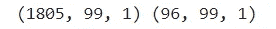

## 偏差方差:

如果模型在训练和测试数据集中的误差都很高，这将表明模型对两个数据集都拟合不足，并且具有很高的偏差。如果模型在训练集中具有低误差，但在测试集中具有高误差，这表示高方差，因为模型未能推广到第二组数据。

因此，目标是生成一个在训练和测试数据集中总体误差较低的模型，并平衡正确的偏差和方差水平。

# 构建 LSTM 模型:

我们将创建一个 3 层 LSTM 网络，使用 20%的退出率来控制训练期间的过拟合。

```
DROPOUT = 0.2 
# 20% Dropout is used to control over-fitting during training
WINDOW_SIZE = SEQ_LEN - 1
model = keras.Sequential()# Input layer
model.add(Bidirectional(LSTM(WINDOW_SIZE, return_sequences=True), input_shape=(WINDOW_SIZE, X_train.shape[-1])))"""Bidirectional RNNs allows to train on the sequence data in forward and backward direction."""model.add(Dropout(rate=DROPOUT))# 1st Hidden layer
model.add(Bidirectional(LSTM((WINDOW_SIZE * 2), return_sequences = True)))
model.add(Dropout(rate=DROPOUT))# 2nd Hidden layer
model.add(Bidirectional(LSTM(WINDOW_SIZE, return_sequences=False)))# output layer
model.add(Dense(units=1))model.add(Activation('linear'))"""Output layer has a single neuron (predicted Bitcoin price). We use Linear activation function which activation is proportional to the input."""BATCH_SIZE = 64
model.compile(loss='mean_squared_error', optimizer='adam')
history = model.fit(X_train, y_train, epochs=50, batch_size=BATCH_SIZE, shuffle=False, validation_split=0.1) 
# shuffle not advisable during training of Time Series
```

我们可以在训练期间使用回调选项来防止我们的模型过度拟合；我没有使用过回叫，但在模型拟合阶段也可以使用。


## 模型评估:

了解培训过程的一个简单方法是查看培训和验证损失。

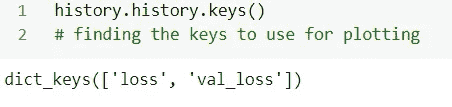

```
# history for loss
plt.figure(figsize = (10,5))
plt.plot(history.history['loss'])
plt.plot(history.history['val_loss'])
plt.title('model loss')
plt.ylabel('loss')
plt.xlabel('epoch')
plt.legend(['train', 'test'], loc='upper left')
plt.show()
```

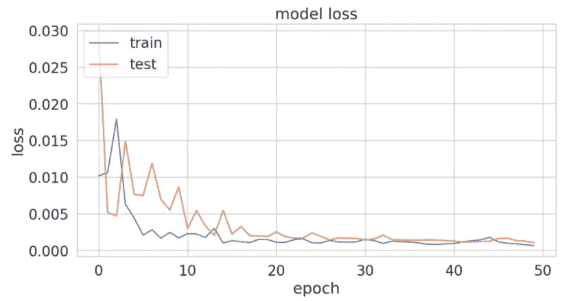

在这里，我们可以看到训练错误和验证错误都有所改善。

## 测试:

我们还剩下一些额外的数据用于测试。让我们使用这些数据从模型中获得预测，以验证我们的模型的拟合度。

```
# prediction on test data
y_pred = model.predict(X_test) 
# invert the test to original values
y_test_inverse = DataFrame(scaler.inverse_transform(y_test)) 
# assigning datetime
y_test_inverse.index = btc.index[-len(y_test):] 
print('Test data:',)
print(y_test_inverse.tail(3)); print();# invert the prediction to understandable values
y_pred_inverse = DataFrame(scaler.inverse_transform(y_pred)) 
# assigning datetime
y_pred_inverse.index = y_test_inverse.index 
print('Prediction data:',)
print(y_pred_inverse.tail(3))
```

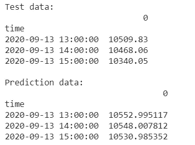

## 准确性指标:

```
print(f'MAE {mean_absolute_error(y_test, y_pred)}')
print(f'MSE {mean_squared_error(y_test, y_pred)}')
print(f'RMSE {np.sqrt(mean_squared_error(y_test, y_pred))}')
print(f'R2 {r2_score(y_test, y_pred)}')
```

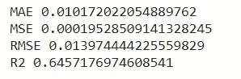

RMSE 允许我们处罚远离平均值的分数。虽然错误分数很低，但看看 R2 分数，这里肯定有改进的空间。可以调整模型以获得更好的输出。

## 性能可视化:

```
plt.figure(figsize = (15,5))
plt.plot(y_test_inverse)
plt.plot(y_pred_inverse)
plt.title('Actual vs Prediction plot (Price prediction model)')
plt.ylabel('price')
plt.xlabel('date')
plt.legend(['actual', 'prediction'], loc='upper left')
plt.show()
```

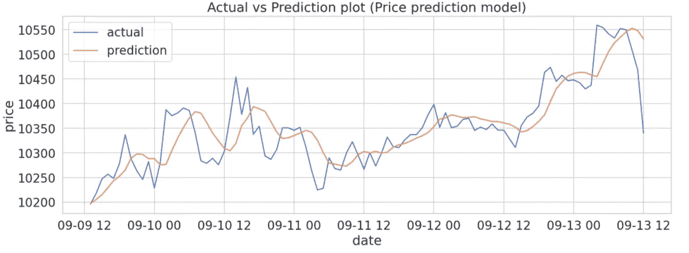

看起来我们的基本和简要模型已经能够捕捉数据的一般模式。然而，它未能捕捉随机运动，这可能是一个好迹象，因为我们可以说，它概括得很好。

# 结论和未来范围:

预测股票市场回报是一项具有挑战性的任务，因为股票价值不断变化，取决于形成复杂模式的多个参数。

未来的方向可能是:

1.  分析不同加密货币之间的相关性，以及这将如何影响我们的模型的性能。
2.  使用技术分析添加特征以检查模型性能。
3.  添加基本面分析的特征，检查这些特征如何影响模式。
4.  添加来自社交网络(如 twitter 和新报告)的情感分析，以检查模型性能。
5.  GRU 网络也可以尝试不同的激活方式，如“软签名”来检查性能。

这种性质的多变量分析需要在特征工程、数据分析、模型训练等方面投入大量的精力和时间。

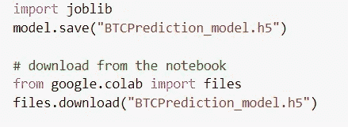

**接我这里**[](https://www.linkedin.com/in/saritmaitra/)***。***

**参考文献:**

1.  **Vijh，m .，Chandola，d .，Tikkiwal，V. A .，& Kumar，A. (2020)。使用机器学习技术预测股票收盘价。Procedia 计算机科学，167，599–606。**
2.  *瓦内琳·瓦尔科夫(2015 年)。黑客机器学习指南*

*注意:*此处描述的程序是实验性的，在用于任何商业目的时都应谨慎使用。所有此类使用风险自负。**