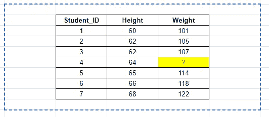

# 回归及其变体:简单、多重、套索、岭和逐步回归

> 原文：<https://towardsdatascience.com/regression-and-its-variants-simple-multiple-lassso-ridge-and-stepwise-regression-9c144fd7a7b2?source=collection_archive---------14----------------------->

## 各种回归类型之间的相似性和差异

在 [Unsplash](https://unsplash.com?utm_source=medium&utm_medium=referral) 上由 [Vesela Vaclavikova](https://unsplash.com/@veselavaclavik?utm_source=medium&utm_medium=referral) 拍摄的照片

假设作为一名数据科学家，您想要分析一个学生数据集，该数据集记录了他们的身高和体重。您注意到 weight 列中缺少一个值。你能预测这个丢失的值吗？

假设的学生数据集

回归有助于解决这类问题。在现实世界的机器学习应用中，回归模型经常用于根据已知特征预测未知值(例如，根据品牌、型号、里程等确定二手车的价格)。)并通过在未知变量(也称为因变量)和已知特征(也称为自变量)之间建立统计关系来实现。这种关系可以表示为:

*因变量= f(自变量 1，自变量 2 …)*

这种统计关系可以采取许多不同的形式，取决于预测因素的类型、结果和用于建立关系的函数。下面是经常遇到的五种回归模型。我以一种明确地将一种类型与下一种类型联系起来的方式来描述它们，这样就很容易理解它们的相似之处和不同之处。

**1)简单线性回归**

顾名思义，简单回归是所有回归中最简单的形式。它只有一个因变量，用一个自变量来解释，两者都用二维散点图表示。上面的例子——身高和体重之间的关系——是简单线性回归的经典例子。简单线性回归模型的数学公式采用以下形式:

*体重= B0+B1 *身高+ e*

其中， *b0* =截距， *b1* =系数， *e* =误差项

**2)多元回归**

多元回归类似于简单的线性回归，但在这种情况下，将有多个独立变量，而不是一个。如果我们再次遵循上面的例子，假设体重不仅仅是由身高预测的，而是由一个额外的变量——比如年龄——预测的，那么这就是多元回归。在数学公式中，我们只需添加额外的变量:

*体重= B0+B1 *身高+B2 *年龄+ e*

**3)拉索回归**

所以，多元回归比简单线性回归好，对吧？因为有更多的预测因素，所以预测必须更加准确！不完全是，不总是。有时简单的模型比复杂的模型表现得更好。上面的多元回归有 2 个自变量，还是挺简单的，但是如果数据集中有 20 个或者 200 个变量呢？这就是数据科学家需要努力思考的问题:保留多少功能，放弃哪些功能。

在机器学习中，特征选择是消除过拟合的重要步骤，回归中也是如此。所以在 LASSO 中，如果有太多的特征，有些特征会被完全消除。这是通过将系数设置为零来实现的。这个过程在机器学习 vocab 中被称为“ **L1** **正则化**”。

**4)岭回归**

在 LASSO 回归中，我们简化了包含太多特征的回归方程，并通过完全消除其中一些特征来实现这一点。岭回归用于相同的目的，即简化模型，但不是完全消除特征，而是最小化它们的影响。

所以在岭回归中，特征系数被缩小到接近零，但不完全是零(这个过程被称为 **L2 正则化**)。在机器学习岭回归模型中，称为*λ*的超参数用于控制与损失函数相关联的惩罚的权重。

因为没有特征被完全消除，所以岭回归不用于特征选择。

**5)逐步回归**

到目前为止，我们已经研究了各种操纵特征以增强模型性能的方法。有一个古老的，但同样有效的方法来寻找更好的模型，被称为“逐步回归”。

顾名思义，在逐步回归中，您从最简单的模型*开始(如 1 个因变量和 1 个自变量)，然后评估其性能。然后，您添加另一个变量，再次评估性能，并比较两个模型，以找到更好的一个。重复该过程，直到找到最佳执行模型。*

称为**赤池信息准则(AIC)** 的估计量用于比较逐步回归中的模型性能。

# 摘要

回归量化了因变量和一个或多个自变量之间的关系，有许多不同的方法来建立和量化这种关系。在本文中，我重点介绍了作为一名数据科学家最常遇到的 5 种回归。有一点要记住，他们之间虽然有区别，但也不是完全不同的阶层。相似之处多于不同之处。因此，当学习回归(或任何建模家族)时，一起学习比一次学习一个更好。