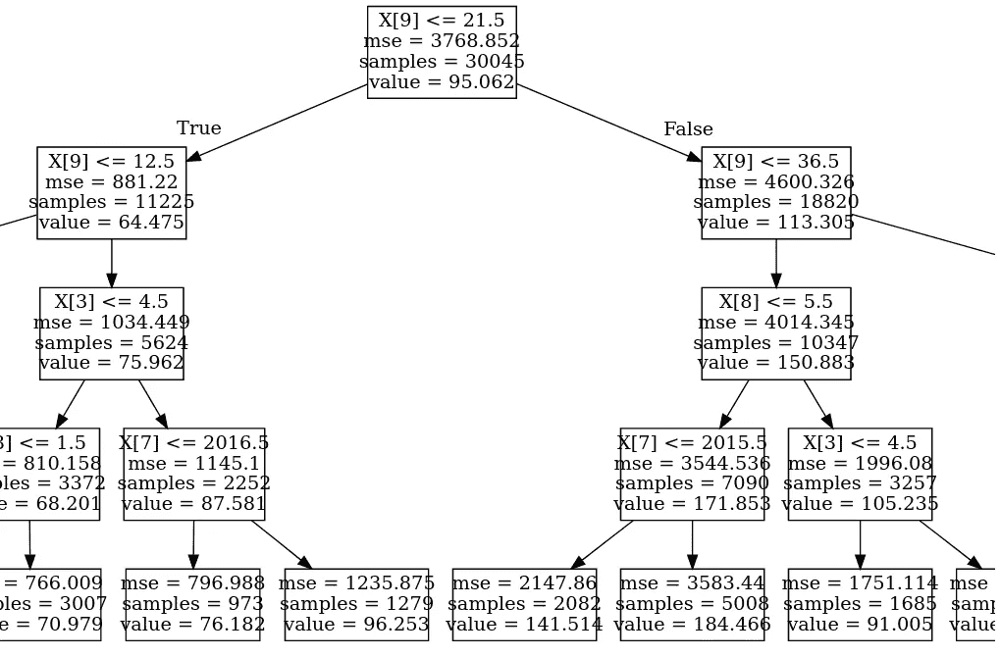

# 基于回归的决策树:预测酒店的平均每日房价

> 原文：<https://towardsdatascience.com/regression-based-decision-trees-predicting-average-daily-rates-for-hotels-857567d5168e?source=collection_archive---------65----------------------->

## 决策树的目的是通过树形图的方式可视化模型的特征，并推断每个特征在影响输出变量中的重要性(或缺乏重要性)。

决策树结构包括:

*   **节点:**每棵决策树由所谓的**根节点**和**决策节点**组成。
*   **分支:**表示跨节点做出的每个决策的结果。


来源:图片来自 [Pixabay](https://pixabay.com/vectors/evergreen-forest-landscape-2025158/) 。

在这个例子中，基于回归的决策树被公式化以预测给定特定客户属性的酒店的 ADR(平均每日房价)。

# 背景

本研究侧重于酒店预订分析。谈到酒店预订，**平均每日房价(ADR)** 是一个特别重要的指标。这反映了特定客户在整个逗留期间每天支付的平均费用。

该分析基于 2016 年 Antonio、Almeida 和 Nunes 的原始研究。

衡量 ADR 可以让酒店更准确地识别最有利可图的客户，并相应地调整营销策略。

形成该神经网络输入的所选特征如下:

1.  取消
2.  原产国
3.  细分市场
4.  存款类型
5.  客户类型
6.  所需的停车位
7.  到达日期:年
8.  抵达日期:月
9.  到达日期:周数
10.  到达日期:当月的某一天

# 数据操作

定义了区间(或连续随机变量)。举两个例子:

```
leadtime = train_df['LeadTime']
adr = train_df['ADR']
```

使用'''类别代码' ' '定义具有分类成分的变量。

作为另外两个例子:

```
deposittypecat=train_df.DepositType.astype("category").cat.codes
deposittypecat=pd.Series(deposittypecat)
customertypecat=train_df.CustomerType.astype("category").cat.codes
customertypecat=pd.Series(customertypecat)
```

numpy 列堆栈是为独立变量(连续变量和分类变量)制定的:

```
x1 = np.column_stack((IsCanceled,countrycat,marketsegmentcat,deposittypecat,customertypecat,rcps,arrivaldateyear,arrivaldatemonthcat,arrivaldateweekno,arrivaldatedayofmonth))
x1 = sm.add_constant(x1, prepend=True)
```

然后，数据被分成训练集和验证集:

```
X_train, X_val, y_train, y_val = train_test_split(x1, y1)
```

# 决策树公式

使用 **sklearn** 导入决策树回归器:

```
from sklearn.tree import DecisionTreeRegressor
```

决策树被拟合。使用 **max_depth** ，确定树的大小。在这种情况下，它被设置为 4。当将预测精度与测试数据(我们将在下面详细讨论)进行比较时，我发现使用四棵树时均方根误差最小。使用较少的树会有大量信息丢失的风险，而过多的树会增加过度拟合的风险。

```
>>> tree_reg = DecisionTreeRegressor(max_depth=4)
>>> tree_reg.fit(X_train, y_train)DecisionTreeRegressor(ccp_alpha=0.0, criterion='mse', max_depth=4,
                      max_features=None, max_leaf_nodes=None,
                      min_impurity_decrease=0.0, min_impurity_split=None,
                      min_samples_leaf=1, min_samples_split=2,
                      min_weight_fraction_leaf=0.0, presort='deprecated',
                      random_state=None, splitter='best')
```

以下是使用验证数据时生成的预测:

```
>>> predictions = tree_reg.predict(X_val)
>>> predictions
array([ 96.25317435, 184.46591454,  70.97877619, ...,  56.187318  ,
        53.58241309,  70.97877619])
```

为了可视化决策树，可以使用一个名为 **graphviz** 的库。

```
>>> from sklearn.tree import export_graphviz
>>> export_graphviz(tree_reg,out_file="tree.dot")
```

可通过终端生成树形视图的 PDF，如下所示:

```
dot -Tpdf tree.dot -o tree.pdf
```

然后，可以导入树图像:

```
>>> import graphviz
>>> with open("tree.dot") as f:
>>>     dot_graph = f.read()>>> graphviz.Source(dot_graph)
```

以下是决策树的示例:



来源:Jupyter 笔记本输出

让我们在**平均绝对误差**和**均方根误差**的基础上评估模型预测在验证数据上的表现。

```
>>> mean_absolute_error(y_val, predictions)
27.39342405758301>>> mean_squared_error(y_val, predictions)
1531.417860233403>>> math.sqrt(mean_squared_error(y_val, predictions))
39.13333438685493
```

# 测试数据

为了确定模型是否能够在未知数据集上保持其准确性，我们现在将测试模型预测在 H2 数据集上是否也显示出类似的准确性。

如前所述，分类变量和连续变量是这样定义的，并且其值也有适当的定义:

```
atest = np.column_stack((t_IsCanceled,t_countrycat,t_marketsegmentcat,t_deposittypecat,t_customertypecat,t_rcps,t_arrivaldateyear,t_arrivaldatemonthcat,t_arrivaldateweekno,t_arrivaldatedayofmonth))
atest = sm.add_constant(atest, prepend=True)
btest = t_adr
btest=btest.values
```

现在，决策树用于对测试数据的特征进行预测。

```
>>> bpred = tree_reg.predict(atest)
>>> bpred
array([141.51432277, 141.51432277, 141.51432277, ..., 184.46591454,
       184.46591454, 184.46591454])
```

现在，让我们评估一下**平均绝对误差**和**均方根误差**。

```
>>> mean_absolute_error(btest, bpred)
41.71191007286715>>> print('mse (sklearn): ', mean_squared_error(btest,bpred))
mse (sklearn):  3115.6311827256595>>> math.sqrt(mean_squared_error(btest, bpred))
55.817839287504306
```

MAE 和 RMSE 比在验证数据中测试时要高一些。鉴于这个数据集是不可见的，这与预期相符。然而，就最大化精度而言，具有 ELU 激活函数的基于回归的神经网络显示出较低的误差，MAE 在 **33.56** 而 RMSE 在 **47.55** 。

如果你感兴趣，关于这个例子的基于回归的神经网络的文章在这里[是](/regression-based-neural-networks-with-tensorflow-v2-0-predicting-average-daily-rates-e20fffa7ac9a)。

# 结论

在本例中，我们看到了如何:

*   构建决策树
*   正确配置决策树
*   评估验证和测试集的模型准确性

本例的数据集和笔记本可在 [MGCodesandStats GitHub 存储库](https://github.com/MGCodesandStats/hotel-modelling)获得，以及关于该主题的进一步研究。

*免责声明:本文是在“原样”的基础上编写的，没有任何担保。本文旨在提供数据科学概念的概述，不应以任何方式解释为专业建议。*