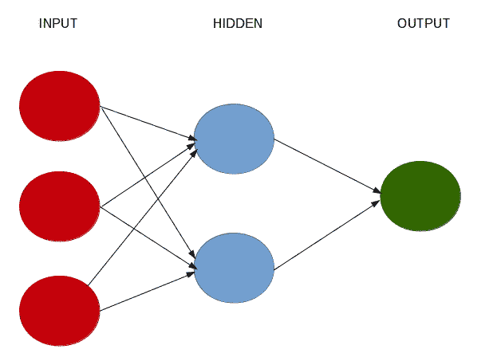
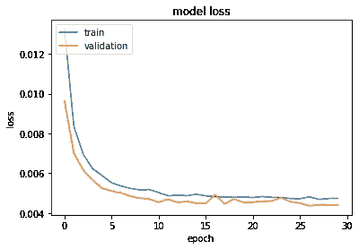
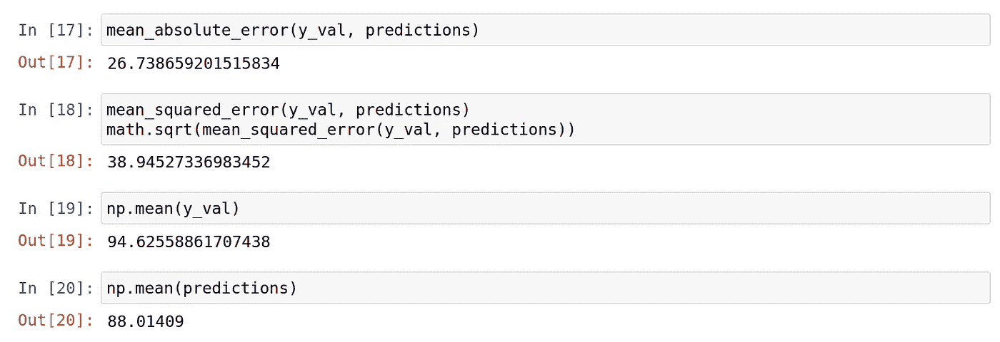
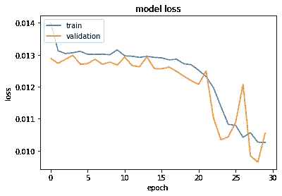

# 基于回归的神经网络:预测酒店的平均日房价

> 原文：<https://towardsdatascience.com/regression-based-neural-networks-with-tensorflow-v2-0-predicting-average-daily-rates-e20fffa7ac9a?source=collection_archive---------1----------------------->

## 谈到酒店预订，**平均每日房价(ADR)** 是一个特别重要的指标。这反映了特定客户在整个逗留期间每天支付的平均费用。

Keras 是一种用于运行高级神经网络的 API——该 API 现在作为默认 API 包含在 TensorFlow 2.0 下，由 Google 开发。

目前，Keras 的主要竞争对手是脸书开发的 PyTorch。虽然 PyTorch 有更高级别的社区支持，但它是一种特别冗长的语言，我个人更喜欢 Keras，因为它在构建和部署模型时更加简单易用。

在这个特殊的例子中，Keras 建立了一个神经网络来解决一个回归问题，即我们的因变量(y)为区间格式，我们试图尽可能准确地预测 y 的数量。

# 什么是神经网络？

神经网络是一种基于现有数据创建预测的计算系统。让我们使用 r。

神经网络包括:

*   输入图层:基于现有数据获取输入的图层
*   隐藏层:使用反向传播来优化输入变量的权重以提高模型预测能力的层
*   输出层:基于输入层和隐藏层数据的预测输出



来源:作者创作

# 背景

本研究侧重于酒店预订分析。说到酒店预订，**【日均房价(ADR)】**是一个特别重要的指标。这反映了特定客户在整个逗留期间每天支付的平均费用。

衡量 ADR 可以让酒店更准确地识别最有利可图的客户，并相应地调整营销策略。

原始数据集可从 [Antonio，Almedia 和 Nunes (2019)，酒店预订需求数据集](https://www.sciencedirect.com/science/article/pii/S2352340918315191)获得。

对于这个例子，我们使用 keras 库中的线性激活函数来创建基于回归的神经网络。这个神经网络的目的是为每个客户预测一个 **ADR** 值。形成该神经网络输入的所选特征如下:

*   取消
*   原产国
*   细分市场
*   存款类型
*   客户类型
*   所需的停车位
*   到达日期:周数

首先，导入相关的库。请注意，您需要在系统上安装 TensorFlow 才能执行以下代码。

```
import math
import matplotlib.pyplot as plt
import numpy as np
from numpy.random import seed
seed(1)
import pandas as pd
import statsmodels.api as sm
import statsmodels.formula.api as smfimport tensorflow
tensorflow.random.set_seed(1)
from tensorflow.python.keras.layers import Dense
from tensorflow.keras.layers import Dropout
from tensorflow.python.keras.models import Sequential
from tensorflow.python.keras.wrappers.scikit_learn import KerasRegressorfrom sklearn.metrics import mean_absolute_error
from sklearn.metrics import mean_squared_error
from sklearn.model_selection import train_test_split
from sklearn.preprocessing import MinMaxScaler
```

# 数据准备

在这个实例中，ADR 被设置为 y 变量，因为这是我们试图预测的特征。变量存储为 numpy 数组。

```
y1 = np.array(adr)
```

数字变量和分类变量是有区别的。例如，诸如原产国的分类变量被定义为一个类别(为了防止神经网络给代码分配顺序，例如，如果 1 =葡萄牙，2 =德国，我们不希望出现德国的排名比葡萄牙“高”的情况)。

```
countrycat=train_df.Country.astype("category").cat.codes
countrycat=pd.Series(countrycat)
```

创建所选特征的 numpy 堆栈:

```
x1 = np.column_stack((IsCanceled,countrycat,marketsegmentcat,deposittypecat,customertypecat,rcps,arrivaldateweekno))
x1 = sm.add_constant(x1, prepend=True)
```

与任何神经网络一样，数据需要进行缩放，以便网络进行正确的解释，这一过程称为标准化。最小最大缩放器用于此目的。

然而，这伴随着一个警告。必须在将数据分成训练集、验证集和测试集之后**进行缩放，每个测试集都单独进行缩放。**

配置神经网络时的一个常见错误是，在拆分数据之前先对数据进行规范化。

这是错误的，因为归一化技术将使用来自验证和测试集的数据作为整体缩放数据时的参考点。这将无意中影响训练数据的值，本质上导致验证和测试集的数据泄漏。

因此，数据首先被分成训练和验证数据:

```
X_train, X_val, y_train, y_val = train_test_split(x1, y1)
```

然后使用**最小最大缩放器:**缩放训练和验证数据

```
y_train=np.reshape(y_train, (-1,1))
y_val=np.reshape(y_val, (-1,1))scaler_x = MinMaxScaler()
scaler_y = MinMaxScaler()print(scaler_x.fit(X_train))
xtrain_scale=scaler_x.transform(X_train)
print(scaler_x.fit(X_val))
xval_scale=scaler_x.transform(X_val)print(scaler_y.fit(y_train))
ytrain_scale=scaler_y.transform(y_train)
print(scaler_y.fit(y_val))
yval_scale=scaler_y.transform(y_val)
```

# 神经网络配置

训练神经网络时，最重要的考虑因素之一是选择输入层和隐藏层中包含的神经元数量。假设输出层是结果层，默认情况下，该层有 1 个神经元。

正如[法尔哈德·马利克](https://medium.com/fintechexplained/what-are-hidden-layers-4f54f7328263)在本文中所解释的，每层中神经元的数量配置如下:

*   **输入层:**输入层的神经元数量计算如下:

`Number of features in the training set + 1`

在这种情况下，由于开始时训练集中有 7 个特征，因此相应地定义了 **8 个**输入神经元。

*   **隐藏层:**定义一个隐藏层，因为单个层适用于大多数数据集。隐藏层中神经元的数量确定如下:

```
Training Data Samples/Factor * (Input Neurons + Output Neurons)
```

在这种情况下，将因子设置为 1，该因子的目的是防止过度拟合。因子可以取 1 到 10 之间的值。输入层中有 8 个神经元，输出层中有 1 个神经元，训练集中有 24036 个观察值，隐藏层被分配了 2，670 个神经元。

*   **输出层:**由于这是结果层，输出层默认取值 1。

```
model = Sequential()
model.add(Dense(8, input_dim=8, kernel_initializer='normal', activation='relu'))
model.add(Dense(2670, activation='relu'))
model.add(Dense(1, activation='linear'))
model.summary()
```

均方误差(mse)和平均绝对误差(mae)是我们的损失函数，即神经网络预测测试数据的准确度的估计值。我们可以看到，当 validation_split 设置为 0.2 时，80%的训练数据用于训练模型，而剩余的 20%用于测试目的。

```
model.compile(loss='mse', optimizer='adam', metrics=['mse','mae'])
history=model.fit(xtrain_scale, ytrain_scale, epochs=30, batch_size=150, verbose=1, validation_split=0.2)
predictions = model.predict(xval_scale)
```

该模型配置如下:

```
Model: "sequential"
_________________________________________________________________
Layer (type)                 Output Shape              Param #   
=================================================================
dense (Dense)                (None, 8)                 72        
_________________________________________________________________
dense_1 (Dense)              (None, 2670)              24030     
_________________________________________________________________
dense_2 (Dense)              (None, 1)                 2671      
=================================================================
Total params: 26,773
Trainable params: 26,773
Non-trainable params: 0
```

现在让我们来拟合我们的模型。

```
Epoch 1/30
161/161 [==============================] - 1s 4ms/step - loss: 0.0133 - mse: 0.0133 - mae: 0.0878 - val_loss: 0.0096 - val_mse: 0.0096 - val_mae: 0.0714
Epoch 2/30
161/161 [==============================] - 0s 3ms/step - loss: 0.0083 - mse: 0.0083 - mae: 0.0672 - val_loss: 0.0070 - val_mse: 0.0070 - val_mae: 0.0609
...
Epoch 28/30
161/161 [==============================] - 0s 2ms/step - loss: 0.0047 - mse: 0.0047 - mae: 0.0481 - val_loss: 0.0044 - val_mse: 0.0044 - val_mae: 0.0474
Epoch 29/30
161/161 [==============================] - 0s 2ms/step - loss: 0.0047 - mse: 0.0047 - mae: 0.0482 - val_loss: 0.0044 - val_mse: 0.0044 - val_mae: 0.0470
Epoch 30/30
161/161 [==============================] - 0s 2ms/step - loss: 0.0047 - mse: 0.0047 - mae: 0.0484 - val_loss: 0.0044 - val_mse: 0.0044 - val_mae: 0.0467
```

在这里，我们可以看到，训练损失和验证损失都在计算中，即预测 y 和实际 y 之间的偏差，由均方误差测量。

已经为我们的模型指定了 30 个时期。这意味着我们实际上是在 30 次向前和向后传递中训练我们的模型，期望我们的损失将随着每个时期而减少，这意味着随着我们继续训练模型，我们的模型正在更准确地预测 y 的值。

让我们来看看当绘制各自的损失时会是什么样子:

```
print(history.history.keys())
# "Loss"
plt.plot(history.history['loss'])
plt.plot(history.history['val_loss'])
plt.title('model loss')
plt.ylabel('loss')
plt.xlabel('epoch')
plt.legend(['train', 'validation'], loc='upper left')
plt.show()
```



来源:Jupyter 笔记本输出

随着时代数量的增加，训练和验证损失都以指数方式减少，这表明随着时代(或向前和向后传递的数量)的增加，模型获得了高度的准确性。

现在可以将使用来自验证集的特征生成的预测与来自该验证集的实际 ADR 值进行比较。

预测将按比例缩小到原始比例:

```
predictions = scaler_y.inverse_transform(predictions)
predictions
```



来源:Jupyter 笔记本输出

与验证集中平均 ADR 值 94 相比，MAE 为 26，RMSE 为 38，该模型显示出显著的预测能力。然而，真正的测试是对以前未见过的数据进行预测，并将结果与新数据集中的实际 ADR 值进行比较。H2 数据集用于此目的。

# 预测—测试集(H2)

使用在 H1 数据集上生成的神经网络模型，来自 H2 数据集的特征现在被输入到网络中，以便预测 H2 的 ADR 值并将这些预测与实际 ADR 值进行比较。

计算出的**平均绝对误差**和**均方根误差**如下:

```
>>> mean_absolute_error(btest, bpred)
44.41596076208908>>> mean_squared_error(btest, bpred)
>>> math.sqrt(mean_squared_error(btest, bpred))
57.899202401480025
```

H2 数据集的平均 ADR 为 105.30。

# 时期与批量大小

在构建神经网络时，一个关键的权衡是关于用于训练模型的**次数**和**批量**。

*   **批量:**指每一个正向/反向传递的训练样本数。
*   **历元:**所有训练实例一次正反向传递。

这份关于[堆栈溢出](https://stackoverflow.com/questions/4752626/epoch-vs-iteration-when-training-neural-networks)的精彩总结对上述定义进行了更详细的阐述。

构建神经网络时面临的关键权衡是批量大小和迭代次数。

例如，训练数据包含 24，036 个样本，批量大小为 150。这意味着需要 160 次迭代来完成 1 个时期。

因此，可以增加批量大小以使每个时期具有更少的迭代，或者减小批量大小，这意味着每个时期需要更多的迭代。

这意味着，在其他条件相同的情况下，神经网络要么需要较高的批量来训练固定数量的时期，要么需要较低的批量来训练更多数量的时期。

## 150 个历元，batch_size = 50

这是测试集上的模型性能，此时历元数增加到 150，批量减少到 50。

```
>>> mean_absolute_error(btest, bpred)
45.20461343967321>>> mean_squared_error(btest, bpred)
>>> math.sqrt(mean_squared_error(btest, bpred))
58.47641486637935
```

当使用 30 个时期和 150 个批次时，平均事件发生率和 RMSE 稍低，这表明在预测 ADR 时，具有较大批次的较少时期更有优势。

## 150 个历元，batch_size = 150

但是，如果时期数和批处理大小都设置为 150，会怎么样呢？成绩有进一步提高吗？

```
>>> mean_absolute_error(btest, bpred)
45.030375561153335>>> mean_squared_error(btest, bpred)
>>> math.sqrt(mean_squared_error(btest, bpred))
58.43900275965334
```

当与 30 个时期的 150 个批量相比时，结果实际上是相同的，当使用 30 个时期时，RMSE 略低。

在这点上，增加批次大小和历元数并没有导致测试集上模型性能的改善。

# 激活功能

当形成神经网络时，还必须考虑所选择的激活函数。

在这种情况下，激活函数的目的是将非线性引入输入层和隐藏层，以便产生输出层所产生的更精确的结果。当我们处理回归问题时，即输出变量是数字而不是分类的，ReLU 激活函数(修正的线性激活函数)非常流行。

具体而言，该激活函数解决了所谓的消失梯度问题，由此神经网络将无法将重要的梯度信息从输出层反馈回输入层。关于消失梯度问题的更多信息可以在[机器学习大师](https://machinelearningmastery.com/how-to-fix-vanishing-gradients-using-the-rectified-linear-activation-function/)的教程中找到。

ReLU 在上面的例子中被使用，并且在 30 个时期和 150 个批量中表现出最好的准确性。

然而，对于这个特定的问题，是否存在更合适的激活函数呢？

作为一个例子， [ELU](https://ml-cheatsheet.readthedocs.io/en/latest/activation_functions.html) 激活函数(代表指数线性单位)的功能与 ReLU 非常相似，但主要区别是 ELU 允许负输入，也可以产生负输出。

从技术上讲，我们的数据集没有负输入。但是，数据集中的许多 ADR 值都是 0。毕竟，如果客户取消了酒店预订，那么酒店就不能向他们收费(在绝大多数情况下)。

因此，ADR 有大量的 **0** 条目，事实上，也有一个实例记录了该变量的负面观察结果。

在这方面，神经网络再次运行 30 个时期，这一次使用 ELU 激活函数代替 ReLU。

```
model = Sequential()
model.add(Dense(8, input_dim=8, kernel_initializer='normal', activation='elu'))
model.add(Dense(2670, activation='elu'))
model.add(Dense(1, activation='linear'))
model.summary()
```

以下是模型配置:

```
Model: "sequential"
_________________________________________________________________
Layer (type)                 Output Shape              Param #   
=================================================================
dense (Dense)                (None, 8)                 72        
_________________________________________________________________
dense_1 (Dense)              (None, 2670)              24030     
_________________________________________________________________
dense_2 (Dense)              (None, 1)                 2671      
=================================================================
Total params: 26,773
Trainable params: 26,773
Non-trainable params: 0
```

这是训练和验证的损失。



来源:Jupyter 笔记本输出

```
>>> mean_absolute_error(btest, bpred)
28.908454264679218>>> mean_squared_error(btest, bpred)
>>> math.sqrt(mean_squared_error(btest, bpred))
43.66170887622355
```

与 ReLU 相比，使用 ELU 时，平均绝对误差和均方根误差较低。这表明改变激活函数已经导致精度的提高。

# 结论

此示例说明了如何:

*   用 Keras 构造神经网络
*   使用 MinMaxScaler 适当缩放数据
*   计算培训和测试损失
*   使用神经网络模型进行预测
*   选择正确激活功能的重要性
*   考虑迭代次数和批量之间的权衡

你可以在这里找到原始文章，它包含了一个到 GitHub 知识库的链接，这个知识库包含了与上述例子相关的笔记本和数据集。

*免责声明:本文是在“原样”的基础上编写的，没有担保。本文旨在提供数据科学概念的概述，不应以任何方式解释为专业建议。*