# 回归基础:代码演练

> 原文：<https://towardsdatascience.com/regression-basics-code-walk-through-c2eac24da2e9?source=collection_archive---------42----------------------->

## 通过预测汽车销售价格发现回归的基本原理


照片由[丹金](https://unsplash.com/@danielcgold?utm_source=medium&utm_medium=referral)在 [Unsplash](https://unsplash.com?utm_source=medium&utm_medium=referral) 上拍摄

本文通过使用一个 [Kaggle 二手车数据集](https://www.kaggle.com/nehalbirla/vehicle-dataset-from-cardekho)展示完整数据项目的代码和全面解释，引导您了解回归的基础知识。该项目利用线性回归、岭 CV、套索 CV 和弹性净 CV 模型来预测销售价格。Github 上有完整的代码[。](https://github.com/jewelbritton/Car-Price-Prediction)

# 正在设置

二手车数据集可从 [Kaggle](https://www.kaggle.com/nehalbirla/vehicle-dataset-from-cardekho) 下载，格式为 CSV 文件。信息由印度二手车网站 cardekho 提供。一旦您下载了 CSV 文件，您就可以利用 Pandas 库来查看和分析数据。

引号内的文件路径会因保存文件的位置而异。在 Mac 上，你可以通过右击文件并按住 Option 键来找到文件路径。应该会出现一个“复制”file.csv“作为路径名”的选项，然后你可以将它粘贴在括号中，就像我下面这样。

```
import pandas as pd# upload data from csvcar = pd.read_csv('/Users/Jewel/Desktop/Car-Price-Prediction/car details.csv')
```

现在 CSV 被保存为熊猫数据帧。要查看我们正在处理的数据类型，我们可以使用下面的代码来查看我们刚刚创建的数据框的前 5 行。如果我们想要查看特定数量的行，我们可以在括号中输入一个数字来查看这些行(cars.head(10)将显示前 10 行)。

```
car.head()
```

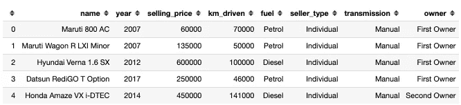

这使我们能够看到数据框包含的内容、列以及包含的二手车详细信息的一些示例。每一行都是一辆独一无二的汽车，每一列代表汽车的不同特征。在这个项目中，我们将使用这些特性来预测每辆车的“销售价格”。为此，我们将使用回归，但首先我们应该探索数据，并根据需要清理数据。

# 探索性数据分析和清理

## 1.检查缺少的值

```
car.isnull().sum()
```

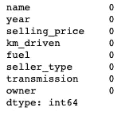

没有任何丢失的值！耶。如果存在缺失值，则很难对信息进行正确建模。通常数据集中有许多缺失值，为了对数据建模，我们要么删除缺失值的行，要么用另一个值(平均值、前一个值……)替换该实例。

## 2.检查数据类型

探索数据的下一步是查看哪些类型的数据存储在列中。这有助于注意看起来被数字填充的列是否被错误地编码为“对象”。如果是这种情况，您可以轻松地更改数据类型，以便计算机正确理解您提供的信息。

```
car.dtypes
```

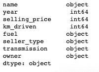

**float** =带小数的数字(1.678)
**int** =不带小数的整数或整数(1，2，3)
**obj** =对象、字符串或单词(' hello')
这些数据类型后的 **64** 是指该值占用多少位的存储空间。你会经常看到 32 或 64。

根据我们到目前为止看到的数据框的前几行，数据类型看起来都是正确的。

## 4.数据概述

```
car.describe()
```


此表为我们提供了有关数字数据列的统计信息的概述。因为只有三列是整数或浮点数，所以我们在图表上只看到这三列。如果数字数据被错误地编码为“对象”,我们将无法查看列上的统计信息。

使用此表，我们可以看到不同的值，如平均值、最小值、最大值和标准偏差。该表有助于快速概述列中的数据，并允许我们识别异常值。例如，当我第一次看到这张表时，我认为二手车 50 万美元的平均价格高得令人难以置信。但后来我看了看数据源，才知道数据是一家印度公司的，50 万卢比约合 6600 美元。合理多了！

此表中另一个突出的地方是 km_driven 的最小值是 1 千米。对于一辆二手车来说，这个价格似乎很低，所以我想进一步调查这辆车。为此，我们可以按照行驶公里数从低到高对数据框进行排序。

```
car.sort_values(by = 'km_driven')
```

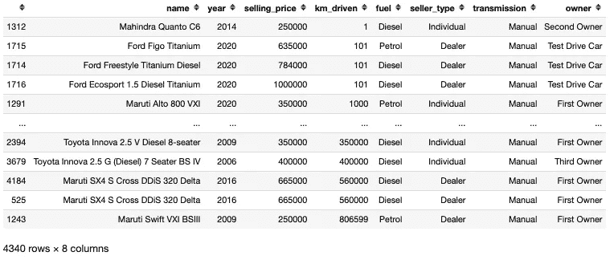

顶部的那辆车行驶了 1 公里，由于这辆车至少有过两个主人，而且是 2014 年的，所以它只有 1 公里似乎不太现实。这可能是一个异常值，或者数据可能输入错误，所以为了安全起见，我将删除这一行。

```
car.drop([1312], inplace = True)
#1312 is the index of the row (which can be seen all the way on the left of the first row
```

## 5.可视化相关性

使用 Seaborn 库，我们还可以可视化不同特性之间的相关性。相关性将只记录具有数字数据的列，但是研究这些特征之间的关系仍然是有帮助的。

```
import seaborn as snssns.heatmap(car.corr(), annot= True);#annot = True shows the correlation values in the squares
```

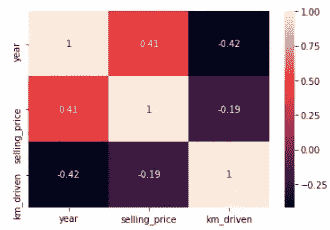

接近 1 的正相关性告诉我们，这两个特征具有正线性关系(随着一个特征上升，另一个特征也上升)。负相关接近-1 表示两者具有负线性关系(一个增加，另一个减少)。

我们从这个关联图中获得的信息直观上是有意义的，并且可能证实我们的一些信念——这总是令人高兴的。年份和售价是相对正相关的，所以随着年份的增加，售价也会增加。年份和行驶的公里数是负相关的，所以随着车越来越旧，行驶的公里数也会越来越多。

# 特征工程

既然我们已经仔细查看了数据及其周围的统计数据，我们就可以为建模准备数据了。

数据框中的“名称”列非常具体，当我们在相对有限的数据集上建模时，有时更模糊一些会更好。这允许模型基于更多过去的样本进行预测。为了研究数据中汽车名称的多样性，我们可以使用下面的代码来计算每种汽车名称的数量。

```
car['name'].value_counts()
```

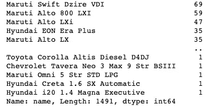

有超过 1400 个不同的汽车名称包括在内，许多例子不到 30 个。如果每辆车只有几个例子，我们的模型将很难预测销售价格。为了使这成为一个更普遍的特征，我们可以只包括汽车的品牌。幸运的是，品牌名称是每一行的第一个单词，所以我们可以创建一个只包含汽车品牌名称的新特性。

```
#make an empty list to append new names tobrand_name = []
for x in car.name:
    y = x.split(' ')
    brand_name.append(y[0]) #append only the first word to the list#we can drop the previous column that had the full name
car = car.drop(['name'], axis = 1)#and add the new column that just has the brand name
car['brand_name'] = brand_name#now let's check how many of each brand is in the column
car.brand_name.value_counts()
```

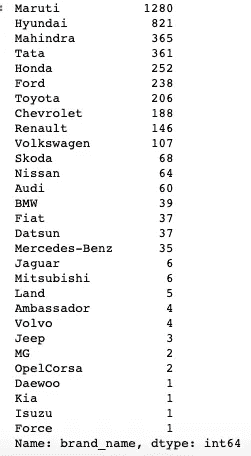

因为这个专栏现在只有品牌名称，所以有少于 1400 个不同的值，许多有超过 30 种不同的汽车。此时，您仍然可以选择删除只有 1 或 2 辆汽车的汽车品牌行(Force、Isuzu、Kian、Daewoo…)，但我现在会保留这些。我们已经极大地限制了品种，所以我们的模型现在应该更强大。

## 将特征二值化

在我们可以对特性建模之前，最后一步是为非数字特性创建二进制列。计算机很难理解所有汽车名称之间的含义差异，因此二进制化只是告诉计算机“是的，这是一辆沃尔沃，”或“不，这不是一辆沃尔沃。”

二进制化为每个汽车品牌创建一个特定的列，然后每行将有一个 0(不是那个汽车品牌)或 1(是那个汽车品牌)。为每个特性创建二进制列的过程也称为“虚拟化”变量，可以用 Pandas 中的代码轻松完成。

```
car_dummies = pd.get_dummies(car, drop_first = True)
#set this equal to a new variable since it will be a different data set
#dropping the first column just removes the redundancy of having all the columns therecar_dummies.head()
```

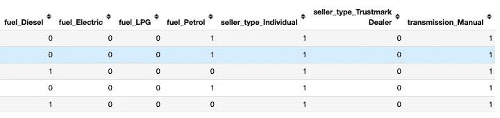

对于虚拟/二进制列，数据框现在看起来像这样-填充了 0 和 1 的列，但三个数字列除外。尽管有更多的列，但是这个过程使得模型能够理解您提供给它的信息。

# 建模

现在(终于)我们可以对我们的数据建模来预测这些二手车的销售价格。

## 分割目标和预测变量

首先，我们需要定义 X 和 y 变量。y 是我们预测的价格(销售价格), X 是我们用来帮助我们做出预测的一切。

```
X = car_dummies.copy()y = X.pop('selling_price')
#.pop() removes the column/list from X and saves it to the new variable
```

## 训练和测试分割

接下来，我们需要为我们的模型创建一个训练和测试组。我们可以使用下面的代码随机选择 70%的数据作为我们模型的训练组，30%将作为我们测试模型质量的测试组。

```
from sklearn.model_selection import train_test_splitX_train, X_test, y_train, y_test = train_test_split(
    X, y, test_size=0.3, random_state=1)
```

## 标准化 X 值

最后，我们将需要标准化所有的 X 值，使它们在一个一致的范围内。这不会改变数字之间的比例关系。

```
from sklearn.preprocessing import StandardScalerscaler = StandardScaler()
X_train = pd.DataFrame(scaler.fit_transform(X_train), columns=X_train.columns)
#you fit_transform on your train data only because you don't want your model to be influenced in any way by the test data. The test data acts as unseen, brand new data to test the quality of the model.X_test = pd.DataFrame(scaler.transform(X_test), columns=X_test.columns)
#you only transform the test data so you can conform it to the parameters set with the mean from the training data
```

## 线性回归

我们将尝试的第一个模型是简单的线性回归。评估交叉验证分数、训练分数和测试分数以反映模型的表现是很重要的。

```
from sklearn.linear_model import LinearRegression
from sklearn.model_selection import cross_val_score#create a model instance
lr_model = LinearRegression()#fit the model on the training data
lr_model.fit(X_train, y_train)# get cross validated scores
scores = cross_val_score(lr_model, X_train, y_train, cv=5)
print("Cross-validated training scores:", scores)
print("Mean cross-validated training score:", scores.mean())

#training score
print("Training Score:", lr_model.score(X_train, y_train))
# evaluate the data on the test set
print("Test Score:", lr_model.score(X_test, y_test))
```

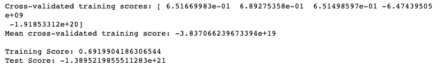

线性回归分数

由于训练分数比测试分数好得多，这表明模型过度拟合了训练数据。这意味着该模型很难对看不见的数据进行预测——这可不好！此外，平均交叉验证分数是一个非常大的负数。理论上，我们希望这三个分数都尽可能接近 1.0，但是由于分数对于这个模型来说非常糟糕，我们可以尝试其他一些回归模型，这些模型也可以调整数据。

## 山脊 CV

岭回归是正则化变量的一种方法，在处理共线性时通常很有用。当存在大量特征，并且许多/所有特征以相似的强度影响目标变量时，岭通常是有用的。在处理任何回归问题时，最好尝试所有这些模型，看看哪种模型表现最好。使用 RidgeCV 模型，我们还可以设置一系列阿尔法值来尝试，模型会选择最好的。

```
from sklearn.linear_model import RidgeCV
import numpy as np# create a RidgeCV model instance
ridge_model = RidgeCV(alphas=np.logspace(-10, 10, 30), cv=5)
# fit the model
ridge_model.fit(X_train, y_train)#mean cv score on training data
scores = cross_val_score(ridge_model, X_train, y_train, cv=5)print("Cross-validated training scores:", scores)
print("Mean cross-validated training score:", scores.mean())

#training score
print("Training Score:", ridge_model.score(X_train, y_train))
# evaluate the data on the test set
print("Test Score:", ridge_model.score(X_test, y_test))
```

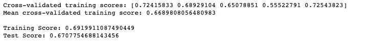

岭简历分数

现在三个分数都大致相同，在几个小数以内。因为这些分数比线性回归分数好得多，所以我们可以假设正则化对建模有帮助。

## 拉索 CV

另一种方法，我们可以调整我们的特点是使用套索。当有许多要素对目标变量几乎没有影响时，这种正则化通常有助于减少共线性。Lasso 会将这些变为零，只保留对预测有重大影响的要素。同样，最好尝试所有模型，看看哪种模型最适合您的模型。

```
from sklearn.linear_model import LassoCV# create a LassoCV model instance
lasso_model = LassoCV(eps= [.0001, .001, .01, .1], alphas=np.logspace(-8, 8, 20), max_iter = 1000000, cv=5)
# fit the model
lasso_model.fit(X_train, y_train)# evaluate on the training set
training_score = lasso_model.score(X_train, y_train)
# evaluate on the test set
test_score = lasso_model.score(X_test, y_test)#mean cv score on training data
scores = cross_val_score(lasso_model, X_train, y_train, cv=5)print("Cross-validated training scores:", scores)
print("Mean cross-validated training score:", scores.mean())

#training score
print("Training Score:", lasso_model.score(X_train, y_train))
# evaluate the data on the test set
print("Test Score:", lasso_model.score(X_test, y_test))
```

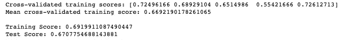

拉索 CV 评分

Lasso 得分与 Ridge 非常相似，但平均 CV 得分略高。比较模型的一个好指标是平均 CV 或测试分数。

## 弹性网 CV

我们将测试的最后一个模型是弹性网络 CV，它创建了套索和脊正则化的组合。

```
#Elastic net model with scores
from sklearn.linear_model import ElasticNetCVenet_model = ElasticNetCV(alphas=np.logspace(-4, 4, 10), 
                     l1_ratio=np.array([.1, .5, .7, .9, .95, .99, 1]),
                     max_iter = 100000,
                     cv=5)
# fit the model
enet_model.fit(X_train, y_train)# evaluate on the training set
training_score = enet_model.score(X_train, y_train)
# evaluate on the test set
test_score = enet_model.score(X_test, y_test)#mean cv score on training data
scores = cross_val_score(enet_model, X_train, y_train, cv=5)print("Cross-validated training scores:", scores)
print("Mean cross-validated training score:", scores.mean())
print()
#training score
print("Training Score:", enet_model.score(X_train, y_train))
# evaluate the data on the test set
print("Test Score:", enet_model.score(X_test, y_test))
```

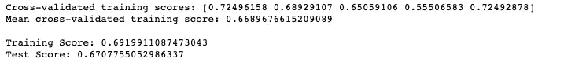

弹性净简历分数

所有三个正则化模型的得分相对相似，但在比较平均交叉验证得分时，Lasso CV 表现最好，相差很小(. 001)。让我们仔细看看套索模型以及它是如何做出预测的。

# 寻找最好的模型

## 特征重要性

查看系数可以向我们显示哪些特征对模型如何进行预测影响最大(或最小)。下图显示了对汽车销售价格产生最大积极影响的特性。例如，成为宝马、奔驰或奥迪会导致销售价格上涨——就像成为一辆新车一样。通过将 ascending 更改为“False ”,我们还可以查看对价格有负面影响的特性。

```
fi = pd.DataFrame({
    'feature': X_train.columns,
    'importance': lasso_model.coef_
})fi.sort_values('importance', ascending=True, inplace=True)#sns.set_style('ticks')
sns.set(font_scale = 2)
fig, ax = plt.subplots()
# the size of A4 paper
fig.set_size_inches(16, 12)
sns.barplot(x='importance', y='feature', data=fi[-15:], orient='h', palette = 'rocket', saturation=0.7)  
ax.set_title("Feature Importance", fontsize=40, y=1.01)
ax.set_xlabel('Importance', fontsize = 30)
ax.set_ylabel('Feature', fontsize = 30)
```


套索正特征重要性

## 预测和残差

我们可以评估模型的另一种方式是通过将模型预测的值与实际值进行比较。这向我们展示了我们的模型在哪里出错，以及它的预测有多错误。我们可以在数据框中查看这些信息，也可以将这些信息转换成图表，对比实际值和预测值。

```
predictions = lasso_model.predict(X_test)
residuals_df = pd.DataFrame(predictions, y_test)
residuals_df.reset_index(inplace = True)
residuals_df.rename({'selling_price': 'actual', 0: 'predictions'}, axis = 1, inplace = True)
residuals_df['residuals'] = residuals_df.actual - residuals_df.predictions
residuals_df
```

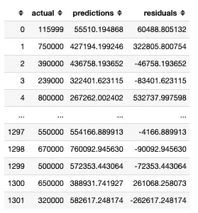

实际值和预测值的数据框架，以及残差(实际值-预测值)

```
#predicted y values
predictions = lasso_model.predict(X_test)#residuals (or error between predictions and actual)
residuals = y_test - predictionssns.axes_style(style='white')sns.set(font_scale = 2)
fig, ax = plt.subplots()
fig.set_size_inches(16, 12)
ax = sns.regplot(x="predictions", y="actual", data= residuals_df,  scatter_kws = {'color': 'lightsalmon'}, 
                 line_kws = {'color': 'darksalmon'})
ax.set_xlabel('Predicted', fontsize = 30)
ax.set_ylabel('Actual', fontsize = 30)
```

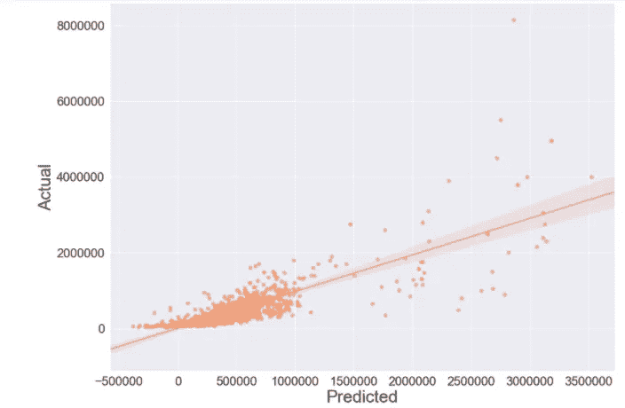

从这些值中，我们可以看到我们的模型在创建准确预测方面做得不错，但是有许多异常值似乎不符合我们的模型。

## 均方根误差

最后一种评估模型性能的方法是计算均方根误差。这是所有残差平方和，然后是该值的平方根。这告诉我们我们的预测平均有多远。

```
from sklearn.metrics import mean_squared_error
(mean_squared_error(y_test, predictions))**0.5
```

这个模型的根 MSE 是 327，518.584，相当于 4，370 美元。虽然我们总是想最小化这个值，但能够预测一辆二手车的价格在 4000 美元以内也是一项不错的成就。使用这种模型，汽车公司可以只根据品牌、行驶公里数、燃料类型和年份等细节合理地给汽车定价。

# 结论

希望这是一个有帮助的数据项目演练，引导您了解 EDA、回归和 Python 建模的一些基础知识。查看 Github 上的[完整代码了解更多细节。](https://github.com/jewelbritton/Car-Price-Prediction)

如果你准备好进行下一步，[查看虹膜数据集的引导走查，学习分类的基础知识](/classification-basics-walk-through-with-the-iris-data-set-d46b0331bf82)。