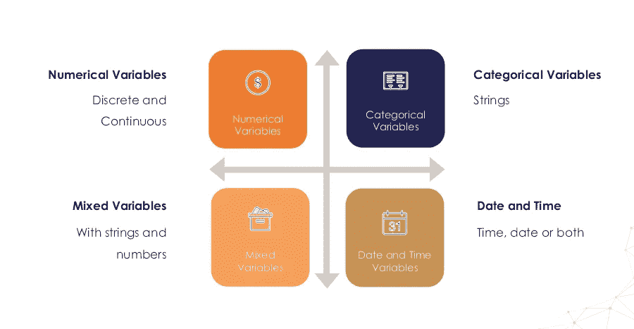
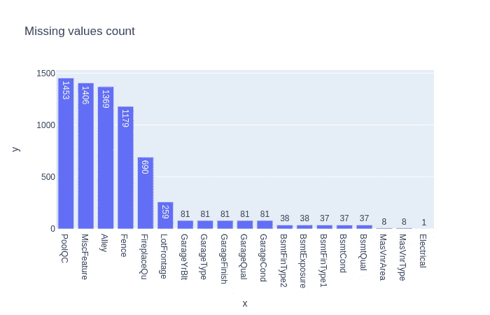
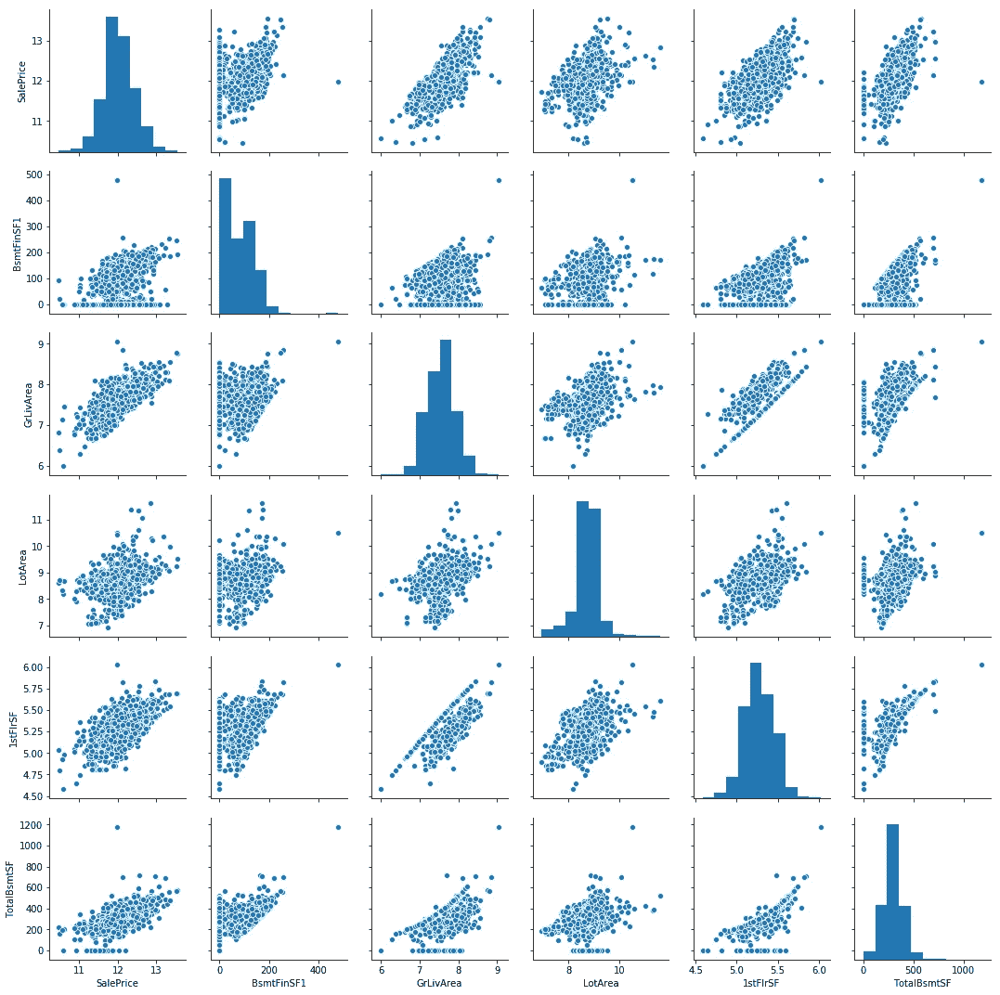
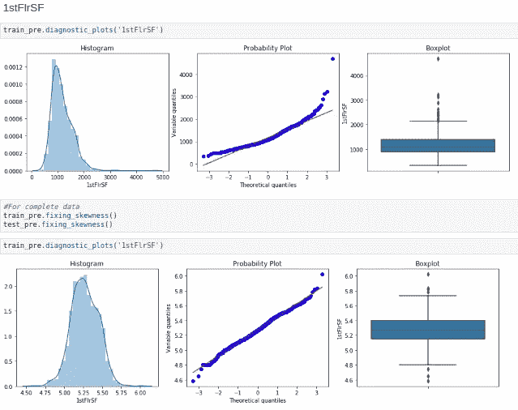
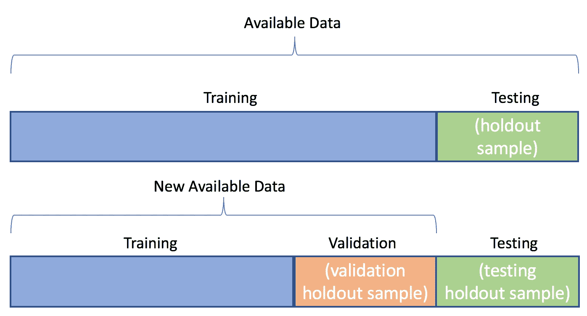

# 回归的数据科学方法

> 原文：<https://towardsdatascience.com/regression-data-case-study-e45d915c8cf2?source=collection_archive---------47----------------------->

## [**深度剖析**](https://medium.com/towards-data-science/in-depth-analysis/home)

## 数据科学工作流中的数据处理、数据清理和探索性数据分析步骤概述。


照片由[米卡·鲍梅斯特](https://unsplash.com/@mbaumi?utm_source=medium&utm_medium=referral)在 [Unsplash](https://unsplash.com?utm_source=medium&utm_medium=referral) 上拍摄

D 数据科学、机器学习和深度学习是最近的研发热点。这些并不新鲜，但由于工具、技术和系统计算能力的进步，目前已经获得了高度重视和高度关注。但是主要部分是**数据。**大部分时间花在数据角力、特征提取、数据清洗等方面。你可能听说过，

> 大约 80%的时间用于查找、清理和重组大量数据，剩下的 20%用于实际的数据分析或其他目的。

因此，花在数据上的时间很重要。随着更多的时间被用来建造某物，它会产生更好的结果。为了更好地了解数据并进行深入的数据分析，我们可以将案例研究分为以下几个部分:

1.  收集数据
2.  了解特征的类型
3.  处理特征中的问题
4.  模型要求
5.  列车测试数据处理
6.  机器学习/深度学习任务

# 收集数据

可以从在线资源收集数据，如 Kaggle、UCI、谷歌数据集搜索等。使用真实世界的数据集可以更好地理解上面的概念(虽然不是真的！😋真实世界的数据要混乱得多😥)我选择了 Kaggle 提供的房价数据，

[](https://www.kaggle.com/c/house-prices-advanced-regression-techniques) [## 房价:高级回归技术

### 预测销售价格并实践特征工程、RFs 和梯度推进

www.kaggle.com](https://www.kaggle.com/c/house-prices-advanced-regression-techniques) 

# 了解数据类型

特征是被观察现象的数据点或可测量的属性。我们使用标准库进行数据分析(pandas、NumPy、matplotlib、plotly 和 seaborn ),并将它们作为，

> import pandas as PD
> import matplotlib . py plot as PLT
> import plotly . express as px
> import numpy as NP
> import seaborn as SNS

我们定义了一个提取变量类型的函数，

提取变量类型

数据类型大致分类如下:



数据类型分类

上述函数对训练数据产生以下输出，

```
Numerical : 38, Categorical 43, Continuous: 18, Discrete: 14
```

# 1.数字的

数字数据是可测量的信息，它是用数字表示的数据。我们的数据包含大约 38 种数值数据类型。进一步的数值细分为:

**(a)离散**为变量，其值为整数(计数)，例

1.  一个家庭的孩子数量
2.  一个人会说多少种语言
3.  在统计课上睡觉的人数

**(b)连续**代表测量值，在特定范围内有一定的值，例如，

1.  人的身高
2.  人的重量
3.  早上该起床了
4.  火车的速度

# 2.分类:

分类变量代表可以分组的数据类型。分类变量的例子有种族、性别、年龄组和教育水平。我们的数据包含大约 43 个分类值。分类数据细分为:

**(a)二进制数据**是离散数据，只能是两类中的一类:是或否、1 或 0、关或开等。

**(b)序数数据**是类别变量，其中类别可以有意义地排序，例如，

1.  学生的考试成绩(A、B、C 或不及格)
2.  一周中的几天(星期一= 1，星期日= 7)

**(c)名义数据**没有显示标签的内在顺序，例如，

1.  出生国(阿根廷、英国、德国)
2.  邮政编码

# 3.日期时间:

日期和时间或日期时间变量，它们将日期和/或时间
作为值。例子，

1.  出生日期(“1867 年 1 月 19 日”、“2010 年 10 月 1 日”)
2.  申请日期(“2020 年 5 月”、“2018 年 3 月”)
3.  事故发生时间(01:20)

我们的数据包含以下特征:

```
['YearBuilt', 'YearRemodAdd', 'GarageYrBlt', 'YrSold']
```

# 处理变量中的问题

数据包含错误，例如，

**(a)遗漏数据**可能因忘记存储、数据处理不当、基层数据录入效率低下等原因而发生。我们的训练数据具有以下缺失值分布:



缺失值图(来源:来自代码)

这是从以下函数中获得的，

用此函数绘制缺失数据

使用 Scikit 学习插补方法处理缺失数据，

[](https://scikit-learn.org/stable/modules/impute.html) [## 6.4.缺失值的插补-sci kit-学习 0.23.1 文档

### 由于各种原因，许多现实世界的数据集包含缺失值，通常编码为空白、NaNs 或其他…

scikit-learn.org](https://scikit-learn.org/stable/modules/impute.html) 

**(b)高基数**意味着分类数据中不同标签的数量非常多，这给模型学习带来了问题。我们用下面的函数检查我们的数据，

**(c)异常值**是可能由误差引起的极端情况，但不是在所有情况下。我们可以通过查看数据来发现异常值，



极值(异常值)(来源:由代码生成)

# 模型要求

模型需求是机器学习算法所期望的数据行为。在我们的例子中，我们对线性模型有以下假设，

1.  变量和目标之间的线性关系
2.  多元正态性
3.  没有或很少共线
4.  同方差性

在这里可以更好地理解这些，

[](https://www.statisticssolutions.com/assumptions-of-multiple-linear-regression/) [## 多元线性回归的假设-统计解决方案

### 多元线性回归分析作出了几个关键的假设:必须有一个线性关系之间的…

www.statisticssolutions.com](https://www.statisticssolutions.com/assumptions-of-multiple-linear-regression/) 

除了假设之外，建模步骤还包括遵循统计概念的数据，例如正态分布。我们的数据必须标准化。使用以下函数中的 scipy 统计模块来修正数据的偏斜度，

固定偏斜度

**偏斜度**指一组数据中对称钟形曲线或正态分布的扭曲或不对称。如果曲线向左或向右移动，就称之为偏斜。变量的偏斜度可以理解为，



修正偏斜度(源代码)

接下来，我们有回归任务，因此分类数据可以通过将它们转换成数字来处理，通过**一键编码**，这是使用 sklearn 模块完成的。

```
**from** **sklearn.preprocessing** **import** OrdinalEncoder
ordinal_encoder = OrdinalEncoder()data[cat] = ordinal_encoder.fit_transform(data[cat])
test[cat_test] = ordinal_encoder.fit_transform(test[cat_test])num, cat, cont, disc, yr = train_pre.extract_var()print("Numerical : "+str(len(num))+", Categorical "+
      str(len(cat)) + ", Continuous: " + 
      str(len(cont))+ ", Discrete: " + str(len(disc)))
```

这导致:

```
Numerical : 76, Categorical 0, Continuous: 18, Discrete: 52
```

# 列车测试分离

机器学习/深度学习任务需要将数据分解成训练、验证和测试任务。因此，使用 sklearn 等模块，我们将数据分为训练、验证和测试数据。下面的代码将数据分为定型数据集和测试数据集。

```
X_train, X_test, y_train, y_test =  train_test_split(data.drop('SalePrice', axis=1), 
data['SalePrice'], test_size=0.2, random_state=42)
```



拆分数据

# 机器学习/深度学习

最后，我们到达的部分，一切都是关于，因为你可以观察出 6 个步骤，这是最后一步，证明了多少时间投入在数据处理。没有**干净的数据**和**干净的代码**，你根本无法应用机器学习算法。

在我们的机器学习任务中，我们选择 scikit-learn 的线性回归模型。

```
**from** **sklearn.linear_model** **import** LinearRegression
regr = LinearRegression()
*# Train the model using the training sets*
regr.fit(X_train, y_train)*# Make predictions using the testing set*
y_test_pred = regr.predict(X_test)
y_train_pred = regr.predict(X_train)**from** **sklearn.metrics** **import** r2_score
**from** **sklearn.metrics** **import** mean_squared_errorprint('MSE train: **%.3f**, test: **%.3f**' % (
        mean_squared_error(y_train, y_train_pred),
        mean_squared_error(y_test, y_test_pred)))
print('R^2 train: **%.3f**, test: **%.3f**' % (
        r2_score(y_train, y_train_pred),
        r2_score(y_test, y_test_pred)))
```

首先导入线性回归模型，然后对数据进行拟合。最后，我们预测分割测试数据集。最后，我们使用 R-Square 和 MSE 等指标来验证我们的模型。这些是显示我们的模型如何执行的误差计算函数。

# **结论**

完整的代码可以在这里找到，

[](https://github.com/pr2tik1/ml-dl-projects/blob/master/regression/adv-reg-house-price/houseprice_predicion.ipynb) [## pr 2 tik 1/ml-dl-项目

### permalink dissolve GitHub 是超过 5000 万开发人员的家园，他们一起工作来托管和审查代码，管理…

github.com](https://github.com/pr2tik1/ml-dl-projects/blob/master/regression/adv-reg-house-price/houseprice_predicion.ipynb) 

最后，你学会了如何预处理数据集，分析数据来预测房价。我们对回归数据进行了案例研究，并对其进行了预测分析。您可以进一步尝试使用数据可视化库(如 plotly 和 seaborn)找出变量之间的关系。

谢谢大家！欢迎您的宝贵建议！你的反馈对我很有价值。

要进行连接，请查看我的投资组合网站以了解更多关于我的详细信息，[此处](https://pr2tik1.github.io/)。

# 其他发布的帖子:

[](/understanding-kaplan-meier-estimator-68258e26a3e4) [## 了解卡普兰-迈耶估计量

### 一种生存分析技术的介绍。

towardsdatascience.com](/understanding-kaplan-meier-estimator-68258e26a3e4) [](/what-happens-to-developers-in-2020-5bdb59e09f84) [## 2020 年的开发者会怎样？

### 使用调查数据对过去两年的开发者洞察。

towardsdatascience.com](/what-happens-to-developers-in-2020-5bdb59e09f84) [](https://medium.com/towards-artificial-intelligence/neural-networks-from-scratch-a-brief-introduction-for-beginners-d3776599aaac) [## 探索神经网络(第一部分)

### 理解深度学习的概念以及使用 Python 和它的神经网络的实现…

medium.com](https://medium.com/towards-artificial-intelligence/neural-networks-from-scratch-a-brief-introduction-for-beginners-d3776599aaac) [](/explore-new-github-readme-feature-7d5cc21bf02f) [## 如何创建令人敬畏的 Github 个人资料-自述文件！

### 探索展示你作为开发者或开源贡献者的“GitHub 简历”的新方法。每一个开源…

towardsdatascience.com](/explore-new-github-readme-feature-7d5cc21bf02f)