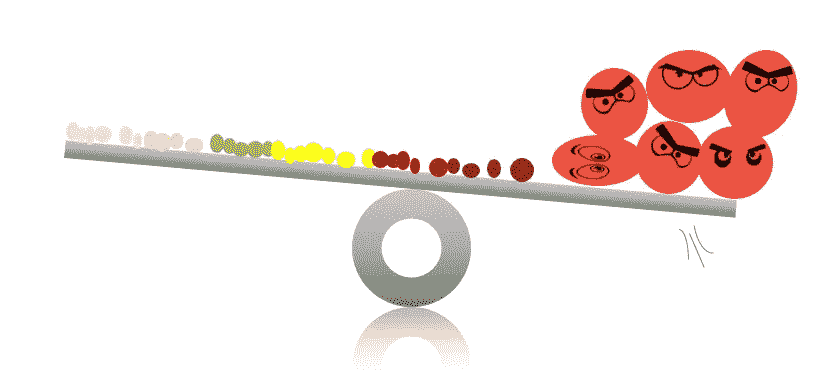
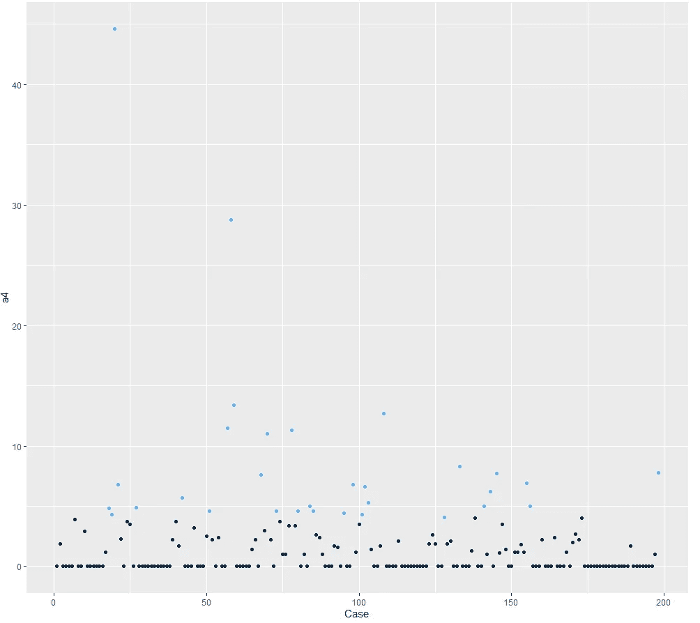
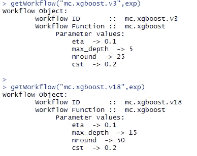

# 不平衡数据的回归及其应用

> 原文：<https://towardsdatascience.com/regression-for-imbalanced-data-with-application-edf93517247c?source=collection_archive---------14----------------------->

由 Unsplash 上的 [Loic Leray](https://unsplash.com/@loicleray) 拍摄的图像

# 简介和动机

不平衡数据是指主要关注数据中代表性较低的观察值的情况。在某些情况下，它们被表示为“离群值”,这是相当危险的。作为“异常值”表达式的结果，这种观察结果被从数据中排除或去除。这最终会导致没有代表性的分析和误导性的结果。

在当今世界，森林火灾、疫情病和经济危机等极端事件层出不穷，很容易发现不平衡数据的不同应用领域，如气象/生态灾难、银行欺诈、高风险保险组合、窃电等。

*作者图片*

解决不平衡数据的分类问题是非常著名的，在许多论文和文章中都可以找到。而回归问题几乎每次都会被忽略，尽管处理它们的方式有很大的不同。**基本上大部分的分类问题原本都是来自于连续变量，都被转移到了分类上进行分类分析！**。在转换过程中，由于数据类型的变化，模式和依赖关系被忽略。

# 概观

本文涵盖了:

*   处理回归不平衡数据的一般直觉和技巧
*   数据预处理技术
*   使用 UBR 技术的模型处理
*   不平衡回归的评价指标
*   不平衡数据在 UBR 中的应用
*   结论

# 回归中不平衡数据的处理技术

现有的用于回归的机器学习模型主要是基于平衡或几乎平衡的数据构建的。这导致这种模型在处理不平衡数据时出现误导和非常糟糕的性能。为了能够使用这些模型处理不平衡的数据，您有两个选择:第一，相对于其他观察，增加感兴趣的观察的表示(或者反之亦然)。第二，通过基于定制标准的参数调整来调整模型本身。**我将讨论处理不平衡数据的两个主要策略，即数据预处理和模型处理。**还有另外两种策略:后处理和混合，但我不会在本文中讨论它们。

# 预处理技术

预处理技术主要集中于在应用传统的机器学习回归模型之前，对数据应用过采样、欠采样或它们之间的混合。

> "预处理技术迫使模型学习数据中的稀有观察值."

对于分类，由于类之间的清晰分离，预处理有一个更容易的任务，这从一开始就已经定义了。但是在连续随机变量的情况下，在几乎所有的参考文献中，所谓的**【关联函数】**都是用来处理这样一个困难的任务。相关性函数取 0 和 1 之间的值，每当相关性更趋向于 1 时，这更多地表示具有高度不平衡的数据。

抬头！在连续的情况下，**不平衡数据**更多地被称为**偏斜数据**。关联函数的定义根据数据和关于其分布的可用信息而变化，稍后我将给出一个使用的定义的例子。

对连续变量的预处理技术很少，如随机欠采样、SMOTE 回归、高斯噪声、SMOGN 算法。简而言之，SMOTE for regression 被认为是一种过采样技术。高斯噪声和 SMOGN 算法是欠采样/过采样技术的混合。

*作者图片*

# 模型处理

模型处理是处理不平衡数据的另一种策略，尽管它在许多应用程序中非常重要和有效，但却很少被提及。。**基于效用的回归(UBR)** 是一种罕见的技术，可以有效地处理不平衡或非均匀权重的整体数据。这种技术最初用于数据挖掘领域。**UBR 的基本思想是为错误估计**、**增加一个代价惩罚，代价惩罚根据关联函数而变化。**如果相关性函数接近 1(这是指非常罕见的观察，对数据的不平衡或偏斜有很大影响),则成本损失增加，并可能达到最大值。

**关联函数**如前所述有很多定义，比如**它可以定义成与概率密度函数**成反比(如果密度定义得很好，你需要去做不同的定义)。用于不平衡回归的 UBR 的工作方式如下:首先，选择一个传统的机器学习模型进行工作，如随机森林回归，梯度推进回归，..等等。其次，定义相关性和效用函数来评估模型的性能。第三，调整给出最佳评估的模型参数。

# |评估指标

最后，在接触数据之前，我将讨论使用 UBR 进行不平衡回归时的评估技术。

> “通常对于回归来说，模型性能是用 MSE 或 RMSE 来衡量的。对于不平衡的数据，这样的措施是无效的。”

还有其他已经用于分类的方法(即:召回率、精确度和 F1 分数)，使用效用函数对其进行调整以评估不平衡的性能。与 MSE 和 RMSE 相比，我们寻找召回率、精确度和 F1 分数的最大值(接近 1)来反映更好的性能。

# 应用程序

下面，我展示了 UBR 在不平衡回归和模型评估中的应用。我使用在不平衡数据的多重引用中使用的回归数据。下图显示了一些极端情况下的数据，这些情况会显著影响传统机器学习模型的回归性能。

图 1:回归因变量以蓝色显示了一些罕见的情况

图 1 显示了不平衡数据的清晰模式，您可以点击这里的[来检查数据和代码。如果我们考虑阈值 4，则数据包含 31 个(15.7%)罕见病例。](https://github.com/hananahmed1/ML-Regression-for-imbalaced-data)

我使用 XGBoost(极端梯度推进)机器学习技术进行回归。我用 5 重交叉验证评估了 360 个回归模型的性能。我根据最低的 MSE 和最高的 F1 分数选择最好的两个模型。我关注 F1 分数，而不是精确度和回忆，因为它是两者的加权平均值，但你可以根据你的研究目标选择关注其他标准。

最终模型的结果是

表 1:评估指标结果

在表 1 中，很明显，两个最佳模型的 MSE 和 RMSE 变化不大，而且都很高。而具有最小 MSE 的 F1 分数变为几乎是具有最大 F1 分数的模型的两倍。使用这两个模型的优化参数，我现在对测试数据运行 XGBoost 并检查最终性能。

最佳两个模型的参数

使用这些参数，对测试数据的两个模型的评估是

基于第一个模型的评估指标

基于第二个模型的评估指标

同样清楚的是，两种模型的 MSE 没有显著差异(30.12 对 32.04)，而 F1 分数有显著变化(0.000020 对 0.431667)。这些结果证实了在不平衡数据的情况下，使用传统的评价指标是没有用的。

# 结论

**不要忽略数据中的罕见案例！。**在短期内，你可以看到令人印象深刻的结果，但这与现实中实际发生的事情无关。

即使在识别出罕见的模式后，**传统的平衡数据工具对不平衡/偏斜的数据情况没有帮助**。最后，尝试不同的机器学习模型可能会导致更好/更差的结果，所以你需要根据你的数据找到一个合适的模型。

## 参考资料:

*   布兰科，p .，托尔戈，l .，，里贝罗，R. P. (2017 年 10 月)。SMOGN:不平衡回归的预处理方法。在*第一届不平衡领域学习国际研讨会:理论与应用*(第 36-50 页)。
*   北卡罗来纳州莫尼斯、北卡罗来纳州布兰科和北卡罗来纳州托戈(2017 年 10 月)。不平衡回归任务中集成方法的评估。在*第一届不平衡领域学习国际研讨会:理论与应用*(第 129-140 页)。
*   托尔戈和里贝罗(2007 年 9 月)。基于效用的回归。在*关于数据挖掘和知识发现原理的欧洲会议*(第 597-604 页)。施普林格，柏林，海德尔