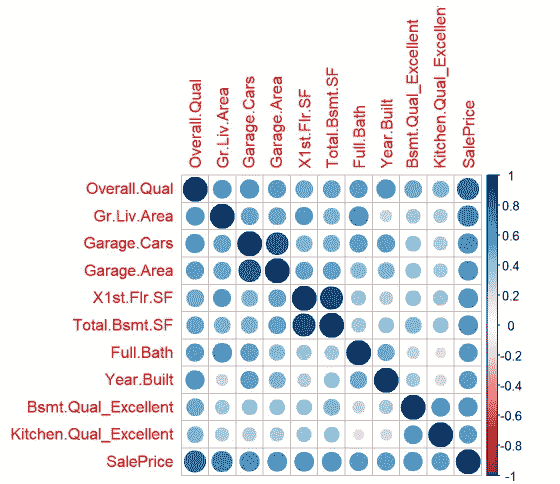
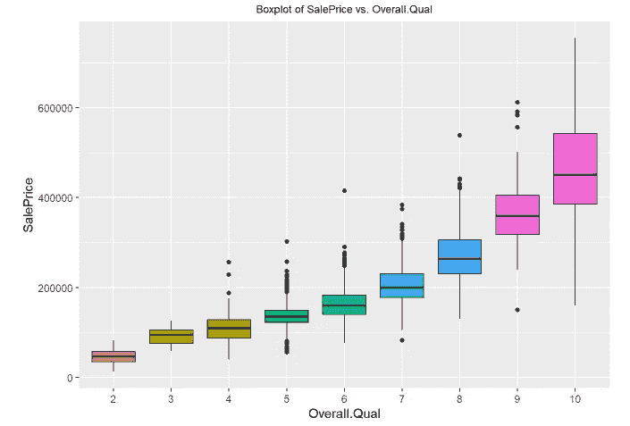
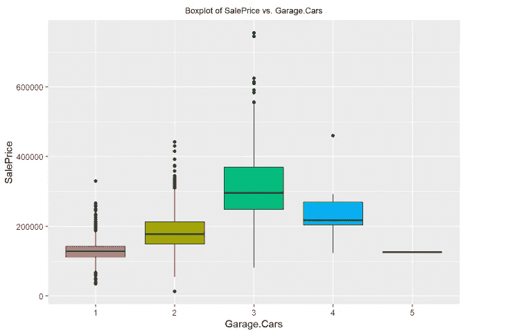
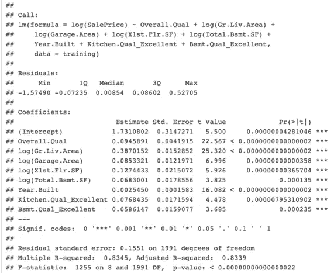

# 衣阿华州埃姆斯市最优房屋销售价格预测的回归模型

> 原文：<https://towardsdatascience.com/regression-modeling-in-predicting-optimal-house-sales-price-in-ames-iowa-d5e63f6d44e2?source=collection_archive---------25----------------------->

这一分析是我的团队在杜克大学富卡商学院 MQM 商业分析项目的应用概率和统计课程项目的一部分。我要特别感谢夏嫣·亚伯拉罕森、迈克尔·鲁奇、孙欣莹(西尔维娅饰)和曹亚琼(朱诺饰)所做出色工作。

照片由[菲尔在](https://unsplash.com/@philhearing?utm_source=unsplash&utm_medium=referral&utm_content=creditCopyText) [Unsplash](https://unsplash.com/s/photos/house-ames-iowa?utm_source=unsplash&utm_medium=referral&utm_content=creditCopyText) 上听

**商业理解**

在住房市场中，经纪人利用比较市场分析(CMA)向卖方提供建议的销售价格和该价格的综合理由(Miller 2018)。虽然许多经纪人利用软件来完成 CMA，但个人经验和直觉也被用来决定提议的价格。我们的分析旨在创建一个回归模型，用于对爱荷华州艾姆斯市的住房市场进行定价。理论上，房屋定价接近其“真实价值”(基于一个具体的模型)将导致经纪人/代理机构使用更少的资源，从而实现更快(更有利可图)的销售。有各种各样的模型，网站，例如 Zillow.com，应用于提供特定房屋的市场价值的估计(麦克唐纳 2006)。我们的分析将专门为爱荷华州的 Ames 构建一个模型，房地产经纪人可以利用该模型编写 CMA 报告，从而对其提议的价格更有信心。

**数据理解**

我们的分析将使用 Dean DeCock 在 2011 年编制并由 Mehdi 在 2018 年发表在 Kaggle 上的数据集。该数据集包含爱荷华州埃姆斯市 2930 处房产的 80 个变量记录(DeCock 2011)。这些数据将允许我们创建一个线性回归模型，以找出不同的自变量如何影响我们的因变量，销售价格。了解每个变量将如何影响房价，将有助于房地产经纪人更好地评估爱荷华州埃姆斯市房屋的适当销售价格。

我们的第一步是清理和准备用于分析的数据。我们删除了无关的“订单”和“PID”列，因为它们与我们的研究无关。我们选择将子类从数值型改为分类型，以简化相关性的计算和可视化。我们移除了所有不适用值，并在适当的情况下使用抽样方法估算缺失值(Buuren & Groothuis-Oudshoorn，2011 年)。我们还删除了丢失 85%以上值的列。在某些情况下，我们用模态值替换所有缺失的分类值。对于我们的分类变量，我们创建了虚拟变量，以允许相关性的数值计算。

**数据探索和转换**

为了了解哪些变量最有可能影响爱荷华州埃姆斯市的房价，我们对自变量和因变量销售价格进行了相关性分析。完成后，我们选择保留价格相关性最高的前 10 个感兴趣的变量。

作者图片

查看因变量 SalePrice 的分布，我们得出结论，我们的数据不是正态分布的。运行 QQ 图后，很明显我们需要转换数据，使其呈正态分布。新的 QQ 图表明我们的 log(销售价格)值更符合正态分布，使我们能够继续分析。

接下来，我们绘制了感兴趣的关键分类变量的边际分布，并展示了它们与价格的关系。毫不奇怪，我们发现厨房质量和价格之间以及地下室质量和价格之间有明显的正相关关系。对于数值变量，进一步分析与因变量的关系的第一步是创建密度图，可视化数据的分布。在分析了密度图之后，我们绘制了感兴趣的数字变量和价格因变量之间的相互作用。底层、居住面积、车库面积、一层建筑面积、地下室总建筑面积和建造年份等变量显示了与总体质量图相似的模式。

作者图片

我们发现了一些不符合预期的相关性。当检查变量车库汽车和全浴(以及它们各自与价格的关系，我们看到预期的正相关在一定程度上，但随后下降。例如，有四个车库的房子通常比有三个车库的房子价格低。同样，有四个全套浴室的房子通常比有三个全套浴室的房子价格低。我们假设寻找这些属性的买家越来越少，因此，四车车库只需要更低的价格。也有可能是市场上的这种房屋更少，其他变量只是对相对较小的四个车库/四个全浴室房屋样本的价格有更显著的影响。

最后，我们考虑了在我们的分析中是否存在共线性问题。计算我们的自变量之间的不同相关性，我们发现两个变量之间的高相关性(0.8461):车库。Cars 和 Garage.Area。除了我们之前分析的结果之外，这也是移除 Garage 的动力。回归模型中的汽车。

**建模**

从探索性数据分析中，我们知道销售价格与许多变量高度相关(我们的“前 9 个”)。我们现在将采用线性回归来建立一个最优的价格模型，为这个市场的房屋，其中包括四个对数转换:整体。Qual，log(Gr.Liv.Area)，log(车库。面积)、日志(X1st。日志(总计。Bsmt.SF)，Bsmt。Qual _ 优秀，饱满。浴室，厨房。Qual_Excellent，年份制造

我们创建了四个多元回归模型。我们的第一个模型(“模型 1”)包括我们的“前 9 个”解释变量(与价格高度相关的变量)。我们开发了第二个模型(“模型 2”)。浴槽变量，其 p 值> 0.05，无统计学意义。为了比较，我们开发了模型 3，它包括了原始数据集中的所有解释变量。在模型 4 中，我们从这个更全面的模型中移除了非显著变量(p 值> 0.05)。

基于 p 值和 R 平方性能(不想过度拟合模型)，我们选择了模型 2 作为我们的最终模型，它包括所有重要的独立变量，但没有相关的高 p 值。

作者图片

在模型 2 中，所有确定的变量都与我们的目标变量(销售价格)高度相关，并显示出统计显著性。所有变量都与销售价格成正相关。更具体地说，我们预计 Gr. Liv 每增长 1%，销售价格平均增长 0.4%。面积，保持其他变量不变。从两个变量可以看出另一种解读:厨房。Qual 和 Bsmt.Qual。只有当价值为“优秀”时，这两项才会对销售价格产生积极影响。为了更深入地进行回归分析，我们还试图找到自变量之间的相互作用，但没有发现有意义的见解。

**评价**

在运行了我们的两个模型:模型 1 和模型 2 之后，我们使用 R 平方和 AIC 来评估我们的模型性能。正如我们所料，模型 2 最适合我们的业务用例。我们比较了模型 1 和模型 2 的 R 平方和 AIC。两个模型中的评价因子相当接近。移除第一个模型中的高 p 值变量后，模型性能仍然很高。由于我们使用更少的变量来预测销售价格，并且在移除所述高 p 值变量后没有损害模型性能，因此我们确定模型 2 是迄今为止性能最高的模型，它包括高度相关的变量而没有大 p 值。

**含义、局限性和结论**

通过分析在爱荷华州艾姆斯房地产市场收集的数据，我们创建了一个模型，可以帮助未来的卖家在市场上为他们的房屋定价，以便在快速出售的同时仍能产生利润。根据我们的分析，决定价格的最重要因素是建造年份、卓越的厨房和地下室质量、地下室和一楼的面积、地上生活区和车库区的面积，以及房屋的整体质量(由材料和装修决定)。因为我们的模型是基于这些变量的，我们相信它是房地产经纪人在爱荷华州艾姆斯市场使用的有用工具。

然而，由于我们使用 2011 年的数据集来构建模型，而房地产市场在不断变化，因此我们的最佳模型可能不适合当前的市场。展望未来，我们建议经常记录 Ames 地区的房屋规格和销售价格，并维护一个包含相关信息的数据库，以不断提高模型预测销售价格的能力，即使面对不断变化的市场形势。除了考虑使用我们的模型的时间效率，我们还必须考虑一种更好的方法来处理缺失值。此外，回归建模有其局限性。因此，我们建议在未来探索更全面的机器学习模型和不同的评估方法。

你可以访问我的 [GitHub](https://github.com/DexterNgn/Linear-Regression-Modeling-in-Predicting-Optimal-Sales-Price-for-Homes-in-Ames-Iowa) 来查看更多关于这个分析的信息。