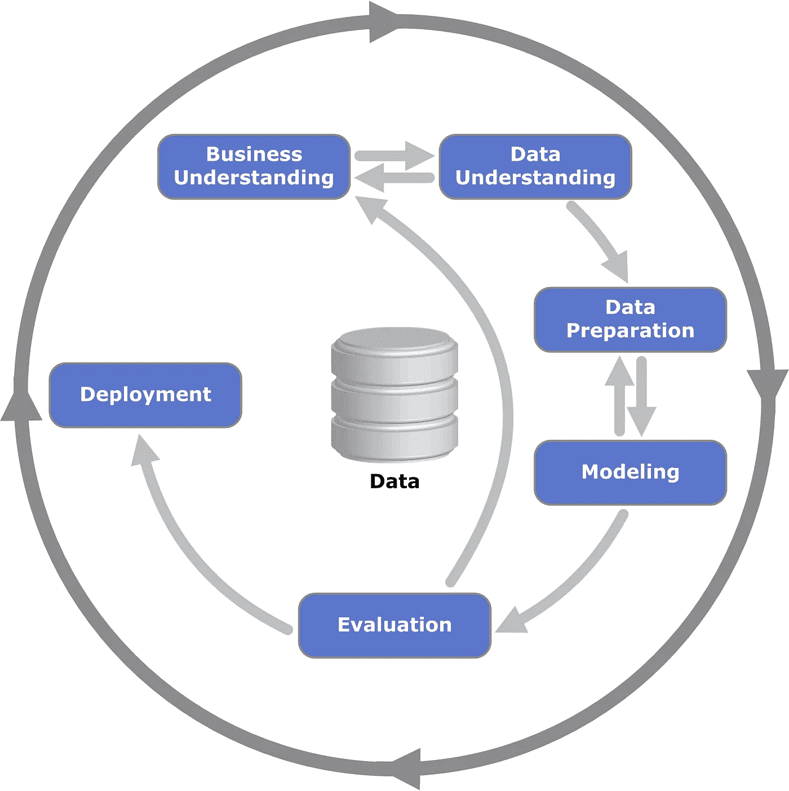
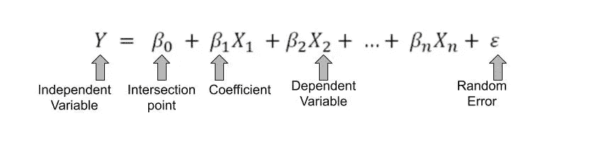
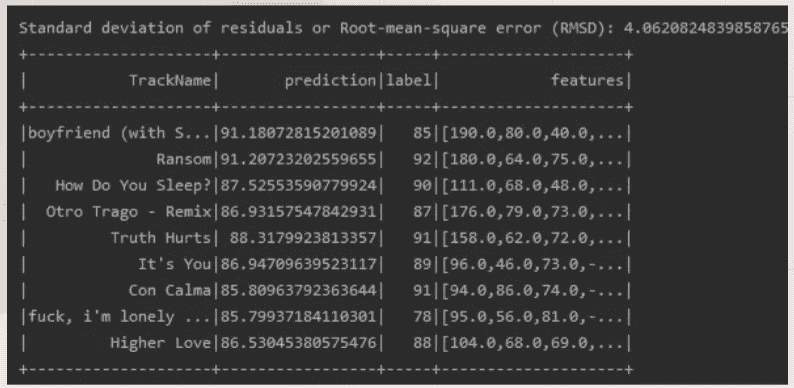
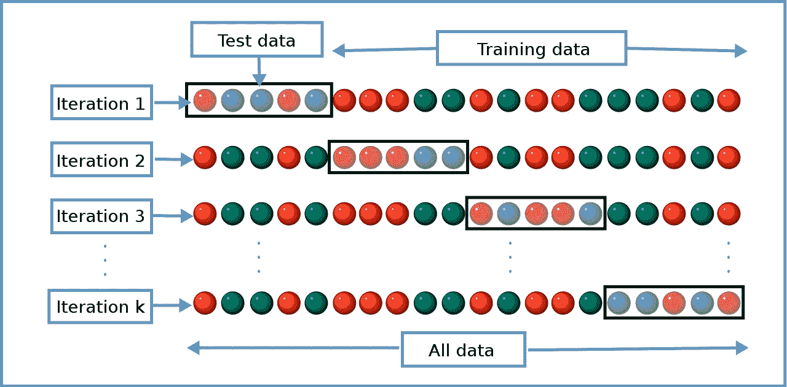

# Sparks MLlib 上的回归

> 原文：<https://towardsdatascience.com/regression-on-sparks-mllib-8107e8390253?source=collection_archive---------51----------------------->

## 使用 MLlib API 的简短示例

照片由 [ThisisEngineering RAEng](https://unsplash.com/@thisisengineering?utm_source=medium&utm_medium=referral) 在[Unsplash](https://unsplash.com?utm_source=medium&utm_medium=referral)【1】上拍摄

我想分享一个关于在 Spark + Scala 上使用 MLlib 的 PoC(概念验证)的(非常)小的开发。在这种情况下，我们希望使用 MLlib 对一些数据执行一些机器学习算法。我们将使用一个(非常)小的数据集，例如，kaggle.com 上[列奥纳多的数据集。有了数据和目标(在 Spark + Scala 上使用 MLlib)，让我们创建这个 PoC。](https://www.kaggle.com/leonardopena/top50spotify2019)

快速查看数据后，结论是:大多数列都是数字。所有这些数字栏都可以预测，但是有一个，它的名字使它成为被选中的一个:受欢迎程度。我们可以“执行”那个“机器学习例子”来预测受欢迎程度的值。

流行度是一个结果(目标变量)，它独立于其他结果，但(很可能)依赖于某些特性(变量/特征)。为了预测(未来)受欢迎程度的结果，受欢迎程度是一个数字目标，使用接收到的特征，也是数字的，我们可以使用线性回归。

[Kenneth Jensens 图片](https://creativecommons.org/licenses/by-sa/3.0/)描述 CRISP-DM 的步骤[2]

让我们来一点理论，这样我们可以用一个潮流来装扮这些断言。我们需要一种简短、实用的方法来从某个事物的示例(PoC)中得出可验证的结果。而且兴趣在需求量很大的 TIC 领域，大数据(以数据工程师为代表)和数据科学(以数据科学家为代表)。

有了这个框架，并在选定的数据集上采用 [CRIPS-DM 的前两步](/crisp-dm-methodology-leader-in-data-mining-and-big-data-467efd3d3781) [3]，我们构思了一个*假设*，即:“一首歌的流行程度在某种程度上是这首歌的其他特征的结果”。当你有指示目标变量的(先前)数据时，从其他特征中预测目标变量，被称为*监督学习。*

正如数据理解步骤向我们展示的，大多数列没有分类值，而是连续数值，包括目标变量。这支持了使用算法(CRIPS-DM 的*建模*步骤)如线性回归来预测(计算)一首歌的流行度的想法。

线性回归公式由[以色列罗德里格斯](https://medium.com/@lwjirl)

在线性回归中，我们通过以下方式计算因变量(目标值/结果):将特定(计算)系数乘以与该系数相关的自变量(特征/变量)的结果相加(B1 * X1+B2 * X2+……)，加上截距点，再加上随机误差。所有这些都是数值。

总的来说，我们已经以非正式的日常方式和技术性的方式提到了什么是动机、目标以及我们将如何实现这些目标。让我们开始吧。

MLlib 中的线性回归算法接收 libsvm 数据作为参数。所以第一步是将 CSV 文件转换成 libsvm。这一步被称为 CRIPS-DM 方法论的数据准备。

我们将删除 string(几个字母的数据类型)列和 id 列，这样做时，我们将面临这样的问题:列名中的点需要在 Spark[4]中进行特殊处理。因此，我们首先删除点，然后删除列，最后使用 MLlib 的*汇编器. transform* 函数将数据转换为 libsvm 格式。

现在是创建模型的时候了，只有很少的几行。但在此之前，我们先把数据随机分为训练和测试，然后，用训练数据来拟合模型。

飞度造型由[伊斯罗德里格](https://medium.com/@lwjirl)

我们将来自 *model_data* 函数的模型保存在 *val* 中，并使用它在我们的测试数据上创建一个预测列。我们的第一个模型的 RMSD 为 4(受欢迎程度)，它对测试数据的预测如下:

[以色列罗德里格斯](https://medium.com/@lwjirl)对比预测值与实际值

定义 CRISP-DM *评估*步骤是为了确保模型的正确性。根据业务情况和误差大小，这些结果可能被视为可接受的结果，也可能不被视为可接受的结果。

为了改善这一结果，我们可以:标准化(均值为 0，标准差为 1)我们的数据，我们可以将分类值转换为因子(摇滚= 1，流行= 2，…)，我们应该使用更大的数据集，我们可以丢弃异常值，我们可以对判别变量(例如音乐流派流行度模型)进行特定研究，等等。

按[以色列罗德里格斯](https://medium.com/@lwjirl)分割数据

但是，为了评估，有一些重要的事情需要考虑:实验应该是可复制的。

用于将数据分割成测试和训练数据集的命令不允许我们在每个实验中为每一侧获取完全相同的行。所以每次我们执行实验，我们都会有(稍微)不同的结果。这是不可取的，因为我们将不能正确地度量模型的改进，或者缺少改进。

我们能做的是:降低模型的(平均)RMSD。要减少模型的 RMSD，最好的办法是移除数据集的异常值(在这种情况下)。

我们必须考虑到:我们可以通过减少 RMSD 来改善结果，但我们不能将其减少到零，因为这将意味着模型过度拟合。

当模型对于给定的数据集是完美的时，就会发生过度拟合，这通常意味着与没有过度拟合的模型相比，与任何其他数据集的误差水平都会更大。

[Gufosowa](https://commons.wikimedia.org/wiki/User:Gufosowa) 图为 k 倍交叉验证图[5]

评估模型是否过度拟合的一个好方法是检查训练和测试数据集之间的误差水平，并通过不同的数据样本交叉验证误差。

当然，我们会接受一定程度的误差以避免过度拟合，但也不接受欠拟合。很难找到一个好的中间点。我们可以继续寻找完美的中间点，但我们不会在这个故事中这样做，因为目标是“在 Spark + Scala 上使用 MLlib”，并且已经实现了。

感谢阅读这个故事:)。

你可以在 Prezi 上找到这个故事的一个(非常)小的演示:【https://prezi.com/tozutehrcojn/?utm_campaign=share】T2&UTM _ medium = copy

参考资料:

[1][this is engineering RAEng](https://unsplash.com/@thisisengineering)，女航天工程师写方程(2020)，网址:[https://unsplash.com/photos/GzDrm7SYQ0g](https://unsplash.com/photos/GzDrm7SYQ0g)

[2] Kenneth Jensens，显示 CRISP-DM (2012)不同阶段之间关系的流程图，URL:[https://es . Wikipedia . org/wiki/Cross _ Industry _ Standard _ Process _ for _ Data _ Mining #/media/Archivo:CRISP-DM _ Process _ diagram . png](https://en.wikipedia.org/wiki/Cross-industry_standard_process_for_data_mining#/media/File:CRISP-DM_Process_Diagram.png)

[3] [Israel Rodrigues](https://towardsdatascience.com/@lwjirl?source=post_page-----467efd3d3781----------------------) ，CRISP-DM 方法论在数据挖掘和大数据领域的领导者(2020)，网址:[https://towardsdatascience . com/CRISP-DM-methodology-leader-in-data-mining-and-big-data-467 EFD 3d 3781](/crisp-dm-methodology-leader-in-data-mining-and-big-data-467efd3d3781)

[4]贾亚德万·issues.apache.org，“当试图从包含列的数据帧中进行选择时。在它里面，是抛出异常”(2016)，网址:【https://issues.apache.org/jira/browse/SPARK-13197

[5] [Gufosowa](https://commons.wikimedia.org/wiki/User:Gufosowa) ，k 倍交叉验证图。(2019)，网址:[https://es . Wikipedia . org/wiki/Cross _ Industry _ Standard _ Process _ for _ Data _ Mining #/media/Archivo:CRISP-DM _ Process _ diagram . png](https://en.wikipedia.org/wiki/Cross-validation_(statistics)#/media/File:K-fold_cross_validation_EN.svg)