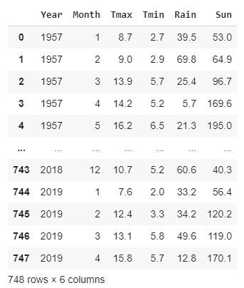
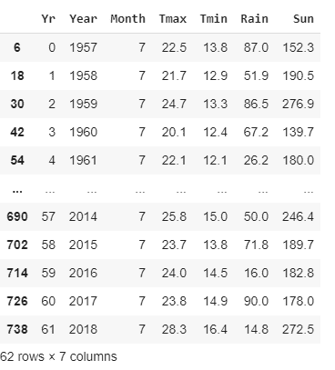
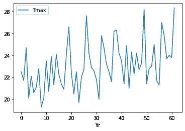
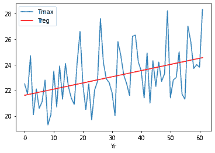
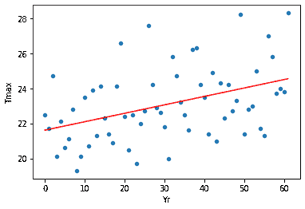

# 熊猫和熊猫的回归图

> 原文：<https://towardsdatascience.com/regression-plots-with-pandas-and-numpy-faf2edbfad4f?source=collection_archive---------5----------------------->

## 数据可视化

## 向 Python 图中添加回归线可以揭示可能被忽视的趋势


艾萨克·史密斯在 [Unsplash](https://unsplash.com?utm_source=medium&utm_medium=referral) 上拍摄的照片

我喜欢熊猫自带的绘图工具。是的，有许多其他绘图库，如 Seaborn，Bokeh 和 Plotly，但对于大多数用途，我很高兴熊猫绘图的简单性。

但是有一件事我不喜欢，那就是在复杂的线或散点图上绘制回归线的能力。

但是，我发现，这很容易解决。使用 Numpy 库，您可以在几行代码中生成回归数据，并将其绘制成与原始线形图或散点图相同的图形。

这就是我们在这篇文章中要做的。

首先，我们来获取一些数据。如果你读过我以前写的关于数据可视化的文章，你就会知道接下来会发生什么。我将使用一组天气数据，您可以从我的 Github 帐户下载。它记录了英国伦敦几十年来的温度、日照水平和降雨量，并存储为 CSV 文件。该文件由英国气象局记录的公共领域数据创建。

## 伦敦的夏天越来越热了吗

我们将检查伦敦的气温是否随着时间的推移而上升。从原始数据来看并不明显，但是通过在数据上画一条回归线，我们将能够更好地看到趋势。

因此，首先我们需要导入我们将需要的库。

```
import pandas as pd
import numpy as np
import matplotlib.pyplot as plt
```

这没什么不寻常的，我们正在导入 Pandas 来帮助数据分析和可视化，Numpy 将为我们提供创建回归数据所需的例程，Pandas 使用 Matplotlib 来创建地块。

接下来，我们下载数据。

```
weather = pd.read_csv('https://raw.githubusercontent.com/alanjones2/dataviz/master/londonweather.csv')
```

(你可能已经猜到了，这应该在一行中。)

我们已经将 CSV 文件读入熊猫数据帧，这是它的样子——一个包含月数据的表格，记录了最高和最低温度，降雨量和日照时数，从 1957 年开始，到 2019 年结束。



我提出了夏季是否会变得更热的问题，因此我将对数据进行过滤，只给出通常记录最热温度的 7 月份的数据。为了方便起见，我将添加一个列，从第 0 年开始对年份进行编号(稍后您将看到这是如何使用的)。

```
july = weather.query('Month == 7')
july.insert(0,'Yr',range(0,len(july)))
```

上面的代码将一个查询应用于*天气*数据帧，该数据帧仅返回月份等于 7(即七月)的行，并根据结果创建一个名为*七月*的新数据帧。

接下来，我们插入一个名为 *Yr* 的新列，它从 0 到表的长度对行进行编号。

*七月*长这样:



现在我们可以画出自 1957 年以来 7 月份的最高气温。

```
july.plot(y='Tmax',x='Yr')
```



那里有很多变化，高温不仅限于最近几年。但是似乎确实有一种趋势，随着时间的推移，气温似乎确实在上升。

我们可以尝试通过线性回归来使这一点变得更明显，我们试图找到一个代表温度上升趋势的直线图。为此，我们使用 Numpy 的 *polyfit* 函数。 *Polyfit* 对给定的数据进行最小二乘多项式拟合。我们希望对列 *Yr* 和 *Tmax* 中的数据进行线性回归，因此我们将它们作为参数传递。最后一个参数是多项式的次数。对于线性回归，阶数为 1。

然后，我们使用方便的函数 *poly1d* 为我们提供一个函数来进行拟合。

```
d = np.polyfit(july['Yr'],july['Tmax'],1)
f = np.poly1d(d)
```

我们现在使用函数 *f* 来生成线性回归数据，并将其插入到名为 *Treg* 的新列中。

```
july.insert(6,'Treg',f(july['Yr']))
```

接下来，我们创建一个 *Yr* 对 *Tmax* 的线形图(我们在上面看到的摆动图)和另一个 *Yr* 对 *Treg* 的线形图，这将是我们的直线回归图。我们通过将第一个图赋给变量 *ax* 来组合这两个图，然后将其作为附加轴传递给第二个图。

```
ax = july.plot(x = 'Yr',y='Tmax')
july.plot(x='Yr', y='Treg',color='Red',ax=ax)
```



就这样，搞定！

我们现在可以更清楚地看到这些年来气温的上升趋势。

这是用散点图做的同样的事情。

```
ax=july.plot.scatter(x='Yr', y='Tmax')
july.plot(x='Yr',y='Treg',color='Red',legend=False,ax=ax)
```



我认为这相当简单，我希望你觉得有用。

关于用熊猫绘图的介绍，请看这个:

[](/plotting-with-pandas-an-introduction-to-data-visualization-8bd7c0831650) [## 用熊猫绘图:数据可视化导论

### 如果您是一名初露头角的数据科学家或数据记者，能够可视化您的数据会让您有能力…

towardsdatascience.com](/plotting-with-pandas-an-introduction-to-data-visualization-8bd7c0831650)