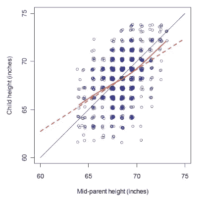

# 回归均值及其含义

> 原文：<https://towardsdatascience.com/regression-to-the-mean-and-its-implications-648660c9bf76?source=collection_archive---------18----------------------->

## 一种无处不在的统计现象，影响着我们的日常生活，但我们大多数人都没有意识到。

洛杉矶的常驻棒球队洛杉矶道奇队(LA Dodgers)在经历了一场精彩的比赛后，出现在了《体育画报》2017 年 8 月 28 日的封面上。他们赢得了 71%的比赛，并有望追平一个赛季中最多胜利的记录。封面配有“最佳”的标题。团队。从来没有？”

该队随后在接下来的 22 场比赛中输掉了 17 场，并最终在世界大赛中输给了休斯顿太空人队。这只是臭名昭著的《体育画报》封面厄运的一个例子，这是一个城市传说，显然会导致出现在封面上的球队和运动员立即经历一连串的糟糕表现。

厄运可以追溯到《体育画报》的第一期，主角是埃迪·马修斯。在他出现在封面上之前，他的球队取得了 9 连胜，但他们继续输掉了下一场比赛，他很快就受伤，导致他错过了 7 场比赛。然而，厄运并不仅限于棒球——它折磨着所有运动项目的运动员。最近倒霉的受害者包括塞雷娜·威廉姆斯、康纳·麦格雷戈、路易斯·苏亚雷斯、林赛·沃恩和汤姆·布拉迪。

对此有许多可能的解释。例如，这可能是一种心理影响——出现在封面上会让团队或运动员感到更大的压力，并可能导致他们失去注意力。然而，最近霉运有了一个有趣的变化，在 2019 年 11 月的一期上，SF 49ers 成为了主角。当这个故事被写出来时，49 人队正处于 8 比 0 的连胜，他们继续输掉了他们的下一场比赛。然而，这一损失发生在这期杂志出版的前两天*。这表明可能有更多的厄运。*

事实上，霉运只是一种非常简单但意义深远的统计现象的结果，这种现象被称为均值回归。当一个随机变量在第一次测量时是极端的，但在第二次测量时更接近平均值(因此是“回归”)时，就会发生这种情况，反之亦然。但是这和体育出版物的世界有什么关系呢？

本质上，这只是说一个团队或运动员在任何时间点的表现都是一个随机变量——潜在的技能无疑是一个非常重要的因素，但它至少部分取决于我们无法预测的噪音或运气的概念。一个团队只有在随机变量的第一次测量(该团队在封面前的表现)达到极限后才会出现在封面上。在第二次测量中，封面出版后，团队更有可能“回归”到平均值，看起来封面的外观让他们倒霉。

## 高尔顿的原始解释

著名统计学家弗朗西斯·高尔顿爵士在 19 世纪末首先发现了回归均值法。1886 年，他进行了一项研究，调查孩子的身高和他们父母之间的关系。他测量了 928 名成年子女和相应的 205 对父母夫妇的身高，在考虑男女身高差异(将每个女性的身高乘以 1.08)后，他注意到了一些有趣的事情。孩子们的身高比他们父母的平均身高更接近平均值。因此，如果父母非常高，孩子通常会比较矮。如果父母都很矮，孩子往往会更高。您可以在下图中看到这一点，虚线没有等位线陡:

来源:斯蒂芬·森在皇家统计学会的《重要性》杂志上发表的文章

人们很容易想到对此的基因解释，事实上这也是高尔顿所建议的。他说，一个孩子的基因构成是他们所有祖先的某种指数平均值。由于更多的人分享了远祖，你最终会向平均人口身高靠拢，而不是纯粹根据你父母的遗传基因来决定你的身高。但是我们现在知道这不是真的——人们只从他们的父母那里获得他们的基因构成。在高尔顿的实验中还有另一个不寻常的效应。不仅孩子的身高没有父母那么极端，反之亦然！正如我们在下图中看到的，极端身高的孩子的父母身高更接近平均水平。这使得基因争论更难被证明，事实上这种影响纯粹是统计学上的。

来源:[文章](https://rss.onlinelibrary.wiley.com/doi/full/10.1111/j.1740-9713.2011.00509.x)由斯蒂芬·森在皇家统计学会的《重要性》杂志上发表

## 回归均值背后的直觉

当你比较两个不完全相关的变量时，就会回归到平均值。这里有一个例子来理解这是什么意思。

假设我们选择了 100 个人，让他们每人抛 10 次硬币。基本概率表明，在所有 1000 次翻转中，我们预计大约有一半是正面。

现在，假设我们选择了第一轮中头数最多的 20 个人，让他们进入第二轮，在第二轮中，他们必须再次投掷硬币 10 次。在这 200 次翻转中，我们会期待什么？我们会期望这些人(他们“擅长”获得正面)获得正面多于反面吗？一点也不！在新的 200 次翻转中，我们预计大约有一半会再次成为正面。这组异常值的平均值现在已经“回归”到平均值。

这是一个极端的例子，其中被测量的两个变量(第一轮中的人数和第二轮中的人数)根本不相关。让我们考虑另一个极端，两个变量完全相关。假设我们用摄氏度测量了世界上 100 个地方的温度。然后我们挑选出前 20 个最热的地方，再用华氏温度测量它们的温度。在这种情况下，我们会看到什么？这些地方将继续比平均华氏温度更热，而且不会回归到平均值！这种变量之间完全相关的情况(给定摄氏温度，我们知道华氏温度的确切温度)是我们不会看到回归平均值的唯一情况。

这两个例子可能看起来非常明显，可能不清楚与 SI cover jinx 或 Galton's heights 有什么联系，但这只是因为大多数回归均值的实例发生在变量不在我们看到的两个极端中的任何一个的情况下——它们会有某种程度的相关性。

父母的身高和孩子的身高当然不是完全相关的。很明显，除了父母的身高，孩子的身高还取决于其他因素。所以回归到平均值是肯定会发生的。然而，身高也不是完全独立的——由于潜在的遗传因素，可能有一些相关性。因此，这种影响不会像掷硬币的例子那样极端，因为在掷硬币的例子中，回归实际上一直回到总体均值。所以在这种偏相关的情况下，会有对均值的偏回归。

我们在现实生活中看到的大多数情况都与此类似，其中有一个潜在的固定因素使两个变量部分相关，一些未知的影响或噪音或运气使它们不那么相关。这就是为什么回归均值在现实生活中如此难以发现的原因。

## 现实世界中的例子

回归均值不仅仅是影响运动员的奇怪统计现象。它对现实世界的政策决策有着非常现实的影响。一个例子——对减少交通事故的不同方法进行优先排序。英国执法部门考虑的一个方法是在最近事故高发的十字路口安装测速摄像头。这样做之后，他们注意到事故发生的频率下降了，大概是因为人们因为摄像头的存在而放慢了速度。但这是唯一的原因吗？就事故而言，安装摄像头的地方可能比平时更极端，因为十字路口是根据最近的事故选择的。所以这些回归平均值的十字路口至少是事故减少的部分原因。在决定是设置更多的高速摄像机还是尝试不同的方法时，区分这两种效果是很重要的。

另一个有趣的例子是 1999 年马萨诸塞州 T2 学校提高分数的案例。从 1999 年到 2000 年，学校设定了旨在提高学生成绩的目标。当他们第二年查看结果时，他们注意到 1999 年以来表现最差的学校达到了他们的改进目标——但是一些表现最好的学校却失败了！这可能是又一个回归平均数的例子，最差和最好的学校都回归到平均数，似乎最差的学校有进步，最好的学校失败。

这实际上提出了一个关于人性和社会的深刻哲学观点，《思考，快与慢》的作者丹尼尔·卡内曼对此做了最好的总结:

> “这是一个欢乐的时刻，在这一时刻，我明白了关于世界的一个重要真理:因为我们倾向于在别人做得好的时候奖励他们，在别人做得不好的时候惩罚他们，而且因为存在回归均值的现象，这是人类条件的一部分，我们因为奖励别人而受到统计上的惩罚，因为惩罚别人而受到奖励。”—丹·卡尼曼

## 回归均值的计算

回归均值很难被注意到，甚至更难量化，但很明显，它不能被忽视。这种影响在医学研究中可能特别危险。医学试验的参与者必须满足某些标准，这是很常见的——例如，如果你想测试一种新药治疗特定疾病的疗效，那么参与者可能会从已经患病一段时间的人群中选择。可能这些人目前是“极端”的例子，不管他们的治疗如何，他们平均会回归到平均水平并有所改善。

医学研究和其他类似的实验通常有对照组来解释这一点。对照组不接受治疗(通常以安慰剂的形式)，而治疗组实际上接受了新药。现在，只要这两组患者来自同一人群(比如，患病至少 2 年的人)，两组患者的平均效应都将回归，两组患者之间的差异将取决于药物的实际影响！

这其实提出了一个有趣的问题。存在对照组的至少部分原因是考虑到安慰剂效应——对照组可能在没有实际接受治疗的情况下有所改善，只要患者*相信*他们得到了治疗。对照组的任何改善实际上都可能是由于安慰剂效应和回归平均值。那么安慰剂效应真实到什么程度呢？[这篇论文](https://www.ncbi.nlm.nih.gov/pmc/articles/PMC1125994/)谈到了在此类研究中考虑回归均值的重要性，并提到在某些情况下，我们认为的安慰剂效应实际上可能只是回归均值。这就是为什么一些研究分成 3 组——A 组不做任何治疗，B 组服用安慰剂，C 组接受实际治疗。A 组内的任何变化都有可能是因为回归到均值，A 组和 B 组的差异显示的是安慰剂效应，B 组和 C 组的差异是因为药物本身！

## 结论

回归均值作为一个概念我们已经知道了一百多年，但由于它的普遍性和背后微妙的推理，当它发生在现实生活中时，很容易被忽略。我说的只是几个例子，但还有很多，包括[大二暴跌](https://en.wikipedia.org/wiki/Sophomore_slump)、[马登魔咒](https://www.digitaltrends.com/gaming/what-is-the-madden-curse/)、[有机玻璃原理](https://grantland.com/the-triangle/fantasy-baseball-nerdy-keys-to-victory-the-plexiglas-principle/)、[月度经理魔咒](https://www.theguardian.com/football/blog/2014/oct/19/manager-of-the-month)等等。正如我们所见，忽视它的后果可能是深远的。我们所能做的就是记住这种效应的存在，并训练自己在现实世界中发现它！