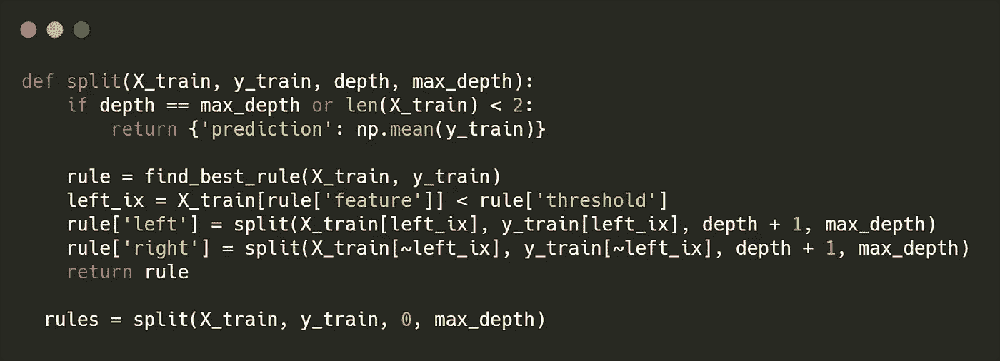
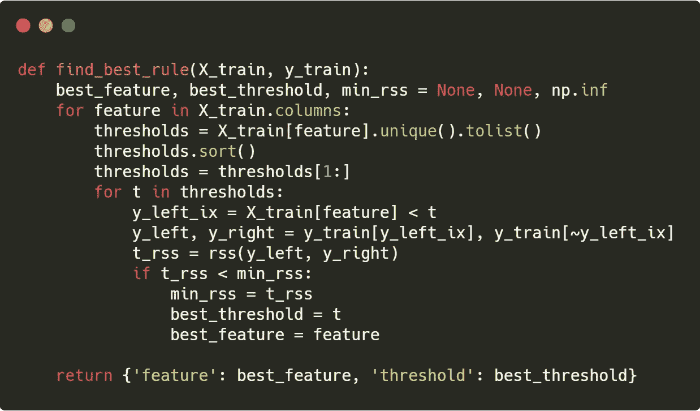
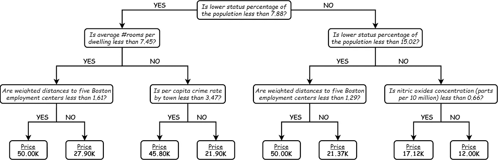
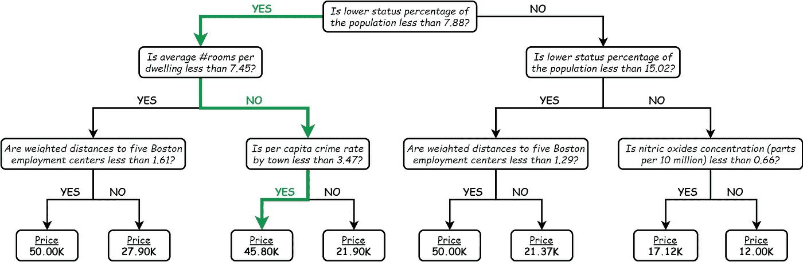
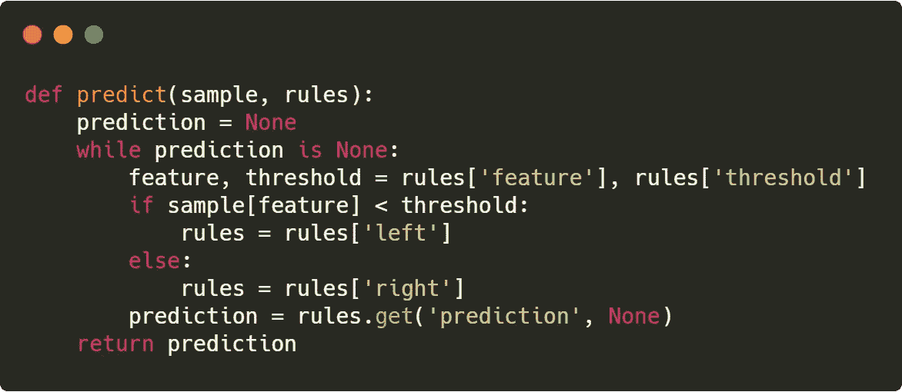

# 用 30 行 Python 从头开始构建回归树

> 原文：<https://towardsdatascience.com/regression-trees-from-scratch-in-30-lines-of-python-8196e0ab29b2?source=collection_archive---------24----------------------->

## 我们描述并实现回归树来预测波士顿的房价。

# 介绍

流程图用于通过视觉媒介清晰地表达决策过程。它们的设计需要对整个系统的全面了解，因此也需要人类的专业知识。问题是:“我们能否自动创建流程图，以使他们的设计更快、更便宜，并且相对于过程的复杂性更具可扩展性？”答案是决策树！

决策树可以自动推导出最能表达决策内部运作的规则。当在标记数据集上训练时，决策树学习规则树(即，流程图)并遵循该树来决定任何给定输入的输出。它们的简单性和高度可解释性使它们成为您 ML 工具箱中的一笔巨大资产。

在这个故事中，我们描述了回归树——具有连续输出的决策树——并实现了用于学习和预测的代码片段。我们使用[波士顿数据集](https://scikit-learn.org/stable/datasets/index.html#boston-dataset)来创建一个用例场景，并学习定义房屋价格的规则。您可以在参考资料中找到完整代码的链接。

用来对付新冠肺炎的流程图。[1]

# 学习规则

我们寻找一个类似于流程图*、*的*规则树*，它能最好地解释房子的特征和价格之间的关系。每个规则将是这棵树中的一个节点，并将房屋划分为不相交的集合，例如有两个房间的房屋、有三个房间的房屋和有三个以上房间的房屋。规则也可以基于多个要素，例如有两个房间并且靠近查尔斯河的房子。因此，所有可能的树的空间是巨大的，我们需要简化来计算处理学习。

作为第一个简化，我们只考虑二元规则:将房子分成两部分的规则，例如*“房子是否少于三个房间？”。*第二，我们省略了特征的组合，因为组合的数量可能很大，并且只考虑基于一个特征的规则。在这些简化下，规则是具有两个部分的“*小于关系”*:一个特征，例如房间的数量和划分阈值，例如三个。

> 基于这个规则定义，我们通过递归地寻找将数据一分为二的最佳规则来构建规则树。

换句话说，我们首先尽可能地将数据分成两部分，然后再分别考虑每个部分。我们继续分割分割，直到满足预定义的条件，例如最大深度。由于简化和贪婪的规则搜索，构造的树只是最佳树的近似。下面你可以找到实现学习的 Python 代码。

用 Python 实现的递归分裂过程。

我们将拆分过程实现为一个函数，并用训练数据(X_train，y_train)调用它。该函数找到将训练数据一分为二的最佳规则，并根据找到的规则执行拆分。它通过使用左右分割作为训练数据来不断调用自己，直到达到预先指定的最大深度或者训练数据太小而无法分割。当满足停止条件时，它停止分割，并预测房价作为当前分割中训练数据的平均价格。

在 *split* 函数中，划分规则被定义为一个字典，其关键字为 *left、right、feature、*和 *threshold* 。最佳划分规则由另一个函数返回，该函数通过遍历训练集中的每个特征和阈值来彻底扫描可能的规则。对某个要素进行尝试的阈值由该要素在整个数据集中取的值决定。代码如下:

寻找分割现有训练数据的最佳规则的函数。

该函数通过测量规则建议的拆分质量来跟踪最佳规则。质量通过一个名为*残差平方和(RSS)* 的“*越低越好”度量标准*来衡量(有关 RSS 的更多详细信息，请参见参考资料中的笔记本)。最后，最佳规则作为字典返回。

# 解释规则

学习算法自动选择特征和阈值，以创建最佳解释房屋特征和价格之间关系的规则。下面我们可视化了从波士顿数据集中学习到的最大深度为 3 的规则树。我们可以观察到提取的规则与人类的直觉重叠。此外，我们可以像画流程图一样简单地预测房子的价格。

从波士顿数据集中学习到的最大深度为 3 的规则树。

现在让我们描述一个自动使用上述流程图进行预测的过程。给定具有数据集中的特征的房屋，我们在节点中提出问题，并根据答案进行传播，直到我们到达预测，即叶节点。

例如，位于(I)较低地位百分比为 5.3，(ii)每所住宅的平均房间数为 10.2，以及(iii)人均犯罪率为 0.01 的位置的房子将回答第一个问题为**是**，第二个问题为**否**，第三个问题为**是**。因此，我们将预测其价格为 **45.80K** 。下面你可以看到它所走路线的图像。

树规则中的示例预测路径。

使用 split 函数返回的字典对预测过程进行编码相当简单。我们通过比较规则指定的特征值和阈值来遍历规则字典。我们根据答案向左或向右移动，直到遇到带有*预测*关键字的规则，即叶节点。下面是预测的代码片段。

函数使用学习到的树来预测房价。

# 结论

回归树是用作回归模型的快速而直观的结构。对于波士顿数据集，当最大深度被适当调整时，他们可以获得大约 0.9 的 R 分数，这是相当高的。然而，对于数据集中的微小变化，它们可能是脆弱的，这使得它们作为单一预测器是不可靠的。提出了随机森林和梯度增强树来解决高敏感性，并且它们可以产生与深度模型相当的结果。

**参考文献**

[1] [待在家里流程图](https://twitter.com/LHoltonLee/status/1243133282453250049/photo/1)

[2] [波士顿数据集](https://scikit-learn.org/stable/datasets/index.html#boston-dataset)

【3】[完整代码](https://github.com/rizaozcelik/cmpe462-spring20/blob/master/RegressionTree/RegressionTree.ipynb)