# 有 ARIMA 误差的回归

> 原文：<https://towardsdatascience.com/regression-with-arima-errors-3fc06f383d73?source=collection_archive---------10----------------------->


图片来自 [Pixabay](https://pixabay.com/?utm_source=link-attribution&utm_medium=referral&utm_campaign=image&utm_content=1837176) 的[像素](https://pixabay.com/photos/architecture-buildings-cars-city-1837176/)

## 它是什么，我们为什么需要它，何时使用它，如何使用 Python 和 statsmodels 构建它

带 ARIMA 误差的回归将两个强大的统计模型(即线性回归和 ARIMA(或季节性 ARIMA))结合成一个超级强大的回归模型，用于预测时间序列数据。

下图说明了如何将线性回归、ARIMA 和季节性 ARIMA 模型相结合来生成带有 ARIMA 误差的回归模型:

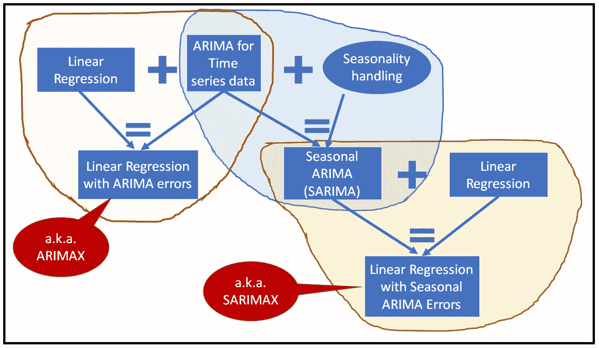

ARIMAX 和 SARIMAX 模型(图片由[作者](https://sachin-date.medium.com/)提供)

在本文中，我们将看看这些模型中最通用的，称为带有季节性 ARIMA 误差的**回归，简称 SARIMAX** 。

# SARIMAX——概念

假设您的时间序列数据集由一个响应变量和一些回归变量组成。还假设回归变量包含在矩阵 ***X*** 中，响应变量也称为因变量包含在向量 ***y*** 中。在每个时间步 *i* ， ***y*** 取某个值 *y_i* ，在 ***X*** 中有一个对应的行向量 ***x_i*** ，包含时间步 *i* 的所有回归变量的值。下图说明了这种情况:

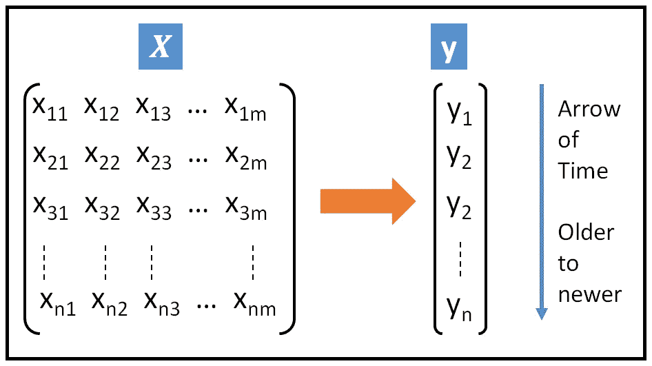

带有回归变量 **X** 和因变量**y的时间序列数据集(图片由[作者](https://sachin-date.medium.com/)提供)**

使用线性回归模型对此数据建模的简单方法如下:

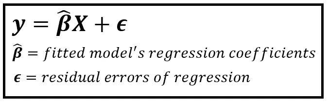

一个线性回归模型(图片由[作者](https://medium.com/@sachin.date))

在上面的模型规范中，***【β(cap)***是存储拟合模型的回归系数的(m×1)大小的向量。

**ε** ，回归的残差是实际的 ***y*** 与模型预测的值 ***y(cap)*** 之差。所以在每个时间步*I:* *ε_ I = y _ I—y(cap)_ I .* ***ε****是一个大小为(n×1)的向量，假设一个数据集跨越 n 个时间步。*

*但是，唉，我们优雅的线性回归模型对时间序列数据不起作用，原因很简单:时间序列数据是自动的，即自相关的。*中 *y_i* 的给定值受 ***y*** 的先前值影响，即 *y_(i-1)、y_(i-2)* 等。线性回归模型无法“解释”这种自相关性。**

**因此，如果对( **y， *X*** )数据集拟合直线线性回归模型，这些自相关会漏入回归残差( ***ε*** )，使 **ε** 自相关！**

**我们在我的文章《线性回归的 [**假设》中已经看到**](/assumptions-of-linear-regression-5d87c347140) 线性回归模型假设回归的残差是独立的随机变量，且服从相同的正态分布。但是如果残差是自相关的，它们就不可能是独立的，从而导致许多问题。自相关残差引起的一个主要问题是，不能使用显著性统计检验(如 f 检验或学生 t 检验)来确定回归系数是否显著。也不能依赖回归系数的标准误差。这反过来使得回归系数的置信区间以及模型预测的置信区间变得不可靠。仅仅是残差中的这一个自相关问题，就导致了线性回归模型的一连串问题，使其实际上对时间序列数据建模无用。**

**但是，人们可以通过引入另一个强大的模型，即 ARIMA(或季节性 ARIMA)，来解决自相关残差的问题，而不是抛弃强大的线性回归模型。(S)ARIMA 模型非常适合处理自相关数据。我们利用 SARIMA 的这种能力，使用 SARIMA 模型对线性回归的残差进行建模。**

## **萨里玛模型**

**SARIMA 模型由以下 7 个部分组成:**

****AR:** 自回归(AR)分量是时间序列过去值的线性组合，达到一定数量的滞后 *p* 。即 *y_i* 是 *y_(i-1)* ， *y_(i-2)* ，… *y_(i-p)* 的线性组合如下:**

**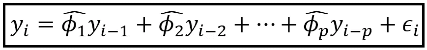**

**AR(p)模型(图片由[作者](https://sachin-date.medium.com/)提供)**

***y_i* 为第 I 个时间步观察到的实际值。 *phi(cap)_i* 是拟合模型的回归系数。 *ε_i* 为第 I 个时间步的回归残差。AR(p)模型的阶次“p”是结合众所周知的规则和建模者的判断来确定的。**

****MA:**SARIMA 的移动平均(MA)成分是模型过去误差的线性组合，达到一定数量的滞后 *q* 。模型过去的误差是通过从过去的实际值中减去过去的预测值来计算的。MA(q)模型表示如下:**

**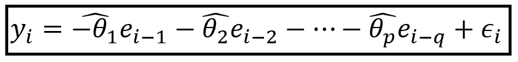**

**马(q)模型(图片由[作者](https://sachin-date.medium.com/))**

***y_i* 为第 I 个时间步观察到的实际值。 *theta(cap)_i* 为拟合模型的回归系数。 *ε_i* 为第 I 个时间步的回归残差。负号符合指定 MA 型号的惯例。MA(q)模型的阶数“q”是通过结合众所周知的规则和建模者的判断来确定的。**

**组合 ARMA (p，q)模型是 AR(p)和 MA(q)模型的简单组合:**

**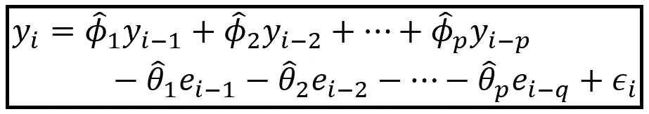**

**ARMA(p，q)模型(图片由[作者](https://sachin-date.medium.com/))**

****差分的顺序(d):** 如果时间序列有趋势，则不能使用 ARMA 模型。趋势的常见例子有线性趋势、二次趋势和指数或对数趋势。如果时间序列表现出一种趋势，可以对时间序列应用一阶或多阶差分，以消除该趋势。一阶差分将移除类型为 *y = m*x + c.* 的线性趋势，二阶和更高阶差分将移除类型为 *y = m*x + c* 、 *y = m*x + c* 等的多项式趋势。**

**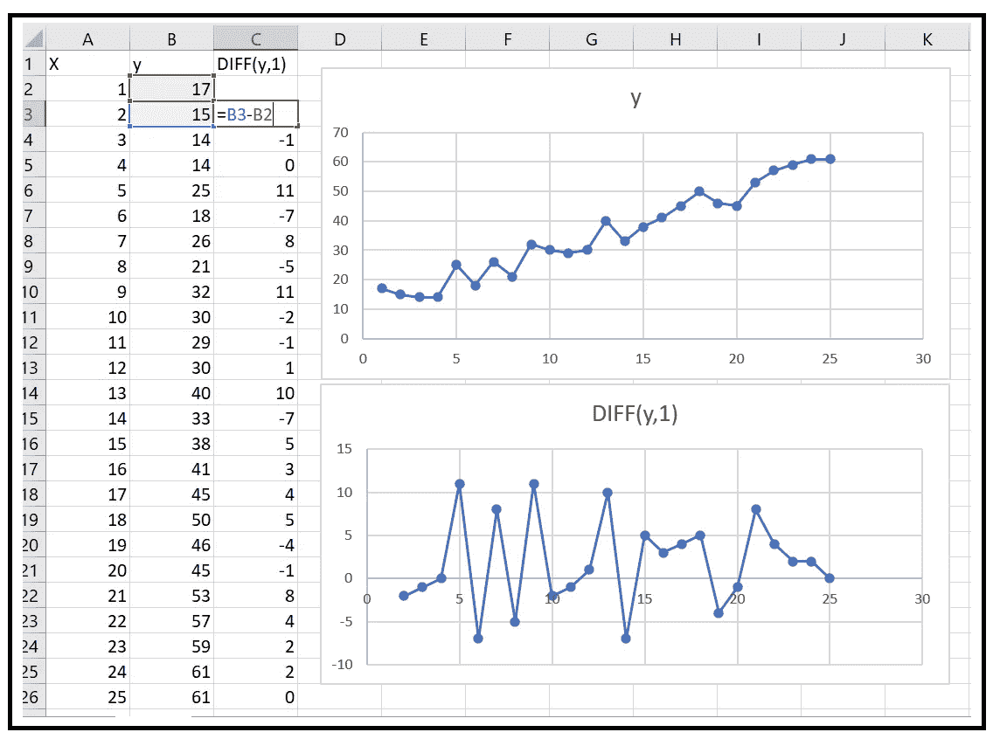**

**具有线性趋势的时间序列，以及应用一阶差分后的去趋势时间序列: *y_i-y_(i-1)* (图片由[作者](https://sachin-date.medium.com/)提供)**

**ARIMA 车型中的差分运算用 ***I*** 字母表示。在 ARIMA， *I* 代表*I*integrated。在 AR 和 MA 项发挥作用之前，ARIMA 模型*应用了差异。差分的阶由 ARIMA(p，d，q)模型规范中的 d 参数表示。***

****SAR、SMA、D 和 m:** 季节性 ARIMA 或 SARIMA 模型通过引入 P 阶季节性 AR (SAR)项、Q 阶季节性 MA (SMA)项和 D 阶季节性差异，将上述 AR、MA 和差异概念简单地扩展到季节性领域。SARIMA 模型中的最后一个参数是“m ”,即季节性周期。例如，对于显示年度季节性的时间序列，m=12 个月。正如 P、D 和 Q 一样，估算 P、D、Q 和 m 的值也有既定的规则。**

***完整的萨里玛模型规格是 ARIMA(p，D，q)(P，D，Q)m***

**现在让我们回到自相关残差这个小难题上来。**

**如前所述，(S)ARIMA 模型非常适合预测时间序列数据，尤其适合处理自相关数据。我们将 SARIMA 模型的这一特性应用于线性回归模型拟合到时间序列数据集后的自相关残差建模。**

**由此产生的模型被称为带有季节性 ARIMA 误差的**回归**或简称为 **SARIMAX** 。它可以大致定义如下:**

**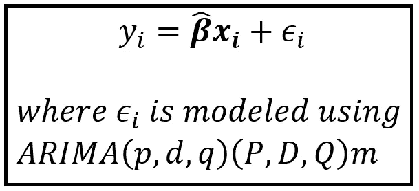**

**SARIMAX(图片由[作者](https://sachin-date.medium.com/)提供)**

**如果(P，D，Q)，(P，D，Q)和 m 选择正确，人们会期望 SARIMAX 模型的残差是*而不是*自相关的。事实上，它们应该是独立的，同分布的随机变量，均值为零，方差恒定。**

**在本文中，我不会详细介绍估算 P、D、Q、P、D、Q 和 m 的规则，而是将重点放在使用 Python 和 Statsmodels 为真实数据集构建 SARIMAX 模型上。在此过程中，我们将应用各种规则来修正 SARIMAX 的参数。**

**为了更好地理解整套规则是什么，请参考以下关于该主题的优秀链接:**

**[](http://people.duke.edu/~rnau/arimrule.htm) [## 识别 ARIMA 模型的规则

### 非季节性 ARIMA 模型说明(pdf 文件)季节性和非季节性 ARIMA 模型幻灯片(pdf 文件)介绍…

people.duke.edu](http://people.duke.edu/~rnau/arimrule.htm) 

为了深入理解 ARIMA 和萨里玛模型，请务必阅读瑙教授关于 ARIMA 的其余课堂讲稿:

[](http://people.duke.edu/~rnau/411arim.htm) [## ARIMA 模型介绍

### 非季节性 ARIMA 模型说明(pdf 文件)季节性和非季节性 ARIMA 模型幻灯片(pdf 文件)介绍…

people.duke.edu](http://people.duke.edu/~rnau/411arim.htm) 

# 使用 Python 和 statsmodels 构建带有季节性 ARIMA 误差的回归模型

我们将运用到目前为止所学的知识。我们将为真实世界的数据集设计一个 SARIMAX 模型。我们将使用的数据集包含了从 2004 年到 2005 年在一个意大利城市繁忙的十字路口每小时测量的各种空气污染物的读数。以下是原始数据集的链接:

[https://archive.ics.uci.edu/ml/datasets/Air+quality](https://archive.ics.uci.edu/ml/datasets/Air+quality)

我已经为我们的 SARIMAX 实验修改了这个数据集。修改后的数据集可以从这里 **下载 [**。**](https://gist.github.com/sachinsdate/2f4fb513f3a5ca367ae1866e3f5b8613)**

让我们从导入我们将使用的所有 Python 包开始:

```
**import** pandas **as** pd
**from** statsmodels.regression **import** linear_model
**from** patsy **import** dmatrices
**import** statsmodels.graphics.tsaplots **as** tsa
**from** matplotlib **import** pyplot **as** plt
**from** statsmodels.tsa.seasonal **import** seasonal_decompose
**from** statsmodels.tsa.arima.model **import** ARIMA **as** ARIMA
**import** numpy **as** np
```

我们将使用 [pandas](https://pandas.pydata.org/) 将数据加载到 DataFrame 中:

```
df = pd.**read_csv**(**'air_quality_uci.csv'**, header=0)
```

让我们打印出前 10 行:

```
df.**head**(10)
```

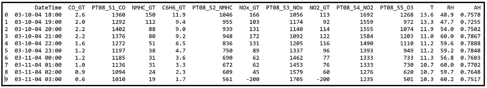

空气质量数据集的前 10 行(图片由[作者](https://sachin-date.medium.com/)提供)

## 回归目标

我们将建立一个回归模型来预测 **PT08_S4_NO2** 变量的小时值。

## 回归策略

我们模型的变量如下:

因变量 ***y*** 为 **PT08_S4_NO2**

回归变量矩阵 ***X*** 将包含两个变量:
温度 ***T*** 绝对湿度 ***AH***

我们将使用带有(季节性)ARIMA 误差的回归，即(S)ARIMAX 模型，通过每小时测量**温度**和**绝对湿度来预测 **PT08_S4_NO2** 的每小时值。**

> 由于我们使用(S)ARIMAX，我们也可以隐式使用因变量 **PT08_S4_NO2** 的过去值和模型的过去误差作为额外的回归变量**。**

我现在把(季节性的)或(S)放在括号里，因为我们还不知道回归的残差中是否存在季节性。我们很快就会知道了。

我们将使用以下逐步过程来构建(S)ARIMAX 模型:

## 步骤 1:准备数据

将数据框中的日期时间列转换为 pandas 日期时间列，并将其设置为数据框的索引。

```
df[**'DateTimeIndex'**]= pd.**to_datetime**(df[**'DateTime'**])
df = df.**set_index**(keys=[**'DateTimeIndex'**])
```

将索引的频率属性设置为每小时。这将创建几个空行，对应于原始数据集中丢失的每小时测量值。用相应列的平均值填充所有空白数据单元格。

```
df = df.**asfreq**(**'H'**)
df = df.**fillna**(df.**mean**())
```

验证任何列中没有空单元格。输出应该全为零。

```
df.**isin**([np.**nan**, np.**inf**, -np.**inf**]).**sum**()
```

创建训练和测试数据集。将测试数据集长度设置为训练数据集的 10%。我们实际上并不需要那么大，但我们现在就用 10%吧。

```
dataset_len = **len**(df)split_index = **round**(dataset_len*0.9)train_set_end_date = df.**index**[split_index]df_train = df.**loc**[df.**index** <= train_set_end_date].**copy**()df_test = df.**loc**[df.**index** > train_set_end_date].**copy**()
```

## 步骤 2:创建线性回归模型

现在，我们将在训练数据集上拟合一个普通的最小二乘线性回归模型，并获取它的残差向量。

让我们用 [Patsy](https://patsy.readthedocs.io/en/latest/quickstart.html) 语法创建模型表达式。在下面的表达式中，我们说 **PT08_S4_NO2** 是因变量，而 **T** 和 **AH** 是回归变量。默认情况下，假设有一个截距项。

```
expr = **'PT08_S4_NO2 ~ T + AH'**
```

我们来雕刻出 ***y*** 和 ***X*** 矩阵。Patsy 让这变得非常简单:

```
y_train, X_train = **dmatrices**(expr, df_train, return_type=**'dataframe'**)y_test, X_test = **dmatrices**(expr, df_test, return_type=**'dataframe'**)
```

在训练数据集上拟合 OLSR 模型:

```
olsr_results = linear_model.**OLS**(y_train, X_train).**fit**()
```

打印出 OLSR 模型的培训结果:

```
olsr_results.**summary**()
```

我们看到以下输出。我强调了输出中的几个重要区域:

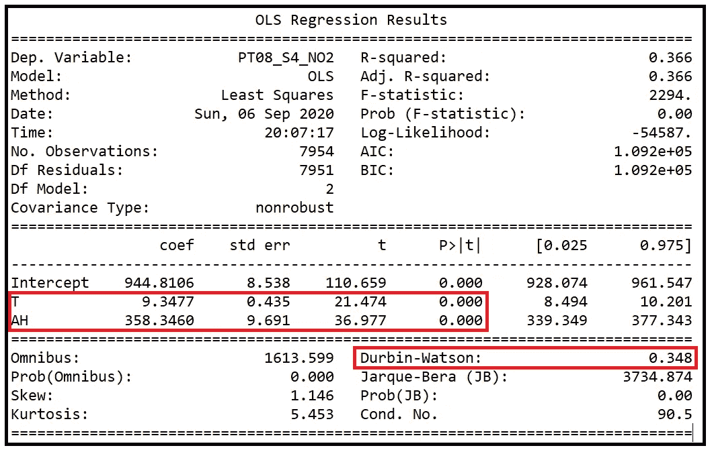

OLSR 模特的模特训练总结(图片由[作者](https://sachin-date.medium.com/)提供)

我们看到，回归变量 T 和 AH 的回归系数在 99.99%的置信水平下是显著的，如它们的 P 值(P > |t|列)所示，P 值基本上为 0。

这些结果中需要注意的第二件事是 [Durbin-Watson 测试](https://www.statsmodels.org/stable/generated/statsmodels.stats.stattools.durbin_watson.html)的输出，该测试测量回归残差中 LAG-1 自相关的程度。值为 2 意味着没有滞后-1 自相关。在残差误差 ***ε*** 中，接近 0 的值意味着强正自相关，而接近 4 的值意味着在滞后-1 处强负自相关。

在上面的输出中，我们看到 DW 检验统计量是 0.348，表明在滞后-1 时回归的残差之间有很强的正自相关。这完全在意料之中，因为基础数据是一个时间序列，而线性回归模型未能解释因变量的自相关性。DW 测试统计正好证实了这一点。

## 步骤 3:估计 ARIMA 参数(P，D，Q)，(P，D，Q)和 m

我们现在开始对 OLSR 模型的回归残差 ***ε估计萨里玛模型的参数的过程。*** 回归误差存储在变量`olsr_results.resid`中。

让我们从绘制残差的自相关图开始:

```
tsa.**plot_acf**(olsr_results.**resid**, **alpha**=0.05)
plt.**show**()
```

我们得到如下的情节:

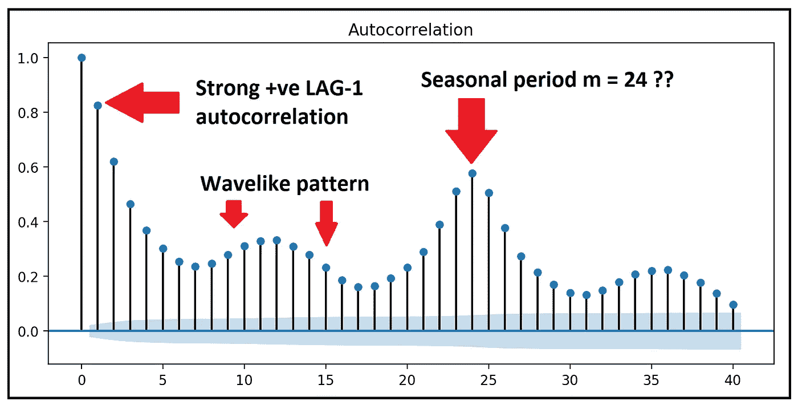

残差的 ACF(图片由[作者](https://sachin-date.medium.com/)提供)

ACF 告诉我们三件事:

1.  有很强的自相关延伸到多个滞后，表明残差时间序列有一个趋势。我们需要通过使用一阶或可能两阶差分来去除这个时间序列的趋势。**因此，参数 d 可能是 1，也可能是 2。**
2.  ACF 中的**波状图案**证明了数据中的季节性变化。
3.  滞后= 24 时的峰值表明**季节周期可能是 24 小时。即 m 很可能是 24** 。对于包含车辆污染测量的数据，这似乎是合理的。我们将很快使用时间序列分解图来验证这个猜测。

> 快速注意:滞后-0 自相关将始终是一个完美的 1.0，可以被忽略，因为一个值是完全相关的。

在我们估计剩余的(S)ARIMA 参数之前，让我们对时间序列求一次差，即 d=1:

```
olsr_resid_diff_1 = olsr_results.resid.**diff**()
olsr_resid_diff_1 = olsr_resid_diff_1.**dropna**()
```

让我们重新绘制残差的差分时间序列的 ACF:

```
tsa.**plot_acf**(olsr_resid_diff_1, **alpha**=0.05)
plt.**show**()
```

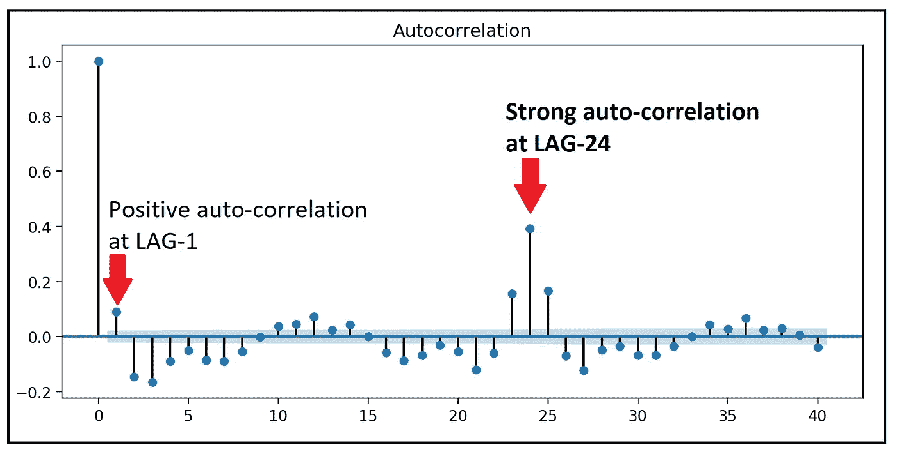

残差差(1)的 ACF(图片由[作者](https://sachin-date.medium.com/)提供)

我们现在在 ACF 中看到一幅非常不同的画面。自相关在所有滞后处都显著降低。波状模式仍然存在，但这是因为我们没有采取任何措施来消除可能的季节变化。滞后-24 自相关再次特别突出。

我们看到，在差分时间序列中，在滞后-1 时仍有显著的自相关。我们*可以*尝试通过再取一个差值(即 d=2)并绘制结果时间序列 ACF:

```
olsr_resid_diff_2 = olsr_resid_diff_1.**diff**()
olsr_resid_diff_2 = olsr_resid_diff_2.**dropna**()
tsa.**plot_acf**(olsr_resid_diff_2, **alpha**=0.05)
plt.**show**()
```

我们得到如下的情节:

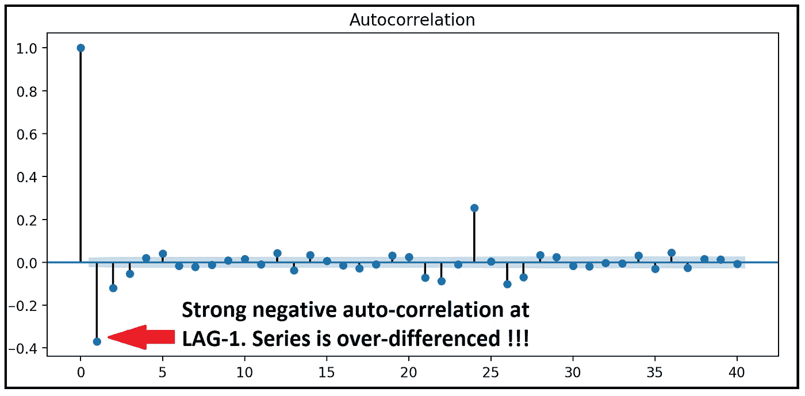

残差差(2)的 ACF(图片由[作者](https://sachin-date.medium.com/)提供)

不幸的是，第二次对时间序列求微分在 LAG-1 产生了严重的负*自相关。这是不好的迹象。我们似乎夸大了差异。我们应该坚持 d=1。*

让我们再来看看 DIFF(1)时间序列的 ACF:

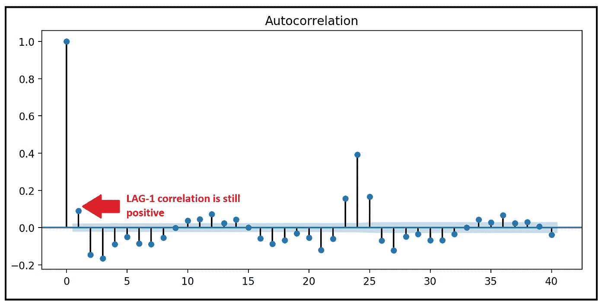

DIFF(1) ACF 在 LAG-1 处显示单一正自相关(图片由[作者](https://sachin-date.medium.com/)提供)

在滞后-1 处的**单个正自相关表明我们可能想要**将 AR 阶数 p 固定为 1。即 AR(1)模型**。**

由于我们已经将 p 固定为 1，现在，我们将省去模型中的 MA 部分。即我们将 q 固定为 0。也就是说，我们的 SARIMA 模型没有 MA 组件。

**到目前为止，我们有如下结果:p=1，d=1，q=0**

让我们验证季节周期 m 是 24 小时。为此，我们将使用 statsmodels 提供的`seasonal_decompose()` 函数将回归的残差分解为趋势、季节性和噪声:

```
components = **seasonal_decompose**(olsr_results.**resid**)
components.**plot**()
```

我们得到如下的情节:

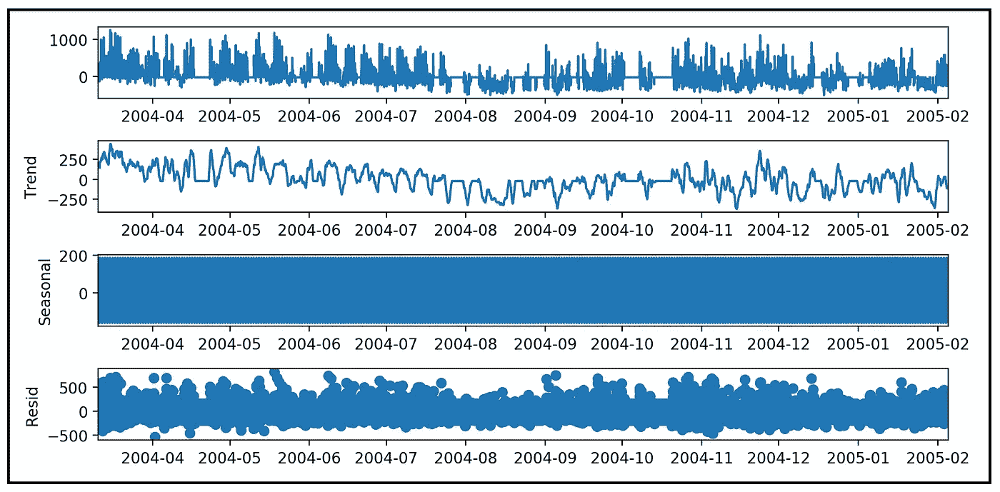

回归残差分解(图片由[作者](https://sachin-date.medium.com/)

让我们放大一下季节性因素:

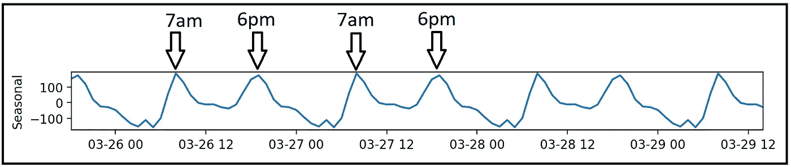

24 小时季节性周期的证据(图片由[作者](https://sachin-date.medium.com/)提供)

季节成分证实 m=24。

强季节分量保证差分的单个季节顺序，即**我们设置 D=1。**

让我们将单个季节差异应用于我们已经差分的残差时间序列:

```
olsr_resid_diff_1_24 = olsr_resid_diff_1.**diff**(**periods**=24)
```

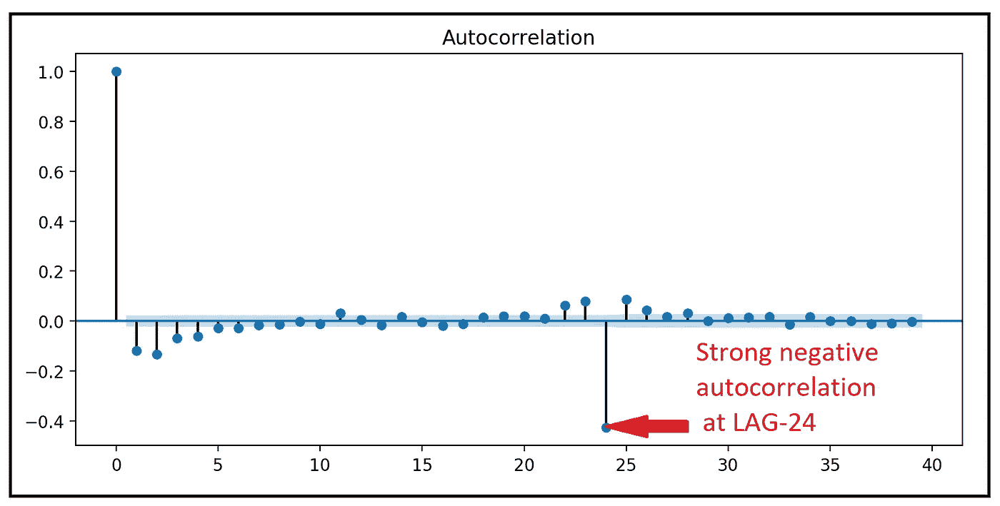

季节性差异时间序列的 ACF(图片由[作者](https://sachin-date.medium.com/)提供)

滞后 24 点的**强负相关表明具有 1 阶的季节性 MA (SMA)信号。即 Q=1** 。此外，**滞后-1 处正相关的缺失表明季节性 AR 成分的缺失。即 P=0。**

**我们固定 P=0，D=1，Q=1，m=24 小时**

就是这样。

我们已经设法估计了 SARIMA 模型的所有 7 个参数如下: **p=1，d=1，q=0，P=0，D=1，Q=1，m=24，即 SARIMAX(1，1，0)(0，1，1)24**

## 步骤 4:建立并拟合带有季节性 ARIMA 误差的回归模型

让我们使用上述参数在训练数据集*(****y _ train****，****X _ train****)*上拟合 SARIMAX 模型。在此之前，我们需要删除 Patsy 自动添加到 ***X_train*** 的截距，并将 ***X_train*** 和 *y_train* *上的时间序列索引频率重置为每小时一次。*

```
X_train_minus_intercept = X_train.**drop**(**'Intercept'**, **axis**=1)X_train_minus_intercept = X_train_minus_intercept.**asfreq**(**'H'**)y_train = y_train.**asfreq**(**'H'**)
```

让我们构建并测试 SARIMAX 模型:

```
sarimax_model = **ARIMA**(**endog**=y_train, **exog**=X_train_minus_intercept,**order**=(1,1,0), **seasonal_order**=(0,1,1,24))sarimax_results = sarimax_model.**fit**()sarimax_results.**summary**()
```

以下是培训总结:

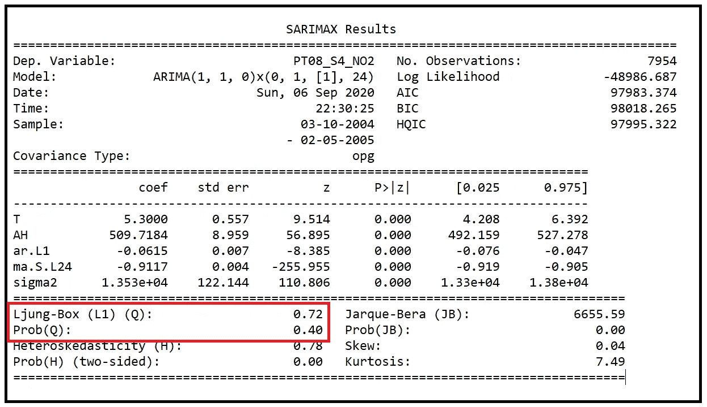

SARIMAX(1，1，0)(0，1，1)24 训练结果(图片由[作者](https://sachin-date.medium.com/)提供)

在训练总结中首先要查看的数字是永盒测试的统计数据及其 p 值。Ljung-Box 帮助我们确定回归的残差是否在统计意义上是自相关的。在这种情况下，p 值为 0.4，显著高于 0.05 (95%置信阈值)。所以我们**接受**永盒检验的零假设，即残差不是自相关的*。*

结果中需要注意的另外两件事是:Jarque-Bera 正态性检验产生了一个非常小的 p 值，这意味着在> 99.99%的置信水平上拒绝了零假设。假设回归误差是正态分布的。这可能是因为误差是高度峰度的(注意峰度=7.49，而不是正态分布的 3.0)。还要注意，误差根本没有偏斜(偏斜度=0.04，而正态分布误差为 0.0)。

回归误差也是异方差的，即它们具有非常数方差。H-test 的 p 值小得几乎为零就证明了这一点，但是您可以做一些事情来解决这个问题。

我们还可以对 P、D、Q、P、D、Q 和 m 的不同参数组合进行试验。事实证明，这种使用不同 SARIMAX 模型的迭代在 SARIMAX 世界中并不罕见。

我们要做的是通过将 Q 设为 0 来简化我们的模型。也就是说，我们将尝试 SARIMAX(1，1，0)(0，1，0)24 模型:

```
sarimax_model = **ARIMA**(**endog**=y_train, **exog**=X_train_minus_intercept,**order**=(1,1,0), **seasonal_order**=(0,1,0,24))sarimax_results = sarimax_model.**fit**()sarimax_results.**summary**()
```

以下是培训总结:

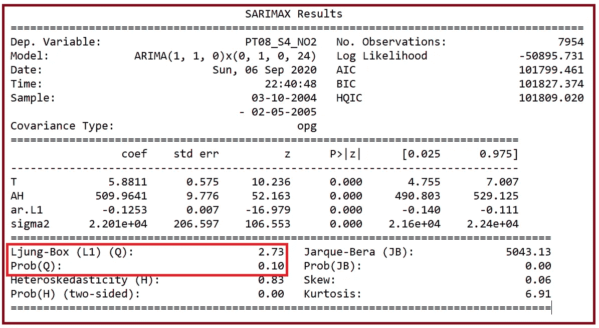

SARIMAX(1，1，0)(0，1，0)24 训练结果(图片由[作者](https://sachin-date.medium.com/)提供)

在这个修正的模型中，我们看到 Ljung-Box 检验统计量的 p 值已经从早期的 0.4 降低到 0.1，这意味着这个模型的回归误差与早期模型相比不相关的可能性要小得多。与以前的模型相比，新模型似乎并没有使误差变得更不异方差或更正态分布。

我们将接受模型的早期版本，即 SARIMAX(1，1，0)(0，1，1)24 模型。

*(感谢* [*蒂亚戈·里巴斯*](https://medium.com/u/482e730d7382?source=post_page-----3fc06f383d73--------------------------------) *在本节早期版本中发现错误)*

## 第五步:预测

SARIMAX 传奇的最后一步是使用选择的模型生成一些预测。我们将要求模型生成 24 个样本外预测，即预测训练数据集结束后未来 24 小时的 ***y*** (污染物 PT08_S4_NO2)值。我们将使用我们在步骤 1 中划分出的测试数据集( ***y_test*** ， ***X_test*** )。回想一下，模型在训练期间从未见过测试数据集。

让我们为预测准备测试数据集:

```
X_test_minus_intercept = X_test.**drop**(**'Intercept'**, **axis**=1)X_test_minus_intercept = X_test_minus_intercept.**asfreq**(**'H'**)y_test = y_test.**asfreq**(**'H'**)
```

调用`get_forecast`方法获得样本外预测:

```
predictions = sarimax_results.**get_forecast**(**steps**=24, **exog**=X_test_minus_intercept[:24])predictions.**summary_frame**()
```

我们得到以下输出:

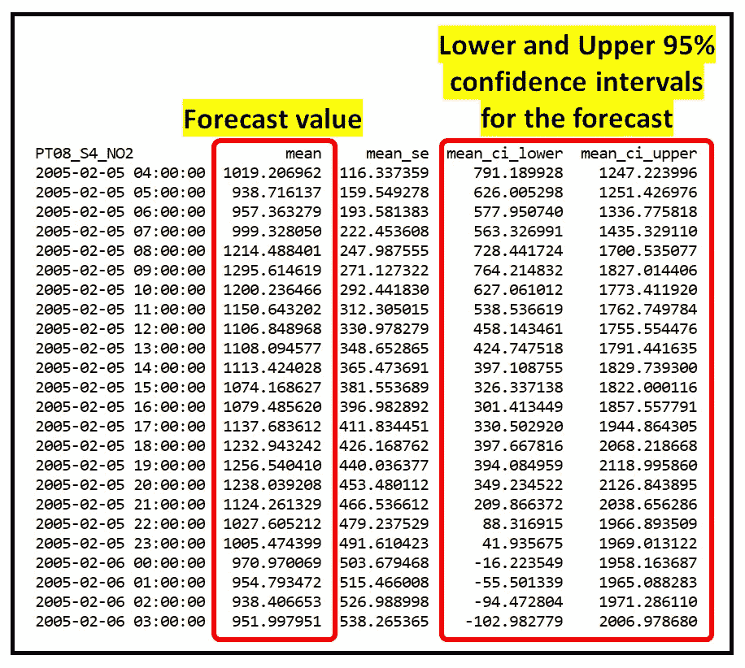

PT08_S4_NO2 的 24 个样本外预报(图片由[作者](https://sachin-date.medium.com/)提供)

让我们将测试数据集中的实际值 ***y_test*** 与 summary _frame 的“平均值”列中提到的预测值一起绘制出来。我们将绘制每个预测值的置信下限和置信上限:

```
predicted, = plt.**plot**(X_test_minus_intercept[:24].**index**, predictions.**summary_frame**()[**'mean'**], **'go-'**, **label**=**'**Predicted**'**)actual, = plt.**plot**(X_test_minus_intercept[:24].**index**, y_test[:24], **'ro-'**, **label**=**'**Actual**'**)lower, = plt.**plot**(X_test_minus_intercept[:24].**index**, predictions.**summary_frame**()[**'**mean_ci_lower**'**], **color**=**'**#990099**'**, **marker**=**'**.**'**, **linestyle**=**'**:**'**, **label**=**'**Lower 95%**'**)upper, = plt.**plot**(X_test_minus_intercept[:24].**index**, predictions.**summary_frame**()[**'**mean_ci_upper**'**], **color**=**'**#0000cc**'**, **marker**=**'.'**, **linestyle**=**':'**, **label**=**'**Upper 95%**'**)plt.**fill_between**(X_test_minus_intercept[:24].**index**, predictions.**summary_frame**()['mean_ci_lower'], predictions.**summary_frame**()['mean_ci_upper'], **color** = **'**b**'**, **alpha** = 0.2)plt.**legend**(**handles**=[predicted, actual, lower, upper])plt.**show**()
```

我们得到如下的情节:

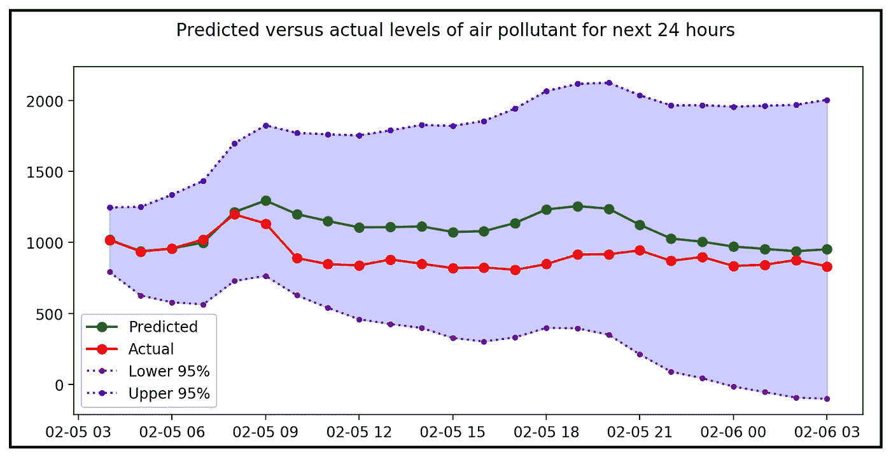

预测、实际和 95%置信区间(图片由[作者](https://sachin-date.medium.com/)提供)

# 关键要点

*   带有(季节性)ARIMA 误差的回归(SARIMAX)是一种时间序列回归模型，它结合了两种强大的回归模型，即线性回归和 ARIMA(或季节性 ARIMA)。
*   Python Statsmodels 库通过 Statsmodels 的 v0.12.0 中的`statsmodels.tsa.arima.model.ARIMA`类或 v0.13.0 中的`statsmodels.tsa.statespace.sarimax.SARIMAX`为构建 ARIMAX 模型提供了强大的支持。
*   在配置(S)ARIMAX 模型的(S)ARIMA 部分时，使用一组众所周知的规则(结合个人判断)有助于确定(S)ARIMAX 模型的 P、D、Q、P、D、Q 和 m 参数值。
*   设计良好的(S)ARIMAX 模型的回归残差几乎没有自相关。这由永氏盒试验的 p 值表示。
*   此外，您可能希望残差是等方差的，并且(最好)是正态分布的。因此，您可能需要尝试 P、D、Q、P、D、Q 的不同组合，直到您获得具有最佳拟合度特征的模型。

# 相关阅读

[](/assumptions-of-linear-regression-5d87c347140) [## 线性回归的假设

### 以及如何使用 Python 测试它们。

towardsdatascience.com](/assumptions-of-linear-regression-5d87c347140) [](/what-is-time-series-decomposition-and-how-does-it-work-9b67e007ae90) [## 什么是时间序列分解，它是如何工作的？

### 另外，首先深入研究使用 Python 的强大的时间序列分解算法

towardsdatascience.com](/what-is-time-series-decomposition-and-how-does-it-work-9b67e007ae90) [](/when-your-regression-models-errors-contain-two-peaks-13d835686ca) [## 当回归模型的误差包含两个峰值时

### 关于处理双峰残差的 Python 教程

towardsdatascience.com](/when-your-regression-models-errors-contain-two-peaks-13d835686ca) [](/heteroscedasticity-is-nothing-to-be-afraid-of-730dd3f7ca1f) [## 异方差没有什么可怕的

### 使用 Python 的原因、影响、测试和解决方案

towardsdatascience.com](/heteroscedasticity-is-nothing-to-be-afraid-of-730dd3f7ca1f) [](/testing-for-normality-using-skewness-and-kurtosis-afd61be860) [## 使用偏度和峰度检验正态性

### …以及使用综合 K 平方和 Jarque–Bera 正态性检验的分步指南

towardsdatascience.com](/testing-for-normality-using-skewness-and-kurtosis-afd61be860) 

# 参考文献、引文和版权

空气质量测量的数据集来自 [UCI 机器学习库](https://archive.ics.uci.edu/ml/datasets/Air+quality)，可用于研究目的。

论文链接: *S. De Vito，E. Massera，M. Piga，L. Martinotto，G. Di 法兰克王国，关于在城市污染监测场景中用于苯估计的电子鼻的现场校准，传感器和致动器 B:化学，第 129 卷，第 2 期，2008 年 2 月 22 日，第 750-757 页，ISSN 0925-4005，* [*【网页链接】*](http://dx.doi.org/10.1016/j.snb.2007.09.060) *。* ( [【网页链接】](http://www.sciencedirect.com/science/article/pii/S0925400507007691))

本文中的所有图片版权归 [Sachin Date](https://www.linkedin.com/in/sachindate/) 所有，版权归 [CC-BY-NC-SA](https://creativecommons.org/licenses/by-nc-sa/4.0/) 所有，除非图片下面提到了不同的来源和版权。

*感谢阅读！如果您喜欢这篇文章，请* [***关注我***](https://timeseriesreasoning.medium.com) *获取关于回归和时间序列分析的提示、操作方法和编程建议。***