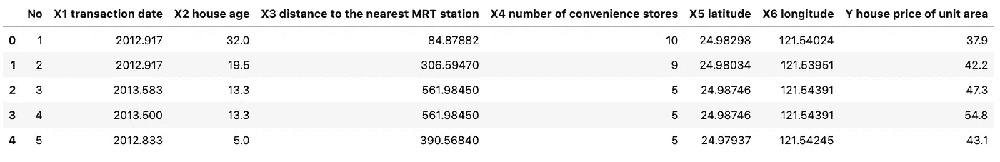
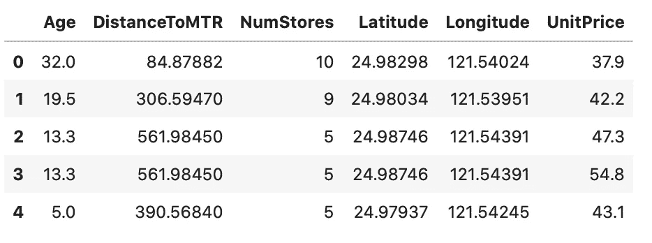
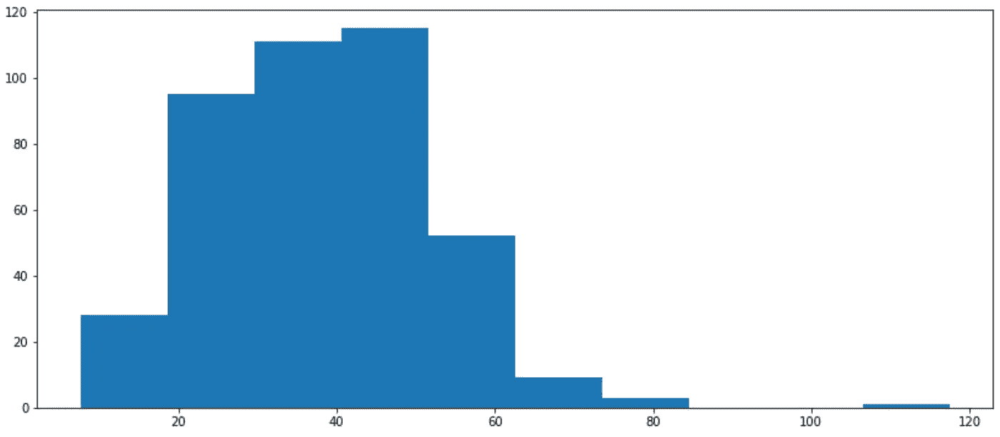
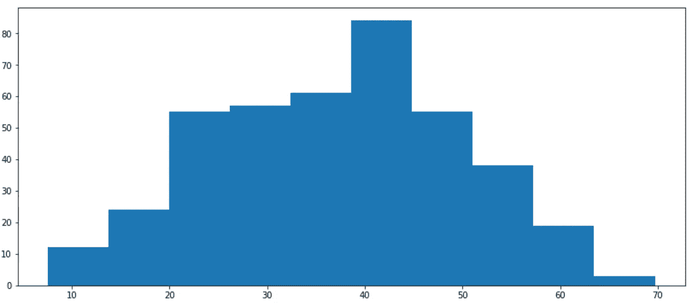
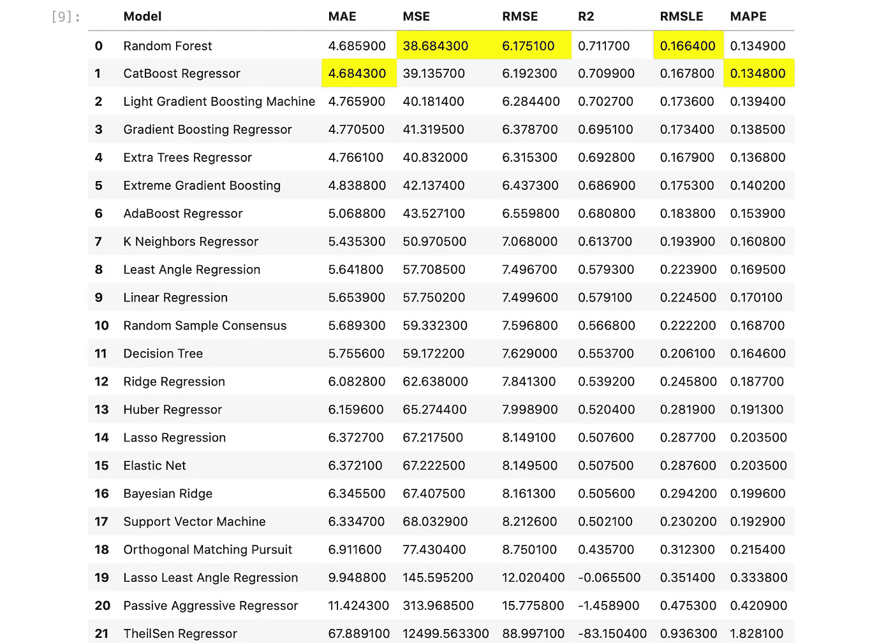
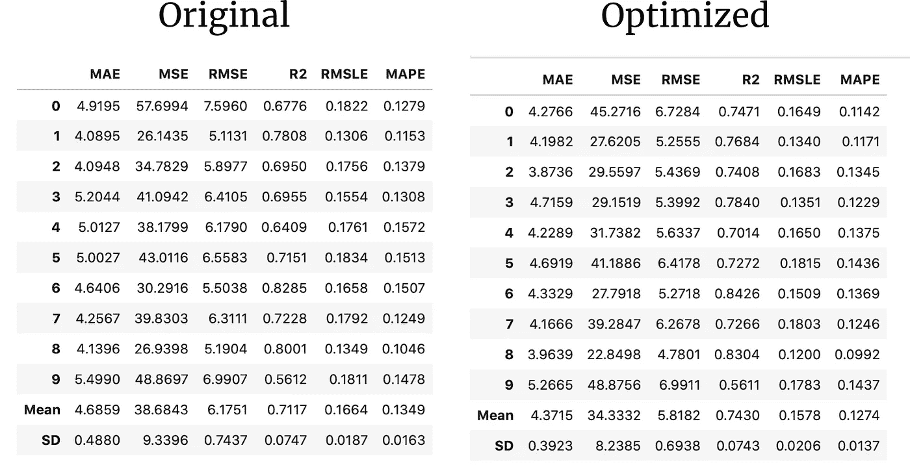
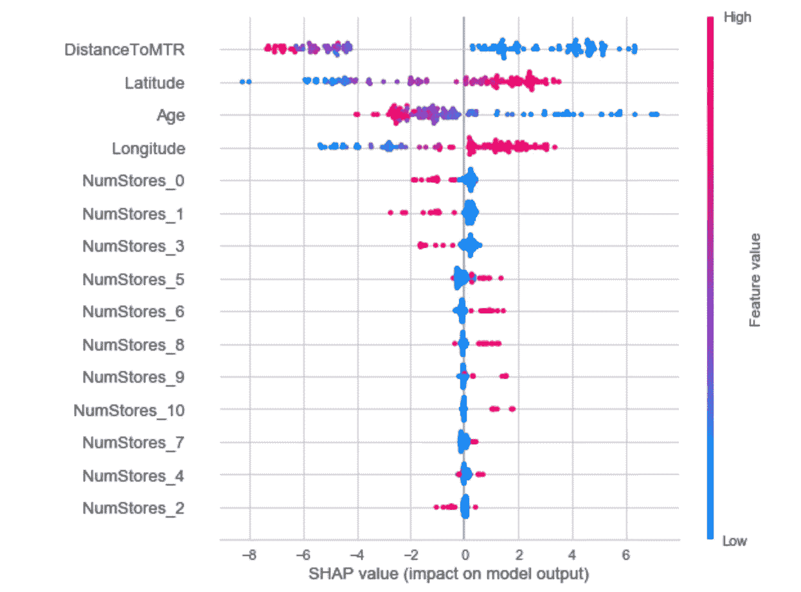

# PyCaret 回归:一个更好的机器学习库

> 原文：<https://towardsdatascience.com/regression-with-pycaret-a-better-machine-learning-library-e02762a0615c?source=collection_archive---------20----------------------->

## 让我们看看用 PyCaret 解决回归问题有多简单。包括源代码。

几天前，我介绍了 PyCaret 库的[基础知识，并展示了它如何在易用性方面击败众所周知的 Scikit-Learn。今天我们将更具体一点，并介绍如何处理回归任务。阅读前一篇文章不是先决条件，但是如果你以前没有使用过这个库，可以随意浏览一下。](/pycaret-better-machine-learning-with-python-58b202806d1e)


由 [HARALD PLIESSNIG](https://unsplash.com/@pliessnig?utm_source=medium&utm_medium=referral) 在 [Unsplash](https://unsplash.com?utm_source=medium&utm_medium=referral) 上拍摄的照片

回归问题在我们周围无处不在——最明显的是任何种类的价格预测。这就是为什么我们必须知道如何解决回归任务，以及如何高效地解决它们。

如果你更喜欢视频，或者只是想巩固你的知识，请随意观看我们关于这个主题的视频。[源代码](https://github.com/betterdatascience/YouTube/blob/master/0006_PyCaretRegression.ipynb)包括:

在开发时间方面，PyCaret 比 Scikit-Learn 更适合回归任务。这一切都归结为几个函数调用。不需要在几个学习算法之间进行测试，也不需要花费几天时间来调整超参数。PyCaret 为您做了所有这些(甚至更多)。

这篇文章的目标读者是熟悉机器学习中回归概念的人。熟练的知识不是必需的，因为我们将简要回顾回归理论。

这篇文章的结构如下:

1.  高级回归概述
2.  模型选择、训练和优化
3.  模型可视化
4.  预测和模型保存
5.  结论

所以事不宜迟，让我们开始吧！

# 高级回归概述

我假设你已经知道什么是回归。Investopedia[的一段话比我更好地总结了这一点:](https://www.investopedia.com/terms/r/regression.asp)

> 回归是一种用于金融、投资和其它学科的统计方法，它试图确定一个因变量(通常用 Y 表示)和一系列其它变量(称为自变量)之间关系的强度和特征

用最简单的术语来说——我们希望通过数据点拟合一条线(或超平面),以获得最佳拟合线。后面的算法旨在找到最小化成本函数的线，通常是 MSE 或 RMSE。

这是线性回归，但也有其他类型，如多项式回归。与它的弟弟不同，多项式回归不假设线性关系，有时可以产生更好的结果。只是不要疯狂地使用多项式次数——因为模型往往会过度拟合。

我们还有更复杂的回归算法，比如:

*   随机森林回归
*   XGBoost 回归

在大多数情况下，这些将优于线性回归，代价是模型的可解释性。不需要考虑算法选择，因为 PyCaret 会自动选择算法。让我们在下一节看看如何实现。

# 模型选择、训练和优化

现在有趣的部分来了。我们将使用来自 Kaggle 的[房地产数据集](https://www.kaggle.com/quantbruce/real-estate-price-prediction/data#)。它看起来是这样的:



它需要清理一下，但不要太大。这是代码

```
df.drop([‘No’, ‘X1 transaction date’], axis=1, inplace=True)
df.columns = [‘Age’, ‘DistanceToMTR’, ‘NumStores’, ‘Latitude’, ‘Longitude’, ‘UnitPrice’]
```



现在情况好些了，但我们还有一个“问题”。如果说这些年来我学到了什么，那就是定价数据集通常是有偏差的。这意味着目标变量不遵循正态分布。

就预测而言，这是一个问题，因为它会影响模型的性能。下面是目标变量的直方图:



怀疑得到证实。为了解决这个问题，我们将使用一种非常科学的目测方法，删除所有单价**大于 70 的记录。当然，有更好的方法来处理这个问题，但是我想尽快开始建模。**

```
df = df[df[‘UnitPrice’] <= 70]
```



我们现在有了一些看起来更正常的东西，可以继续建模过程了。如果你读过[之前的文章](/pycaret-better-machine-learning-with-python-58b202806d1e)，你就知道这部分不能再简单了。首先，让我们从 PyCaret 库中导入回归模块并执行基本设置:

```
from pycaret.regression import *exp_reg = setup(df, target=’UnitPrice’)
```

几秒钟后，您将看到一条成功消息和一个数据框，其中包含大量数据信息。请随意通读。接下来，我们可以比较一堆机器学习模型的性能，看看哪一个做得最好。就像函数调用一样简单:

```
compare_models()
```



似乎**随机森林**算法总体上做得最好，所以我们将使用它来创建模型:

```
model = create_model(‘rf’)
```


模型调整现在也是一个简单的过程:

```
tuned_model = tune_model(‘rf’)
```

下面是原始模型和调整后的模型之间的性能比较:



所以是的，超参数调整，尽管只持续了几秒钟，将 RMSE 从 6.17 降低到了 5.82。现在，让我们从这个调整后的模型中进行一些可视化处理。

# 模型可视化

首先，让我们绘制调整模型的残差图:

```
plot_model(tuned_model)
```


火车片场的表现更好，但那是意料之中的。训练集和测试集残差都是正态分布的。接下来，让我们用 SHAP 值来解释我们的模型。

SHAP，或*沙普利附加解释，*是一种解释机器学习模型输出的方式。通过绘制每个样本的每个特征的 SHAP 值，我们可以使用它来查看哪些特征最重要。

```
interpret_model(tuned_model)
```



到 MRT 的距离更远(图表上的错别字，抱歉)，导致单价下降。房产的年限也是如此。位置(纬度和经度)正好相反。我们还没有用地理图可视化这些数据，所以我提供一些推理是没有意义的。

接下来，让我们进行预测并保存我们的回归模型。

# 预测和模型保存

好的，假设我们对模型的表现很满意，我们想对测试集做一个最终的评估。方法如下:

```
predictions = predict_model(tuned_model)
```


您可能不知道的是，PyCaret 在数据集加载时进行了 70:30 的训练测试分割，因此我们不必手动完成这一步。您可以更改这个百分比，但是 70:30 是一个很好的起点。

我们在测试集上看到了一点糟糕的结果，但这是意料之中的。在将模型保存到 *pickle* 文件之前，我们需要完成它:

```
finalize_model(tuned_model)
```

现在可以在您选择的环境中保存模型以备后用:

```
save_model(tuned_model, ‘realestate_rf’)
```

这就是 PyCaret 的回归任务。让我们在下一部分总结一下。

# 结论

这是一篇有趣的文章。如果您一直在跟进，我希望您已经花了一些额外的时间来准备数据，并在建模中获得了更好的结果。因为我们有纬度和经度信息，所以制作这个数据集的地理图也是很好的。这样我们就能更好地解释为什么经度和纬度的增加会导致价格上涨。

无论如何，我希望你已经设法得到一些有用的东西。当然，还有更多的东西需要探索，但是 PyCaret 使我们能够将更多的时间花在重要的事情上——比如数据准备和模型解释，而不是花费数周的时间来训练和调整模型。

感谢阅读。

*喜欢这篇文章吗？成为* [*中等会员*](https://medium.com/@radecicdario/membership) *继续无限制学习。如果你使用下面的链接，我会收到你的一部分会员费，不需要你额外付费。*

[](https://medium.com/@radecicdario/membership) [## 通过我的推荐链接加入 Medium-Dario rade ci

### 作为一个媒体会员，你的会员费的一部分会给你阅读的作家，你可以完全接触到每一个故事…

medium.com](https://medium.com/@radecicdario/membership)