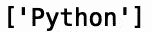
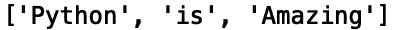
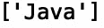
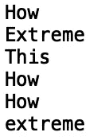
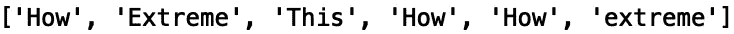
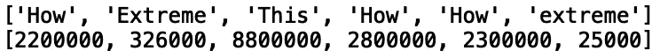
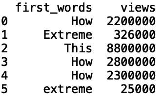
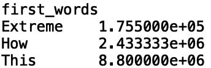
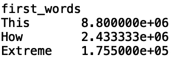

# Python 中的正则表达式

> 原文：<https://towardsdatascience.com/regular-expressions-in-python-7c991daab100?source=collection_archive---------25----------------------->

## 数据科学的正则表达式


[来源](https://www.pexels.com/photo/coffee-notebook-pen-writing-34587/)

正则表达式是定义文本中搜索模式的特殊字符序列。在这篇文章中，我们将讨论如何使用 python 中最基本的正则表达式方法之一“re.findall()”来提取字符串表达式的开头。

我们开始吧！

首先，让我们导入 python 正则表达式模块“re”:

```
import re
```

假设我们有以下字符串:

```
test_string1 = 'Python is Amazing!'
```

我们可以将表达式 r "^\w+ "传递给' re.findall()'，以及我们的字符串，这将返回我们的输入字符串的开头:

```
regex_1 = re.findall(r"^\w+",test_string1)
print(regex_1)
```



在表达式 r“^\w+”中，字符'^'对应于字符串的开头，而' \w+'在字符串中查找字母数字字符。

如果我们去掉'^'，我们会得到:

```
regex_1 = re.findall(r"\w+",test_string1)
print(regex_1)
```



让我们试着拉另一个字符串示例的开头:

```
test_string2 = 'Java is Amazing!'
```

现在，让我们应用' re.findall()'来查找该字符串的第一个单词:

```
regex_2 = re.findall(r"^\w+",test_string2)
print(regex_2)
```



接下来，让我们考虑一个更现实的场景，在这个场景中，这个方法可能是有用的。假设我们有一个 YouTube 视频标题和相应的 YouTube 视图的列表。我们可能对分析视频标题的第一个单词和相应的视频观看次数之间的关系感兴趣。考虑下面的标题/视图元组列表:

```
youtube_titles = [("How to Tell if We're Beating COVID-19", 2200000), ("Extreme Closet Clean Out",326000), ("This is $1,000,000 in Food",8800000), ("How To Tell If Someone Truly Loves You ", 2800000), ("How to Tell Real Gold from Fake", 2300000), ("Extreme living room transformation ", 25000)]
```

我们可以用下面的方法找到每个标题的第一个单词:

```
for title in youtube_titles:
    print(re.findall(r"^\w+",title[0])[0])
```



我们可以将这些值追加到列表中:

```
first_words = []
for title in youtube_titles:
    first_words.append(re.findall(r"^\w+",title[0])[0])
print(first_words)
```



我们还可以将视图附加到列表中:

```
first_words = []
views = []
for title in youtube_titles:
    first_words.append(re.findall(r"^\w+",title[0])[0])
    views.append(title[1])
```



然后，我们可以创建首字值和视频视图的数据框:

```
import pandas as pd
df = pd.DataFrame({'first_words': first_words, 'views':views})
print(df)
```



然后，我们可以执行分组，并计算每个第一个词的平均浏览量:

```
df = df.groupby('first_words')['views'].mean()
print(df)
```



让我们也按降序对这些值进行排序:

```
df = df.groupby('first_words')['views'].mean().sort_values(ascending = False)
print(df)
```



假设这些结果来自足够大的数据集，比如有数千个标题和观看次数，这种类型的分析可以帮助我们选择最佳的 YouTube 视频标题。

我将在这里停下来，但是我鼓励您自己尝试使用“re.findall()”方法。

# 结论

总之，在这篇文章中，我们讨论了如何使用 python 中正则表达式模块的“re.findall()”方法。我们将该方法应用于两个简单的字符串，以提取每个字符串的第一个单词。然后，我们考虑了一个更现实的用例，我们使用该方法提取 YouTube 视频标题的第一个词，并计算每个第一个词对应的平均视频浏览量。我希望你觉得这篇文章有趣/有用。这篇文章的代码可以在 [GitHub](https://github.com/spierre91/medium_code/blob/master/regular_expressions/regex_tutorial.py) 上找到。感谢您的阅读！