# 正则表达式(RegEx):用备忘单清楚地解释它们

> 原文：<https://towardsdatascience.com/regular-expressions-regex-dont-fear-them-it-is-simpler-than-you-think-3a4d6de77058?source=collection_archive---------29----------------------->

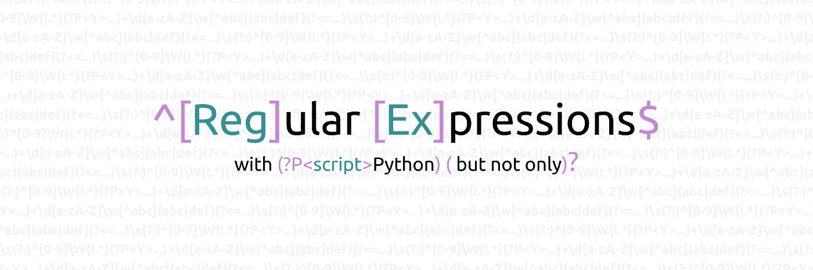

正则表达式(或 **regex** )是用来表示**字符串模式**的工具。它们用于检测、检查、修改和操作字符串。基本上，如果你想在一个文本中找到所有的专有名词，你可以使用正则表达式。我们知道名称只包含字母，并且以大写字母开头。Regex 允许我们**将自然的人类短语转录成计算机表示**。他们精通 Python 或 Java，甚至 Excel，对于工程师、营销人员或其他人来说非常有用。

但是正则表达式，**乍一看，毫无魅力**。一个人可以害怕他们，但是错误地害怕他们。除了少数例外，它们在所有平台上都以相同的方式使用。因此，我将展示使用 Python 了解 regex 的要点。

我为你准备了一张 [*小抄，你可以下载*](https://github.com/AxelThevenot/RegularExpressionPython/raw/master/RegEx%20Cheatsheet.pdf) 来总结这篇文章中会看到的内容。

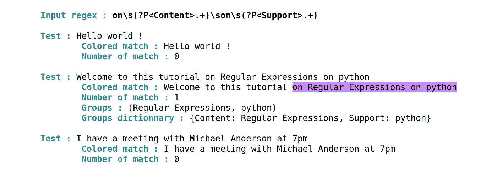

# 准备一个 Python 脚本，自己进行可视化测试

## (非强制性)

为了让这篇文章尽可能的有用和互动，我很快为你创建了一个小的 python 脚本。你将能够用清晰的视觉实时地**自己**测试任何你想要的东西。

如果你没有 python 或者只是想看帖子那么 [**你可以去下一节**](#16a7) 没有任何问题。本帖**中的图片展示了结果**。

首先，您将要做的所有测试都将位于一个您将命名为`file.json`的 **JSON 文件**中。你可以把你的正则表达式写在引号内`"Regular expressions" :`之后。注意，在 JSON 格式中，`\`是一个叫做**转义符**的特殊字符。所以你必须写一个双反斜杠`\\`。

动态结果将自动在控制台中**显示。因此，为了格式化我的文本，我创建了一个`class SGR`，代表“选择图形再现”。你可以在这里找到更多关于[如何格式化你的文本的信息。](https://en.wikipedia.org/wiki/ANSI_escape_code#SGR_parameters)**

最后一段代码用于**提取并在控制台**中显示从测试句子的正则表达式中编译的数据。这允许你有你在上面看到的渲染。有必要了解什么是 regex 才能更好的理解这个脚本。我对代码做了注释，所以你可以在读完这篇文章后再来看。

# 让我们从基础开始

假设我们正在寻找所有的**字母** "e *"* 。那么关联的正则表达式就是简单的`e`。如果我们寻找所有出现的字符串“el”，那么相关的正则表达式就是`el`。注意，正则表达式是区分大小写的。换句话说，`e`不同于`E`。

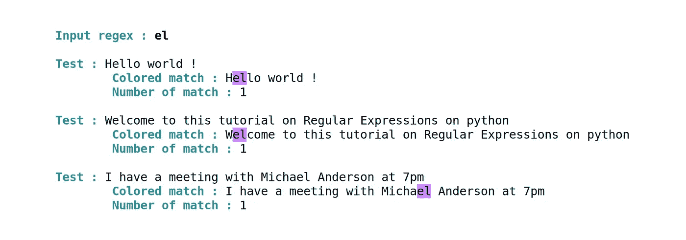

如果你同时使用了我上面的脚本或其他工具来测试，我邀请你尽可能多地自己尝试这个概念，例如，正则表达式`hello`或正则表达式`Welcome`。只有`Welcome`正则表达式会给出结果，因为它区分大小写。

# 范围

到目前为止，**没什么复杂的**，我们甚至可以不用正则表达式。正是从这一点开始，正则表达式引起了他们所有的兴趣。让我们想象一下，我们想要捕捉文本中所有的**元音**。我们不能编写 regex `aeiouAEIOU`(记住它是区分大小写的)来完成这个任务。所以我们不得不引入**区间**的概念。音程写在**方括号内[…]** 。为了匹配所有的元音，我们需要正则表达式`[aeiouAEIOU]`。如果我们必须对它进行人工解读，我们会说我们在寻找所有的字符“a”或“e”或“I”或“O”或“U”。

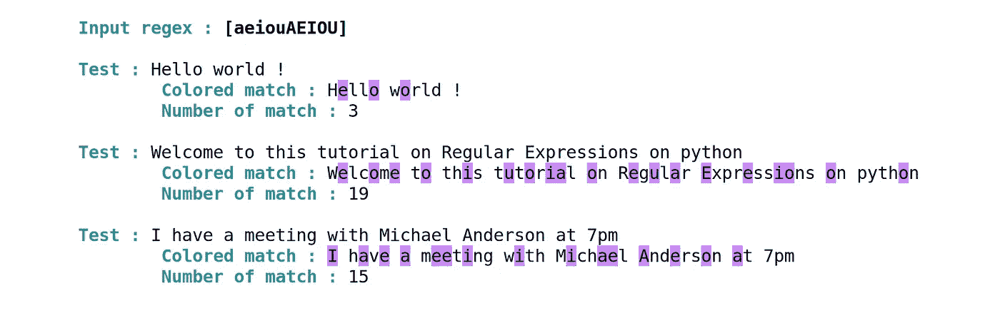

如果我们希望**所有大写字母**(大写)**从“D”到“W”**，我们将使用正则表达式`[D-W]`。

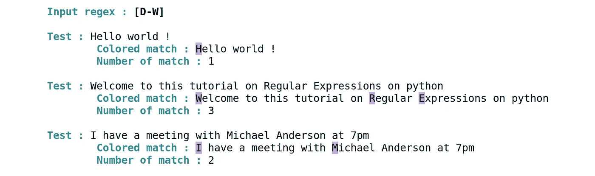

为了熟悉这个区间(或范围)的概念，你可以使用 [*附带的备忘单*](https://github.com/AxelThevenot/RegularExpressionPython/raw/master/RegEx%20Cheatsheet.pdf) 中的区间**尝试**出新的正则表达式。

# 字符类别

要用大写和小写说出字母表中的每个字母，必须写`[a-zA-Z]`。我承认付出了很多努力，但收效甚微。这就是为什么有不同的**类**可用于构建正则表达式:

*   为了替换`[a-zA-Z]`，(所有的字母)我们有`\w`，这相当于说我们想要**的任何单词字符**。
*   对于任何数字字符，我们有 T2 类。
*   `\s`相当于一个**空格字符。**
*   **换行**由`\n.`给出
*   而`.`意味着我们希望**占位符中的任意字符**(除了换行符`\n`)。

因此，如果我们想找到所有由空格包围的**双字单词，我们有正则表达式`\s\w\w\s`。**

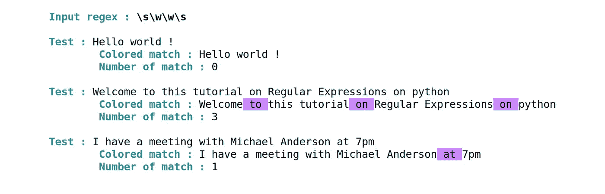

注意每个类都有它的**否定**。否定是用**大写**格式写的。也就是说，如果我们想要除了字母以外的所有东西，我们就必须写`\W` (注意`\W`也表示没有数字)。如果我们想捕捉除了数字以外的所有东西，我们可以使用`\D`类。同样适用于`\S`。

为了捕捉**三次任何不是单词或数字**字符的东西，我们可以选择`...\W`。

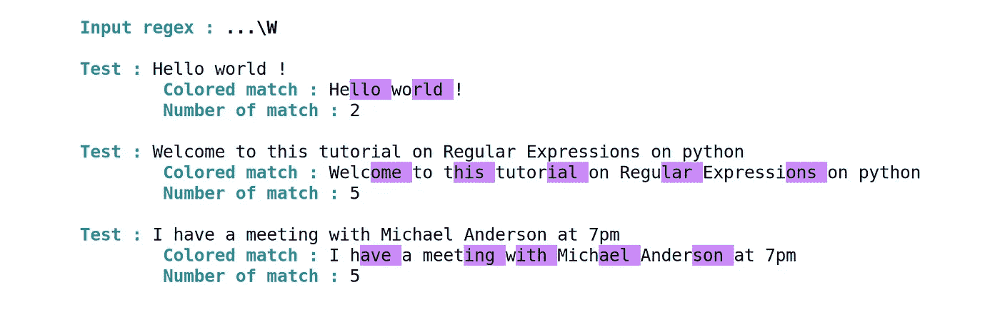

# **量词**

在前面的例子中，我们使用 regex `...\W`来获取不以字母结尾的 4 个字符的字符串。假设我们想要同样的东西，但是有 8 个字符。我们可以写`.......\W`,但是很明显你看到了其中的问题。最好的方法是**能够选择我们想要的重复次数**。这正是量词的作用。

给定在**括号{…}** 之间，量词**应用于其后的字符**。因此，为了让**每个空格后跟 4 个字的字符**，我们可以使用`\s\w{4}`。

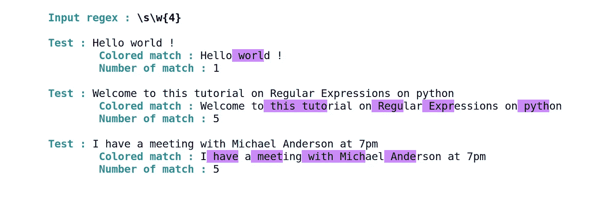

你也可以更进一步，选择**最小或最大重复次数**，或者询问重复间隔。对于两个到七个字母之间的单词，我们有正则表达式`\w{2,7}`。

还有其他的量词:

*   `+`允许我们指定 1 个或多个**等同于`{1,}`。**
*   `*`可以表示 0 或更多的**，相当于`{0,}`。**
*   **最后，`?`表示 **0 或 1 乘以**，与`{0,1}`相同。**

**为了演示它，让我们想象一下，由于某种原因，我们需要捕捉**每个空格，后跟最多 2 个任意字符，后跟另一个空格，然后是一个单词**。一个词当然包含至少一个字符(`+`量词)，所以我们必须检查所有对应于`\s.{,2}\s\w+`的模式。(**直写**但不一定要读)**

**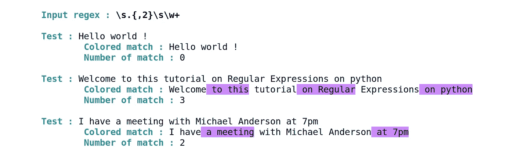**

**大量信息堆积起来。熟能生巧，所以你需要一开始就把小抄带在身边。在进入下一部分之前，让我们稍微休息一下，看看这只猫。我保证这一跳看起来很难，但其实并不难。**

**[资料来源:GIPHY](https://giphy.com/gifs/thumbnail-Jd5YlXOVTcQtW)**

# **组**

**接下来的部分将详细介绍 python 能做些什么。如果你看了我提供的代码，你会注意到有一个**组**的概念。为了简单起见，让我们假设我们想要提取问候“Hello”、“Welcome”和“Hey”。我们可以一个接一个地做 3 个正则表达式`[Hh]ello`、`[Ww]elcome`和`[Hh]ey`、T23。(注意，在这些正则表达式中，我们考虑到 a 可以以大写字母开头)。
但是我们可以**通过在**括号(…)** 之间建立一个所谓的组，并用一个**竖线|** 分隔，将这三个正则表达式**聚集成一个**。我们得到正则表达式`([Hh]ello|[Ww]elcome|[Hh]ey)`。****

**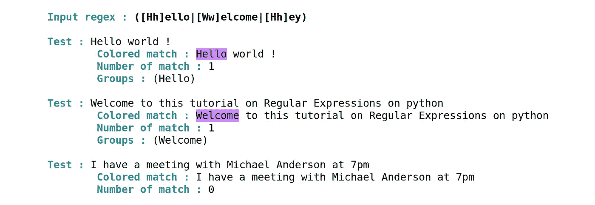**

**你可以在上面的图片上看到**组可以被 python 检测到**并返回。所以最大的好处就是**组可以作为变量返回**。你也可以使用**字典组**。也就是说，在 python 字典中返回给我们的组。只需更改组的开头，如斜体所示`(*?P<greetings>*[Hh]ello|[Ww]elcome|[Hh]ey)`。
所以你最终得到一个带有**键*问候语*** 的字典，从你的脚本中访问这场比赛，如下图所示。注意所有的**字典组都包含在组**中。**

**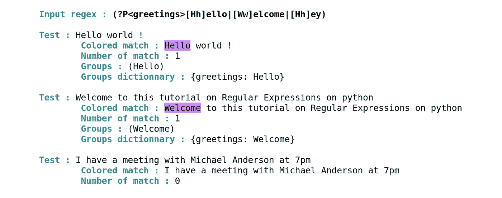**

**您也可以决定不使用`(*?:*[Hh]ello|[Ww]elcome|[Hh]ey)`格式返回组。但我再次邀请你**用这张纸自己试一下**。**

# ****断言****

**您还可以使用许多可能的断言，包括:**

*   **`^`表示一个字符串的开始**
*   **`$`为结尾或一串**
*   **`\b`象征一个字的边界**

**如果你现在想抓住所有以感叹号结尾的句子。然后就和要求一句话**从头到尾结尾带感叹号且不管中间是什么一样。**此处节录`**^.*!$**`**

**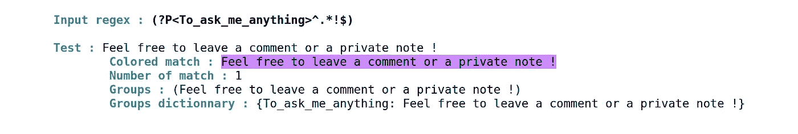**

**我刚发现做这个截图很有趣:)**

**还有其他一些需要更多关注的断言**

**为了总结正则表达式可以做的事情，我想通过一个例子来介绍其中的一个。这一部分的目的是复制下面的正则表达式。**不要慌**，它又长又丑。但是我敢打赌，我可以告诉你，一个正则表达式，从一部分来看，实际上并没有那么复杂。**

**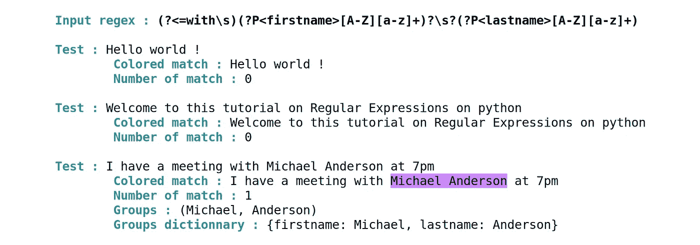**

**本部分的目的是回答以下问题:“**您与谁会面**”？
所以要回答这个问题，我们需要提取出**直接放在**前面的名字“with”。**这是一个断言**。从字面上来看，它是一个**正向后视**标记为**(?< =…)** 。积极是因为“是”而不是“不是”，回顾是因为“在前”而不是“在后”。**

**为了提取单词“with”(和一个空格字符)前面的内容，我们以 regex `(?<=with\s).*`结束。**

****

**因此，我们摘录了直接跟在“with”后面的内容。但是我们想知道这个人的名字。**

**那么让我们想象一个困难的情况，其中有一个“迈克尔-菲利普·约翰逊”。他的名字也可以写成:“M.-P”。或者“MP”或者“M”或者“M-P”。为了让**只有** **个大写字母或一个点或连字符，后面可能跟着小写字母****，我们使用了正则表达式`[A-Z\.\-]+[a-z]*`。(注意`.`是留给“任意字符”的。如果你真的想要一个点，你必须在前面加上转义字符`\`。对于`-`来说也是同样的想法。)****

****然后在 dictionary 中将这个组作为**返回，这个步骤很简单，我们可以在末尾添加一个`?`，因为名字也可以不写。并且加一个`\s`保证字尾。******

****我们得到`(?P<firstname>[A-Z\.\-]+[a-z]*)?\s`。**将**与我们已经拥有的东西串联起来:
我们得到`(?<=with\s)(?P<firstname>[A-Z\.\-]+[a-z]*)?\s`。****

****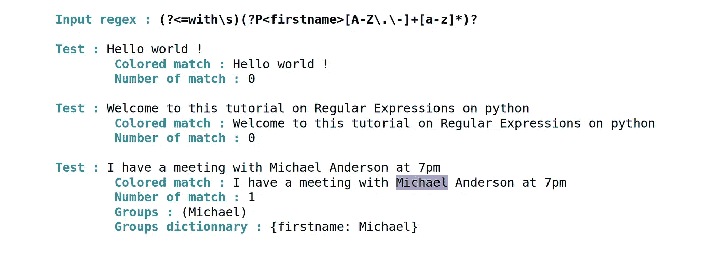****

****那么很容易！姓氏由一个大写字母和几个小写字母定义，因此我们可以编写`[A-Z][a-z]+`正则表达式。通过在 python 字典中添加 return，它变成了`(?P<lastname>[A-Z][a-z]+)`。
如果姓氏和“with”之间没有名字，则没有额外的空格。我们加一个`?`来保证这种情况。串联一切和 **Tadam！** `(?<=with\s)(?P<firstname>[A-Z\.\-]+[a-z]*)?\s?(?P<lastname>[A-Z][a-z]+)`****

****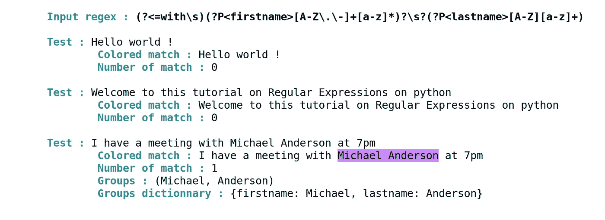****

# ****旗帜****

****最后还有**多面旗**。我不会解释如何使用它们，因为它们在不同的编程语言中有不同的用法。它们当然会出现在备忘单中。例如，如果您想要:****

*   ******忽略区分大小写**你可以使用 **I** 标志****
*   ******允许注释**和空格在正则表达式中你可以使用 **X** 标志****
*   ******允许多线**带 **M** 。****

****(python re 包中的例子)。****

********

> ****知识就是分享。
> **支持**我，一键获得**访问 [**中我所有文章的**。](https://axel-thevenot.medium.com/membership)******

****

# ****来源****

**[正则表达式操作](https://docs.python.org/3/library/re.html)，Python 文档**

**所有的图片和脚本都是自制的，可以免费使用。**

**这里是 [github 库](https://github.com/AxelThevenot/RegularExpressionPython/blob/master/README.md)你可以在那里找到脚本**

**[我的小抄又来了](https://github.com/AxelThevenot/RegularExpressionPython/raw/master/RegEx%20Cheatsheet.pdf)，免费的时候总是更好！🆓 🆓 🆓**