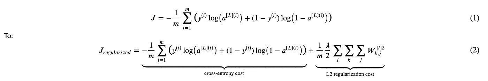
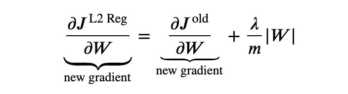
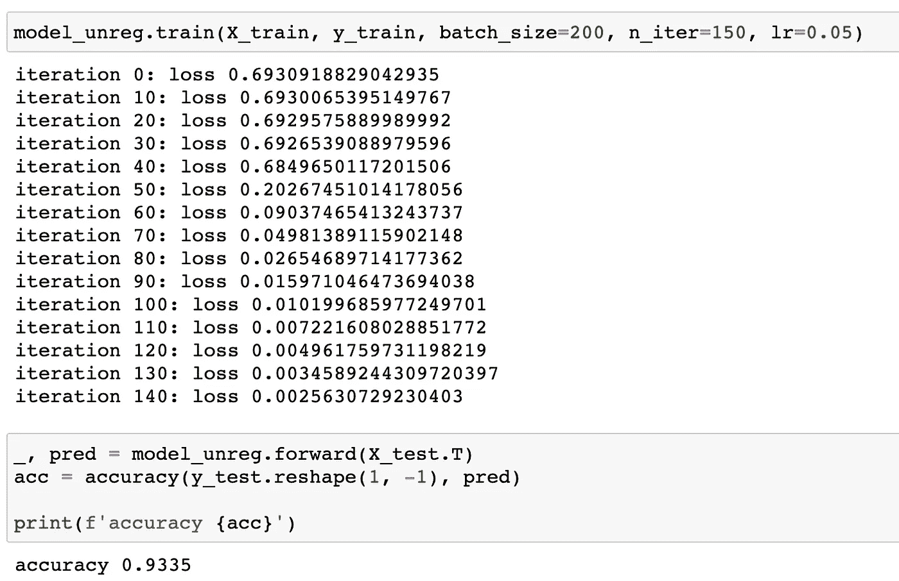
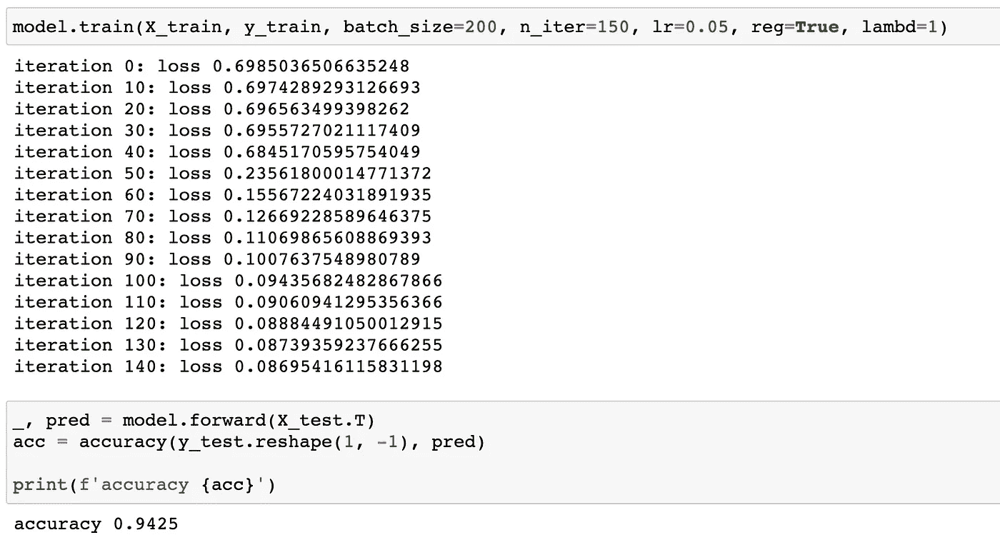
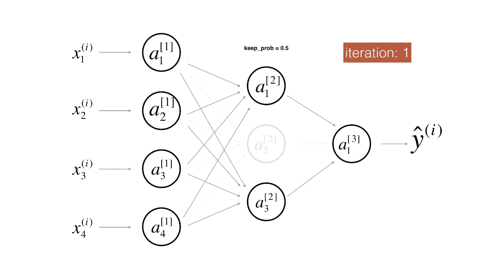
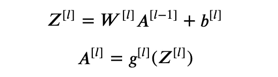
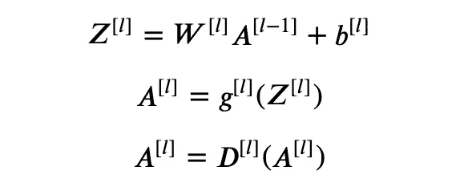
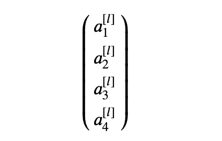
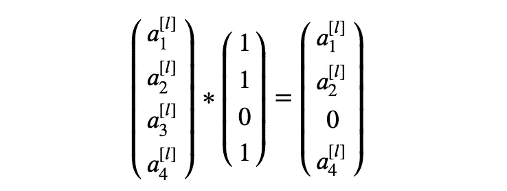

# 深度学习中的正规化和退出

> 原文：<https://towardsdatascience.com/regularization-dropout-in-deep-learning-5198c2bf6107?source=collection_archive---------28----------------------->

## 编码，这样你就能理解了

在上一篇[帖子](/code-a-deep-neural-network-a5fd26ec41c4)中，我们已经编码了一个深度密集的神经网络，但是为了拥有一个更好、更完整的神经网络，我们需要它更加健壮，能够抵抗过拟合。你可能听说过，深度神经网络中常用的方法是正则化和丢弃。在本文中，我们将一起理解这两种方法，并用 python 实现它们。

(我们将在下面直接使用上一篇文章中创建的函数，如果你对一些代码感到困惑，你可能需要查看上一篇[文章](/code-a-deep-neural-network-a5fd26ec41c4))

[法比奥](https://unsplash.com/@fabioha?utm_source=medium&utm_medium=referral)在 [Unsplash](https://unsplash.com?utm_source=medium&utm_medium=referral) 上拍摄的照片

# 正规化

正则化通过在损失函数的末尾增加一个额外的惩罚项来帮助防止模型过度拟合。

其中`m`是批量大小。所示的正则化称为`L2 regularization`，而`L2`将平方应用于权重，`L1 regularization`应用绝对值，其形式为|W|。

当有太多的重量或重量变得太大时，附加的额外项会扩大损失，并且可调因子λ强调了我们想要对重量进行多少惩罚。

## 1.为什么惩罚重量有助于防止过度拟合？

> 直观的理解是，在最小化新的损失函数的过程中，一些权重将降低到接近零，使得相应的神经元对我们的结果具有非常小的影响，就好像我们在具有更少神经元的更小的神经网络上训练一样。

## 向前

在正演过程中，我们只需要改变损失函数。

## 向后的

`L2 regularization`的后向传播实际上是直接向前的，我们只需要加上 L2 项的梯度。

## 培养

像往常一样，我们在一个二元分类案例上测试我们的模型，并比较有正则化和没有正则化的模型。

**没有正则化的模型**

**正规化模型**

实际上，当我们让`iteration`上升时，模型会继续过拟合，这导致除法运算中的错误，怀疑在前进过程中，结果`A`太接近 0。

相比之下，正则化模型不会过拟合。有关完整的实施和培训流程，请查看我的 [Github Repo](https://github.com/MJeremy2017/deep-learning/tree/main/regularization) 。

# 拒绝传统社会的人

Dropout 通过随机关闭一些输出单元来防止过拟合。

* *[来源]* *:[https://github.com/enggen/Deep-Learning-Coursera](https://github.com/enggen/Deep-Learning-Coursera)

在上述过程中，在每次迭代中，层[2]上的一些单元将被随机静音，这意味着在正向过程中工作的神经元将减少，从而简化了神经网络的整体结构。

同时，经过训练的模型将更加健壮，因为该模型不再依赖于任何特定的神经元(因为它们可能在此过程中被抑制)，所有其他神经元都需要在训练中学习。

## 向前

你可以把辍学看作是在前进的过程中增加了额外的一层。

在前面的课程中，我们有如下的正向方程式:

**无脱落**

其中`g`是激活函数。现在辍学的一个额外的层是适用于 A^[l].

**辍学**

其中`D`是漏失层。辍学层的关键因素是`keep_prob`参数，它指定了保持每个单位的概率。假设`keep_prob = 0.8`，我们有 80%的机会保持每个输出单元不变，20%的机会将它们设置为 0。

这个实现将会给结果`A`添加一个额外的遮罩。假设我们有一个包含如下四个元素的输出 A^{[l]}，

我们想让第三个单元静音，同时保留其余的单元，我们需要的是一个相同形状的矩阵，并做如下的元素乘法，

## 向前

下面有些模块是预导入的，要查看完整代码，请去我的 [Github Repo](https://github.com/MJeremy2017/deep-learning/tree/main/dropout) 。

这里我们将`D`初始化为与`A's`相同的形状，并基于`keep_prob`将其转换为 0 和 1 矩阵。

**注意，退学后，成绩** `**A**` **需要重新标度！**因为一些神经元在此过程中被抑制，相应地，左侧神经元需要被增强以匹配期望值。

## 向后的

反向过程是将同一个函数`D`屏蔽到对应的`dA`。

反向传播等式与我们在深度密集网络实施中介绍的等式相同。唯一的区别在于矩阵`D`。除了最后一层，所有其他有缺失的层将应用相应的蒙版`D`到`dA`。

**注意，在反向传播中，** `**dA**` **也需要重新缩放。**

培训和评估部分与辍学，如果你有兴趣，请检查我的 Github 上面的链接。

# 结论

正则化和丢失都是广泛采用的防止过拟合的方法，正则化是通过在损失函数的末端增加一个额外的惩罚项来实现的，而丢失是通过在正向过程中随机静音一些神经元来实现的，以使网络更加简洁。