# 深度学习中的正规化——L1、L2 和辍学

> 原文：<https://towardsdatascience.com/regularization-in-deep-learning-l1-l2-and-dropout-377e75acc036?source=collection_archive---------0----------------------->

## 深度学习中最重要的正则化技术的理论和实践指南

[https://www.spacetelescope.org/images/heic0611b/](https://www.spacetelescope.org/images/heic0611b/)

**正则化是一套技术，可以防止神经网络中的过拟合，从而提高深度学习模型在面对来自问题域的全新数据时的准确性。** **在本文中，我们将讨论最流行的正则化技术，它们被称为 L1、L2 和辍学。**

# 目录

1.  **重述:过度拟合**
2.  **什么是正规化？**
3.  **L2 正规化**
4.  **L1 正规化**
5.  **为什么 L1 和 L2 的正规化会奏效？**
6.  **辍学**
7.  **带回家的信息**

# 1.回顾:过度拟合

训练神经网络时最重要的一个方面是避免过度拟合。我们已经在这篇文章中详细讨论了[过度拟合的问题。](https://www.deeplearning-academy.com/p/ai-wiki-overfitting-underfitting)

**然而，让我们快速回顾一下:**过度拟合是指神经网络对训练数据建模非常好，但当它看到来自同一问题领域的新数据时失败的现象。过度拟合是由神经网络在训练期间拾取的训练数据中的噪声引起的，并将其作为数据的基本概念来学习。

www.memegenerator.net

然而，这种习得的噪声对于每个训练集是唯一的。一旦模型看到来自同一问题域的新数据，但不包含这种噪声，神经网络的性能就会变得更差。

*“为什么神经网络首先会拾取噪音？”*

之所以这样，是因为这个网络的复杂程度太高了。右边的图像显示了更高复杂度的神经网络拟合。

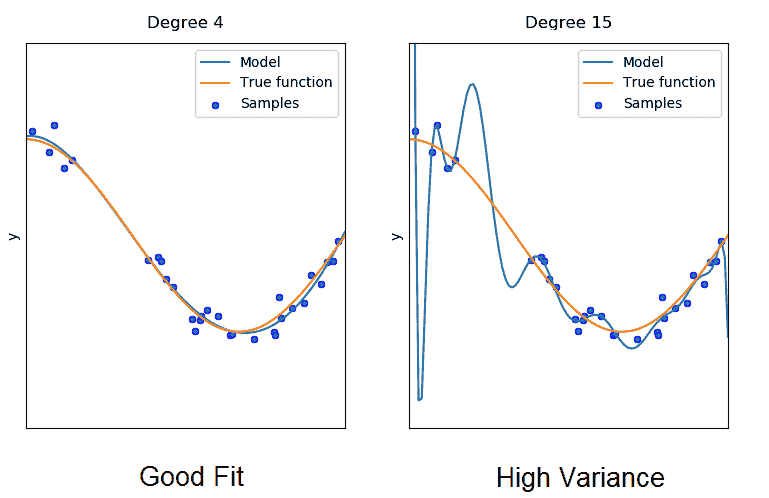

图表 1。具有良好拟合和高方差的模型。来源:[https://www.researchgate.net/publication/332412613](https://www.researchgate.net/publication/332412613)

具有较高复杂性的模型能够拾取和学习数据中由一些随机波动或误差引起的模式(噪声)。该网络将能够逐个模拟分布的每个数据样本，而不识别描述该分布的真实函数。

用真函数生成的新的任意样本将具有与模型拟合的高距离。我们也说这个模型有很高的方差。

另一方面，左侧复杂度较低的网络对分布的建模要好得多，因为它没有太努力地对每个数据模式进行单独建模。

> 在实践中，过度拟合导致神经网络模型在训练期间表现得非常好，但是当面对全新的数据时，在推理时间期间性能变得更差。

**简而言之:**不太复杂的神经网络不太容易过度拟合。为了防止过度拟合或高方差，我们必须使用所谓的正则化。

# 2.什么是正规化？

**简单来说:**正则化是指在训练过程中降低神经网络模型复杂性的一套不同技术，从而防止过拟合。

有三种非常流行和有效的正则化技术叫做*【L1】*、*和我们将在下面讨论的辍学。*

# *3.L2 正则化*

*L2 正则化是所有正则化技术中最常见的类型，通常也被称为权重衰减或乘坐回归。*

*这个正则化的数学推导，以及为什么这个方法在减少过拟合方面起作用的数学解释，是相当长且复杂的。由于这是一篇非常实用的文章，我不想过多地关注数学。相反，我想传达这项技术背后的直觉，最重要的是如何实现它，以便您可以在深度学习项目中解决过度拟合问题。*

*在 L2 正则化期间，神经网络的损失函数由所谓的正则化项扩展，这里称为**ω**。*

*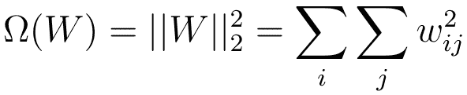*

*情商。1 正则项*

*正则项**ω**被定义为权重矩阵的欧几里德范数(或 L2 范数)，其是权重矩阵的所有平方权重值的总和。正则项由标量α除以 2 进行加权，并添加到为当前任务选择的正则损失函数中。这导致损失函数的新表达式:*

*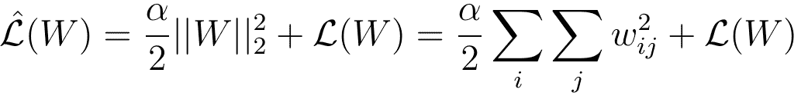*

*Eq 2。L2 正则化过程中的正则化损失。*

*Alpha 有时被称为**正则化率**，是我们引入神经网络的一个额外的超参数。简单地说，alpha 决定了我们正则化模型的程度。*

*在下一步中，我们可以计算新损失函数的梯度，并将梯度放入权重的更新规则中:*

*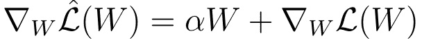**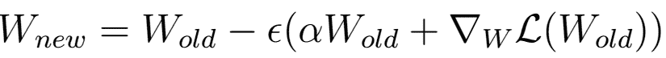*

*情商。3 L2 正则化过程中的梯度下降。*

*更新规则的一些重新表述导致了非常类似于规则梯度下降期间权重的更新规则的表达式:*

*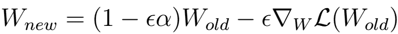*

*方程 4 L2 正则化期间的梯度下降。*

*唯一的区别是，通过添加正则化项，我们从当前权重中引入了额外的减法(等式中的第一项)。*

*换句话说，独立于损失函数的梯度，我们在每次执行更新时使我们的权重变小一点。*

# *4.L1 正则化*

*在 L1 正则化(也称为 Lasso 回归)的情况下，我们简单地使用另一个正则化项**ω**。该项是权重矩阵中权重参数绝对值的总和:*

*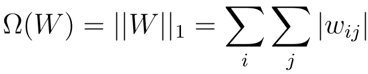*

*情商。5 L1 正则化的正则化项。*

*与前一种情况一样，我们将正则项乘以α，然后将全部内容添加到损失函数中。*

*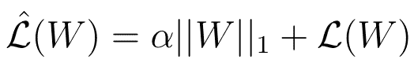*

*情商。6 L1 正则化过程中的损失函数。*

*新损失函数的导数导致以下表达式，旧损失函数的梯度和权重值的符号乘以α。*

*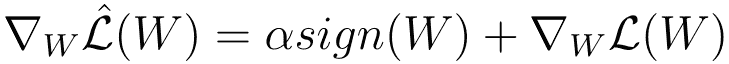*

*情商。7 L1 正则化期间损失函数的梯度。*

# *5.为什么 L1 和 L2 的正规化会奏效？*

*你现在可能会问自己的问题是:*

**“为什么所有这些有助于减少过度拟合问题？”**

*让我们来解决这个问题。*

*请考虑和函数的图，其中表示在 L1 期间执行的运算和在 L2 正则化期间执行的运算。*

*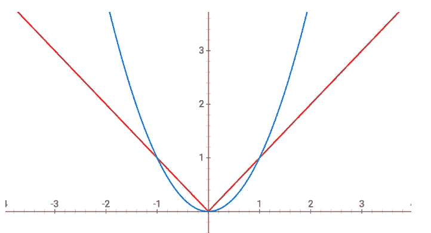*

*图表。2 L1 函数(红色)，L2 函数(蓝色)。来源:自制。*

*在 L2 正则化的情况下，我们的权重参数减小，但不一定变为零，因为曲线在零附近变得平坦。另一方面，在 L1 正则化期间，权重总是被强制向零。*

*我们也可以对此采取不同的、更加数学化的观点。*

**在 L2 的情况下，你可以考虑解一个方程，其中权重值的平方和等于或小于一个值* ***s*** 。 **s** 是正则项 **α** 的每个可能值的常数。对于仅仅两个权重值 **W1** 和 **W2** ，该等式看起来如下: **W1 *+ W ≤ s****

*另一方面， *L1 正则化可以被认为是一个等式，其中权重值的模之和小于或等于值* ***s*** 。这看起来像下面的表达式: **|W1| *+ |W2| ≤ s****

*基本上，引入的 L1 和 L2 正则化方程是约束函数，我们可以将其可视化:*

*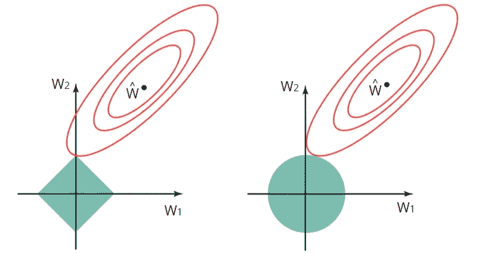*

*资料来源:统计学习导论，作者:加雷斯·詹姆斯，丹妮拉·威滕，特雷弗·哈斯蒂，罗伯特·蒂布拉尼*

*左图显示了 L1 正则化的约束函数(绿色区域)，右图显示了 L2 正则化的约束函数。红色椭圆是梯度下降过程中使用的损失函数的轮廓。在轮廓的中心，有一组最优权重，对于这些权重，损失函数具有全局最小值。*

*在 L1 和 L2 正则化的情况下，W1 和 W2 的估计值由椭圆与绿色约束区域相交的第一个点给出。*

*由于 L2 正则化具有圆形约束区域，所以相交通常不会出现在轴上，并且这对于 W1 和 W2 的估计将完全是非零的。*

*在 L1 的例子中，约束区域是带角的菱形。因此损失函数的轮廓通常会在轴上与约束区域相交。那么这种情况发生时，估计值之一(W1 或 W2)将为零。*

*在高维空间中，许多权重参数将同时等于零。*

# *5.1 正规化实现了什么？*

*   *执行 L2 正则化促使权重值趋向于零(但不完全为零)*
*   *执行 L1 正则化促使权重值为零*

*直观地说，较小的权重减少了隐藏神经元的影响。在这种情况下，这些隐藏的神经元变得可以忽略，神经网络的整体复杂性降低。*

***如前所述:**不太复杂的模型通常会避免对数据中的噪声进行建模，因此不存在过度拟合。*

*但是你必须小心。当选择正则项 **α时。**我们的目标是在模型的低复杂性和准确性之间取得适当的平衡*

*   *如果你的阿尔法值太高，你的模型会很简单，但是你会冒*对数据*拟合不足的风险。您的模型无法从训练数据中获得足够的信息来做出有用的预测。*
*   *如果你的 alpha 值太低，你的模型将会更复杂，你将会面临数据过度拟合的风险。您的模型将会了解太多有关训练数据的特殊性，并且无法推广到新数据。*

# *6.拒绝传统社会的人*

*除了 L2 正则化和 L1 正则化，另一个著名的和强大的正则化技术是所谓的辍学正则化。辍学调整背后的程序非常简单。*

*简而言之，辍学意味着在训练期间，神经网络的一个神经元以某种概率在训练期间被关闭。让我们看一个直观的例子。*

*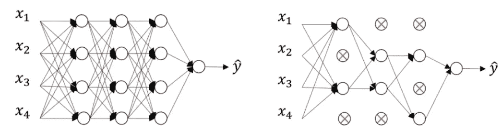*

*图表 3。有脱失(右)和无脱失(左)的神经网络。来源:机器学习研究杂志 15 (2014)*

*假设在左侧，我们有一个无丢失的前馈神经网络。假设一个随机神经元在训练过程中被关闭的概率为 **P=0.5** ，使用 dropout 将导致神经网络位于右侧。*

*在这种情况下，您可以观察到大约一半的神经元是不活跃的，并且不被视为神经网络的一部分。如你所见，神经网络变得更简单了。*

*神经网络的更简单版本导致复杂性降低，从而可以减少过拟合。在每个前向传播和权重更新步骤应用具有一定概率 **P** 的神经元的去激活。*

# *6.带回家的信息*

*   *过度拟合发生在更复杂的神经网络模型中(许多层、许多神经元)*
*   *通过使用 L1 和 L2 正则化以及丢弃，可以降低神经网络的复杂度*
*   *L1 正则化迫使权重参数变为零*
*   *L2 正则化迫使权重参数趋向于零(但从不精确为零)*
*   *较小的权重参数使一些神经元可以忽略→神经网络变得不太复杂→较少过拟合*
*   *在退出期间，一些神经元以随机概率 **P** →神经网络变得不那么复杂→更少的过拟合*

**最初发表于*[*https://www.deeplearning-academy.com*](https://www.deeplearning-academy.com/p/ai-wiki-regularization)*。**