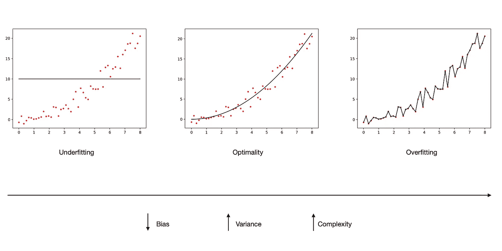
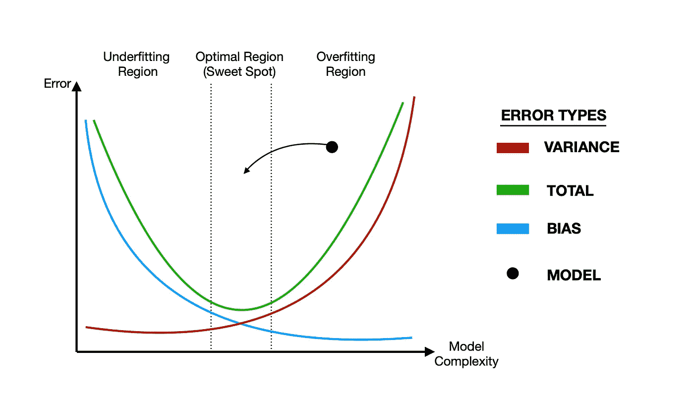
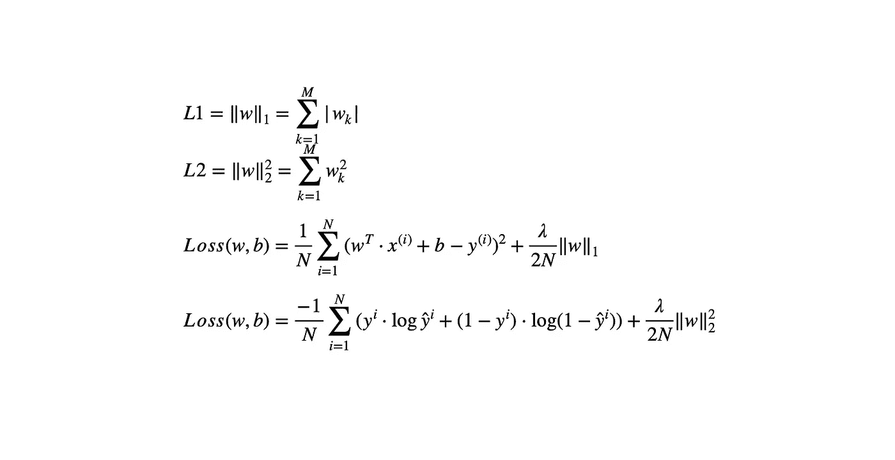

# 机器学习中的正则化

> 原文：<https://towardsdatascience.com/regularization-in-machine-learning-7f85f64ff8e8?source=collection_archive---------48----------------------->

灯塔和大海，由戈克图·古韦尔辛拍摄

# 介绍

在这篇文章中，我们主要关注机器学习中正则化的四个基本方面。

*   什么是正规化？
*   正规化是用来做什么的？
*   正则化如何解决过拟合问题？
*   关于偏差和方差误差的背景信息，以理解前面的三个要点。

本文从理论层面分析了正则化的这四个不同方面，并对它们进行了概述。在下一篇文章中，我们将探讨应用于线性回归的三种常见正则化技术，并展示正则化项如何影响空间世界中的优化算法，以提供关于它的几何直观。

# 1)背景信息

在训练标准的机器学习模型时，我们试图做的是使数据集的基础事实标签和模型对它们的预测尽可能彼此接近。这个操作是在我们为我们的问题选择的损失函数上执行的，它倾向于增加模型在训练集上的准确性，同时最小化总误差中的**偏差**。

> 机器学习模型对其预测能力产生的总误差由三个值组成，分别是**偏差**、**方差**和**不可约误差**。偏差定义为预测值与正确标签的差异程度。

然而，这种趋势有时会导致 ML 模型记住数据集分散在多维空间中的模式，而不是理解并由此推广到该模式，这被称为**过拟合**。这是完全不理想的情况，因为模型实际上不会从数据中学习必要的东西，当我们在看不见的数据集上测试它时，它很可能会失败。此外，经历过拟合的 ML 模型变得如此复杂，因此；它们的**方差**在总误差上最大化。

> **方差**是我们总误差中的第二项，它指的是模型对数据集的敏感度的大小。换句话说，如果一个模型的性能很容易受到数据集微小变化的影响，那么这个模型将会高度适应它。这是过度拟合的模型在未知测试集中失败而在训练集中成功的主要原因。

下图实际上是上面给出的所有解释的总结，它旨在提供关于上下文的洞察力。

模型的训练过程，作者:goktu gu vercin

# 2)正规化

在这一点上，正规化进入画面。正则化能够消除过度拟合，因此；提高模型质量。尽管其最常见的实践是在线性回归上观察到的，但它也适用于逻辑回归模型，以及遭受过拟合的人工神经网络。

正则化意在给目标 ML 或 DL 模型的代价函数增加额外的项。这个附加项的确切作用是防止优化算法(如梯度下降)达到最小化偏差误差的权重值。换句话说，它会给模型增加额外的偏置误差。这样，大量的方差误差被消除，模型摆脱了过拟合，并获得了超过其预测能力的泛化能力。下图也展示了这一过程。

规则化图，作者:goktu gu vercin

如正则化图中所示，为了最小化偏差误差，该模型倾向于放弃观察到总误差量最低的最佳点，并落入过拟合区域。正则化牺牲了少量的偏差；然而，在这种方式下，它通过减少大量的方差来实现将模型重新定位在最佳点。换句话说，在训练过程中，加入到代价函数中的正则项总是使模型保持在最佳状态；然而，如果我们在损失函数中不使用该项，模型可能会在过拟合区域结束。

正则项通常有两种不同的类型，称为 L2 和 L1。L2 项是多维空间中模型权重所在的原点和位置之间的欧氏距离，而 L1 项指的是同一事物，只是距离的计算方法不同，实际上是曼哈顿距离。在下图中，L2 和 L1 正则化项分别用逻辑回归和线性回归的损失函数进行了演示。

正规化术语，作者:goktu gu vercin

当优化算法试图达到损失曲线上的全局最小点时，它们实际上减少了这些损失函数中的第一项，即求和部分的值。然而，与此同时，权重向量的长度有增加的趋势；因此，正则项的值上升。优化算法必须在求和项和正则项之间建立平衡；不可能同时降低这两个值。超参数 lambda (λ)用于调整这种平衡，并决定哪一个更占优势。这种平衡，实际上也指上面提到的偏差-方差权衡。换句话说，正则化项表现得像手刹，正因为如此，正则化还能够缩小学习模型的权重，从而减少由于大权重的存在而在模型上观察到的不稳定性。

在这篇文章中，我们必须涵盖的最后一个要点是，为什么正则化项没有 bias ( *b* )参数，并且只在权重上定义。事实上，我们也可以通过偏差( *b* )参数来正则化我们的学习模型；没有限制，它必须进行公正的重量。然而，没有必要这样做，因为学习模型通常容纳大量的权重，并且与权重向量相比，在参数 *b* 上正则化模型对模型的贡献非常小。

## 结论

我希望我能提供关于正规化运作的有益信息。如果帖子里有不清楚的地方，可以在评论里提一下。应用于线性回归和几何直觉的最常见的正则化技术将在下一篇文章中讨论。