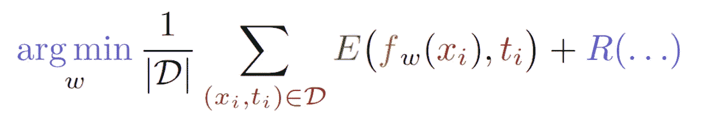

# 机器学习中的正则化

> 原文：<https://towardsdatascience.com/regularization-in-machine-learning-b73bc486162a?source=collection_archive---------69----------------------->

## 让深度神经网络泛化的关键。

在 [Unsplash](https://unsplash.com?utm_source=medium&utm_medium=referral) 上由 [Daiga Ellaby](https://unsplash.com/@daiga_ellaby?utm_source=medium&utm_medium=referral) 拍摄的照片

在本文中，我将讨论正则化的概念、正则化方法的分类以及正则化策略的具体例子。

本质上，正则化增加了模型拟合过程的偏差，以防止过度拟合。正则化背后的直觉是，如果我们有一个非常丰富的*模型类*，例如大型神经网络，我们希望将我们的学习过程限制为仅在该类的子集上搜索，该子集包含具有所需属性(例如某种程度的简单性)的模型。这种限制是一种偏见。希望是，如果我们明智地选择子集(我们通过适当的正则化来做到这一点)，我们将找到一个比我们查看整个模型类更好的模型。

假设我们考虑的模型类是线性回归类，并且我们正在尝试拟合样本数少于输入要素数的数据集。因为我们想要拟合的参数数量(=特征数量)大于样本数量，所以我们有一个不适定的问题，我们的类中可能有许多模型可以解决回归问题。我们可以通过施加 L2 正则化来限制这一类，即在误差项中添加 *w* ，其中 *w* 是我们的回归权重。通过这种方式，我们将在任何同等精确的权重集合中选择权重最小的解决方案。

正则化是一个比深度学习古老得多的概念，也是经典统计学不可或缺的一部分。它可以说是推动最近机器学习热潮的最重要的技术集合之一。尽管如此，当使用术语“正则化”时，我们通常并不完全清楚我们的意思，并且存在几个相互竞争的定义(例如 [Goodfellow 等人的](https://www.deeplearningbook.org/contents/regularization.html))。在本文中，我将采用可能是最广泛的一种方法——kuka ka 等人的方法[:](https://arxiv.org/abs/1710.10686)

> 定义 1:正则化是任何旨在使模型更好地泛化的补充技术，即在测试集上产生更好的结果。

乍一看，这似乎太笼统而没有用，但是作者也提供了一个分类法来理解这个定义所包含的大量正则化方法。这种分类法的概述如下。

## 正则化分类法

在查看模型拟合过程时，[kuka ka 等人](https://arxiv.org/abs/1710.10686)确定了以下部分，每个部分都与偏置学习的方式相关联，即，调整。

经验风险最小化。可正则化的部分是-紫色:优化，红色:训练集，绿色:误差项，棕色:模型族，蓝色:正则化项。

基于上面的经验风险优化公式，我们可以正则化:
1。训练设置
2。模范家庭
3。误差项
4。正则项
5。优化程序

## 训练集

满足上述定义 1(即有助于实现更好的测试误差)的我们的数据的任何预处理或增加(随机的或确定的)都属于这一类。突出的例子是不平衡数据集的过采样或欠采样、图像识别中的[数据增强](https://journalofbigdata.springeropen.com/articles/10.1186/s40537-019-0197-0)，以及具有对立例子、[退出](https://arxiv.org/abs/1207.0580)和[批处理形式](https://arxiv.org/abs/1502.03167v3)的[训练。后两种可能看起来令人惊讶，但它们可以被视为中间网络层创建的表示空间中的数据转换。](https://arxiv.org/abs/1312.6199)

扩大训练集是一种简单的方法，可以消除数据中的特定偏差，而不必提出更复杂的模型——图像识别文献表明它确实有效！缺点是，这些技术通常会增加训练集的大小，这意味着需要在训练上花费更多的资源，并且必须小心不要创建与任务无关的样本。

## 模范家庭

选择我们模型的正确结构可能通常不被称为正则化，但它也是一种提高泛化能力的方法，因此它符合定义。

如果你曾经使用过神经网络，你会知道超参数调整可能是得到一个好模型的最乏味的部分。选择层数和每层神经元的数量，甚至只是定义搜索哪些不同的设置都可以被视为正则化。你实际上是将所有可能的神经网络的搜索空间限制在对你有意义的配置上。人类的直觉在这里发挥作用，这或许是深度学习有时被比作艺术或黑魔法的原因。

比调整网络中的元素数量更令人兴奋的是定义网络的结构:卷积层、LSTMs、T2、softmax 层、T4、注意力层、T5 等等，不胜枚举。我们不要忘记 convnets 在[使 DNNs 适用于](https://www.mitpressjournals.org/doi/abs/10.1162/neco.1989.1.4.541)图像识别中发挥了至关重要的作用！

## 误差项

当然，选择正确的误差项也会影响模型在测试集上的性能。*均方误差*可能是最流行的误差项，但是*交叉熵*也很流行，例如对于[自然语言任务](https://arxiv.org/abs/1810.04805) s，或者某些[类不平衡独立损失](https://pdfs.semanticscholar.org/df27/dde10589455d290eeee6d0ae6ceeb83d0c6b.pdf)。这些错误术语概括了关于任务、数据以及好的解决方案是什么样子的假设。

## 正则项

*正则化术语*大概就是大多数人说正则化的意思。这是一个修正误差项*而不依赖于数据*的项。数据的这种独立性意味着正则项仅用于偏置模型参数的*结构*。

可能最流行的正则化术语是网络上的 L2 范数或回归权重，也就是深度学习中的 [*权重衰减*](https://www.semanticscholar.org/paper/Experiments-on-Learning-by-Back-Propagation.-Plaut-Nowlan/4a42b2104ca8ff891ae77c40a915d4c94c8f8428) 和经典统计学中的*岭回归*的定义特征。这种 L2 正则化是吉洪诺夫正则化的一种特殊形式，实际上是模型权重的零均值高斯先验，这意味着我们倾向于使用较少而不是较多特征的解决方案，并且不会过度依赖任何特征。这潜在地消除了冗余特征，并产生了更简单的模型。为了进一步增加权重的稀疏性，可以使用 L1 范数(套索回归)。

其他正则化项针对例如输入上的[梯度，或者输入-输出映射](/the-many-uses-of-input-gradient-regularization-e2af244e6950)的[函数属性。](https://arxiv.org/pdf/1206.5538.pdf)

正则化术语通常是一种定义模型外观的优雅方法，因为它们可以以即插即用的方式使用，并且对任何数据集都一样。它们通常会稍微增加超参数调整的工作量，因为通常需要定义一个参数来衡量正则项和误差项的贡献。

## 优化程序

优化过程是一种有趣的，但经常被忽视的正则化方法。改变优化器和学习速率显然对学习什么模型有影响，但是这种影响是什么通常不直观地清楚。一些[有趣的最近结果](https://www.nature.com/articles/s41467-020-14663-9)显示 SGD 实际上可能是一个重要的正则化子，这可能有助于[解释为什么深度神经网络像它们一样泛化](https://arxiv.org/abs/1611.03530)(尽管被极大地过度参数化)。

本文到此为止，希望你学到有用的东西！请务必查看 Kukač ka 等人介绍分类学的论文，如果您对泛化和正则化感兴趣，也可以看看张等人非常容易理解的“[理解深度学习需要重新思考泛化](https://arxiv.org/abs/1611.03530)”。