# 正则化:机器学习

> 原文：<https://towardsdatascience.com/regularization-machine-learning-891e9a62c58d?source=collection_archive---------8----------------------->


照片由 [Alex wong](https://unsplash.com/@killerfvith?utm_source=medium&utm_medium=referral) 在 [Unsplash](https://unsplash.com?utm_source=medium&utm_medium=referral) 上拍摄

## 过度拟合模型、模型类型、数学和执行的解决方案。

# 简介:

为了理解正则化的概念及其与机器学习的联系，我们首先需要理解我们为什么需要正则化。我们都知道机器学习是用相关数据训练一个模型，并使用该模型预测未知数据。“未知”一词意味着模型尚未看到的数据。我们已经训练了这个模型，并且在使用训练数据时取得了不错的成绩。但是在预测的过程中，我们发现该模型与训练部分相比表现不佳。现在，这可能是一种过度拟合的情况(对此我将在下面解释),这导致了模型的不正确预测。在这种情况下，规范化模型有助于解决问题。

# 背景:

在本文中，我们将讨论以下主题:

1.  ML 中欠拟合和过拟合是什么意思？
2.  如何解决不合身的问题？
3.  正则化及其背后的数学介绍。
4.  正规化的类型(L1 和 L2)。
5.  正规化和交叉验证。

# 欠配合和过配合的问题:

这里是贯穿本文的 Jupyter 笔记本 的 [**链接。请并排浏览以彻底理解这篇文章。**](https://github.com/Gokul-S-Kumar/Regularization.git)

考虑线性回归的情况。我们将生成一些数据来处理。然后，数据将被分成训练和测试数据。

生成的数据如下所示:

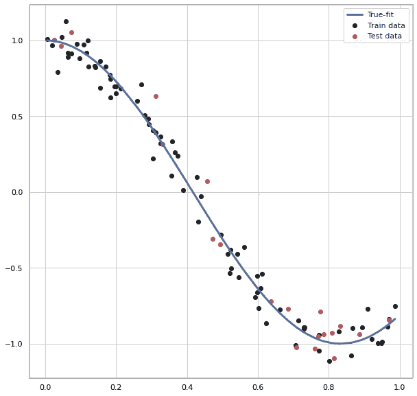

图一。生成的数据

我们已经将生成的总数据的 20%分割成测试数据。真实拟合函数是我们生成数据所基于的函数。添加噪声是为了模拟真实世界的数据(因为实际上没有数据会完全符合函数)。

了解欠拟合和过拟合涉及在具有不同程度的假设方程的模型上训练数据。让我们从一个具有 1 次的**假设方程的模型开始，它将是:**

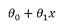

这是回归线的样子:

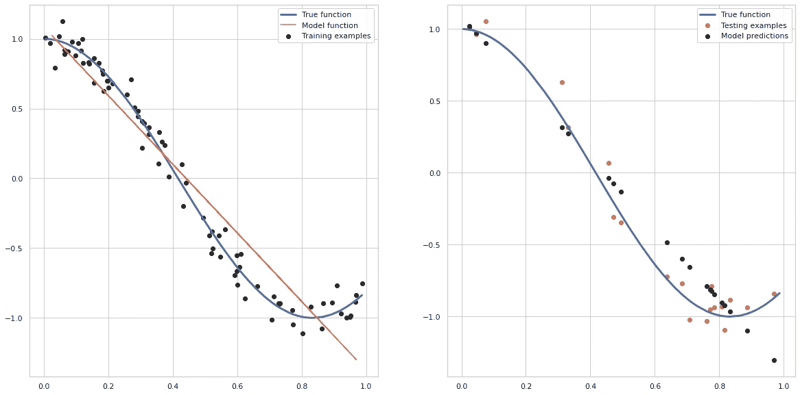

图二。使用一次方程式。

这是**欠拟合**的一个例子，因为我们可以看到，这条线对数据的拟合程度不足以让我们使用模型进行未来预测。训练和测试精度和误差值如下:

```
train accuracy 0.9276025053551601
test accuracy 0.9259414382942455
Training MSE: 0.040338393489346015
Test MSE: 0.04068556089245825
```

欠拟合问题也称为**‘高偏差’**问题。这两者都意味着该模型不太适合训练数据。偏差一词指的是模型有一个强烈的先入为主的观念，即 y 随 x 线性变化，尽管事实并非如此。

现在，我们可以尝试用二次函数来拟合数据。假设是这样的:

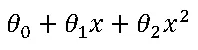

该模型可以被可视化为:

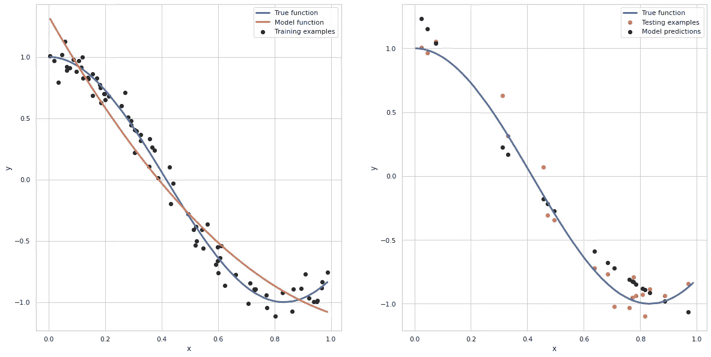

图三。使用二次方程

我们可以看到，该模型在拟合训练数据方面工作得非常好。训练和测试精度和 MSE 值为:

```
Train accuracy: 0.9541558552139953
test accuracy 0.9421659027644554
Training MSE: 0.02554341363098832
Test MSE: 0.031772324908036456
```

与以前的模型相比，精确度有所提高。这意味着更加合适。

由于增加阶数似乎会提高模型的性能，因此让我们尝试使用一个假设方程阶数为 20 的模型。这将是结果:


图 4。使用 20 次方程

哎呀！模型函数似乎被扭曲了。这是因为高度使其更灵活，从而允许其在拟合时将噪声纳入数据中。模型函数试图通过所有点，因此看起来失真。

我们把这个问题叫做**【过拟合】**，它有**【高方差】**。术语“高方差”背后的原因是，如果我们要拟合这样一个高阶多项式，那么该假设几乎可以拟合任何函数，即不同类型的可能假设非常大且变化太大，以至于我们没有足够的数据来约束它以得到一个完美的假设。

我们可以通过检查交叉验证分数或 MSE 值来决定过度拟合的问题。我绘制了上述数据的精确度和 MSE 值，这些数据的假设方程的度数从 1 度到 40 度。

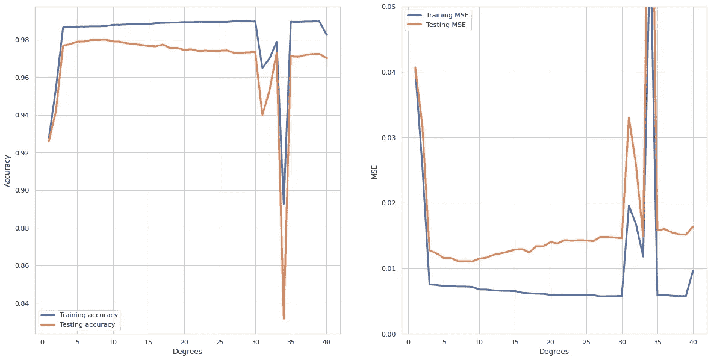

图五。精确度和 MSE 值。

我们可以看到，在一定程度(具体来说是 9)之后，测试 MSE 似乎增加了，而训练 MSE 继续减少。当模型由于过度拟合而无法预测看不见的数据时，就会发生这种情况。

使用 9 次方程，我们得到以下模型函数:

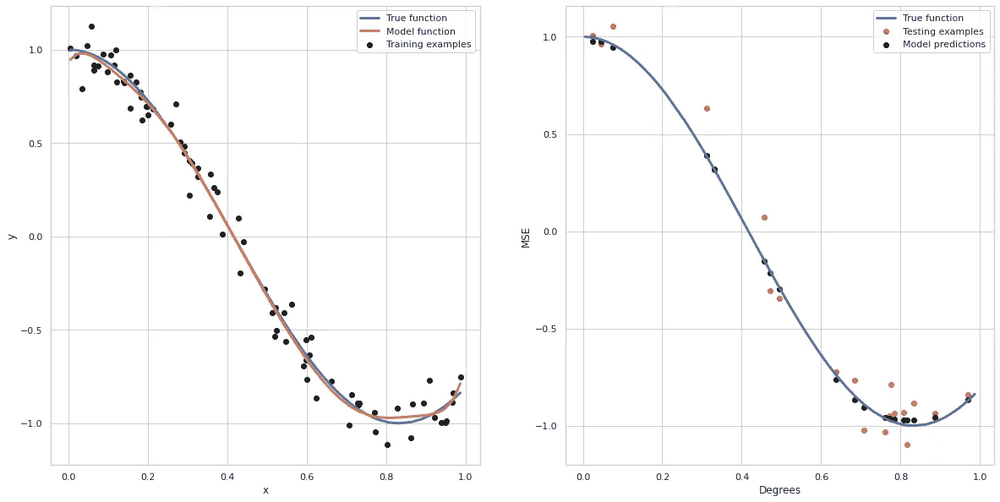

图六。用一个 9 次方程。

如果我们有太多的特征，过度拟合也会发生，这是当我们增加函数的次数时间接发生的。已学习的假设可能非常适合训练集(在某种程度上，成本值将为零)，但无法预测新的示例。同样的概念也适用于**逻辑回归**，这里考虑的是决策边界而不是回归线。

# 解决过度拟合问题:

大多数真实世界的数据集将具有大量的要素。如果我们有很多特征，但只有很少的训练数据，那么就会出现过度拟合。解决过度拟合有两种主要方法:

1.  **减少特征数量**:这可以通过手动减少特征数量来实现。我们可以在训练数据之前做一些 EDA 和特征选择，以知道哪些特征要保留，哪些要丢弃。我们还可以使用自动选择特征的模型选择算法。这种方法的缺点是，通过删除某些特征，我们删除了关于问题的信息。
2.  **正则化**:该方法保留了所有特征，但降低了假设参数的幅度。当所有参数都对标签的预测有贡献时，这种方法工作良好。

# 正规化介绍:

考虑一下我们上面看到的数据拟合 10 次函数的情况。假设是这样的:

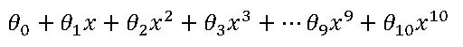

如果我们惩罚θ_ 10 并使其非常小(几乎等于零),那么假设将被简化为 9 次方程，这将是如上所示的数据的最佳拟合。

这是正则化背后的一般思想。我们不是减少一个参数，而是惩罚所有的参数。这将产生一个更简单的假设，它不容易过度拟合。

# 线性回归的正则化成本函数；

对于任何不熟悉线性回归背后的数学的人，请参考下面我以前发表的故事。它还会让你对以后要用到的术语和变量有所了解。

[](/univariate-linear-regression-theory-and-practice-99329845e85d) [## 一元线性回归-理论与实践

### 简介:这篇文章解释了一元线性回归的数学和执行。这将包括数学…

towardsdatascience.com](/univariate-linear-regression-theory-and-practice-99329845e85d) 

任何回归模型的成本函数由下式给出:

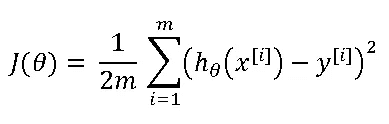

为了将正则化添加到模型中，成本函数被稍微修改为:

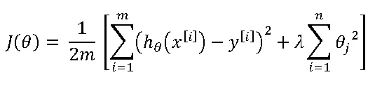

在哪里

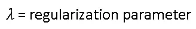

Lambda 的目的是在限制参数值的同时为训练数据提供良好的拟合，从而保持假设相对简单，以避免过度捕捞。换句话说，我们正在给过度拟合的成本函数(趋于零)添加一个小的偏差，以防止它过度捕捞。通过增加少量的偏差，我们得到了方差的显著下降。

考虑 10 度假设的情况。如果我们把λ的值设得很高，比如说λ=⁰⁰.，会发生什么所有的参数 theta_1 到 theta_10 将被高度减少到假设将是:

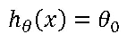

该曲线在绘制时将是一条水平直线，因此与我们的数据拟合不佳。因此，为了使正则化工作良好，还应该小心选择λ的值。

# 线性回归的正则梯度下降；

没有正则化的线性回归的梯度下降由下式给出:

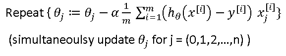

成本函数的偏导数将由于包含正则化而改变，正则化产生如下梯度下降方程:

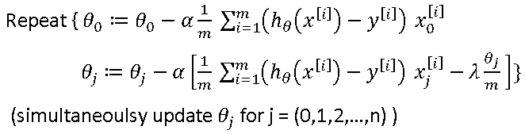

我已经单独写了θ_ 0，因为它不包括在正则化参数的总和中。这可以简化为:

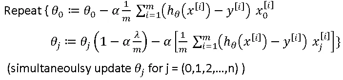

因为α、λ和 m 是正的:

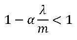

因此，当应用梯度下降时，每次θ_ j 的值将从θ_ j 的较低值减小，比如 0.99 *θ_ j。这有助于在梯度下降的每次迭代之后收缩θ的值。

# 正规化的类型:

主要有两种类型的正则化技术:

1.  L1 正则化或套索回归。
2.  L2 正则化或岭回归。

# 岭回归:

我们上面讨论的所有数学都与岭回归有关。它的成本函数是


下面的图是通过用不同的λ值将 20 次方程拟合到我们上面使用的数据而得到的。

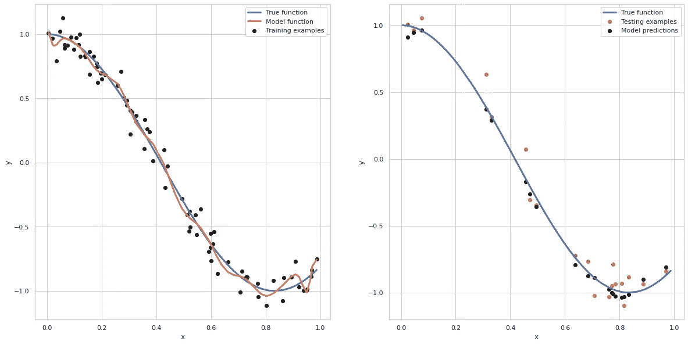

图七。λ= 0 的岭回归

我们可以看到，对于λ= 0，使用 20 次方程的过拟合线性回归没有变化。

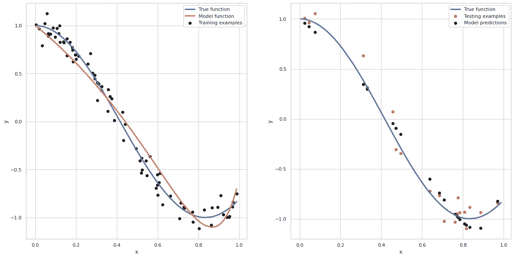

图八。λ= 0.5 的岭回归

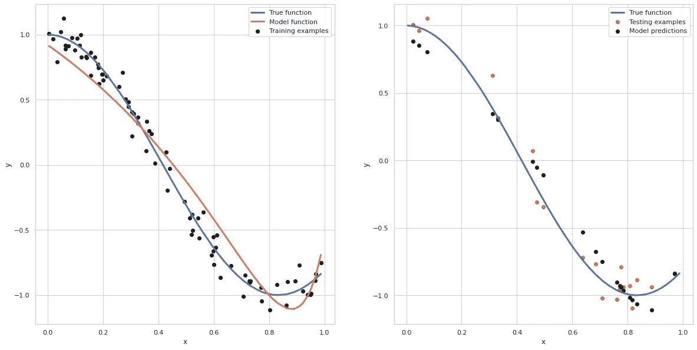

图九。λ= 1 的岭回归

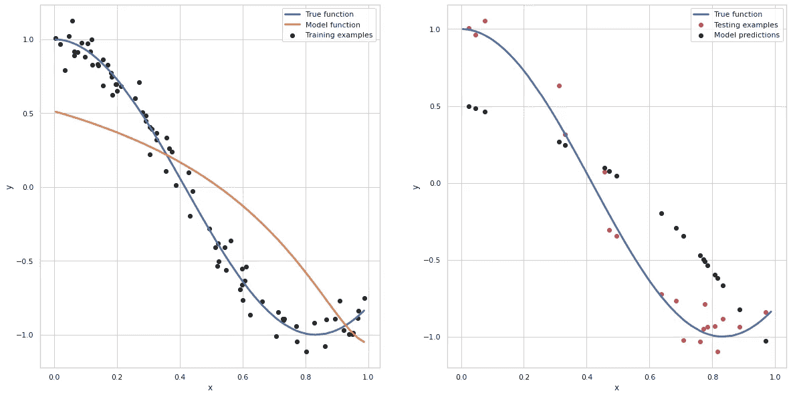

图 10。λ= 10 的岭回归

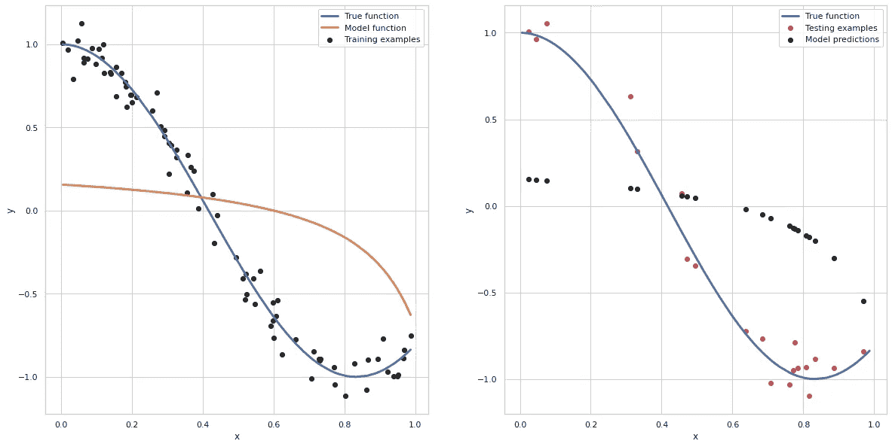

图 11。λ= 100 的岭回归

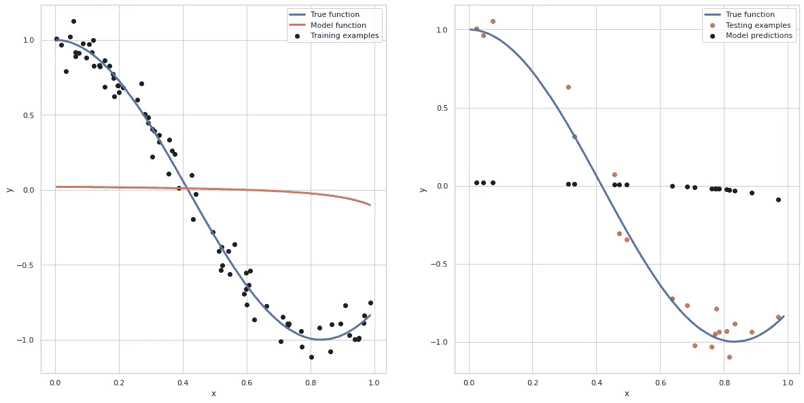

图 12。λ= 1000 的岭回归

我们可以看到，随着λ值的增加，这条线逐渐平行于 x 轴。这是对上述论点的直观证明，其中λ的值很大，从而将假设减少到只有θ_ 0。获取 lambda = 10000 的参数值。

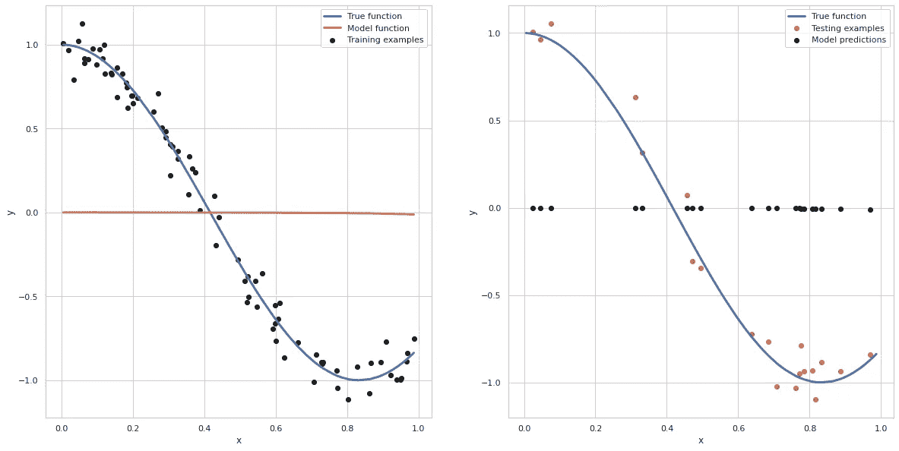

图 13。λ= 10000 的岭回归

```
Parameters: [ 7.59298747e-05 -1.59864470e-03 -1.48732636e-03 -1.24979159e-03
 -1.04968203e-03 -8.94986923e-04 -7.75465974e-04 -6.81440074e-04
 -6.05849341e-04 -5.43793075e-04 -4.91877768e-04 -4.47723687e-04
 -4.09631866e-04 -3.76365596e-04 -3.47007135e-04 -3.20862795e-04
 -2.97399119e-04 -2.76199260e-04 -2.56932649e-04 -2.39333548e-04
 -2.23185647e-04]
```

我们可以看到参数趋向于零，并且有不同的值。

岭回归用于训练样本的**大小小于**的情况，从而通过减少方差来防止模型过度拟合训练数据。

# 套索回归:

套索回归与岭回归非常相似。在成本函数中有一个微小的修改，它将是:

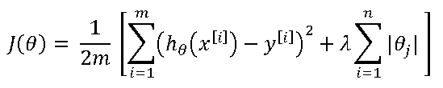

我们将使用参数的模之和，而不是正则项中参数的平方和。

下面的图是通过用不同的λ值将 20 次方程拟合到我们上面使用的数据而得到的。

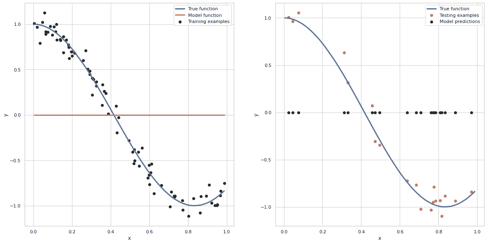

图 14。lambda=1 的套索回归

我们可以看到，对于λ= 0.1，模型是一条平行于 x 轴的直线，这与数据拟合得不好。因此，很明显，我们必须进一步降低λ的值。

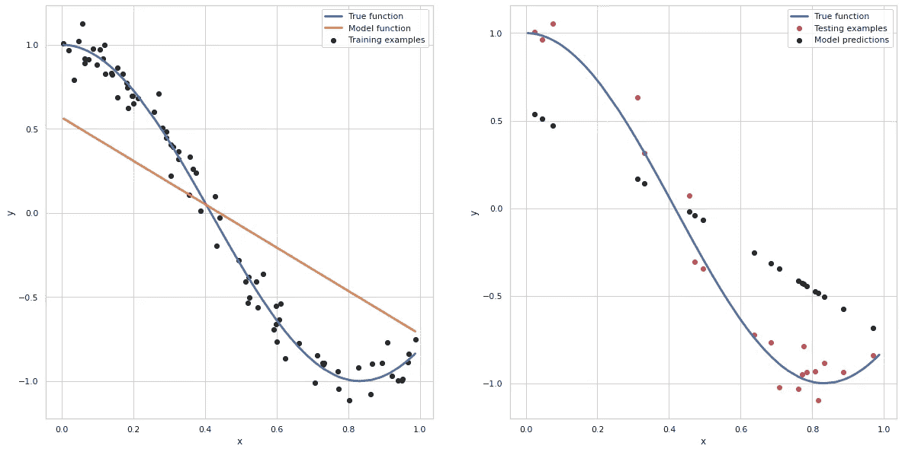

图 15。lambda=0.1 的套索回归

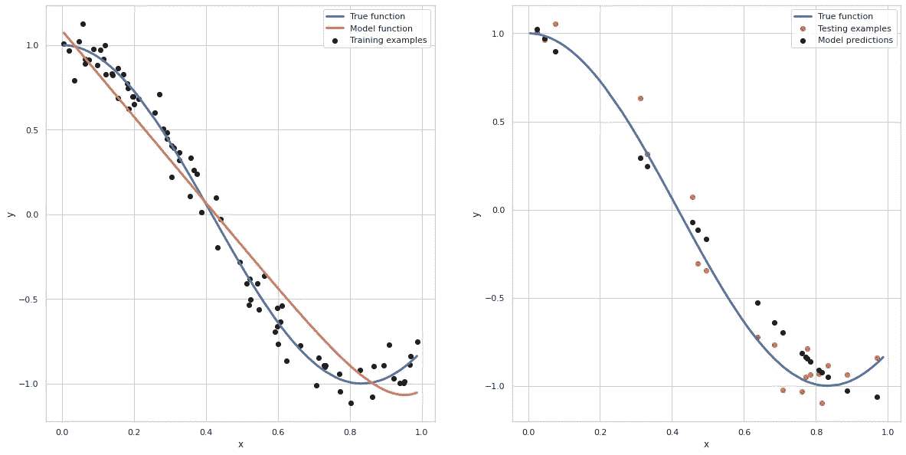

图 16。lambda=0.01 的套索回归

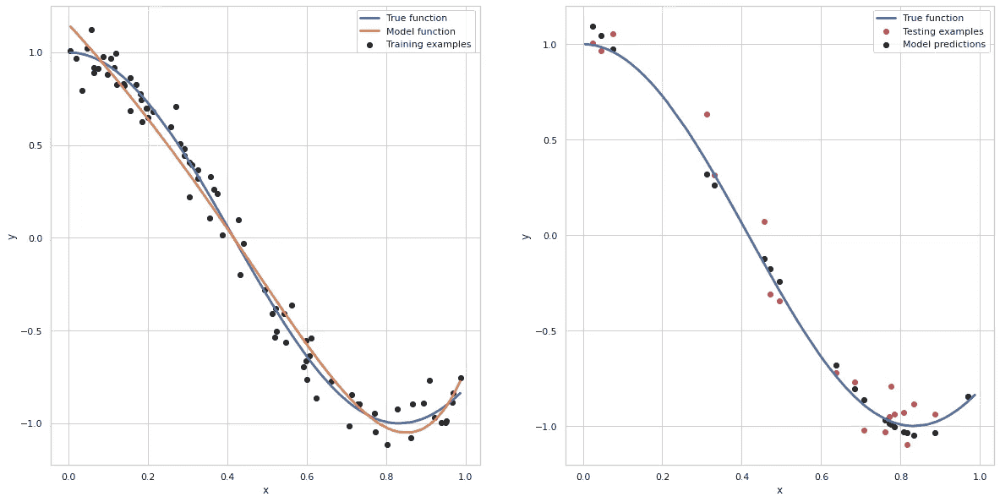

图 17。lambda=0.001 的套索回归


图 17。lambda=0.0005 的套索回归

随着λ值的增加，模型变成平行于 x 轴的直线。这里，对于较大的λ值，参数等于零。这是岭回归和套索回归的主要区别。

> 在大λ值的岭回归中，参数趋向于零，而在拉索回归中，参数可以等于零。

λ= 1 的参数为:

```
Parameters: [-0.00227563 -0.00227563 -0.00227563 -0.00227563 -0.00227563 -0.00227563
 -0.00227563 -0.00227563 -0.00227563 -0.00227563 -0.00227563 -0.00227563
 -0.00227563 -0.00227563 -0.00227563 -0.00227563 -0.00227563 -0.00227563
 -0.00227563 -0.00227563 -0.00227563]
```

我们可以看到所有的值都相等，并且近似等于零。进一步增加 lambda 的值不会改变参数的值，如下所示。


图 18。λ= 10 的套索回归

```
Parameters: [-0.00227563 -0.00227563 -0.00227563 -0.00227563 -0.00227563 -0.00227563
 -0.00227563 -0.00227563 -0.00227563 -0.00227563 -0.00227563 -0.00227563
 -0.00227563 -0.00227563 -0.00227563 -0.00227563 -0.00227563 -0.00227563
 -0.00227563 -0.00227563 -0.00227563]
```

当参数减少到零时，与这些参数相关联的特征将不会对成本函数有任何影响。通过这样做，我们将执行一种类型的**特征选择**，其中我们省略了所有对模型没有太大贡献的无用特征。

# 正则化系数的取值如何选择？

模型表现最佳的正则化系数或λ的值可以通过交叉验证获得。sklearn 的岭回归器中有内置的交叉验证技术。我们可以直接使用它，也可以执行单独的交叉验证过程。

我们将使用与上述 20 次方程相同的数据。我们必须输入一个包含不同 lambda 值的数组来执行交叉验证。

lambdas 的第一个输入是:

```
[0.0005, 0.001, 0.01, 0.1, 1, 10, 100]
```

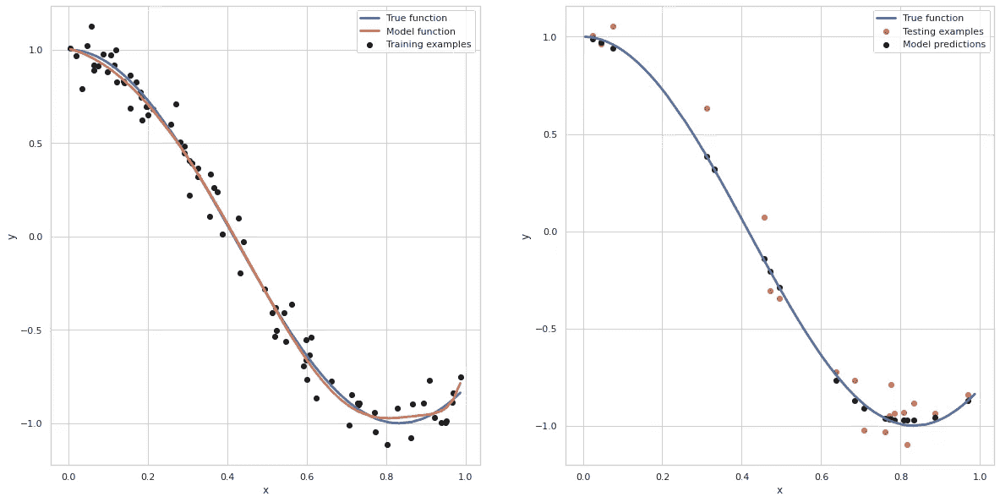

λ的最佳值及其对应的 CV 值为:

```
Best lambda: 0.0005
CV score: 0.983912496818687
```

我们可以通过输入 0.0005 左右的值来进一步放大λ值。类似地，交叉验证的方法可以使用 sklearn 的 LassoCV 对象。

正则化方法也可用于防止**逻辑回归**中的过拟合。我们将使用 sklearn 的**岭分类器**在逻辑回归中实现 L2 正则化。

# 结论:

我们在本文中看到了以下内容:

1.  欠拟合和过拟合如何影响模型。
2.  解决过拟合的方法。
3.  正规化的概念。
4.  正则化代价函数和梯度下降。
5.  L1 正则化或套索回归。
6.  L2 正则化或岭回归。
7.  使用交叉验证来确定正则化系数。

# 推论:

1.  关于机器学习概念背后的数学问题，你可以参考 Youtube 上的这个播放列表。

2.这是 Youtube 上的另一个播放列表，它简单地解释了所有的机器学习基础，没有涉及太多的术语。

请点击这里查看我关于数据科学和机器学习的其他文章[。](https://medium.com/@skumar.gokul)欢迎在评论中和 [LinkedIn](https://www.linkedin.com/in/gokul-s-kumar) 上进行更深入的讨论。