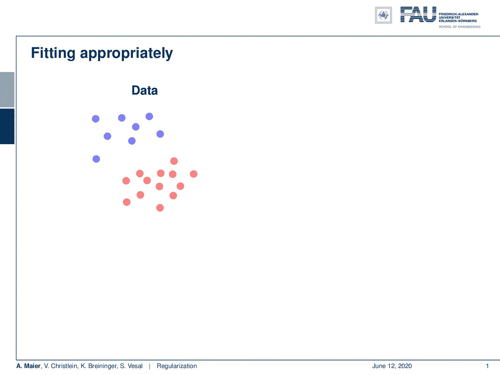
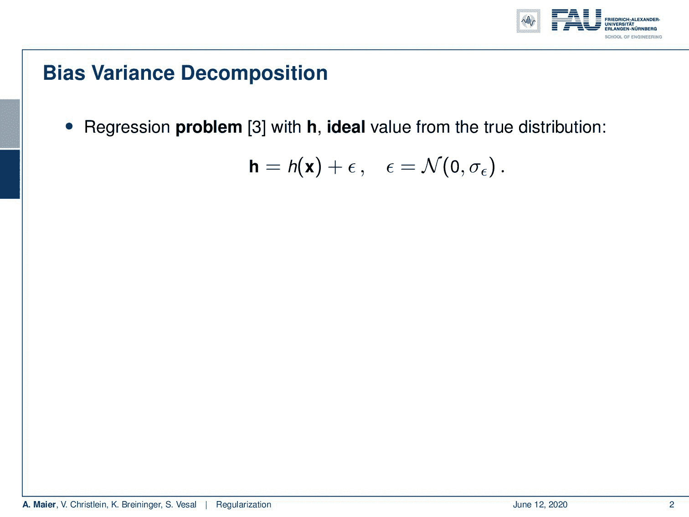
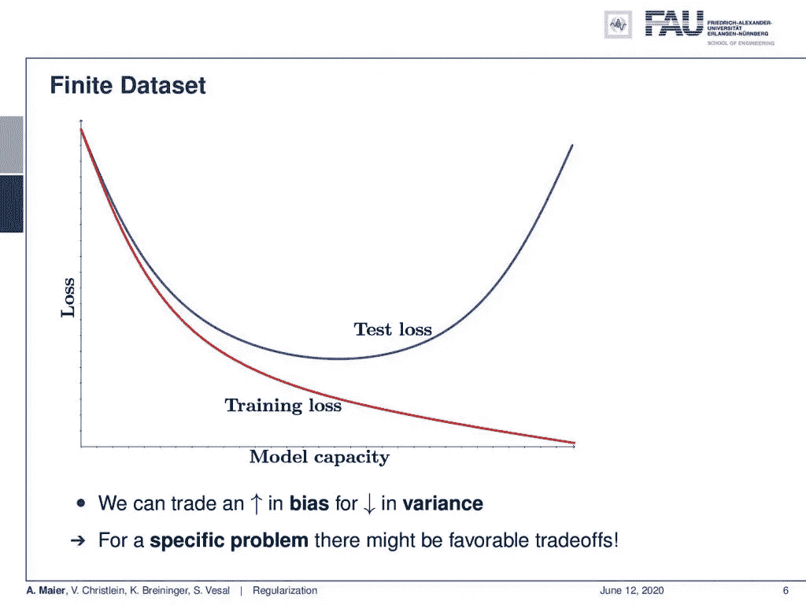
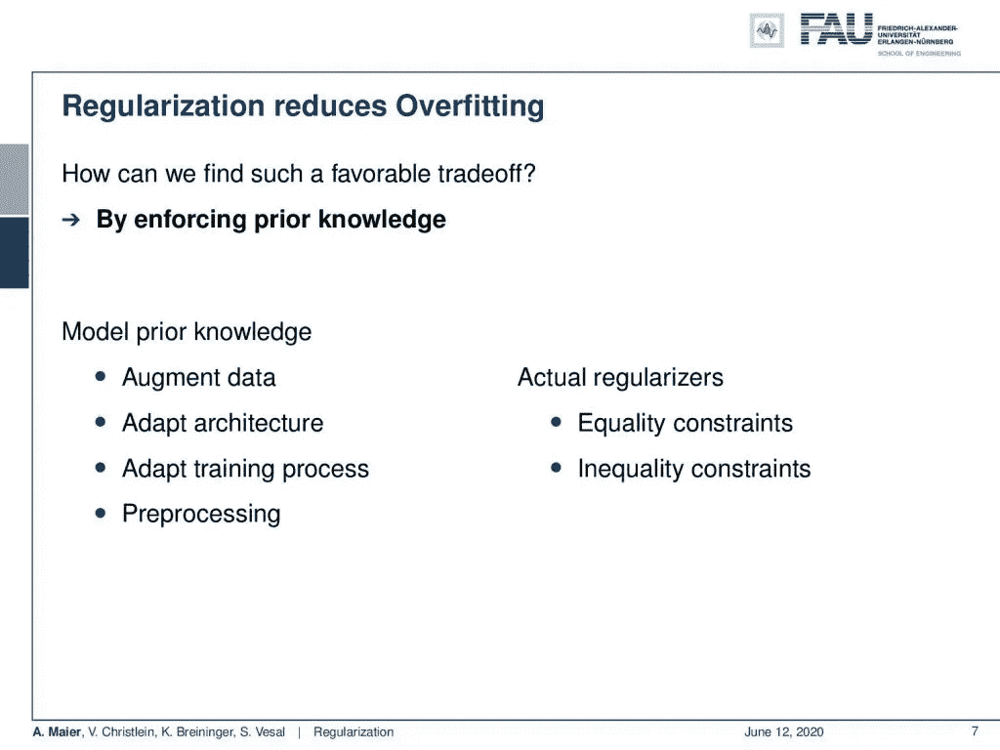

# 正规化—第一部分

> 原文：<https://towardsdatascience.com/regularization-part-1-db408819b20f?source=collection_archive---------43----------------------->

## [FAU 讲座笔记](https://towardsdatascience.com/tagged/fau-lecture-notes)关于深度学习

## 偏差-方差权衡

FAU 大学的深度学习。下图 [CC BY 4.0](https://creativecommons.org/licenses/by/4.0/) 来自[深度学习讲座](https://www.youtube.com/watch?v=p-_Stl0t3kU&list=PLpOGQvPCDQzvgpD3S0vTy7bJe2pf_yJFj&index=1)

**这些是 FAU 的 YouTube 讲座** [**深度学习**](https://www.youtube.com/watch?v=p-_Stl0t3kU&list=PLpOGQvPCDQzvgpD3S0vTy7bJe2pf_yJFj&index=1) **的讲义。这是与幻灯片匹配的讲座视频&的完整抄本。我们希望，你喜欢这个视频一样多。当然，这份抄本是用深度学习技术在很大程度上自动创建的，只进行了少量的手动修改。如果你发现了错误，请告诉我们！**

# 航行

[**上一讲**](/activations-convolutions-and-pooling-part-4-5dd7f85aa9f7) **/** [**观看本视频**](https://youtu.be/-I3SQMfyZYw) **/** [**顶级**](/all-you-want-to-know-about-deep-learning-8d68dcffc258) **/** [**下一讲**](/regularization-part-2-5b729698d026)

欢迎回到深度学习！所以今天，我们想谈谈正则化技术，我们先简单介绍一下正则化和过拟合的一般问题。所以，我们先从背景说起。问问题“正规化的问题是什么？”然后，我们谈论经典技术，规范化，辍学，初始化，迁移学习和多任务学习。那么，为什么我们如此频繁地谈论这个话题呢？

将函数拟合到数据可能会导致过度拟合或拟合不足。 [CC 下的图片来自](https://creativecommons.org/licenses/by/4.0/)[深度学习讲座](https://www.youtube.com/watch?v=p-_Stl0t3kU&list=PLpOGQvPCDQzvgpD3S0vTy7bJe2pf_yJFj&index=1)的 4.0 。

嗯，如果你想拟合你的数据，那么像这样的问题很容易拟合，因为它们有明确的解决方案。通常，您会遇到这样的问题:您的数据有噪声，并且您无法轻松地将这些类分开。所以，如果你有一个容量不是很大的模型，你就会遇到不合适的问题。那么你可能会有类似这条线的东西，它不是很适合描述类的分离。反之就是过拟合。这里，我们有容量非常高的模型，它们试图对训练数据中观察到的一切进行建模。这可能会产生不太合理的决策界限。我们真正感兴趣的是一个合理的边界，它是观测数据和实际分布之间的折衷。

偏差-方差权衡与预期模型误差及其方差有关。 [CC 下的图片来自](https://creativecommons.org/licenses/by/4.0/)[深度学习讲座](https://www.youtube.com/watch?v=p-_Stl0t3kU&list=PLpOGQvPCDQzvgpD3S0vTy7bJe2pf_yJFj&index=1)的 4.0 。

因此，我们可以通过所谓的偏差-方差分解来分析这个问题。在这里，我们坚持回归问题，我们有一个理想的函数 h( **x** )来计算一些值，它通常与一些测量噪声有关。所以，有一些附加值ϵ被加到 h( **x** )上。它可以正态分布，平均值为零，标准差为σ。现在，你可以继续使用一个模型来估计 **h** 。这表示为 f hat，它是从一些数据集 d 中估计出来的。我们现在可以将单点的损失表示为损失的期望值。这将只是 L2 的损失。所以，我们取真实函数减去估计函数的 2 次方，计算期望值。有趣的是，这种损失可以分解成两部分:一部分是偏差，本质上是我们的模型的期望值与真实模型的偏差。所以，这基本上衡量了我们离真相有多远。另一部分可以用数据集的有限大小来解释。我们总是可以尝试找到一个非常灵活的模型，并尝试减少偏差。结果我们得到的是方差的增加。因此，方差就是 y hat 的期望值——y hat 的当前值的 2 次方。这就是我们在 y hat 中遇到的变化。然后，当然，有一个小的不可再现的误差。现在，我们可以对 **x** 中的每个数据点进行积分，从而得到整个数据集的损失。顺便说一下，使用 1–0 损失的分类存在类似的分解，您可以在[9]中看到。略有不同，但有相似的含义。因此，我们了解到，随着方差的增加，我们可以从根本上减少偏差，即我们的模型对训练数据集的预测误差。

由偏差和方差引起的误差的可视化。 [CC 下的图片来自](https://creativecommons.org/licenses/by/4.0/)[深度学习讲座](https://www.youtube.com/watch?v=p-_Stl0t3kU&list=PLpOGQvPCDQzvgpD3S0vTy7bJe2pf_yJFj&index=1)的 4.0 。

让我们把它形象化一点:在左上角，我们看到一个低偏差、低方差的模型。这本质上总是正确的，并且在预测中没有太多的噪音。在右上方，我们看到一个非常一致的高偏差模型，即方差很低，并且始终处于关闭状态。在左下方，我们看到一个低偏差高方差模型。这有相当程度的变化，但平均来说，它非常接近它应该在的地方。在右下角，我们有我们想要省略的情况。这是一个高偏差、高方差的模型，有很多噪音，甚至不在它应该在的地方。因此，我们可以为给定的数据集选择一种模型，但同时优化偏差和方差通常是不可能的。偏差和方差可以作为模型容量一起研究，我们将在下一张幻灯片中看到。

模型容量是对一个函数有多少变化可以近似的度量。 [CC 下的图片来自](https://creativecommons.org/licenses/by/4.0/)[深度学习讲座](https://www.youtube.com/watch?v=p-_Stl0t3kU&list=PLpOGQvPCDQzvgpD3S0vTy7bJe2pf_yJFj&index=1)的 4.0 。

模型的容量描述了它可以近似的各种函数。这和参数的个数有关，所以经常有人说:“那就是参数的个数。增加参数的数量，然后你就可以摆脱你的偏见。”这是真的，但它远远不平等。确切地说，你需要计算 Vapnik-Chervonenkis (VC)维度。这是对容量的精确测量，它基于计算模型可以分离多少个点。因此，与经典方法相比，神经网络的 VC 维数非常高，并且它们具有非常高的模型容量。如果你看一下[18]，他们甚至设法记住了随机的标签。这又是那篇研究带有随机标签的学习图像网络的论文。顺便说一下，VC 维在判断神经网络的真实能力方面是无效的。尽管如此，我们总是可以通过增加模型容量来减少偏差。因此，如果您增加模型容量，请记住这一点。你可能会遇到过度拟合的问题。

您拥有的数据越多，就越有可能接近未知的测试集。来自[深度学习讲座](https://www.youtube.com/watch?v=p-_Stl0t3kU&list=PLpOGQvPCDQzvgpD3S0vTy7bJe2pf_yJFj&index=1)的 [CC BY 4.0](https://creativecommons.org/licenses/by/4.0/) 下的图片。

那么我们来看看数据的作用。这里，我们绘制了损失与训练样本数量的关系图，您可以看到，训练损失随着训练样本数量的增加而增加。学习大数据集比学习小数据集更难。如果你有一个非常小的数据集，完全记住它可能非常容易。小数据集的问题在于，它不能很好地代表您真正感兴趣的数据。所以，小数据集模型，当然会有很高的测试损失。现在，通过增加数据集的大小，你也增加了训练损失，但是测试误差下降了。这是我们感兴趣的。我们想建立通用模型，真正对看不见的数据起作用。这是一个非常重要的属性。这也是我们需要如此多数据的原因，也是大公司对获取如此多数据并将其存储在服务器上感兴趣的原因。从技术上讲，我们可以通过使用更多的训练数据来优化方差。因此，我们可以创建更高容量的模型，但我们也需要更多的训练数据，但从长远来看，这可能会给我们带来非常低的测试误差。此外，模型容量必须与训练数据集的大小相匹配。如果你有一个太高的容量，它只会产生一个非常糟糕的过度拟合，你的模型在看不见的数据上不会很好。现在的问题是，当然，如果我们不能得到更多的数据呢？

有限的数据集是过度拟合的常见原因。 [CC 下的图片来自](https://creativecommons.org/licenses/by/4.0/)[深度学习讲座](https://www.youtube.com/watch?v=p-_Stl0t3kU&list=PLpOGQvPCDQzvgpD3S0vTy7bJe2pf_yJFj&index=1)的 4.0 。

假设你在一个数据有限的领域。那么，当然，你有麻烦了。让我们用固定的数据集大小来研究这些影响。所以，在一个有限的数据集上，你做出如下观察:如果你增加模型容量，你的训练损失会下降。当然，有了更高的容量，你可以记忆更多的训练数据集。这是通过记忆所有东西来解决学习问题的蛮力方式。问题是你在某些时候产生了一个糟糕的过度配合。开始时，增加模型容量也会减少测试损失。在某些时候，当你进入过度拟合，测试损失将增加，如果测试损失增加，你基本上是在你过度拟合的点。在这堂课的后面，我们将研究使用从训练数据集中提取的验证数据集的想法，以产生测试损失的替代数据。所以，我们会在几节课中讨论这个问题。我们可以看到，我们可以用偏差的增加来换取方差的减少。

所有正则化技术都旨在减少过拟合问题。 [CC 下的图片来自](https://creativecommons.org/licenses/by/4.0/)[深度学习讲座](https://www.youtube.com/watch?v=p-_Stl0t3kU&list=PLpOGQvPCDQzvgpD3S0vTy7bJe2pf_yJFj&index=1)的 4.0 。

对于一个特定的问题，可能会有有利的权衡。一般现在正则化的思路是减少过拟合。这个想法从何而来？我们本质上是在强化先验知识。一种方法是数据扩充。你可以调整架构，因为你对问题有所了解，你可以调整训练过程，你可以做预处理，等等。为了结合先前的知识，可以采取许多额外的步骤。也可以使用实际的正则化，然后将正则化扩充到损失函数中，并且它们通常将解约束到等式约束或不等式约束。因此，我们还将简要了解一下这些解决方案。

在这个深度学习讲座中，更多令人兴奋的事情即将到来。来自[深度学习讲座](https://www.youtube.com/watch?v=p-_Stl0t3kU&list=PLpOGQvPCDQzvgpD3S0vTy7bJe2pf_yJFj&index=1)的 [CC BY 4.0](https://creativecommons.org/licenses/by/4.0/) 下的图片。

这已经把我们带到了这节课的结尾。下一次，我们将研究神经网络和机器学习中使用的经典正则化方法。我期待着在下一次会议中再次见到你！

如果你喜欢这篇文章，你可以在这里找到更多的文章，或者看看我们的讲座。如果你想在未来了解更多的文章、视频和研究，我也会很感激你在 YouTube、Twitter、脸书、LinkedIn 上的鼓掌或关注。本文以 [Creative Commons 4.0 归属许可](https://creativecommons.org/licenses/by/4.0/deed.de)发布，如果引用，可以转载和修改。

# 链接

[链接](https://www.springer.com/us/book/9780387310732) —关于最大后验概率估计和偏差-方差分解的详细信息
[链接](https://arxiv.org/abs/1206.5533) —关于正则化实用建议的综合文本
[链接](http://citeseerx.ist.psu.edu/viewdoc/download?doi=10.1.1.207.2059&rep=rep1&type=pdf) —关于校准方差的论文

# 参考

[1]谢尔盖·约菲和克里斯蒂安·塞格迪。“批量标准化:通过减少内部协变量转移加速深度网络训练”。《第 32 届机器学习国际会议论文集》。2015 年，第 448–456 页。乔纳森·巴克斯特。“通过多任务抽样学习的贝叶斯/信息论模型”。摘自:机器学习 28.1(1997 年 7 月)，第 7-39 页。
【3】克里斯托弗·m·毕晓普。模式识别和机器学习(信息科学和统计学)。美国新泽西州 Secaucus 出版社:纽约斯普林格出版社，2006 年。
[4]理查德·卡鲁阿纳。多任务学习:归纳偏差的知识来源。收录于:第十届机器学习国际会议论文集。摩根·考夫曼，1993 年，第 41-48 页。
【5】Andre Esteva，Brett Kuprel，Roberto A Novoa，等《深度神经网络的皮肤癌皮肤科医生级分类》。载于:自然 542.7639 (2017)，第 115–118 页。
[6]丁俊钦、徐俊卿、陶行知。“多任务姿态不变人脸识别”。载于:IEEE 图像处理汇刊 24.3(2015 年 3 月)，第 980–993 页。
[7]李万，马修·泽勒，张思欣，等，“用下降连接实现神经网络的正则化”。载于:《第 30 届机器学习国际会议论文集》(ICML，2013 年)，第 1058-1066 页。
[8] Nitish Srivastava，Geoffrey E Hinton，Alex Krizhevsky，等人，“辍学:防止神经网络过度拟合的简单方法。”载于:《机器学习研究杂志》15.1 (2014)，第 1929–1958 页。
[9]r . o .杜达、P. E .哈特和 D. G .施托克。模式分类。约翰威利父子公司，2000 年。
[10]伊恩·古德菲勒、约舒阿·本吉奥和亚伦·库维尔。深度学习。[http://www.deeplearningbook.org。](http://www.deeplearningbook.org.)麻省理工学院出版社，2016 年。
【11】与何。“群体常态化”。载于:arXiv 预印本 arXiv:1803.08494 (2018)。
【12】何，，任等，“深入挖掘整流器:在 imagenet 分类上超越人类水平的表现”。IEEE 计算机视觉国际会议论文集。2015 年，第 1026–1034 页。
【13】D 乌里扬诺夫，A 韦达尔迪，以及 VS 伦皮茨基。实例规范化:快速风格化缺少的要素。CoRR ABS/1607.0[14]günter Klambauer，Thomas Unterthiner，Andreas Mayr 等，“自规范化神经网络”。在:神经信息处理系统的进展。abs/1706.02515 卷。2017.arXiv: 1706.02515。吉米·巴雷、杰米·瑞安·基罗斯和杰弗里·E·辛顿。“图层规范化”。载于:arXiv 预印本 arXiv:1607.06450 (2016)。
【16】Nima Tajbakhsh，Jae Y Shin，Suryakanth R Gurudu，等，“用于医学图像分析的卷积神经网络:完全训练还是微调？”载于:IEEE 医学成像汇刊 35.5 (2016)，第 1299–1312 页。
【17】约书亚·本吉奥。“深度架构基于梯度训练的实用建议”。《神经网络:交易的诀窍》。斯普林格出版社，2012 年，第 437-478 页。
[18]张，Samy Bengio，Moritz Hardt 等，“理解深度学习需要反思泛化”。载于:arXiv 预印本 arXiv:1611.03530 (2016)。
[19]什巴尼·桑图尔卡，迪米特里斯·齐普拉斯，安德鲁·易勒雅斯等，“批处理规范化如何帮助优化？”在:arXiv e-prints，arXiv:1805.11604(2018 年 5 月)，arXiv:1805.11604。arXiv:1805.11604[统计。ML】。
[20]蒂姆·萨利曼斯和迪德里克·P·金马。“权重标准化:加速深度神经网络训练的简单重新参数化”。神经信息处理系统进展 29。柯伦咨询公司，2016 年，第 901–909 页。
【21】泽维尔·格洛特和约舒阿·本吉奥。“理解训练深度前馈神经网络的困难”。载于:2010 年第十三届国际人工智能会议论文集，第 249-256 页。
【22】，罗平，陈改来，等，“基于深度多任务学习的人脸标志点检测”。载于:计算机视觉— ECCV 2014 年:第 13 届欧洲会议，瑞士苏黎世，Cham: Springer 国际出版公司，2014 年，第 94–108 页。