# 正规化—第二部分

> 原文：<https://towardsdatascience.com/regularization-part-2-5b729698d026?source=collection_archive---------42----------------------->

## [FAU 讲座笔记](https://towardsdatascience.com/tagged/fau-lecture-notes)关于深度学习

## 古典技术

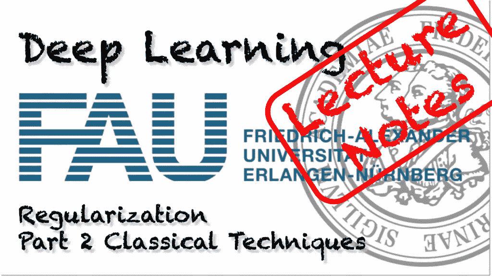

FAU 大学的深度学习。下图 [CC BY 4.0](https://creativecommons.org/licenses/by/4.0/) 来自[深度学习讲座](https://www.youtube.com/watch?v=p-_Stl0t3kU&list=PLpOGQvPCDQzvgpD3S0vTy7bJe2pf_yJFj&index=1)

**这些是 FAU 的 YouTube 讲座** [**深度学习**](https://www.youtube.com/watch?v=p-_Stl0t3kU&list=PLpOGQvPCDQzvgpD3S0vTy7bJe2pf_yJFj&index=1) **的讲义。这是与幻灯片匹配的讲座视频&的完整抄本。我们希望，你喜欢这个视频一样多。当然，这份抄本是用深度学习技术在很大程度上自动创建的，只进行了少量的手动修改。如果你发现了错误，请告诉我们！**

# 航行

[**上一讲**](/regularization-part-1-db408819b20f) **/** [**观看本视频**](https://youtu.be/1RqnSkp9YS0) **/** [**顶级**](/all-you-want-to-know-about-deep-learning-8d68dcffc258) **/** [**下一讲**](/regularization-part-4-2ee8e7aa60ec)

欢迎回到深度学习！我们想继续分析正则化方法，今天我想谈谈经典技术。

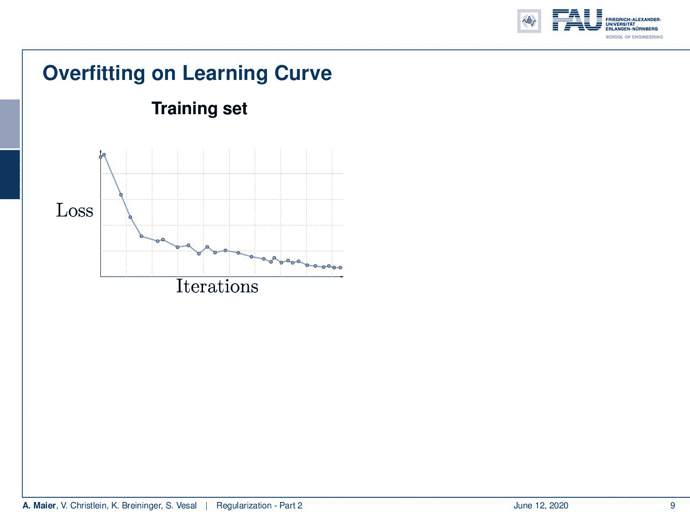

您将无法在训练数据上观察到过度拟合。 [CC 下的图片来自](https://creativecommons.org/licenses/by/4.0/)[深度学习讲座](https://www.youtube.com/watch?v=p-_Stl0t3kU&list=PLpOGQvPCDQzvgpD3S0vTy7bJe2pf_yJFj&index=1)的 4.0 。

这是一个典型的训练集迭代损失曲线的例子。我在右边展示的是测试集上的损耗曲线。你可以看到，虽然培训损失下降了，但测试损失却上升了。因此，在某种程度上，训练数据集是过度拟合的，它不再产生代表数据的模型。顺便说一句，永远记住，测试集决不能用于训练。如果你在你的测试集上接受训练，那么你会得到非常好的结果，但是很有可能完全高估了性能。典型的情况是，有人跑进我的办公室说:“是的！我有 99%的识别率！”。当模式识别或机器学习领域的人读到“99%的识别率”时，他做的第一件事是问:“你用你的测试数据训练过吗？”这是你首先要确保的事情。当你犯了一些愚蠢的错误，有一些数据集指针没有指向正确的数据集，你的识别率突然上升。所以，如果你有非常好的结果，一定要小心。始终仔细检查它们是否真的合适，它们是否真的通用。因此，如果你想产生像我在这里展示的曲线，你可能想使用一个验证集，你从训练数据集。你从来没有在训练中使用过这个集合，但是你可以用它来估计你的模型过度拟合。

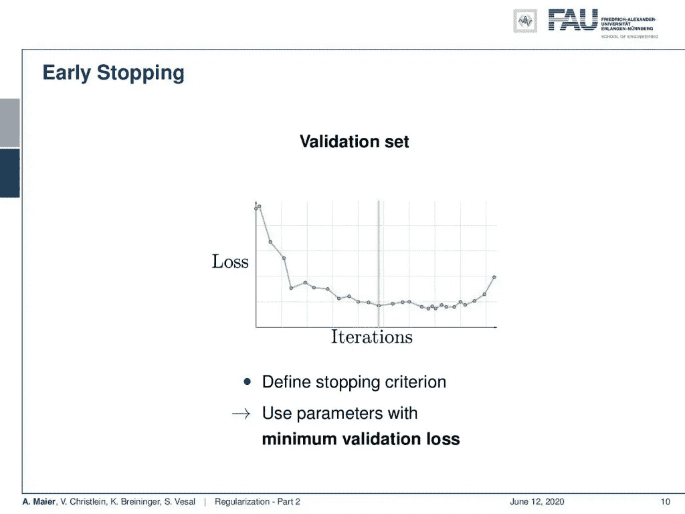

当验证损失再次上升时，验证集有助于发现过度拟合。来自[深度学习讲座](https://www.youtube.com/watch?v=p-_Stl0t3kU&list=PLpOGQvPCDQzvgpD3S0vTy7bJe2pf_yJFj&index=1)的 [CC BY 4.0](https://creativecommons.org/licenses/by/4.0/) 下的图片。

所以，如果你这样做了，我们就可以使用第一个技巧了。您使用验证集。我们观察在什么点上我们在验证集中有最小的误差。如果我们在这一点上，我们可以使用它作为一个停止标准，并使用我们的测试评估模型。因此，使用具有最小验证结果的参数是一种常见的技术。

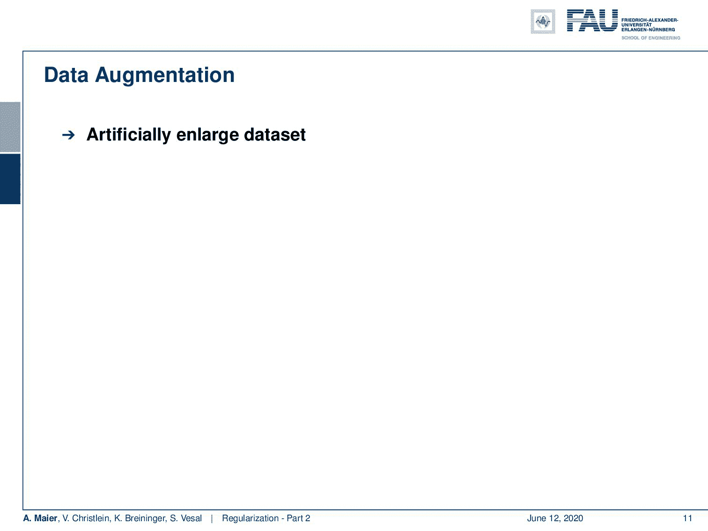

数据扩充实际上可以增加训练集的大小。来自[深度学习讲座](https://www.youtube.com/watch?v=p-_Stl0t3kU&list=PLpOGQvPCDQzvgpD3S0vTy7bJe2pf_yJFj&index=1)的 4.0CC 下的图片。

另一个非常有用的技术是数据扩充。所以，这里的想法是人为地扩大数据集。标签上有一些变换，这些变换对于类应该是不变的。假设你有一只猫的图像，你把它旋转 90 度，它仍然显示一只猫。显然，这些增强技术必须小心谨慎。因此，在右边的例子中，您可以看到旋转 180 度可能不是增加数字的好方法，因为它可能会转换标签。

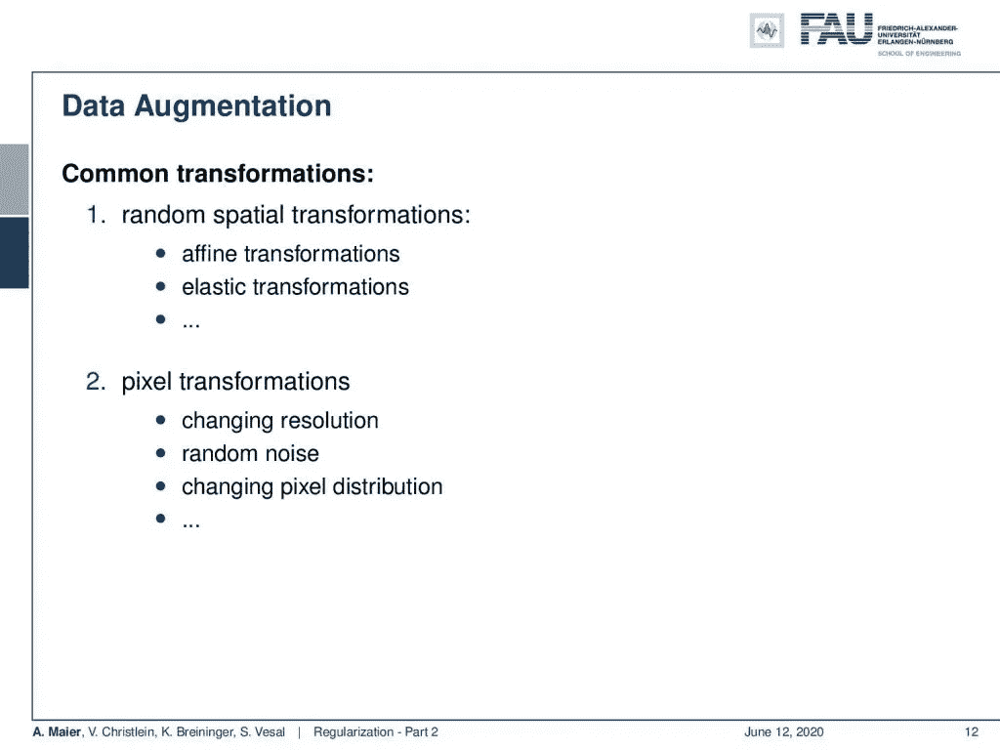

数据扩充的常见转换。 [CC 下的图片来自](https://creativecommons.org/licenses/by/4.0/)[深度学习讲座](https://www.youtube.com/watch?v=p-_Stl0t3kU&list=PLpOGQvPCDQzvgpD3S0vTy7bJe2pf_yJFj&index=1)的 4.0 。

这里有非常常见的变换:随机空间变换，如仿射或弹性变换。然后，还有像素变换，如改变分辨率、改变噪声或改变像素分布，如颜色亮度等。这些是图像处理中典型的增强技术。

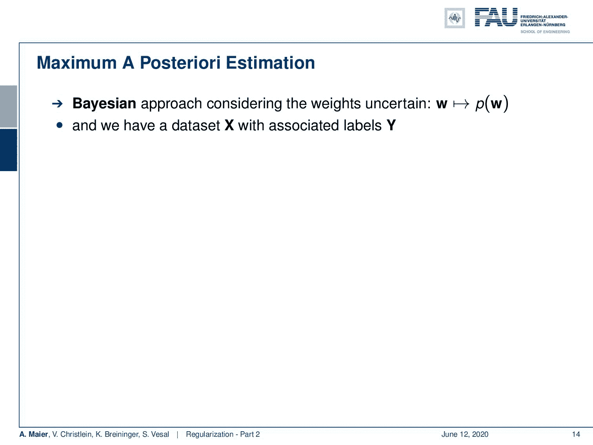

利用贝叶斯定理，我们可以得到所谓的最大后验估计。来自[深度学习讲座](https://www.youtube.com/watch?v=p-_Stl0t3kU&list=PLpOGQvPCDQzvgpD3S0vTy7bJe2pf_yJFj&index=1)的 [CC BY 4.0](https://creativecommons.org/licenses/by/4.0/) 下的图片。

还有什么？我们可以正则化损失函数。这里，我们可以看到，这基本上导致了最大后验概率(MAP)估计。我们可以用贝叶斯方法来做到这一点，我们希望考虑不确定的权重。它们遵循先验分布 p( **w** )。如果你有一些带有一些关联标签 **Y** 的数据集 **X** ，我们可以看到联合概率 p( **w** ， **Y** ， **X** )是概率 p( **w** | **Y，X** )乘以概率 p( **Y，X** )。我们可以将其重新表述为概率 P( **Y** | **X** ， **w** )乘以概率 p( **X** ， **w** )。从这些等式可以推导出条件概率 p( **w** | **Y** ， **X** )可以表示为概率 p( **Y** | **X，w** )乘以概率 P( **X，w** )除以概率 p( **Y，X** )的贝叶斯定理。因此，我们可以进一步重新排列，这里你可以看到概率 p( **X** )概率 p( **Y** | **X** )弹出。通过移除与 **w** 无关的项，这产生了 MAP 估计。所以，我们实际上可以通过最大化条件概率 p( **Y** | **X** ， **w** )乘以概率 p( **w** )来寻求最大化联合概率。因此，通常情况下，我们将这个问题作为最大似然估计量来解决，即左边的问题乘以右边部分 **w** 的先验。我们可以说这是一个最大似然估计量，但我们用一些额外的先验信息来扩充它。这里，先验信息是我们对 **w** 的分布有一些了解，例如 **w** 可能是稀疏的。我们也可以使用其他的知识来源，在那里我们知道一些关于 **w** 的事情。在图像处理中，经常使用的是例如自然图像相对于梯度是稀疏的，因此这种先验可以使用各种稀疏度。

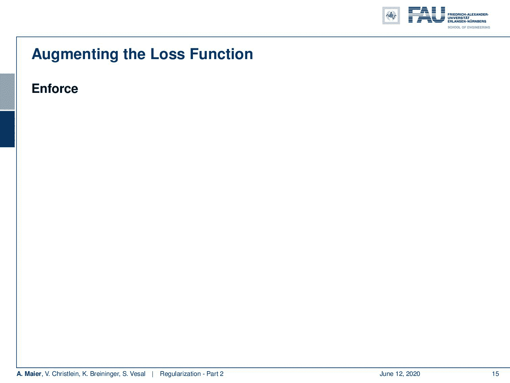

MAP 估计在损失函数中产生正则化项。 [CC 下的图片来自](https://creativecommons.org/licenses/by/4.0/)[深度学习讲座](https://www.youtube.com/watch?v=p-_Stl0t3kU&list=PLpOGQvPCDQzvgpD3S0vTy7bJe2pf_yJFj&index=1)的 4.0 。

现在有趣的部分是，这个 MAP 估计器可以被重构，如果你参加过模式识别，你就知道我在说什么。我们已经看到，最大似然估计的最大化导致负对数似然的最小化。我们讨论的典型损失函数具有这种形式。现在，如果你从地图估计开始，你基本上以一个非常相似的估计结束，但是损失函数的形状稍微改变了。所以，我们得到了一个新的损失函数。这就像 L2 损失或交叉熵损失加上一些λ和一些对权重的约束 **w** 。所以在这里，我们实施了一个最小 l2 规范。现在，对于正λ，我们可以将其识别为最小化损失函数的拉格朗日函数，其受限于小于α的约束 L2 范数 **w** ，其中α依赖于某些未知数据。所以这是完全相同的公式。我们现在可以把这一点引入到增加损失的反向传播中去。这通常是如何实现的？你跟踪梯度的损失。这是损失的右边部分，我们已经用学习率η计算过了，另外，你把这种收缩应用到 **w** 上。因此，这里的收缩步骤可以用于实现额外的 L2 正则化。好消息是现在我们可以像以前一样简单地计算反向传播。然后，另外，我们在权重更新中使用收缩。因此，我们也可以获得非常简单的权重更新，它们允许我们涉及那些正则化。如果我们选择不同的正则项，收缩函数会发生变化。如果我们现在为λ优化训练损失，我们通常会得到λ = 0，因为每次我们引入正则化，我们都在做一些关于训练损失不是最优的事情。当然，我们引入它是因为我们想减少过度拟合。因此，这是我们无法在训练数据中直接观察到的东西，但我们希望在一个看不见的测试集上获得更好的属性。这甚至会增加我们训练数据的损失值。所以要小心。同样，我们增加偏差以减少方差。

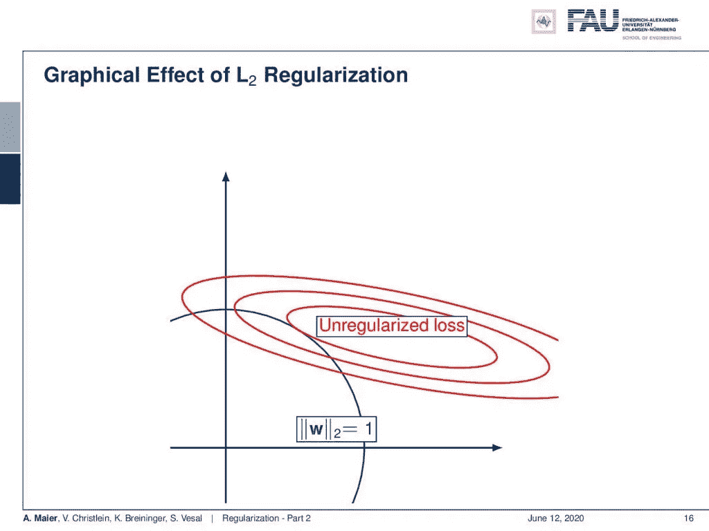

L2 规范强制实施具有较低权重量值的解决方案。 [CC 下的图片来自](https://creativecommons.org/licenses/by/4.0/)[深度学习讲座](https://www.youtube.com/watch?v=p-_Stl0t3kU&list=PLpOGQvPCDQzvgpD3S0vTy7bJe2pf_yJFj&index=1)的 4.0 。

这里，我们有一个可视化的 L2 正则化的效果。不规则损耗当然会导致椭圆的中心变成红色。但是现在你做了额外的调整，使你的 **w** 变小。这意味着你离原点越远，你的 L2 损耗就越高。因此，l2 损失会使您偏离关于训练数据集的数据最佳损失。希望它描述了一些我们在训练数据集中没有看到的先验知识。因此，它将产生一个更适合未知测试数据集的模型。

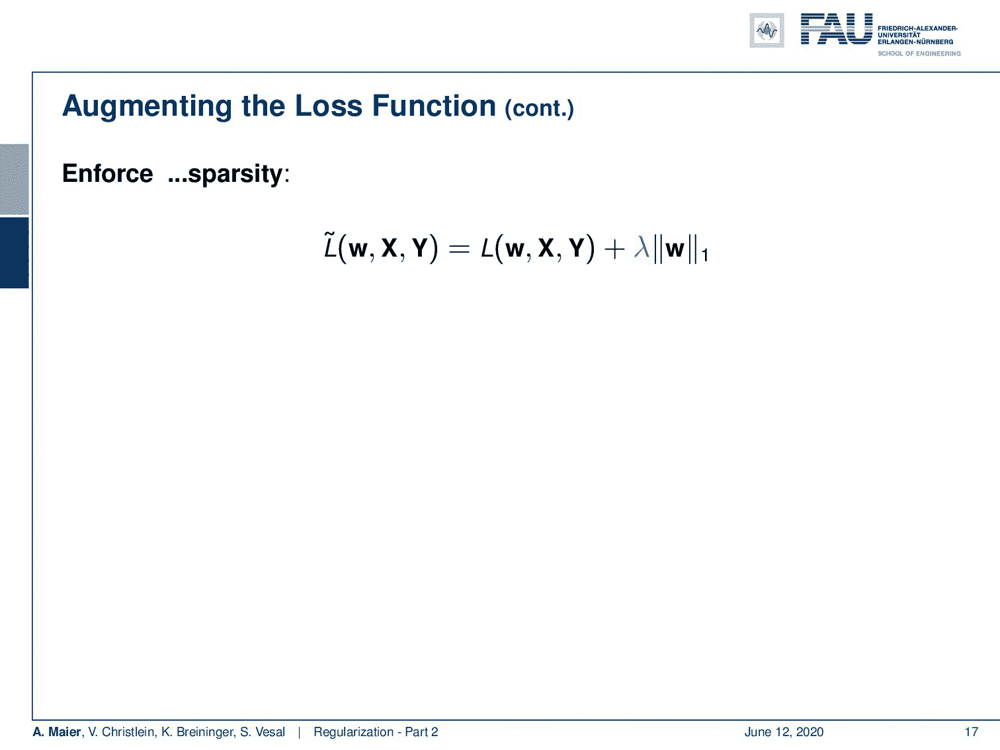

使用 L1 项会导致不同形式的重量收缩。来自[深度学习讲座](https://www.youtube.com/watch?v=p-_Stl0t3kU&list=PLpOGQvPCDQzvgpD3S0vTy7bJe2pf_yJFj&index=1)的 4.0CC 下的图片。

我们也可以使用其他规范，例如，L1 规范。因此，在这里，我们再次以拉格朗日公式结束，其中我们有服从 L1 范数的原始损失函数，该损失函数小于某个值α，且α未知，取决于数据。这里，我们简单地得到一个不同的收缩操作，它现在涉及到符号函数的使用。所以这又是次梯度的一个暗示。这里，为了使这种优化可行，必须采用不同的收缩方式。同样，我们对损失函数使用了与之前完全相同的梯度。所以只有收缩被取代。

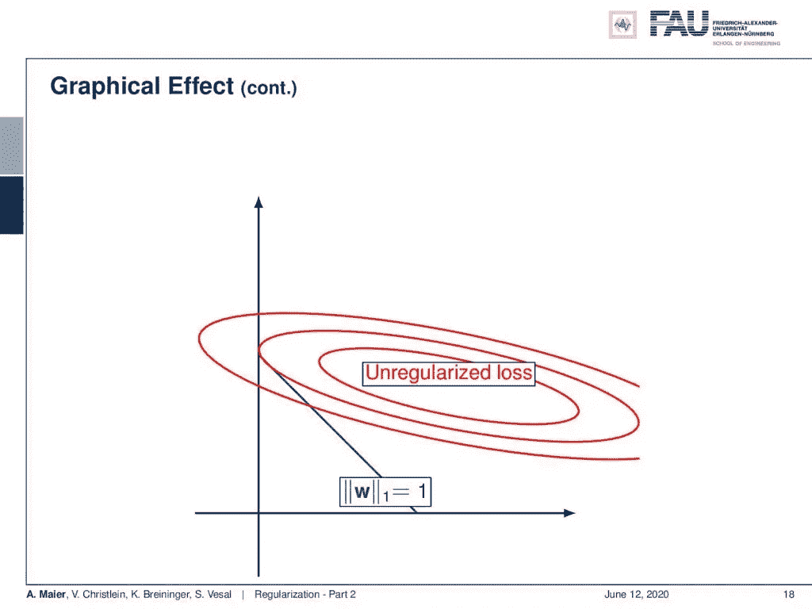

来自[深度学习讲座](https://www.youtube.com/watch?v=p-_Stl0t3kU&list=PLpOGQvPCDQzvgpD3S0vTy7bJe2pf_yJFj&index=1)的 4.0 在 [CC 下的二维图像中 L1 范数为菱形。](https://creativecommons.org/licenses/by/4.0/)

现在，我们也可以在我们的小图中看到这一点。L1 标准的形式当然是不同的。用 L2，我们有这个圆，用 L1 范数，我们得到一个菱形。现在，你可以看到选择的最小值可能位于坐标轴上。因此，如果你试图找到这个 L1 范数和非正则化损耗的最小位置，你会看到与这个 L1 损耗相交的最小非正则化损耗点基本上在这个图中的 y 轴上。这是一个非常稀疏的解决方案，意味着在我们的权重向量中只有 y 的条目，在这种情况下，x 的条目非常接近 0 或等于 0。因此，如果您希望权重稀疏，或者如果您希望创建连接较少的网络，您可能希望对权重引入额外的 L1 正则化。这样会造成权重稀疏。

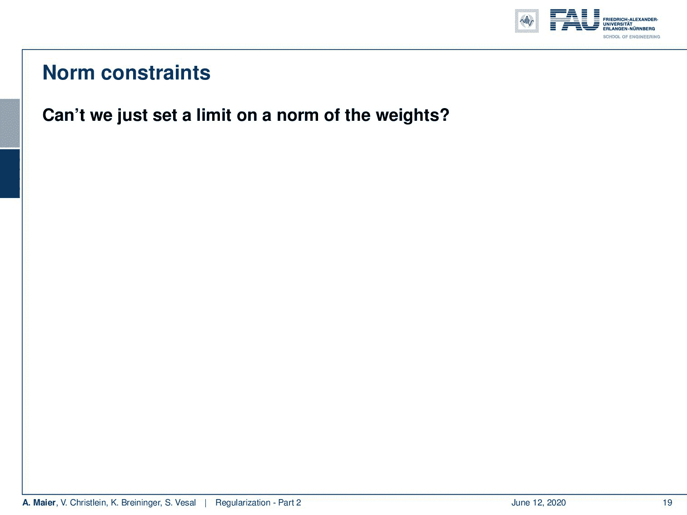

来自[深度学习讲座](https://www.youtube.com/watch?v=p-_Stl0t3kU&list=PLpOGQvPCDQzvgpD3S0vTy7bJe2pf_yJFj&index=1)的 4.0CC 下 w. Image 中的一个最大范数极限高值。

还有什么？还有更多已知的约束，例如我们可以对权重的范数设置限制。在这里，我们只是强制它们低于某个最大值。我们希望 **w** 的大小低于α，其中α是一个正常数。如果你这样做，我们基本上必须在每次参数更新时投影到单位球上，这又是一种收缩，基本上禁止爆炸梯度。小心，它也可能只是隐藏它们，这样你就再也看不到它们了。

规则化损失还有许多其他变体。来自[深度学习讲座](https://www.youtube.com/watch?v=p-_Stl0t3kU&list=PLpOGQvPCDQzvgpD3S0vTy7bJe2pf_yJFj&index=1)的 4.0CC 下的图片。

还有许多改变损失的其他方法。每个层都可以有一个约束和一个单独的λ。所以你可以不同地约束每一层，但是我们还没有在文献中看到任何增益。代替权重，激活也可以被约束。这导致不同的变体，例如在稀疏自动编码器中。我们将讨论他们是如何不正则化权重，而是通过激活来形成特定的分布，从而产生稀疏的激活。这也是一个非常有趣的问题，当我们谈到自动编码器和无监督学习时，我们会对此进行更多的讨论。

在这个深度学习讲座中，更多令人兴奋的事情即将到来。 [CC 下的图片来自](https://creativecommons.org/licenses/by/4.0/)[深度学习讲座](https://www.youtube.com/watch?v=p-_Stl0t3kU&list=PLpOGQvPCDQzvgpD3S0vTy7bJe2pf_yJFj&index=1)的 4.0 。

所以下次在深度学习中，我们想继续讲正则化方法。我们将研究特别为深度学习设计的非常典型的工具。非常有趣的方法，和你们在这节课上看到的略有不同。非常感谢您的收看，再见！

如果你喜欢这篇文章，你可以在这里找到[更多的文章](https://medium.com/@akmaier)，在这里找到更多关于机器学习的教育材料[，或者看看我们的](https://lme.tf.fau.de/teaching/free-deep-learning-resources/)[深度](https://www.youtube.com/watch?v=p-_Stl0t3kU&list=PLpOGQvPCDQzvgpD3S0vTy7bJe2pf_yJFj) [学习](https://www.youtube.com/watch?v=p-_Stl0t3kU&list=PLpOGQvPCDQzvgpD3S0vTy7bJe2pf_yJFj&index=1) [讲座](https://www.youtube.com/watch?v=p-_Stl0t3kU&list=PLpOGQvPCDQzvgpD3S0vTy7bJe2pf_yJFj)。如果你想在未来了解更多的文章、视频和研究，我也会很感激你在 YouTube、Twitter、脸书、LinkedIn 或 T21 上的掌声或关注。本文以 [Creative Commons 4.0 归属许可](https://creativecommons.org/licenses/by/4.0/deed.de)发布，如果引用，可以转载和修改。

# 链接

[链接](https://www.springer.com/us/book/9780387310732) —关于最大后验概率估计和偏差-方差分解的详细信息
[链接](https://arxiv.org/abs/1206.5533) —关于正则化实用建议的综合文本
[链接](http://citeseerx.ist.psu.edu/viewdoc/download?doi=10.1.1.207.2059&rep=rep1&type=pdf) —关于校准方差的论文

# 参考

[1]谢尔盖·约菲和克里斯蒂安·塞格迪。“批量标准化:通过减少内部协变量转移加速深度网络训练”。载于:第 32 届机器学习国际会议论文集。2015 年，第 448–456 页。乔纳森·巴克斯特。“通过多任务抽样学习的贝叶斯/信息论模型”。摘自:机器学习 28.1(1997 年 7 月)，第 7-39 页。
【3】克里斯托弗·m·毕晓普。模式识别和机器学习(信息科学和统计学)。美国新泽西州 Secaucus 出版社:纽约斯普林格出版社，2006 年。
[4]理查德·卡鲁阿纳。多任务学习:归纳偏差的知识来源。收录于:第十届机器学习国际会议论文集。摩根·考夫曼，1993 年，第 41-48 页。
【5】Andre Esteva，Brett Kuprel，Roberto A Novoa，等《深度神经网络的皮肤癌皮肤科医生级分类》。载于:自然 542.7639 (2017)，第 115–118 页。
[6]丁俊钦、徐俊卿、陶行知。“多任务姿态不变人脸识别”。载于:IEEE 图像处理汇刊 24.3(2015 年 3 月)，第 980–993 页。
[7]李万，马修·泽勒，张思欣，等，“用下降连接实现神经网络的正则化”。载于:《第 30 届机器学习国际会议论文集》(ICML，2013 年)，第 1058-1066 页。
[8] Nitish Srivastava，Geoffrey E Hinton，Alex Krizhevsky，等人，“辍学:防止神经网络过度拟合的简单方法。”载于:《机器学习研究杂志》15.1 (2014)，第 1929–1958 页。
[9]r . o .杜达、P. E .哈特和 D. G .施托克。模式分类。约翰威利父子公司，2000 年。
[10]伊恩·古德菲勒、约舒阿·本吉奥和亚伦·库维尔。深度学习。[http://www.deeplearningbook.org。](http://www.deeplearningbook.org.)麻省理工学院出版社，2016 年。
【11】与何。“群体常态化”。载于:arXiv 预印本 arXiv:1803.08494 (2018)。
【12】何，，任等，“深入挖掘整流器:在 imagenet 分类上超越人类水平的表现”。IEEE 计算机视觉国际会议论文集。2015 年，第 1026–1034 页。
【13】D 乌里扬诺夫，A 韦达尔迪，以及 VS 伦皮茨基。实例规范化:快速风格化缺少的要素。CoRR ABS/1607.0[14]günter Klambauer，Thomas Unterthiner，Andreas Mayr 等，“自规范化神经网络”。在:神经信息处理系统的进展。abs/1706.02515 卷。2017.arXiv: 1706.02515。吉米·巴雷、杰米·瑞安·基罗斯和杰弗里·E·辛顿。“图层规范化”。载于:arXiv 预印本 arXiv:1607.06450 (2016)。
【16】Nima Tajbakhsh，Jae Y Shin，Suryakanth R Gurudu，等，“用于医学图像分析的卷积神经网络:完全训练还是微调？”载于:IEEE 医学成像汇刊 35.5 (2016)，第 1299–1312 页。
【17】约书亚·本吉奥。“深度架构基于梯度训练的实用建议”。《神经网络:交易的诀窍》。斯普林格出版社，2012 年，第 437-478 页。
[18]张，Samy Bengio，Moritz Hardt 等，“理解深度学习需要反思泛化”。载于:arXiv 预印本 arXiv:1611.03530 (2016)。
[19]什巴尼·桑图尔卡，迪米特里斯·齐普拉斯，安德鲁·易勒雅斯等，“批处理规范化如何帮助优化？”在:arXiv e-prints，arXiv:1805.11604(2018 年 5 月)，arXiv:1805.11604。arXiv:1805.11604[统计。ML】。
[20]蒂姆·萨利曼斯和迪德里克·P·金马。“权重标准化:加速深度神经网络训练的简单重新参数化”。神经信息处理系统进展 29。柯伦咨询公司，2016 年，第 901–909 页。
【21】泽维尔·格洛特和约舒阿·本吉奥。“理解训练深度前馈神经网络的困难”。摘自:2010 年第十三届国际人工智能会议论文集，第 249-256 页。
【22】，罗平，陈改来，等，“基于深度多任务学习的人脸标志点检测”。载于:计算机视觉— ECCV 2014 年:第 13 届欧洲会议，瑞士苏黎世，Cham: Springer 国际出版公司，2014 年，第 94–108 页。