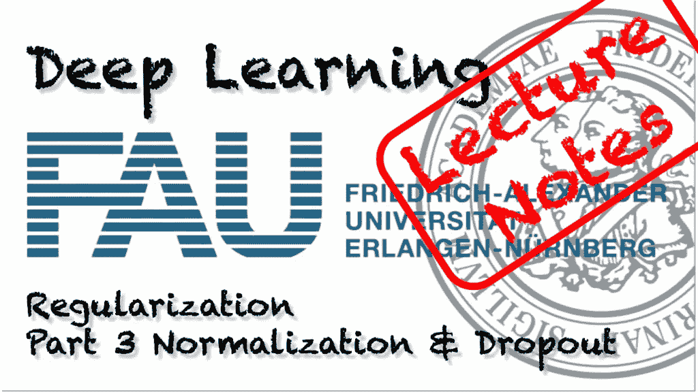
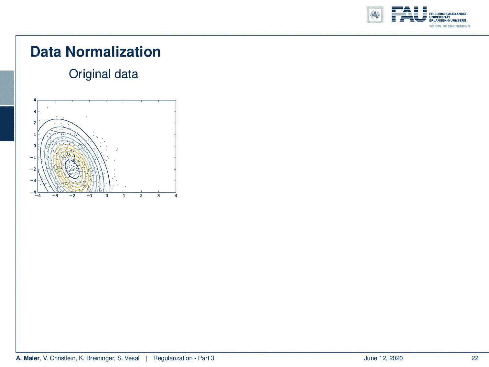
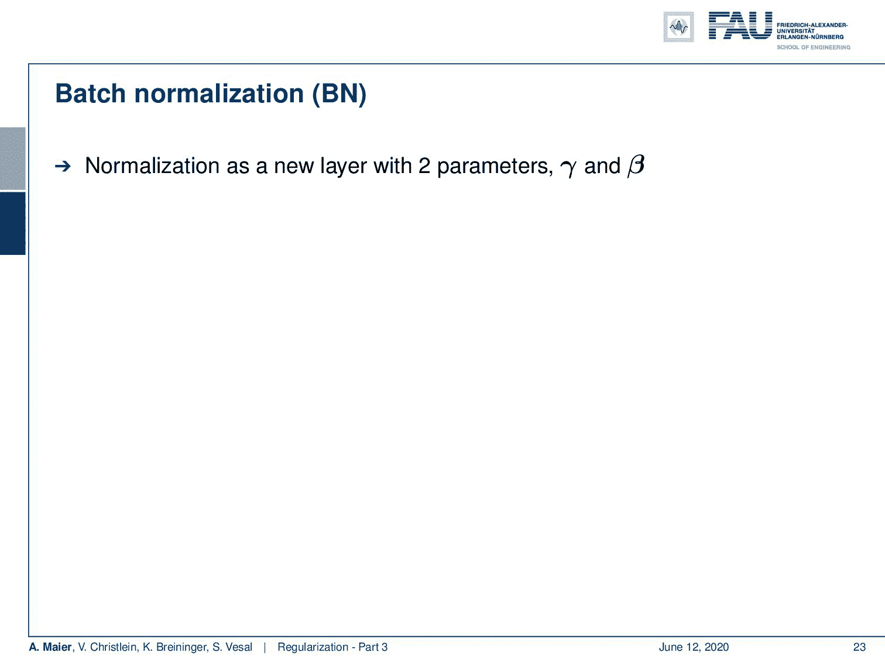
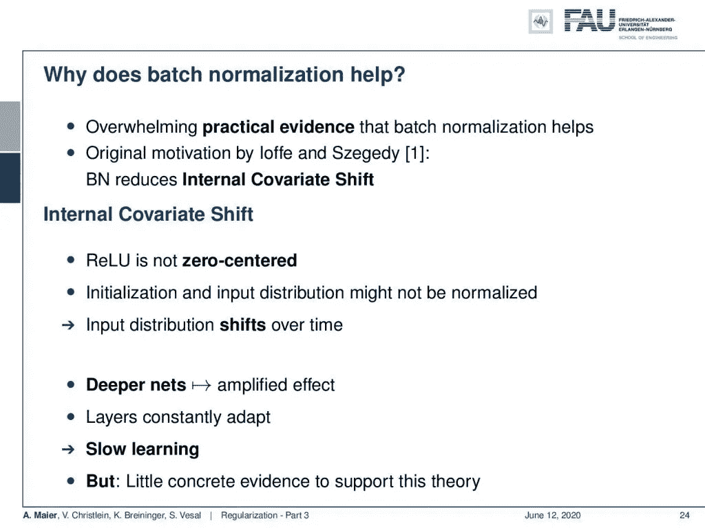
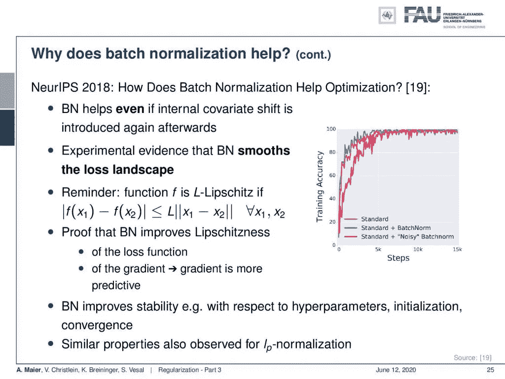
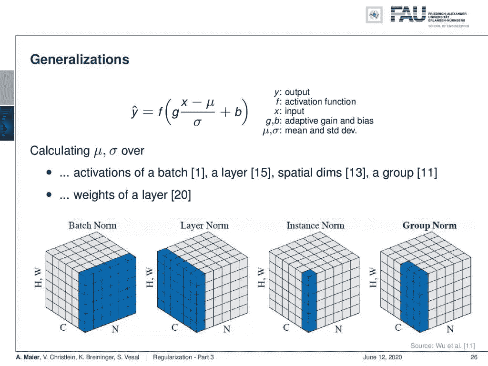
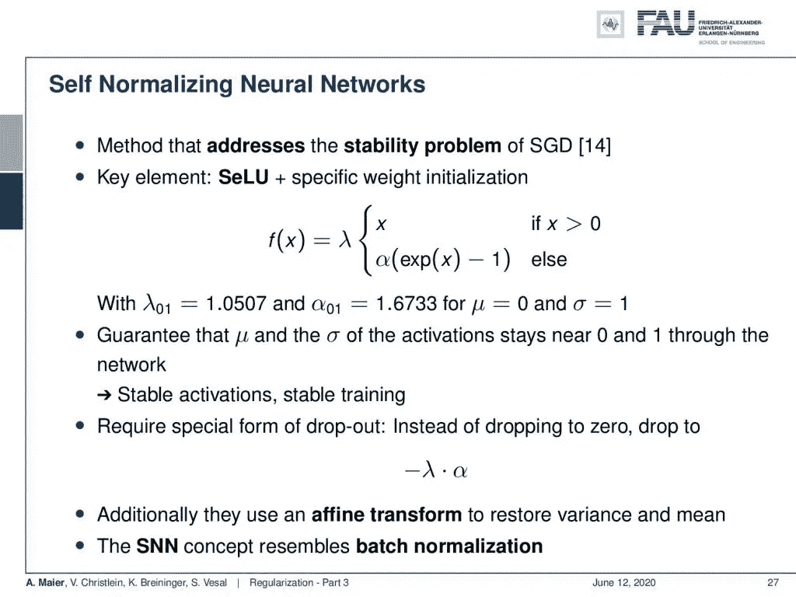
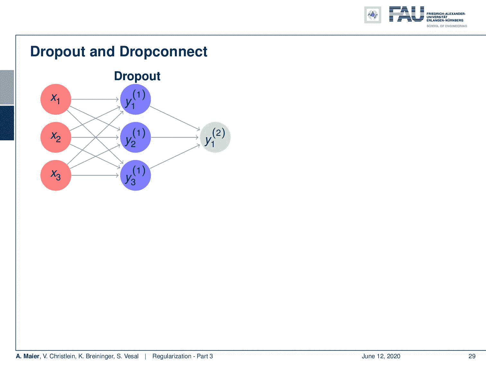

# 正规化——第 3 部分

> 原文：<https://towardsdatascience.com/regularization-part-4-2ee8e7aa60ec?source=collection_archive---------26----------------------->

## [FAU 讲座笔记](https://towardsdatascience.com/tagged/fau-lecture-notes)关于深度学习

## 正常化和辍学

FAU 大学的深度学习。下图 [CC BY 4.0](https://creativecommons.org/licenses/by/4.0/) 来自[深度学习讲座](https://www.youtube.com/watch?v=p-_Stl0t3kU&list=PLpOGQvPCDQzvgpD3S0vTy7bJe2pf_yJFj&index=1)

**这些是 FAU 的 YouTube 讲座** [**深度学习**](https://www.youtube.com/watch?v=p-_Stl0t3kU&list=PLpOGQvPCDQzvgpD3S0vTy7bJe2pf_yJFj&index=1) **的讲义。这是与幻灯片匹配的讲座视频&的完整抄本。我们希望，你喜欢这个视频一样多。当然，这份抄本是用深度学习技术在很大程度上自动创建的，只进行了少量的手动修改。如果你发现了错误，请告诉我们！**

# 航行

[**上一讲**](/regularization-part-2-5b729698d026) **/** [**观看本视频**](https://youtu.be/-175v_5w4nc) **/** [**顶级**](/all-you-want-to-know-about-deep-learning-8d68dcffc258) **/** [**下一讲**](/regularization-part-4-3518ec44ed85)

欢迎来到我们的深度学习讲座。今天我们想谈谈更多的正规化。我想介绍的第一个话题是标准化的概念。那么为什么正常化会是一个问题呢？

数据的规范化有助于将原始数据带到一个统一的空间。 [CC 下的图片来自](https://creativecommons.org/licenses/by/4.0/)[深度学习讲座](https://www.youtube.com/watch?v=p-_Stl0t3kU&list=PLpOGQvPCDQzvgpD3S0vTy7bJe2pf_yJFj&index=1)的 4.0 。

这里我们来看一些原始数据。一种典型的方法是减去平均值，然后也可以归一化方差。这非常有用，因为这样我们就在输入的预期范围内。当然，如果你做这些标准化，然后你想估计他们只对训练数据。另一种方法不仅是在网络前进行归一化，还可以在网络内进行归一化。这就引出了批处理规范化的概念。

批量标准化能够作为可训练层自动执行标准化。 [CC 下的图片来自](https://creativecommons.org/licenses/by/4.0/)[深度学习讲座](https://www.youtube.com/watch?v=p-_Stl0t3kU&list=PLpOGQvPCDQzvgpD3S0vTy7bJe2pf_yJFj&index=1)的 4.0 。

想法是引入一个新的层，参数为γ和β。γ和β用于重新调整图层的输出。在层的输入端，开始测量批次的平均值和标准差。你要做的是计算小批量的当前均值和标准差，然后用它来归一化输入的激活。因此，你有一个零均值和单位标准差。因此，这是在整个训练过程中动态计算的，然后使用可训练权重β和γ对层的输出进行缩放。您可以根据下一层的需要适当地缩放它们。因此，这个不错的功能当然只能在培训期间实现。如果您想继续进行测试，那么在完成训练后，您可以在批处理标准化层中为整个训练集计算一次平均值和标准差，并在网络的所有未来应用中保持不变。当然， **μ** 和 **σ** 是向量，它们与激活向量的维数完全相同。通常，这与卷积层成对出现。在这种情况下，通过对每个通道使用标量μ和σ，批次归一化略有不同。所以如果在卷积中使用，会有一点点不同。

批处理规范化为什么有帮助？ [CC 下的图片来自](https://creativecommons.org/licenses/by/4.0/)[深度学习讲座](https://www.youtube.com/watch?v=p-_Stl0t3kU&list=PLpOGQvPCDQzvgpD3S0vTy7bJe2pf_yJFj&index=1)的 4.0 。

你可能会争论为什么批处理规范化真的有帮助？有压倒性的实际证据表明，它确实是一个有用的工具，这最初是由内部协变量的变化所推动的。因此，确定了 ReLU 不在零中心的问题。因此，初始化和输入分布可能无法正常化。因此，输入分布会随时间而变化。在更深的网中，你甚至会得到放大的效果。因此，各层必须不断适应，这导致学习缓慢。现在，如果你仔细观察这些观察，很少有具体的证据来支持这个理论。

可以看出，批量标准化能够平滑损失情况。 [CC 下的图片来自](https://creativecommons.org/licenses/by/4.0/)[深度学习讲座](https://www.youtube.com/watch?v=p-_Stl0t3kU&list=PLpOGQvPCDQzvgpD3S0vTy7bJe2pf_yJFj&index=1)的 4.0 。

在 NeurIPS 2018 上，有一篇论文展示了批处理规范化如何帮助优化。他们表明，即使在批处理规范化层之后再次引入内部协变量移位，批处理规范化也是有效的。所以在这种情况下，批量规范化还是有帮助的。他们可以通过实验证明，这种方法平滑了损失景观。这支持优化，也有助于降低损失函数的 Lipschitzness。Lipschitz 常数是函数中出现的最高斜率。如果你改善了 Lipchitzness，这基本上意味着不再出现高斜率。因此，这符合平滑损失的原则。他们甚至可以在论文中为这个性质提供证明。因此，批处理规范化提高了超参数、初始化、收敛和类似属性的稳定性。顺便说一下，这也可以在 Lp 规范化中观察到。

批处理规范化有许多变体。来自[深度学习讲座](https://www.youtube.com/watch?v=p-_Stl0t3kU&list=PLpOGQvPCDQzvgpD3S0vTy7bJe2pf_yJFj&index=1)的 [CC BY 4.0](https://creativecommons.org/licenses/by/4.0/) 下的图片。

所以这是一种方法。批量标准化有一些概括:您可以计算批量激活、层、空间维度、组、层权重的μ和σ，我们可能会遗漏一些变化。所以它是一个非常强大的工具。

自规范化神经网络是批处理规范化的替代方法。 [CC 下的图片来自](https://creativecommons.org/licenses/by/4.0/)[深度学习讲座](https://www.youtube.com/watch?v=p-_Stl0t3kU&list=PLpOGQvPCDQzvgpD3S0vTy7bJe2pf_yJFj&index=1)的 4.0 。

另一个非常有效的工具是自归一化神经网络。它还解决了随机梯度下降的稳定性问题，这里的关键元素是我们已经在[激活函数](/lecture-notes-in-deep-learning-activations-convolutions-and-pooling-part-2-94637173a786)中讨论过的缩放指数线性单元。所以，这里我们又有了定义。通过λ和α的特定设置，我们可以确保零均值和单位标准差输入在数据输出时具有相同的均值和标准差。所以这保证了保持这些性质。那么结果是稳定的激活也导致稳定的训练。必须改变的一件事是我们将在下一段看到的退学程序。这里不是降到零，而是降到负λ乘以α。此外，他们使用仿射变换来恢复方差和均值。因此，这种自规范化神经网络概念在某种程度上也类似于批量规范化。有趣的是，它还会增加稳定性，这也是你在构建神经网络时可能需要考虑的一个好方法。

辍学及其推广下降连接。来自[深度学习讲座](https://www.youtube.com/watch?v=p-_Stl0t3kU&list=PLpOGQvPCDQzvgpD3S0vTy7bJe2pf_yJFj&index=1)的 [CC BY 4.0](https://creativecommons.org/licenses/by/4.0/) 下的图片。

现在我们已经谈到了辍学。这也是一项非常重要的技术，正在深度网络中使用。你可能要考虑的一件事是，训练中的所有因素，当然，它们是相互依赖的。因此，如果您有相关的输入，那么自适应也将以类似的方式运行。但是，如果你想要有独立的特征，让你能够识别不同的东西，那么你必须打破特征之间的相关性，这实际上可以通过辍学来实现。它的基本思想是，你随机杀死一些神经元，并把它们设置为零。因此，您选择一个概率 p，并将随机激活设置为零，概率为 1 — p。然后，在测试期间，您必须将所有激活乘以 p，否则，下一层的激活会过高。所以你必须在测试时补偿这种下降效应。在这个例子中，假设 y₁和 y₂是相关的，所以它们携带相同的信息和权重。现在，如果我使用它们并试图训练它们，它们将永远学不到别的东西，因为它们总是产生相同的输出。因此，在反向传播中，它们将获得相同的更新项。因此，它们将始终保持关联。现在如果你引入这个退出程序，你会随机杀死一些神经元。这意味着在训练过程中，重量被拉向不同的方向。因此，它们将不再相关。因此，你可以使用 dropout 来打破这些内部相关性，这已经证明可以减少过度拟合的问题。这确实是一个非常重要的概念，在深度学习中经常使用。还有一个有趣的概括是 dropconnect。这里，你没有杀死单个神经元的所有激活，但是你杀死了单个的连接。因此，您可以随机确定设置为零的连接。这可以被视为辍学的一种概括，因为你有更多不同的方式来调整它。通常，这种实现效率不高，因为您必须像屏蔽一样实现它。更简单的方法是将其中一个激活设置为零。

在这个深度学习讲座中，更多令人兴奋的事情即将到来。 [CC 下的图片来自](https://creativecommons.org/licenses/by/4.0/)[深度学习讲座](https://www.youtube.com/watch?v=p-_Stl0t3kU&list=PLpOGQvPCDQzvgpD3S0vTy7bJe2pf_yJFj&index=1)的 4.0 。

好了，我们已经讨论了这些常见的概念和规范化，但这并不是所有的技巧。我们袖子里还有几张牌。所以这些技巧我会在下节课展示给你们。非常感谢您的收听，再见！

如果你喜欢这篇文章，你可以在这里找到更多的文章，或者看看我们的讲座。如果你想在未来了解更多的文章、视频和研究，我也会很感激关注 [YouTube](https://www.youtube.com/c/AndreasMaierTV) 、 [Twitter](https://twitter.com/maier_ak) 、[脸书](https://www.facebook.com/andreas.maier.31337)或 [LinkedIn](https://www.linkedin.com/in/andreas-maier-a6870b1a6/) 。本文以 [Creative Commons 4.0 归属许可](https://creativecommons.org/licenses/by/4.0/deed.de)发布，如果引用，可以转载和修改。

# 链接

[链接](https://www.springer.com/us/book/9780387310732) —关于最大后验概率估计和偏差-方差分解的详细信息
[链接](https://arxiv.org/abs/1206.5533) —关于正则化实用建议的综合文本
[链接](http://citeseerx.ist.psu.edu/viewdoc/download?doi=10.1.1.207.2059&rep=rep1&type=pdf) —关于校准方差的论文

# 参考

[1]谢尔盖·约菲和克里斯蒂安·塞格迪。“批量标准化:通过减少内部协变量转移加速深度网络训练”。《第 32 届机器学习国际会议论文集》。2015 年，第 448–456 页。乔纳森·巴克斯特。“通过多任务抽样学习的贝叶斯/信息论模型”。摘自:机器学习 28.1(1997 年 7 月)，第 7-39 页。
【3】克里斯托弗·m·毕晓普。模式识别和机器学习(信息科学和统计学)。美国新泽西州 Secaucus 出版社:纽约斯普林格出版社，2006 年。
[4]理查德·卡鲁阿纳。多任务学习:归纳偏差的知识来源。收录于:第十届机器学习国际会议论文集。摩根·考夫曼，1993 年，第 41-48 页。
【5】Andre Esteva，Brett Kuprel，Roberto A Novoa，等《深度神经网络的皮肤癌皮肤科医生级分类》。载于:自然 542.7639 (2017)，第 115–118 页。
[6]丁俊钦、徐俊卿、陶行知。“多任务姿态不变人脸识别”。载于:IEEE 图像处理汇刊 24.3(2015 年 3 月)，第 980–993 页。
[7]李万，马修·泽勒，张思欣，等，“用下降连接实现神经网络的正则化”。载于:《第 30 届机器学习国际会议论文集》(ICML，2013 年)，第 1058-1066 页。
[8] Nitish Srivastava，Geoffrey E Hinton，Alex Krizhevsky，等人，“辍学:防止神经网络过度拟合的简单方法。”载于:《机器学习研究杂志》15.1 (2014)，第 1929–1958 页。
[9]r . o .杜达、P. E .哈特和 D. G .施托克。模式分类。约翰威利父子公司，2000 年。
[10]伊恩·古德菲勒、约舒阿·本吉奥和亚伦·库维尔。深度学习。http://www.deeplearningbook.org。麻省理工学院出版社，2016 年。
【11】与何。“群体常态化”。载于:arXiv 预印本 arXiv:1803.08494 (2018)。
【12】何，，任等，“深入挖掘整流器:在 imagenet 分类上超越人类水平的表现”。IEEE 计算机视觉国际会议论文集。2015 年，第 1026–1034 页。
【13】D 乌里扬诺夫，A 韦达尔迪，以及 VS 伦皮茨基。实例规范化:快速风格化缺少的要素。CoRR ABS/1607.0[14]günter Klambauer，Thomas Unterthiner，Andreas Mayr 等，“自规范化神经网络”。在:神经信息处理系统的进展。abs/1706.02515 卷。2017.arXiv: 1706.02515。吉米·巴雷、杰米·瑞安·基罗斯和杰弗里·E·辛顿。“图层规范化”。载于:arXiv 预印本 arXiv:1607.06450 (2016)。
【16】Nima Tajbakhsh，Jae Y Shin，Suryakanth R Gurudu，等，“用于医学图像分析的卷积神经网络:完全训练还是微调？”载于:IEEE 医学成像汇刊 35.5 (2016)，第 1299–1312 页。
【17】约书亚·本吉奥。“深度架构基于梯度训练的实用建议”。《神经网络:交易的诀窍》。斯普林格出版社，2012 年，第 437-478 页。
[18]张，Samy Bengio，Moritz Hardt 等，“理解深度学习需要反思泛化”。载于:arXiv 预印本 arXiv:1611.03530 (2016)。
[19]什巴尼·桑图尔卡，迪米特里斯·齐普拉斯，安德鲁·易勒雅斯等，“批处理规范化如何帮助优化？”在:arXiv e-prints，arXiv:1805.11604(2018 年 5 月)，arXiv:1805.11604。arXiv:1805.11604[统计。ML】。
[20]蒂姆·萨利曼斯和迪德里克·P·金马。“权重标准化:加速深度神经网络训练的简单重新参数化”。神经信息处理系统进展 29。柯伦咨询公司，2016 年，第 901–909 页。
【21】泽维尔·格洛特和约舒阿·本吉奥。“理解训练深度前馈神经网络的困难”。摘自:2010 年第十三届国际人工智能会议论文集，第 249-256 页。
【22】，罗平，陈改来，等，“基于深度多任务学习的人脸标志点检测”。载于:计算机视觉— ECCV 2014 年:第 13 届欧洲会议，瑞士苏黎世，Cham: Springer 国际出版公司，2014 年，第 94–108 页。