# 正规化——第 4 部分

> 原文：<https://towardsdatascience.com/regularization-part-4-3518ec44ed85?source=collection_archive---------62----------------------->

## [FAU 讲座笔记](https://towardsdatascience.com/tagged/fau-lecture-notes)关于深度学习

## 初始化和迁移学习

FAU 大学的深度学习。下图 [CC BY 4.0](https://creativecommons.org/licenses/by/4.0/) 来自[深度学习讲座](https://www.youtube.com/watch?v=p-_Stl0t3kU&list=PLpOGQvPCDQzvgpD3S0vTy7bJe2pf_yJFj&index=1)

**这些是 FAU 的 YouTube 讲座** [**深度学习**](https://www.youtube.com/watch?v=p-_Stl0t3kU&list=PLpOGQvPCDQzvgpD3S0vTy7bJe2pf_yJFj&index=1) **的讲义。这是与幻灯片匹配的讲座视频&的完整抄本。我们希望，你喜欢这个视频一样多。当然，这份抄本是用深度学习技术在很大程度上自动创建的，只进行了少量的手动修改。如果你发现了错误，请告诉我们！**

# 航行

[**上一讲**](/regularization-part-4-2ee8e7aa60ec) **/** [**观看本视频**](https://youtu.be/sXCpj6sfxBc) **/** [**顶级**](/all-you-want-to-know-about-deep-learning-8d68dcffc258) **/** [**下一讲**](/regularization-part-5-b4019720b020)

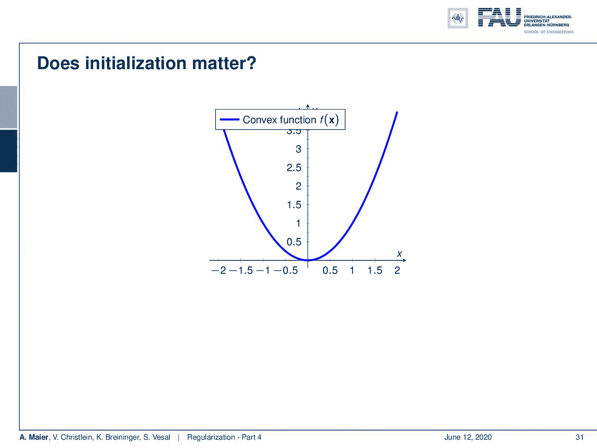

在凸问题中，初始化不起作用。 [CC 下的图片来自](https://creativecommons.org/licenses/by/4.0/)[深度学习讲座](https://www.youtube.com/watch?v=p-_Stl0t3kU&list=PLpOGQvPCDQzvgpD3S0vTy7bJe2pf_yJFj&index=1)的 4.0 。

欢迎回到深度学习！所以今天，我们想看看一些初始化技术，它们将在你使用深度学习网络的整个工作中非常方便。所以，你可能会想，如果你有一个凸函数，为什么初始化很重要，实际上，这一点都不重要，因为你沿着负梯度方向，你总是会找到全局最小值。所以，凸优化没有问题。

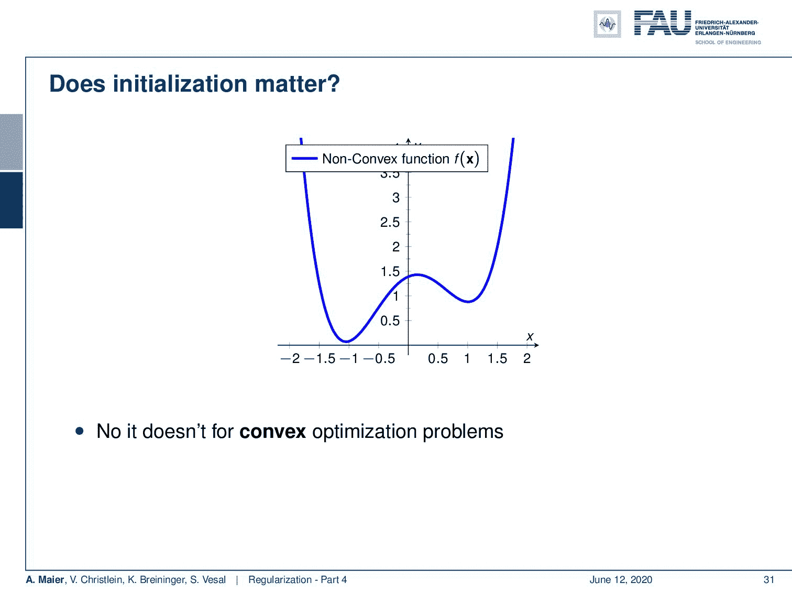

在非凸问题中，初始化可以起到很大的作用。 [CC 下的图片来自](https://creativecommons.org/licenses/by/4.0/)[深度学习讲座](https://www.youtube.com/watch?v=p-_Stl0t3kU&list=PLpOGQvPCDQzvgpD3S0vTy7bJe2pf_yJFj&index=1)的 4.0 。

然而，我们正在处理的许多问题是非凸的。非凸函数可能有不同的局部最小值。如果我从这一点开始，你可以看到我通过优化得到了一个局部最小值。但是如果我从这里开始，你可以看到，我会得到一个非常不同的局部最小值。所以对于非凸问题，初始化其实是一件大事。具有非线性的神经网络通常是非凸的。

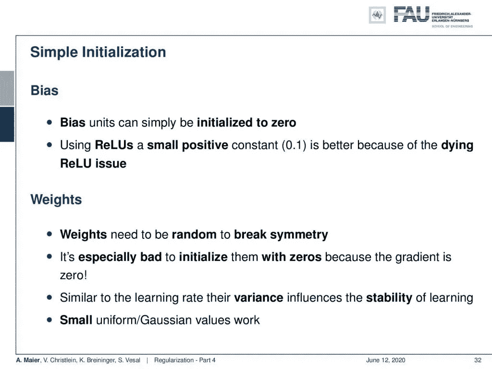

初始化的简单思路。来自[深度学习讲座](https://www.youtube.com/watch?v=p-_Stl0t3kU&list=PLpOGQvPCDQzvgpD3S0vTy7bJe2pf_yJFj&index=1)的 [CC BY 4.0](https://creativecommons.org/licenses/by/4.0/) 下的图片。

那么，有什么办法呢？当然，你必须做一些初始化工作。对于偏差，您可以很容易地开始并将它们初始化为 0。这是非常典型的。请记住，如果您正在处理一个 ReLU，您可能希望从一个小的正常数开始，这样会更好，因为会出现 ReLU 问题。对于权重，你需要随机打破对称。我们已经有这个问题了。在辍学，我们看到我们需要额外的正规化，以打破对称性。同样，用零初始化它们也是非常糟糕的，因为这样梯度也是零。所以，这是你不想做的事情。类似于学习率，它们的方差影响学习过程的稳定性。小的均匀高斯值有效。

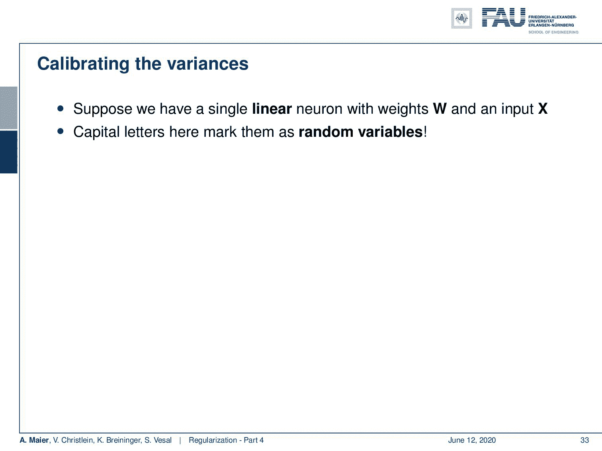

如何校准差异？ [CC 下的图片来自](https://creativecommons.org/licenses/by/4.0/)[深度学习讲座](https://www.youtube.com/watch?v=p-_Stl0t3kU&list=PLpOGQvPCDQzvgpD3S0vTy7bJe2pf_yJFj&index=1)的 4.0 。

现在，你可能想知道我们如何校准这些差异。让我们假设我们有一个单线性神经元，其权重为 **W** ，输入为 **X** 。记住这里的大写字母把它们标为随机变量。然后，你可以看到输出是 **W** 乘以 **X** 。这是各个输入加上一些偏置的线性组合。现在，我们对 Y 的方差感兴趣。如果我们假设 **W** 和 **X** 是独立的，那么每个产品的方差实际上可以被计算为 **X** 的期望值是 **W** 方差的 2 次幂加上 **W** 的期望值是 **X** 方差的 2 次幂，然后你将两个随机变量的方差相加。现在，如果我们要求 **W** 和 **X** 的平均值为 0，那么这将简化整个问题。平均值是 0，所以期望值抵消了，我们的方差就是两个方差的乘积。现在，我们假设 X 下标 n 和 W 下标 n 是独立同分布的。在这种特殊情况下，我们可以看到，这里的 N 代表了我们的方差。因此，它实际上取决于您对图层的输入数量。这是方差与 W 下标 n 的比例，所以，你看到权重非常重要。实际上，你拥有的权重越多，方差就越大。

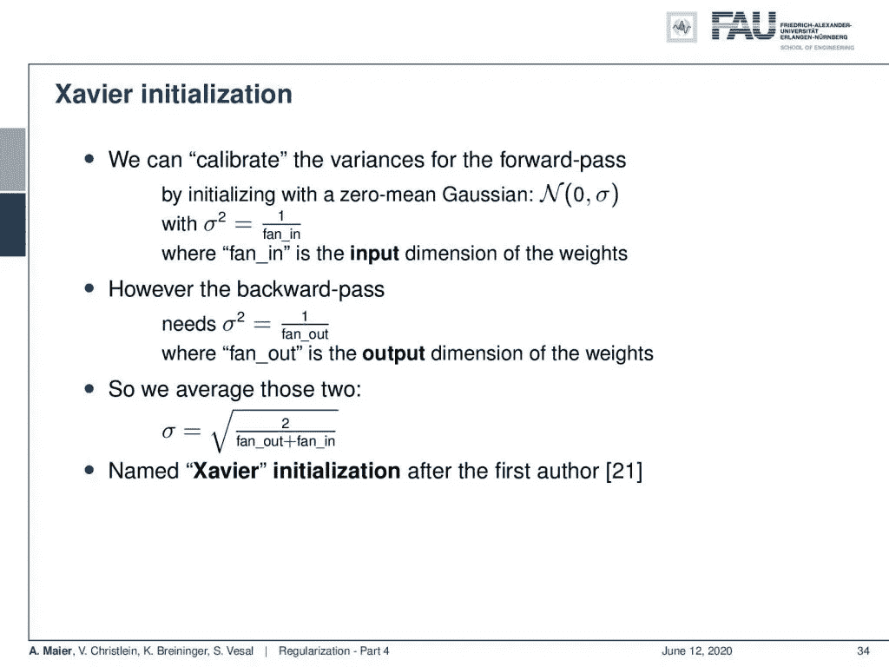

Xavier 初始化会考虑重量的变化。 [CC 下的图片来自](https://creativecommons.org/licenses/by/4.0/)[深度学习讲座](https://www.youtube.com/watch?v=p-_Stl0t3kU&list=PLpOGQvPCDQzvgpD3S0vTy7bJe2pf_yJFj&index=1)的 4.0 。

因此，我们可以使用 Xavier 初始化。因此，我们校准向前传递的方差。我们使用零均值高斯函数进行初始化，只需将 fan_in 上的标准差设置为 1，其中 fan_in 是权重的输入维度。因此，我们简单地将输入维数的方差缩放为 1。然而，在向后传递中，我们需要同样的向后效果。因此，我们必须用 1 除以 fan_out 来调整标准差，其中 fan_out 是权重的输出维度。所以，你只要把这两个平均，然后计算一个新的标准差。这个初始化是在[21]的第一个作者之后调用的。好吧，还能做什么？

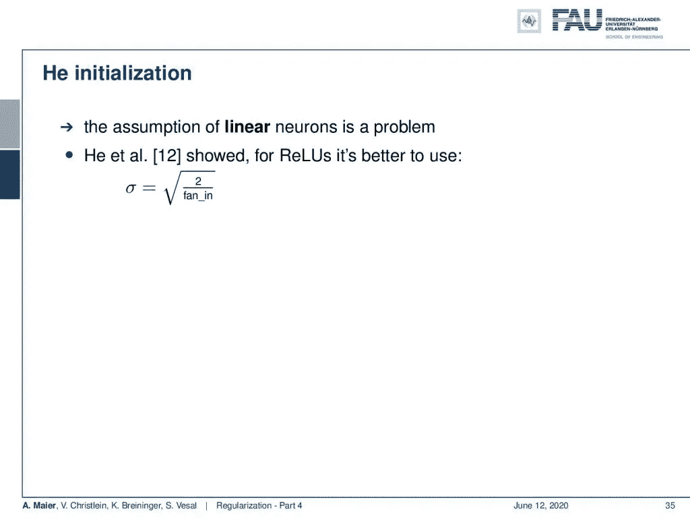

有了 ReLUs，初始化就有优势了。 [CC 下的图片来自](https://creativecommons.org/licenses/by/4.0/)[深度学习讲座](https://www.youtube.com/watch?v=p-_Stl0t3kU&list=PLpOGQvPCDQzvgpD3S0vTy7bJe2pf_yJFj&index=1)的 4.0 。

还有初始化，然后也考虑到线性神经元的假设是一个问题。所以在[12]中，他们表明对于 ReLUs，实际上最好用 2 的平方根除以 fan_in 作为标准差。因此，这是一个非常典型的随机初始化权重的选择。

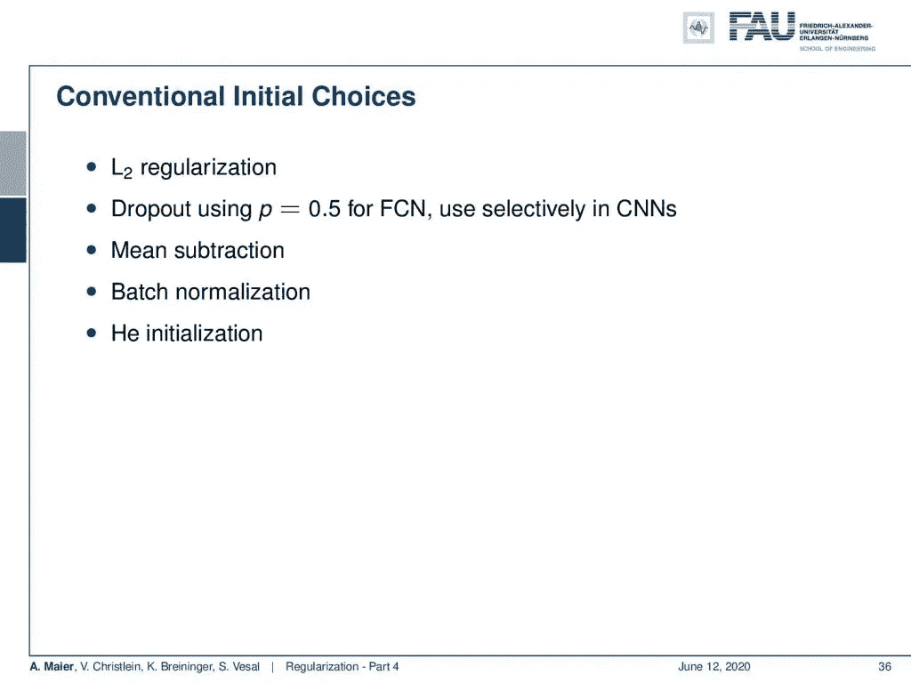

初始化时的其他常规选择。来自[深度学习讲座](https://www.youtube.com/watch?v=p-_Stl0t3kU&list=PLpOGQvPCDQzvgpD3S0vTy7bJe2pf_yJFj&index=1)的 [CC BY 4.0](https://creativecommons.org/licenses/by/4.0/) 下的图片。

然后，其他常规的初始选择是进行 L2 正则化，对完全连接的层使用概率为 0.5 的下降，并在卷积神经网络中选择性地使用它们。你的意思是减法，批量标准化，和初始化。这是非常典型的设置。

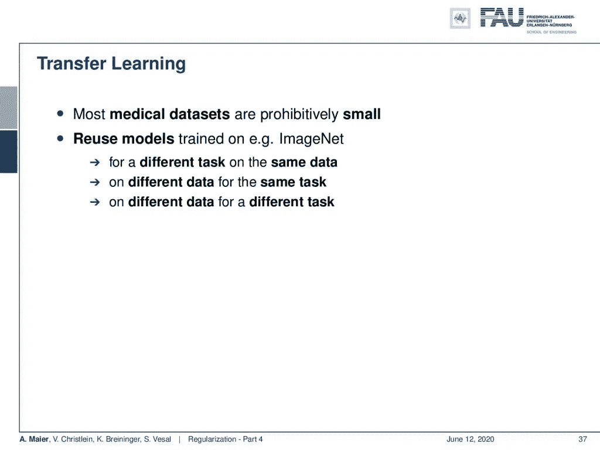

迁移学习试图重用以前培训设置中的知识。 [CC 下的图片来自](https://creativecommons.org/licenses/by/4.0/)[深度学习讲座](https://www.youtube.com/watch?v=p-_Stl0t3kU&list=PLpOGQvPCDQzvgpD3S0vTy7bJe2pf_yJFj&index=1)的 4.0 。

那么我们还剩下哪些技巧呢？一个重要的技巧是迁移学习。现在，迁移学习通常用在所有数据很少的情况下。一个例子是医疗数据。在那里，你通常只有很少的数据。因此，这个想法是重用模型，例如，在 ImageNet 上训练的模型。您甚至可以针对相同的数据重用在不同的任务中训练过的东西。您也可以在同一任务中使用不同的数据，甚至可以在不同的任务中使用不同的数据。

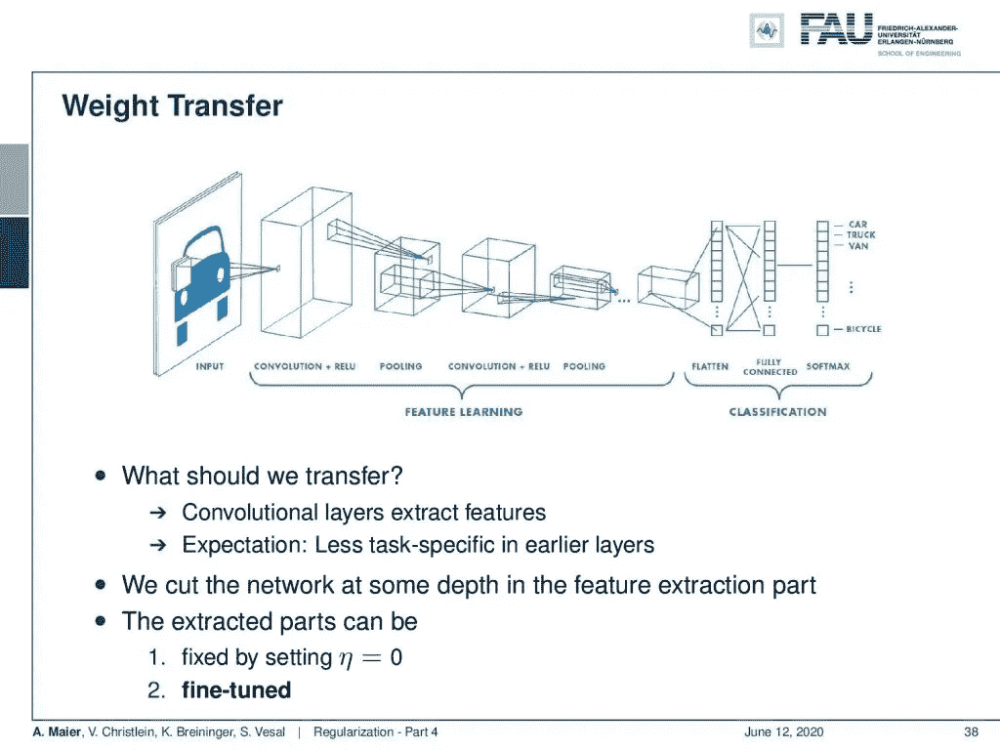

权重迁移是迁移学习的常见选择。来自[深度学习讲座](https://www.youtube.com/watch?v=p-_Stl0t3kU&list=PLpOGQvPCDQzvgpD3S0vTy7bJe2pf_yJFj&index=1)的 4.0CC 下的图片。

所以现在的问题是我们应该转移什么？好吧，卷积层提取特征，现在的期望是较少的特定于任务的特征在较早的层中。我们在几篇论文中看到过。我们还可以在[中看到我们的可视化视频](https://youtu.be/o9qg7BmNVSQ)。所以通常情况下，那些有更多的基本信息，并可能包含值得传输的信息。我们在特征提取部分对网络进行一定深度的切割。对于那些提取出来的部分，我们可以把学习率固定为零。所以，如果我们把它设置为零，它们不会改变。到时候就可以开始微调了。

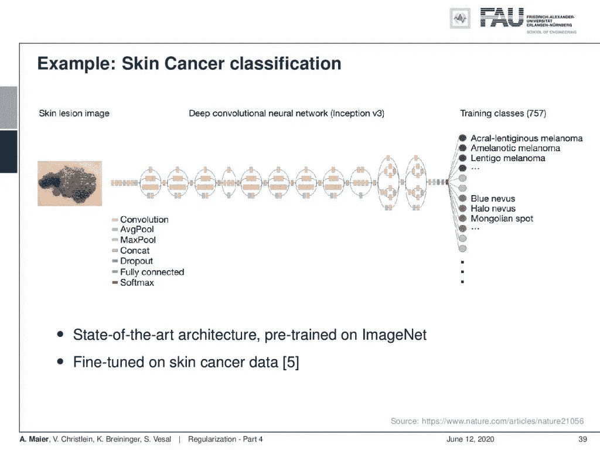

迁移学习的一个例子见[5]。来自[深度学习讲座](https://www.youtube.com/watch?v=p-_Stl0t3kU&list=PLpOGQvPCDQzvgpD3S0vTy7bJe2pf_yJFj&index=1)的 [CC BY 4.0](https://creativecommons.org/licenses/by/4.0/) 下的图片。

这里的一个例子是皮肤癌分类。他们使用基于 Inception V3 的深度卷积神经网络。他们有一个在 ImageNet 上预先训练过的最先进的架构。然后，他们根据皮肤癌数据对其进行微调。因此，它们本质上是网络，而你要替换的本质上是右边的部分。这些课程的培训是你在 ImageNet 上找不到的。所以，你必须替换整个网络，因为你想预测非常不同的类。然后，您可以使用两个完全连接的图层将您学习到的要素制图表达映射到不同的空间。然后，你可以从那里做一个分类。

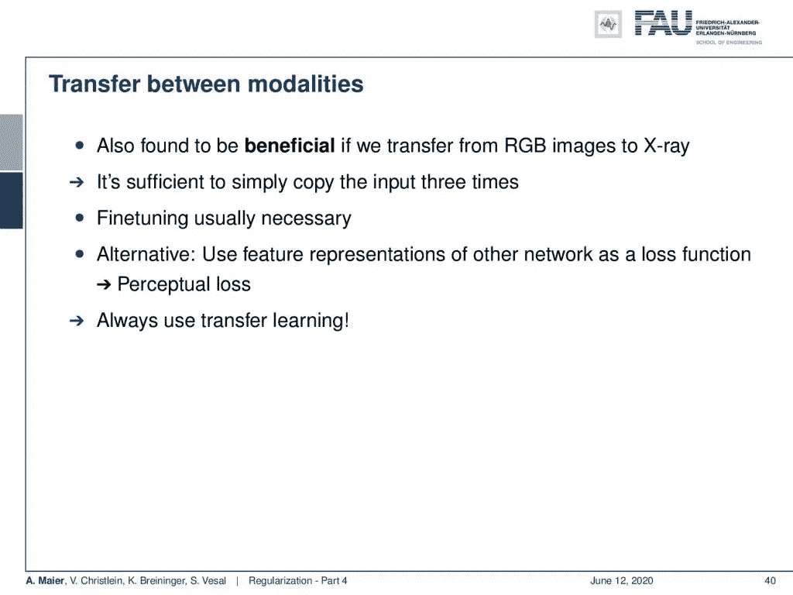

许多其他转移也是可能的。来自[深度学习讲座](https://www.youtube.com/watch?v=p-_Stl0t3kU&list=PLpOGQvPCDQzvgpD3S0vTy7bJe2pf_yJFj&index=1)的 4.0CC 下的图片。

还有模态之间的转换。这也被发现是有益的。现在，您可以从彩色转换到 x 射线，这里只需简单地复制输入三次就足够了。那么，你就不需要那么多微调了。所以，这个效果很好。一种替代方法是使用其他网络的要素制图表达作为损失函数。这就导致了知觉的丧失。我们将在另一个视频中讨论感知损失[。在任何情况下，迁移学习通常是一个非常好的主意。有许多应用和论文都使用了迁移学习。很久以前他们不说迁移学习而是说适应。特别是在语音处理方面，他们有说话人和噪声适应等等。但是现在你说迁移学习。本质上是同一个概念。](https://youtu.be/fXO1fOXnOTI)

在这个深度学习讲座中，更多令人兴奋的事情即将到来。来自[深度学习讲座](https://www.youtube.com/watch?v=p-_Stl0t3kU&list=PLpOGQvPCDQzvgpD3S0vTy7bJe2pf_yJFj&index=1)的 [CC BY 4.0](https://creativecommons.org/licenses/by/4.0/) 下的图片。

下一次在深度学习中，我们将讨论交易和正规化的剩余技巧。我期待着在下一次讲座中见到你。非常感谢您的收听，再见！

如果你喜欢这篇文章，你可以在这里找到更多的文章，或者看看我们的讲座。如果你想在未来了解更多的文章、视频和研究，我也会很感激关注 [YouTube](https://www.youtube.com/c/AndreasMaierTV) 、 [Twitter](https://twitter.com/maier_ak) 、[脸书](https://www.facebook.com/andreas.maier.31337)或 [LinkedIn](https://www.linkedin.com/in/andreas-maier-a6870b1a6/) 。本文以 [Creative Commons 4.0 归属许可](https://creativecommons.org/licenses/by/4.0/deed.de)发布，如果引用，可以转载和修改。

# 链接

[链接](https://www.springer.com/us/book/9780387310732) —关于最大后验概率估计和偏差-方差分解的详细信息
[链接](https://arxiv.org/abs/1206.5533) —关于正则化实用建议的综合文本
[链接](http://citeseerx.ist.psu.edu/viewdoc/download?doi=10.1.1.207.2059&rep=rep1&type=pdf) —关于校准方差的论文

# 参考

[1]谢尔盖·约菲和克里斯蒂安·塞格迪。“批量标准化:通过减少内部协变量转移加速深度网络训练”。载于:第 32 届机器学习国际会议论文集。2015 年，第 448–456 页。乔纳森·巴克斯特。“通过多任务抽样学习的贝叶斯/信息论模型”。摘自:机器学习 28.1(1997 年 7 月)，第 7-39 页。
【3】克里斯托弗·m·毕晓普。模式识别和机器学习(信息科学和统计学)。美国新泽西州 Secaucus 出版社:纽约斯普林格出版社，2006 年。
[4]理查德·卡鲁阿纳。多任务学习:归纳偏差的知识来源。收录于:第十届机器学习国际会议论文集。摩根·考夫曼，1993 年，第 41-48 页。
【5】Andre Esteva，Brett Kuprel，Roberto A Novoa，等《深度神经网络的皮肤癌皮肤科医生级分类》。载于:自然 542.7639 (2017)，第 115–118 页。
[6]丁俊钦、徐俊卿、陶行知。“多任务姿态不变人脸识别”。载于:IEEE 图像处理汇刊 24.3(2015 年 3 月)，第 980–993 页。
[7]李万，马修·泽勒，张思欣，等，“用下降连接实现神经网络的正则化”。载于:《第 30 届机器学习国际会议论文集》(ICML，2013 年)，第 1058-1066 页。
[8] Nitish Srivastava，Geoffrey E Hinton，Alex Krizhevsky，等人，“辍学:防止神经网络过度拟合的简单方法。”载于:《机器学习研究杂志》15.1 (2014)，第 1929–1958 页。
[9]r . o .杜达、P. E .哈特和 D. G .施托克。模式分类。约翰威利父子公司，2000 年。
[10]伊恩·古德菲勒、约舒阿·本吉奥和亚伦·库维尔。深度学习。http://www.deeplearningbook.org。麻省理工学院出版社，2016 年。
【11】与何。“群体常态化”。载于:arXiv 预印本 arXiv:1803.08494 (2018)。
【12】何，，任等，“深入挖掘整流器:在 imagenet 分类上超越人类水平的表现”。IEEE 计算机视觉国际会议论文集。2015 年，第 1026–1034 页。
【13】D 乌里扬诺夫，A 韦达尔迪，以及 VS 伦皮茨基。实例规范化:快速风格化缺少的要素。CoRR ABS/1607.0[14]günter Klambauer，Thomas Unterthiner，Andreas Mayr 等，“自规范化神经网络”。在:神经信息处理系统的进展。abs/1706.02515 卷。2017.arXiv: 1706.02515。吉米·巴雷、杰米·瑞安·基罗斯和杰弗里·E·辛顿。“图层规范化”。载于:arXiv 预印本 arXiv:1607.06450 (2016)。
【16】Nima Tajbakhsh，Jae Y Shin，Suryakanth R Gurudu，等，“用于医学图像分析的卷积神经网络:完全训练还是微调？”载于:IEEE 医学成像汇刊 35.5 (2016)，第 1299–1312 页。
【17】约书亚·本吉奥。“深度架构基于梯度训练的实用建议”。《神经网络:交易的诀窍》。斯普林格出版社，2012 年，第 437-478 页。
[18]张，Samy Bengio，Moritz Hardt 等，“理解深度学习需要反思泛化”。载于:arXiv 预印本 arXiv:1611.03530 (2016)。
[19]什巴尼·桑图尔卡，迪米特里斯·齐普拉斯，安德鲁·易勒雅斯等，“批处理规范化如何帮助优化？”在:arXiv e-prints，arXiv:1805.11604(2018 年 5 月)，arXiv:1805.11604。arXiv:1805.11604[统计。ML】。
[20]蒂姆·萨利曼斯和迪德里克·P·金马。“权重标准化:加速深度神经网络训练的简单重新参数化”。神经信息处理系统进展 29。柯伦咨询公司，2016 年，第 901–909 页。
【21】泽维尔·格洛特和约舒阿·本吉奥。“理解训练深度前馈神经网络的困难”。摘自:2010 年第十三届国际人工智能会议论文集，第 249-256 页。
【22】，罗平，陈改来，等，“基于深度多任务学习的人脸标志点检测”。载于:计算机视觉— ECCV 2014 年:第 13 届欧洲会议，瑞士苏黎世，Cham: Springer 国际出版公司，2014 年，第 94–108 页。