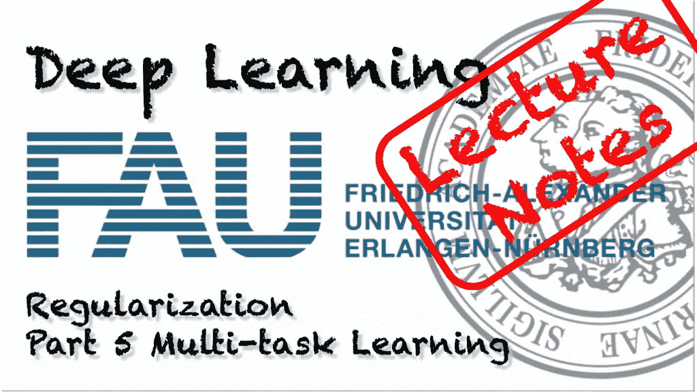
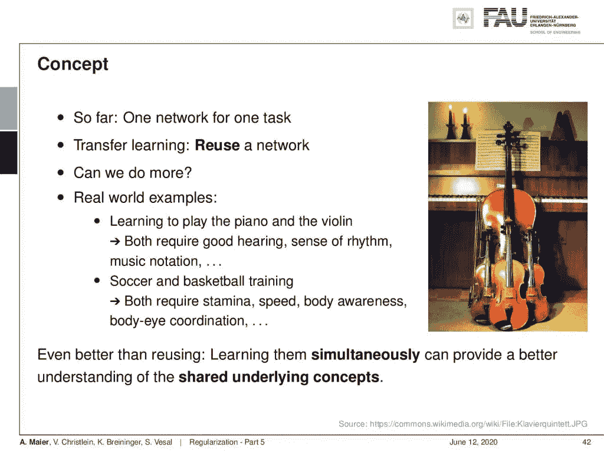
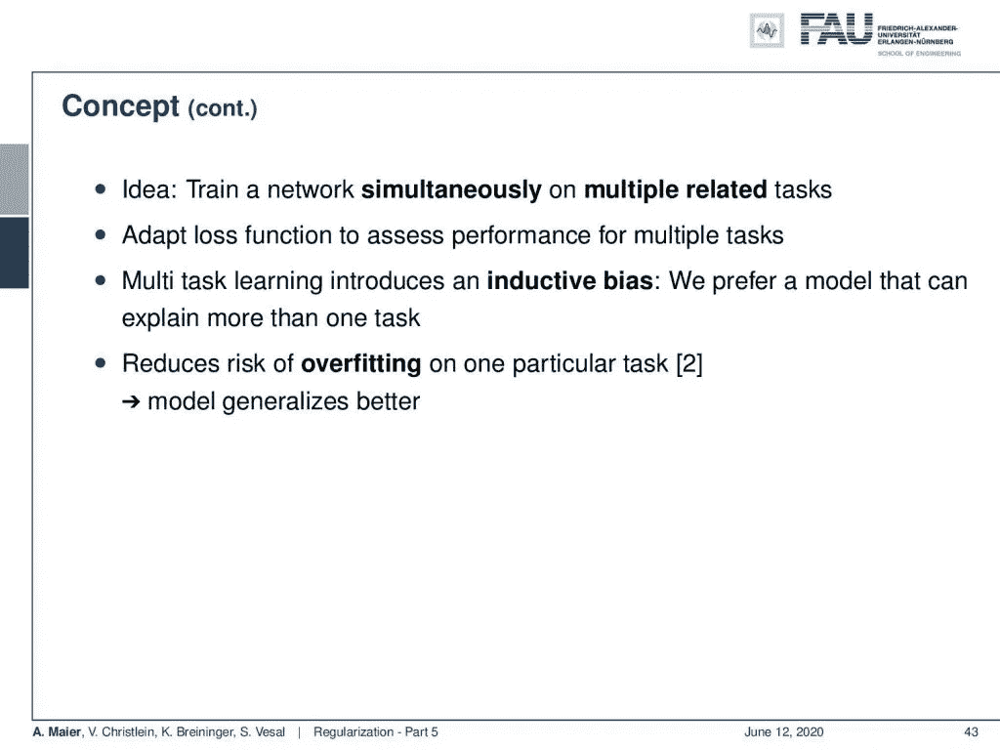
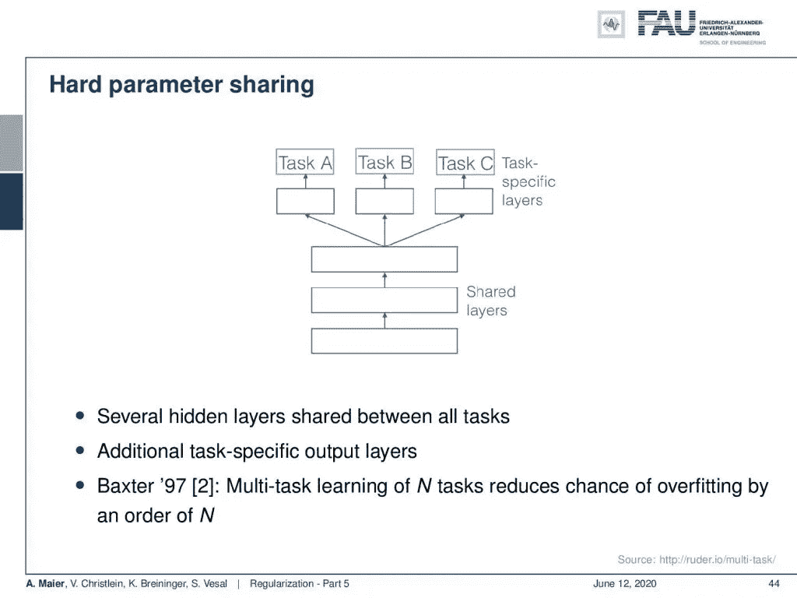
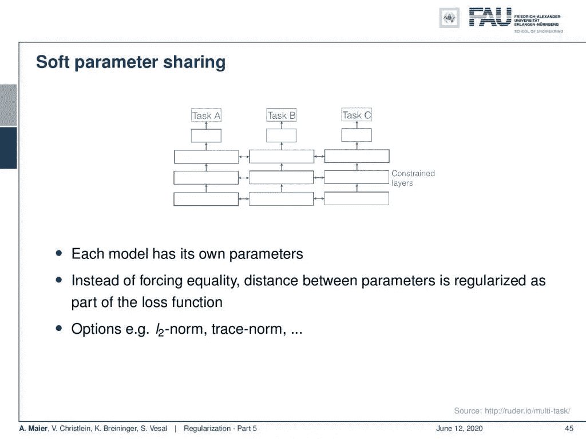
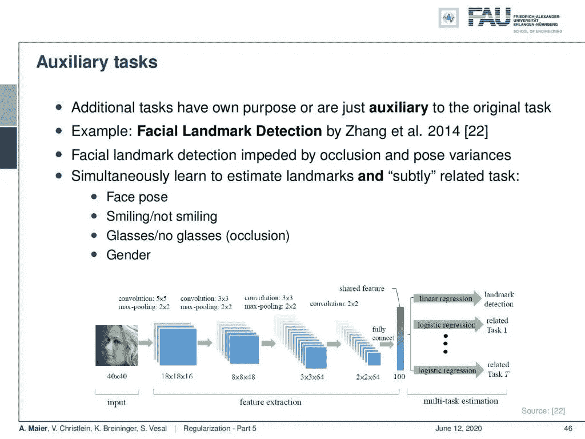
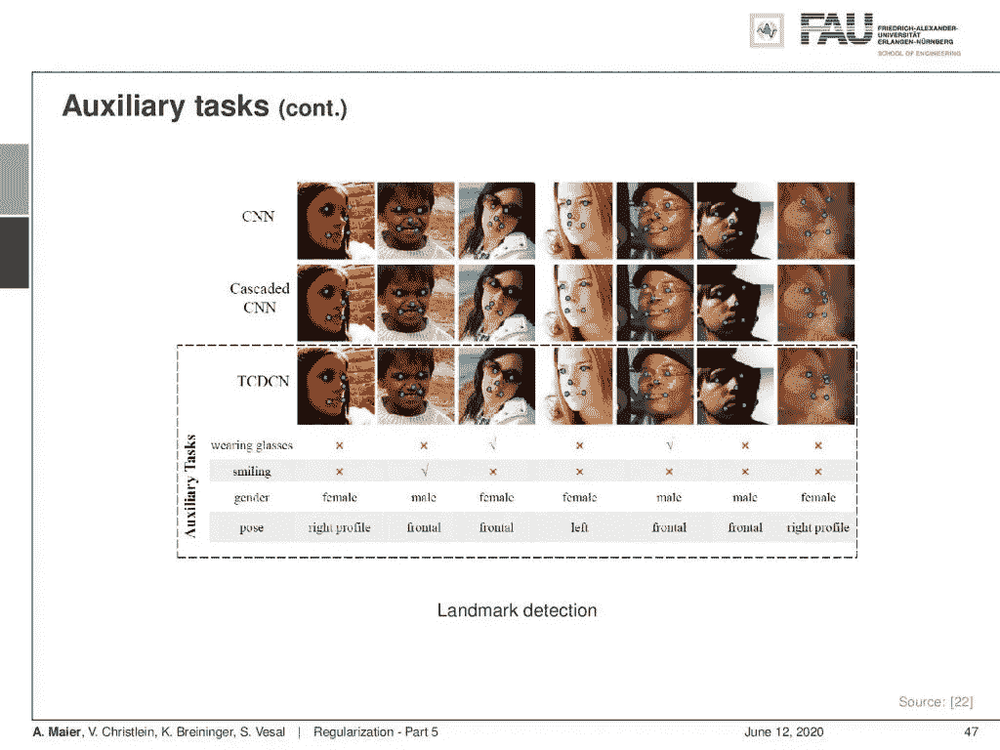
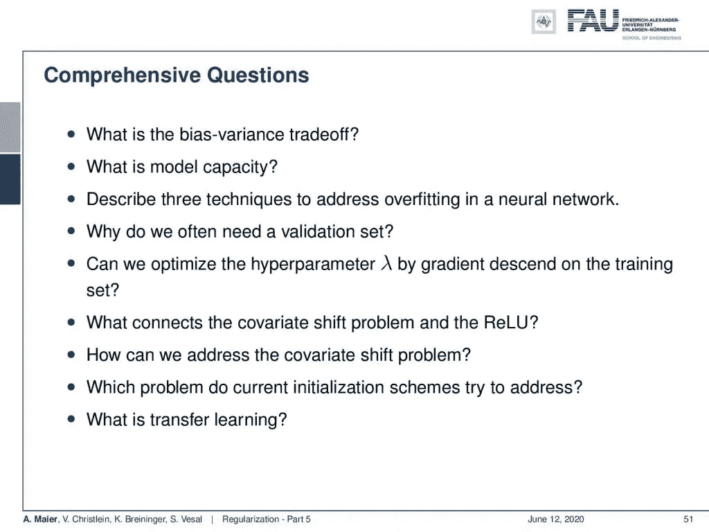

# 正规化—第 5 部分

> 原文：<https://towardsdatascience.com/regularization-part-5-b4019720b020?source=collection_archive---------54----------------------->

## [FAU 讲座笔记](https://towardsdatascience.com/tagged/fau-lecture-notes)关于深度学习

## 多任务学习

FAU 大学的深度学习。下图 [CC BY 4.0](https://creativecommons.org/licenses/by/4.0/) 来自[深度学习讲座](https://www.youtube.com/watch?v=p-_Stl0t3kU&list=PLpOGQvPCDQzvgpD3S0vTy7bJe2pf_yJFj&index=1)

**这些是 FAU 的 YouTube 讲座** [**深度学习**](https://www.youtube.com/watch?v=p-_Stl0t3kU&list=PLpOGQvPCDQzvgpD3S0vTy7bJe2pf_yJFj&index=1) **的讲义。这是与幻灯片匹配的讲座视频&的完整抄本。我们希望，你喜欢这个视频一样多。当然，这份抄本是用深度学习技术在很大程度上自动创建的，只进行了少量的手动修改。如果你发现了错误，请告诉我们！**

# 航行

[**上一讲**](/regularization-part-4-3518ec44ed85) **/** [**观看本视频**](https://youtu.be/ytToIeZnJZo) **/** [**顶级**](/all-you-want-to-know-about-deep-learning-8d68dcffc258) **/** [**下一讲**](/common-practices-part-1-6a7c1b2eb6d4)

多任务学习的概念。 [CC 下的图片来自](https://creativecommons.org/licenses/by/4.0/)[深度学习讲座](https://www.youtube.com/watch?v=p-_Stl0t3kU&list=PLpOGQvPCDQzvgpD3S0vTy7bJe2pf_yJFj&index=1)的 4.0 。

欢迎大家来深度学习！所以今天，我们想结束谈论不同的正则化方法。我们想特别谈谈另一种叫做多任务学习的技巧。在多任务学习中，我们希望扩展前面的概念。以前，我们只有一个网络用于一项任务。然后，我们通过迁移学习来重用网络。问题是我们能做得更多吗？我们能以更好的方式做它吗？有一些真实世界的例子。例如，如果你学习弹钢琴和小提琴，那么在这两项任务中，你都需要良好的听力，对音乐符号的节奏感，等等。所以，有些东西是可以分享的。此外，足球和篮球训练都需要耐力、速度、身体意识和眼-身协调。所以，如果你学会了其中一个，那么你通常也会从另一个中受益。因此，这甚至比在您同时学习时重用更好，然后提供对共享基础概念的更好理解。

多任务学习旨在使用几个任务同时进行训练。 [CC 下的图片来自](https://creativecommons.org/licenses/by/4.0/)[深度学习讲座](https://www.youtube.com/watch?v=p-_Stl0t3kU&list=PLpOGQvPCDQzvgpD3S0vTy7bJe2pf_yJFj&index=1)的 4.0 。

现在的想法是，我们在多个相关的任务上同时训练我们的网络。因此，我们采用损失函数来评估多任务的表现，然后这导致多任务学习，这引入了所谓的归纳偏差。因此，我们更喜欢一个能解释多项任务的模型。此外，这降低了在一个特定任务上过度拟合的风险，并且我们的模型概括得更好。

硬参数共享。来自[深度学习讲座](https://www.youtube.com/watch?v=p-_Stl0t3kU&list=PLpOGQvPCDQzvgpD3S0vTy7bJe2pf_yJFj&index=1)的 [CC BY 4.0](https://creativecommons.org/licenses/by/4.0/) 下的图片。

那么，让我们来看看设置。因此，我们有一些共享的输入图层，它们类似于要素提取图层或制图表达图层。然后，我们在某个点进行划分，进入特定于任务的层，对任务 A、任务 B 和任务 c 进行评估。它们可能非常不同，但却有某种联系，否则，共享之前的层就没有意义。因此，所有任务共享几个隐藏层。正如 Baxter 在[2]中已经表明的，N 个任务的多任务学习将过度适应的机会减少了 N 个数量级。

软共享只是使用约束松散地耦合权重。 [CC 下的图片来自](https://creativecommons.org/licenses/by/4.0/)[深度学习讲座](https://www.youtube.com/watch?v=p-_Stl0t3kU&list=PLpOGQvPCDQzvgpD3S0vTy7bJe2pf_yJFj&index=1)的 4.0 。

除了硬共享，还可以做软参数共享。它引入了额外的损失。因此，您将各个层中的激活约束为相似。因此，每个模型都有自己的参数，但我们将它们连接在一起，以在受约束的层中执行相似但不同的提取步骤。举例来说，你可以用一个 L2 规范或者其他使它们相似的规范来做。

面部标志检测的辅助任务是面部姿态估计和性别、眼镜和微笑检测。来自[深度学习讲座](https://www.youtube.com/watch?v=p-_Stl0t3kU&list=PLpOGQvPCDQzvgpD3S0vTy7bJe2pf_yJFj&index=1)的 [CC BY 4.0](https://creativecommons.org/licenses/by/4.0/) 下的图片。

现在，还是要说说辅助任务。所有这些任务都应该有自己的目的。你也可以只是包括辅助任务，只是因为你想创建一个更稳定的网络。因此，这里的一个例子是张等人的面部标志检测[22]。他们本质上想要检测面部标志，但是这受到遮挡和后置变化的阻碍。因此，他们同时开始学习地标和微妙相关的任务，如面部姿势，微笑与不微笑，戴眼镜与不戴眼镜，以及性别。他们提供了这些信息，然后您可以在多任务学习框架中进行设置，就像您在网络架构中看到的那样。

张等人[22]的定性结果。 [CC 下的图片来自](https://creativecommons.org/licenses/by/4.0/)[深度学习讲座](https://www.youtube.com/watch?v=p-_Stl0t3kU&list=PLpOGQvPCDQzvgpD3S0vTy7bJe2pf_yJFj&index=1)的 4.0 。

在结果中，您可以看到辅助任务如何支持面部标志的检测。他们把这比作 CNN，级联 CNN，以及他们的带有辅助任务的多任务网络。通过引入这些辅助任务来改进界标检测。因此，对于一个任务来说，某些特征可能很难学，但是对于一个相关的任务来说，可能就比较容易了。辅助任务有助于将训练引向特定的方向，我们通过选择适当的辅助任务，以某种方式包含了先验知识。当然，任务可以有不同的收敛速度。为了缓解这个问题，您还可以引入基于任务的早期停止。一个公开的研究问题是什么任务是合适的辅助任务。所以这是我们通常无法回答的问题，但通常是由实验验证决定的。

在这个深度学习讲座中，更多令人兴奋的事情即将到来。 [CC 下的图片来自](https://creativecommons.org/licenses/by/4.0/)[深度学习讲座](https://www.youtube.com/watch?v=p-_Stl0t3kU&list=PLpOGQvPCDQzvgpD3S0vTy7bJe2pf_yJFj&index=1)的 4.0 。

因此，下一次关于深度学习，我们将从一个新的主题开始，在这个主题中，我们将研究一些实用的建议，以使事情真正发挥作用。所以你已经看到了，我们已经很远了，但是有一些提示会让你的生活变得更容易。所以，我强烈建议观看接下来的几节课。我们将研究如何评估绩效，以及如何处理每个人在开始时都必须面对的最常见的问题。此外，我们还会查看具体的案例研究，包括您到目前为止所学的所有内容。

这些问题可能有助于备考。来自[深度学习讲座](https://www.youtube.com/watch?v=p-_Stl0t3kU&list=PLpOGQvPCDQzvgpD3S0vTy7bJe2pf_yJFj&index=1)的 [CC BY 4.0](https://creativecommons.org/licenses/by/4.0/) 下的图片。

我有几个综合性的问题，比如:“什么是偏差-方差权衡？”“什么是模型容量？”"描述解决过度拟合的三种技术.""协变量移位问题和 ReLU 之间有什么联系？""我们如何解决协变量转移问题？"，等等。进一步的阅读，你可以在我贴在这篇文章下面的链接上找到。非常感谢您的阅读，下次讲座再见！

如果你喜欢这篇文章，你可以在这里找到更多的文章，或者看看我们的讲座。如果你想在未来了解更多的文章、视频和研究，我也会很感激关注 [YouTube](https://www.youtube.com/c/AndreasMaierTV) 、 [Twitter](https://twitter.com/maier_ak) 、[脸书](https://www.facebook.com/andreas.maier.31337)或 [LinkedIn](https://www.linkedin.com/in/andreas-maier-a6870b1a6/) 。本文以 [Creative Commons 4.0 归属许可](https://creativecommons.org/licenses/by/4.0/deed.de)发布，如果引用，可以转载和修改。

# 链接

[链接](https://www.springer.com/us/book/9780387310732) —关于最大后验概率估计和偏差-方差分解的详细信息
[链接](https://arxiv.org/abs/1206.5533) —关于正则化实用建议的综合文本
[链接](http://citeseerx.ist.psu.edu/viewdoc/download?doi=10.1.1.207.2059&rep=rep1&type=pdf) —关于校准方差的论文

# 参考

[1]谢尔盖·约菲和克里斯蒂安·塞格迪。“批量标准化:通过减少内部协变量转移加速深度网络训练”。载于:第 32 届机器学习国际会议论文集。2015 年，第 448–456 页。乔纳森·巴克斯特。“通过多任务抽样学习的贝叶斯/信息论模型”。摘自:机器学习 28.1(1997 年 7 月)，第 7-39 页。
【3】克里斯托弗·m·毕晓普。模式识别和机器学习(信息科学和统计学)。美国新泽西州 Secaucus 出版社:纽约斯普林格出版社，2006 年。
[4]理查德·卡鲁阿纳。多任务学习:归纳偏差的知识来源。收录于:第十届机器学习国际会议论文集。摩根·考夫曼，1993 年，第 41-48 页。
【5】Andre Esteva，Brett Kuprel，Roberto A Novoa，等《深度神经网络的皮肤癌皮肤科医生级分类》。载于:自然 542.7639 (2017)，第 115–118 页。
[6]丁俊钦、徐俊卿、陶行知。“多任务姿态不变人脸识别”。载于:IEEE 图像处理汇刊 24.3(2015 年 3 月)，第 980–993 页。
[7]李万，马修·泽勒，张思欣，等，“用下降连接实现神经网络的正则化”。载于:《第 30 届机器学习国际会议论文集》(ICML，2013 年)，第 1058-1066 页。
[8] Nitish Srivastava，Geoffrey E Hinton，Alex Krizhevsky，等人，“辍学:防止神经网络过度拟合的简单方法。”载于:《机器学习研究杂志》15.1 (2014)，第 1929–1958 页。
[9]r . o .杜达、P. E .哈特和 D. G .施托克。模式分类。约翰威利父子公司，2000 年。
[10]伊恩·古德菲勒、约舒阿·本吉奥和亚伦·库维尔。深度学习。[http://www.deeplearningbook.org。](http://www.deeplearningbook.org.)麻省理工学院出版社，2016 年。
【11】与何。“群体常态化”。载于:arXiv 预印本 arXiv:1803.08494 (2018)。
【12】何，，任等，“深入挖掘整流器:在 imagenet 分类上超越人类水平的表现”。IEEE 计算机视觉国际会议论文集。2015 年，第 1026–1034 页。
【13】D 乌里扬诺夫，A 韦达尔迪，以及 VS 伦皮茨基。实例规范化:快速风格化缺少的要素。CoRR ABS/1607.0[14]günter Klambauer，Thomas Unterthiner，Andreas Mayr 等，“自规范化神经网络”。在:神经信息处理系统的进展。abs/1706.02515 卷。2017.arXiv: 1706.02515。吉米·巴雷、杰米·瑞安·基罗斯和杰弗里·E·辛顿。“图层规范化”。载于:arXiv 预印本 arXiv:1607.06450 (2016)。
【16】Nima Tajbakhsh，Jae Y Shin，Suryakanth R Gurudu，等，“用于医学图像分析的卷积神经网络:完全训练还是微调？”载于:IEEE 医学成像汇刊 35.5 (2016)，第 1299–1312 页。
【17】约书亚·本吉奥。“深度架构基于梯度训练的实用建议”。《神经网络:交易的诀窍》。斯普林格出版社，2012 年，第 437-478 页。
[18]张，Samy Bengio，Moritz Hardt 等，“理解深度学习需要反思泛化”。载于:arXiv 预印本 arXiv:1611.03530 (2016)。
[19]什巴尼·桑图尔卡，迪米特里斯·齐普拉斯，安德鲁·易勒雅斯等，“批处理规范化如何帮助优化？”在:arXiv e-prints，arXiv:1805.11604(2018 年 5 月)，arXiv:1805.11604。arXiv:1805.11604[统计。ML】。
[20]蒂姆·萨利曼斯和迪德里克·P·金马。“权重标准化:加速深度神经网络训练的简单重新参数化”。神经信息处理系统进展 29。柯伦咨询公司，2016 年，第 901–909 页。
【21】泽维尔·格洛特和约舒阿·本吉奥。“理解训练深度前馈神经网络的困难”。摘自:2010 年第十三届国际人工智能会议论文集，第 249-256 页。
【22】，罗平，陈改来，等，“基于深度多任务学习的人脸标志点检测”。载于:计算机视觉— ECCV 2014 年:第 13 届欧洲会议，瑞士苏黎世，Cham: Springer 国际出版公司，2014 年，第 94–108 页。