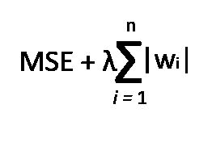

# 正则化技术及其在 TensorFlow(Keras)中的实现

> 原文：<https://towardsdatascience.com/regularization-techniques-and-their-implementation-in-tensorflow-keras-c06e7551e709?source=collection_archive---------6----------------------->

## 技术(包括代码)

## 理解用于减轻深度神经网络中过拟合问题的传统技术。


由 [Unsplash](https://unsplash.com/s/photos/machine-learning?utm_source=unsplash&utm_medium=referral&utm_content=creditCopyText) 上的 [Clarisse Croset](https://unsplash.com/@herfrenchness?utm_source=unsplash&utm_medium=referral&utm_content=creditCopyText) 拍摄的照片

# 正规化

深度神经网络(DNN)具有大量的架构内部权重参数，可以学习一系列值。这些数值范围是使神经网络能够解决巨大复杂函数的关键。

神经网络越深，其具有的代表能力就越强，但是，随着权参数数量的增加，会出现一个缺点。这个缺点是神经网络更容易过拟合训练数据集。

> **过拟合:**这个问题涉及到算法预测呈现给它的模式的新实例，基于**太接近于**它在训练期间观察和学习的模式的实例。这可能导致机器学习算法无法准确地推广到看不见的数据。如果训练数据没有准确地表示测试数据的分布，则会发生过度拟合。可以通过减少训练数据中的特征数量以及通过各种技术降低网络的复杂性来修复过度拟合

正则化技术通过限制网络中权重值的范围来降低神经网络过拟合的可能性(稍后*将详细介绍*)。

本文介绍了两种正则化策略，对损失函数的结果施加约束条件。

> **损失函数**是一种量化机器学习模型表现*有多好*的方法。量化是基于一组输入的输出(成本)，这些输入被称为参数值。参数值用于估计预测，而“损失”是预测值和实际值之间的差异。

本文不会关注正则化的数学。相反，本文介绍了一些标准的正则化方法，以及如何使用 TensorFlow(Keras)在神经网络中实现它们。

关于数学的更多细节，这些由[莱米·卡里姆](https://medium.com/u/c2958659896a?source=post_page-----c06e7551e709--------------------------------)和[雷努·汉德尔瓦尔](https://medium.com/u/31b07253bc35?source=post_page-----c06e7551e709--------------------------------)撰写的文章合理地展示了 L1 和 L2 的正则化数学。

[](https://medium.com/datadriveninvestor/l1-l2-regularization-7f1b4fe948f2) [## L1 L2 正则化

### 在这篇文章中，我们将了解为什么我们需要正规化，什么是正规化，什么是不同类型的…

medium.com](https://medium.com/datadriveninvestor/l1-l2-regularization-7f1b4fe948f2) [](/intuitions-on-l1-and-l2-regularisation-235f2db4c261) [## 对 L1 和 L2 正则化的直觉

### 他们如何防止过度拟合？

towardsdatascience.com](/intuitions-on-l1-and-l2-regularisation-235f2db4c261) 

# 正规化的类型

从上一节中，我们可以理解正则化技术作用于神经网络中的权重参数。更具体地说，它修改结果损失函数，进而修改产生的权重值。

## l1 正则化

L1 正则化对神经网络权重值的影响在于，它通过使权重值等于 0 来惩罚接近 0 的权重值。负权重值也取值为 0；所以如果一个权值是-2，在 L1 正则化的作用下，它变成 0。

L1 正则化的一般直觉是，如果权重值接近 0 或非常小，那么它对于模型的整体性能来说是可以忽略的，因此使其为 0 不会影响模型的性能，并且可以减少模型的内存容量。

*   L1 对权重的绝对值之和(|weight|)进行惩罚

我知道我说过我不会涉足数学，但是下面的数学符号应该相对容易理解。

我们有损失函数，在这种情况下，均方差。

然后我们加上权重绝对值之和与**正则化超参数值**的乘积，用λ符号()表示。

数学符号中的 *i* 表示当前权值的索引， *n* 表示层内权值的总数。 *W* 代表重量值。



L1 正则化

## l2 正则化

L2 正则化也惩罚权重值。对于较小的权重值和相对较大的权重值，L2 正则化将这些值转换为接近 0 但不完全 0 的数字。

*   l2 惩罚权重的平方和(权重)


L2 正则化

如果你要结合 L1 和 L2 正则化技术的效果，那么你将得到[‘弹性网正则化](https://en.wikipedia.org/wiki/Elastic_net_regularization)’。

正则化技术在训练过程中对神经网络产生影响，而不是进行推理。

现在我们对正则化有了一些基本的理解(*随意探索两种方法的数学*)和一些例子，让我们看看它们是如何实现的。

# 实施正规化

第一步是导入用于实现或支持神经网络实现的工具和库。

*   [**TensorFlow**](https://www.tensorflow.org/) :机器学习模型实现、训练、部署的开源平台。
*   [**Keras**](https://keras.io/) :一个开源库，用于实现运行在 CPU 和 GPU 上的神经网络架构。

```
import tensorflow as tf
from tensorflow import keras
```

我们将利用的数据集是普通的[时尚-MNIST 数据集](https://github.com/zalandoresearch/fashion-mnist)。

时尚-MNIST 数据集包含 70，000 幅服装图像。更具体地说，它包括 60，000 个训练样本和 10，000 个测试样本，这些样本都是尺寸为 28×28 的灰度图像，分为十类。

数据集的准备包括通过将每个像素值除以 255.0 来归一化训练图像和测试图像。这将像素值置于范围 0 和 1 之间。

数据集的验证部分也在此阶段创建。这组数据集在训练期间被用来评估网络在各种迭代中的性能。

```
(train_images, train_labels),(test_images, test_labels) = keras.datasets.fashion_mnist.load_data()
train_images = train_images / 255.0
test_images = test_images / 255.0validation_images = train_images[:5000]
validation_labels = train_labels[:5000]
```

接下来，我们使用 Keras Sequential API 实现一个简单的模型。我们模型中的隐藏层使用了多种正则化技术。

要添加一个正则化到一个层，你只需要把首选的正则化技术传递给层的关键字参数' kernel _ regularizer '。

Keras 正则化实现方法可以提供代表**正则化超参数值**的参数。这显示在下面的一些层中。

Keras 提供了 l1 和 l2 正则化的实现，我们将在下面的代码片段中的一些隐藏层中使用它。此外，我们包括一个利用 l1 和 l2 正则化的层。

这就是在神经网络中实现各种正则化技术的全部内容。不太难。

```
model = keras.models.Sequential([
    keras.layers.Flatten(input_shape=[28,28]),
    keras.layers.Dense(200, activation='relu', kernel_regularizer=keras.regularizers.l1()),
    keras.layers.Dense(100, activation='relu', kernel_regularizer=keras.regularizers.l2(0.001)),
    keras.layers.Dense(50, activation='relu', kernel_regularizer=keras.regularizers.l1_l2(0.01)),
    keras.layers.Dense(10, activation='softmax')
])
```

在下一段代码中，我们设置并指定用于训练已实现的神经网络的优化算法；以及损失函数和超参数，例如学习速率和时期数。

```
sgd = keras.optimizers.SGD(lr=0.01)
model.compile(loss="sparse_categorical_crossentropy", optimizer=sgd, metrics=["accuracy"])model.fit(train_images, train_labels, epochs=60, validation_data=(validation_images, validation_labels))
```

使用先前搁置的测试数据进行模型性能的评估。

通过评估结果，您可以在观察测试数据集评估的准确性后，决定微调网络超参数或继续生产。

```
model.evaluate(test_images, test_labels)
```

# 结论

如果损失函数上的正则化项被从层中排除并被训练相同数量的历元，则实现的模型可能在测试数据集上具有更好的性能。

正则化更常用于具有数百万个参数和更多特征的更深层次的神经网络中。

我希望读者现在对各种各样的正则化技术以及如何实现它们有一个直觉。

探索神经网络实现和训练中的其他正则化方法可能是令人感兴趣的，例如[退出](https://machinelearningmastery.com/dropout-for-regularizing-deep-neural-networks/)或[提前停止](https://en.wikipedia.org/wiki/Early_stopping)。

下面是本文包含的代码的 GitHub 存储库。

[](https://github.com/RichmondAlake/tensorflow_2_tutorials/blob/master/09_regularization.ipynb) [## Richmond alake/tensor flow _ 2 _ 教程

### permalink dissolve GitHub 是超过 5000 万开发人员的家园，他们一起工作来托管和审查代码，管理…

github.com](https://github.com/RichmondAlake/tensorflow_2_tutorials/blob/master/09_regularization.ipynb) [](/batch-normalization-in-neural-networks-code-d7c9b88da9f5) [## 神经网络中的批量标准化(代码)

### 通过 TensorFlow (Keras)实施

towardsdatascience.com](/batch-normalization-in-neural-networks-code-d7c9b88da9f5) [](/5-soft-skills-you-need-as-a-machine-learning-engineer-and-why-41ef6854cef6) [## 作为机器学习工程师你需要的 5 个软技能(以及为什么)

### 包括成为任何劳动力的有用组成部分的提示

towardsdatascience.com](/5-soft-skills-you-need-as-a-machine-learning-engineer-and-why-41ef6854cef6)