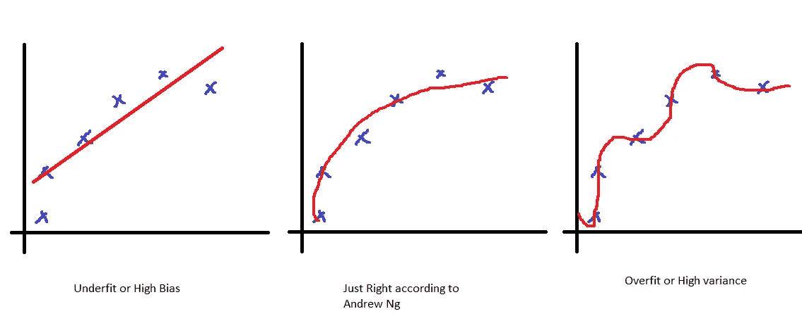

# 正规化。什么，为什么，什么时候，怎么做？

> 原文：<https://towardsdatascience.com/regularization-what-why-when-and-how-d4a329b6b27f?source=collection_archive---------14----------------------->

## 在这篇文章中，我想深入探讨一下正规化。

# 什么？

**什么是正规化？**

正则化是一种约束模型的方法，以准确地拟合我们的数据，而不是过度拟合。它也可以被认为是惩罚我们模型中不必要的复杂性。深度学习实践者主要使用 3 种类型的正则化技术。它们是:

1.  L1 正则化或拉索正则化
2.  L2 正则化或岭正则化
3.  拒绝传统社会的人

> **侧栏**:其他技术也可以对我们的模型产生正则化效果。你可以通过更多的数据来限制我们函数的搜索空间，从而防止过度拟合。这可以通过数据扩充等技术来实现，这些技术可以创建更多的数据来训练，从而减少过度拟合。
> 有许多其他解决过度拟合的方法，如集合和提前停止，它们可以帮助防止过度拟合，但不被视为正则化，因为它们不限制搜索空间或惩罚复杂性。尽管你应该记住这些，因为调整并不是解决过度拟合的唯一方法。

# 为什么？

**我们为什么需要正规化？**

图 1:欠适与过适。图片由作者提供。灵感来自[吴恩达](https://www.youtube.com/channel/UCcIXc5mJsHVYTZR1maL5l9w)

在图 1 中，我们看到 3 条曲线。左边的预测分数做得很差，右边的预测分数做得**【太好】**。我们可以直观地看出左边的图不对，但是为什么右边的不好呢？我们的模型准确预测点的位置，这不好吗？

答案是**不**，原因如下。我们的数据包含一些噪音，我们不希望我们的模型预测噪音，因为噪音是随机的。所以右边的图也不理想，我们想要像中间的图一样的东西。

拟合不足是由于我们的模型过于简单，或者训练时间不够长造成的。过度拟合是一个更难的问题。
过度拟合可能是由于过于复杂的模型(学习噪音)造成的，或者是我们的模型函数的搜索空间太大，我们没有足够的数据来限制搜索。

所以正则化是一种停止过度拟合的方法。

# 什么时候？

**我们什么时候使用正规化？**

每当我们怀疑我们的模型过度拟合时，我们就使用正则化。过度拟合的最大迹象是验证指标的糟糕表现。验证集是模型尚未看到的数据集的一部分。

因为我们想检测我们的模型是仅从数据中学习，还是受到噪声的严重影响，所以我们使用噪声与训练集不同的验证集。因此，如果我们的模型过度拟合训练数据，它将在我们的验证集上预测不佳。

在培训期间，我们还会不断测量验证指标。如果我们看到验证指标没有显著提高，或者恶化，这是我们的模型过度拟合的警告信号。然后我们需要应用正则化技术。

> **注意**:有些规则化技术没有缺点，应该一直使用**。这方面的一个例子是数据扩充。使用数据扩充没有坏处，无论模型是否过度拟合都应该使用。**

# **怎么会？**

****L1 正规化****

**L1 正则化通过添加基于由某个值 l(通常称为λ)缩放的参数的绝对值的惩罚来工作。**

**最初我们的损失函数是: **Loss = f(preds，y)** 其中 *y 是目标输出，preds 是预测**preds = WX+b*，其中 *W 是参数，X 是输入，b 是偏差。***

**对于 L1 正则化，我们添加了 l*|W|的额外项，其中 W 是权重矩阵(参数)。因此，L1 正则化后的损失函数为**

> **损失= f(preds，y) + l*abs(W)**

****L2 正规化****

**L2 正则化非常类似于 L1 正则化，除了罚项是由某个因子 l(λ)缩放的参数的平方**

> **损失= f(preds，y) + l*(W)**

*****L1 与 L2 正规化的区别*****

**L1 正则化和 L2 正则化之间的区别在于，损失函数相对于 L1 正则化的参数的梯度与参数的**无关，因此一些参数可以一直设置为零，因此完全被忽略。****

**但是在 L2 正则化中，损失函数的梯度**线性地依赖于参数**，因此参数不可能为零。它们只是渐近地接近零。这意味着没有一个参数被完全忽略，每个参数对预测的影响总是最小的。**

**这种差异是选择正规化类型的关键，如果你知道你有无用的功能，L1 可能是一个更好的选择。如果你想考虑所有的功能，L2 可能是一个更好的选择。**

> **细微差别:深度学习中有一个细微差别，通过使用 L1 和 L2 正则化，可以使用两全其美的方法。这被称为弹性网正则化。**

****辍学****

**[Dropout](https://www.cs.toronto.edu/~hinton/absps/JMLRdropout.pdf) 是一种神奇的正则化技术，只对神经网络有效(据我所知)。dropout 的惊人想法是以概率 p (p 是超参数)随机地将输入张量的一些元素归零。**

**这背后的直觉很简单，当我们的模型太复杂时会出现过度拟合，那么我们如何简化模型呢？只是不要用一些神经元然后嘭！！实现了一个更简单的模型。**

**我们发现辍学在实践中非常有效，并且易于实施。我绝对推荐试一试。**

****数据扩充****

**数据扩充是我们正规化的最终“方法”。数据扩充背后的想法非常简单，但极其优雅。**

**我们知道过度拟合是由于在我们的最优函数的搜索空间中缺乏约束而引起的。我们如何添加更多约束？更多数据。
但是为我们的问题收集更多的数据可能是一项耗时且艰巨的任务。这就是数据增强的用武之地。**

**数据扩充的想法是从我们已经拥有的数据中创造更多的数据。方法是对我们的图像进行一些变换，改变图像，使同一图像有不同的多个版本。神奇的是，我们有了更多的数据。**

**我最喜欢的深度学习库( [fastai](https://www.fast.ai/) )提供的数据增强列表可以在这里[看到](https://docs.fast.ai/vision.augment)。**

# **结论**

**检查你的模型是否过度拟合，使用上述正则化方法之一来避免过度拟合。始终使用数据增强！！鳍。**