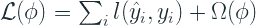
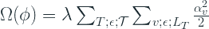
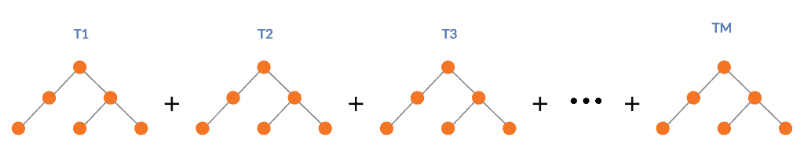
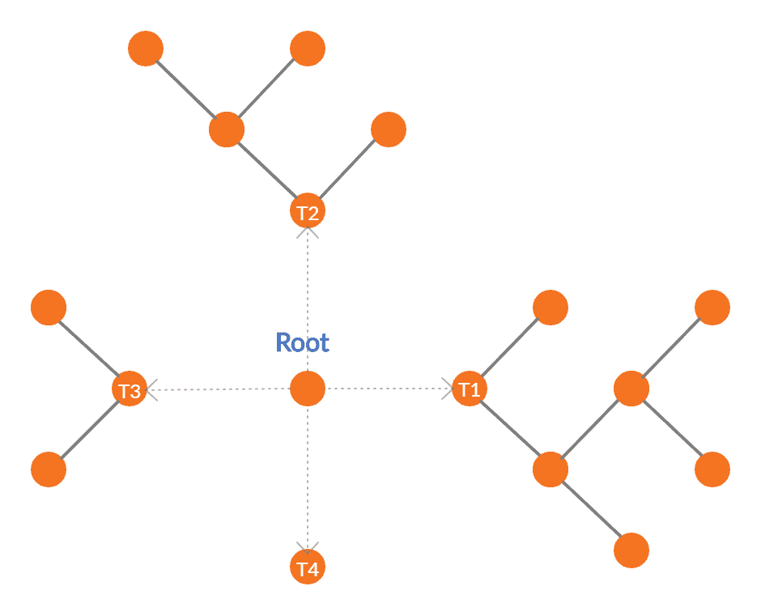
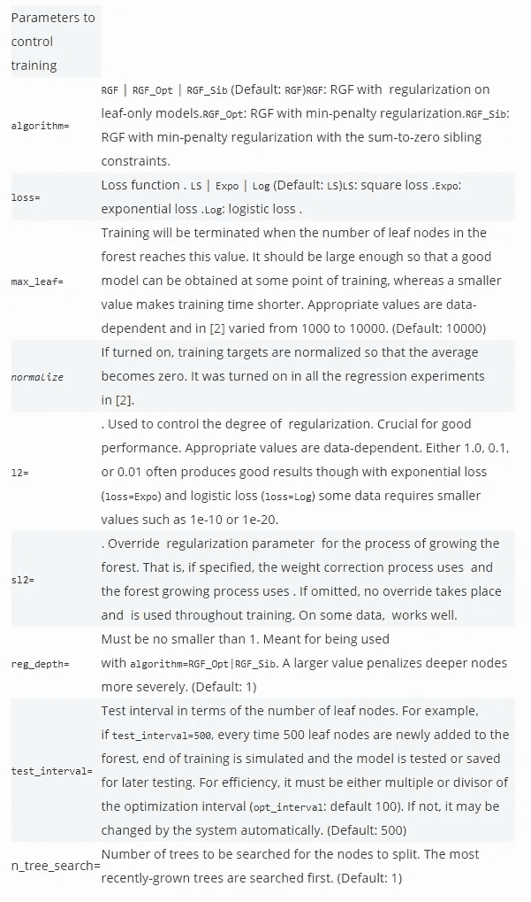
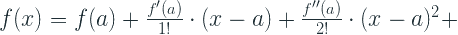
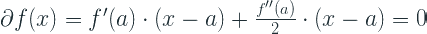
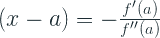

# 正则贪婪森林

> 原文：<https://towardsdatascience.com/regularized-greedy-forest-a17cd0c85f06?source=collection_archive---------32----------------------->

## [梯度助推器](http://towardsdatascience.com/tagged/the-gradient-boosters)

## 修改赢得许多卡格尔比赛的 GBM

来源: [Unsplash](https://unsplash.com/photos/-IZ2sgQKIhM)

2011 年，Rie Johnson 和张彤提出了对梯度推进模型的修改。他们称之为[正规化的贪婪森林](https://github.com/RGF-team/rgf)。当他们进行修改时，GBDTs 已经在某种程度上统治了表格世界。他们测试了各种数据集的新修改，包括合成和真实世界，并发现他们的修改比标准 GBDTs 实现了更好的性能。他们还参加了一些 Kaggle 类型的比赛([债券价格挑战](https://www.kaggle.com/c/benchmark-bond-trade-price-challenge)、[生物反应预测](https://www.kaggle.com/c/bioresponse)和遗产提供商网络健康奖)，并在比赛中击败了其他 GBDT 模特。

他们建议的核心 GBDT 算法的关键修改如下:

# 完全正确的贪婪更新

根据 Friedman[1]的说法，标准梯度提升的缺点之一是收缩/学习率需要很小才能实现收敛。事实上，他主张无限小的步长。他们建议进行修改，使收缩参数变得不必要。

在标准梯度推进中，该算法在每次迭代中执行部分校正步骤。该算法仅在当前迭代中优化基础学习器，而忽略所有先前的学习器。它为当前时间步长创建最佳回归树，并将其添加到集合中。但是他们建议在每次迭代中，我们更新整个森林( *m* 基础学习者用于迭代 *m* )并且在每次迭代中重新调整比例因子。

# 结构化稀疏正则化

虽然完全校正的贪婪更新意味着算法将更快地收敛，但也意味着它过拟合得更快。因此，结构化稀疏正则化被用来解决这个问题。结构化稀疏性的一般思想是，在假设稀疏解的情况下，可以利用任务背后的稀疏结构。在这个特定的设置中，它被实现为在森林结构中对决策规则的稀疏搜索。

# 显式正则化

除了结构化稀疏正则化，他们还包括一个损失函数显式正则项。

其中 *l* 是可微凸损失函数，ω是惩罚树结构复杂性的正则化项，ϕ是森林结构。

本文介绍了三种类型的正则化选项:

# 树叶的 L2 正则化

其中ϕ是森林结构，λ是用于控制正则化强度的常数，αᵥ是节点 v 的权重(其被限制为叶节点)，Lₜ是树 t 的叶，𝒯是森林中所有树的集合。

实现中超参数: *l2*

# 最小惩罚正则化

最小惩罚正则化惩罚树的深度。这是一种正则化，它作用于所有节点，而不仅仅是树叶。这使用了任何叶节点都可以根据其祖先节点来编写的原则。正则化背后的直觉是它惩罚深度，这在概念上是一个复杂的决策规则。

确切的公式超出了我们的范围，但是这里的关键超参数是 *l2* ，它控制正则化的整体强度，以及 *reg_depth* ，它控制惩罚树的深度的严厉程度。 *l2* 的建议值为 1、0.1、0.01，而 *reg_depth* 应为大于 1 的值

# 兄弟和为零的最小惩罚正则化

这非常类似于最小惩罚正则化，但是增加了一个条件，即兄弟节点的权重总和应该为零。总和为零约束背后的直觉是，冗余较少的模型是优选的，并且当内部节点处的分支导致完全相反的动作时，模型是最不冗余的，例如将“x”加到输出值而不是从输出值中减去“x”。所以这不利于两件事——树的深度和树的冗余度。这里没有额外的超参数。

**注意:**这里要注意的一个有趣的花絮是，论文和竞赛中的所有 bechmarks 都只使用了简单的 L2 正则化。

# 算法

总的概念仍然类似于梯度推进，但是关键的区别在于每次迭代中的树更新。并且由于目标函数中的正则化项，简单方便的均值或中值导数或梯度不再起作用。

让我们看看新的算法，尽管是在一个高层次上。

1.  重复

1.1 ϕ是通过对当前森林ϕ应用一步结构改变操作可获得的所有森林中最小化ℒ(ϕ的最佳森林)

1.2 优化ϕ的叶片重量以最小化损失(ℒ(ϕ)

2.直到满足一些退出标准

3.优化ϕ的叶子重量以最小化损失ℒ(ϕ)

4.返回ϕ

# 树构建策略

在规则贪婪森林中，树的建造方式有一个关键的不同。在经典的梯度推进中，在每个阶段都会建立一棵新树，并有一个特定的停止标准，比如深度或叶子的数量。一旦你通过了一个阶段，你不能碰那棵树或与之相关的重量。相反，在 RGF，在任何 m 次迭代中，更新任何先前创建的 m-1 树或开始一个新树的选项是开放的。对森林的确切更新由最小化损失函数的动作来确定。

让我们看一个例子来理解梯度增强和正则化贪婪森林在树构建上的根本区别

梯度推进的树构建过程(来源:自有图解)

正则化贪婪森林的树构建过程(来源:自己的插图灵感来自论文[2])

标准的梯度提升建立连续的树，并将这些树相加成为近似期望函数的加法函数。

RGF 采取了稍微不同的路线。对于树结构中的每一步变化，它评估在现有树中生长新叶与借助损失函数开始新树的可能性，然后采取贪婪的方法来选择损失最小的路线。所以在上图中，我们可以选择在 T1，T2 或 T3 种植树叶，或者我们可以开始一个新的 T4 树，这取决于哪一个给你最大程度的减少损失。

但实际上，这样做在计算上是有挑战性的，因为随着我们越来越深入森林，要评估的可能分裂呈指数增长。因此，在实现中有一个超参数， *n_tree_search* ，它将树的回溯更新限制为仅那些最近的树。默认值设置为 1，以便更新总是查看一个先前创建的树。在我们的例子中，这降低了在 T3 长出叶子或在 T4 长出新树的可能性。

从概念上讲，与森林中树木的加法函数相比，这变成了森林树叶的加法函数，因此，在 RGF 中没有 max_depth 参数，因为树的深度自动受到对树结构的增量更新的约束。

下一步是被选为最佳结构变化的新叶的权重。这是一个优化问题，可以使用多种方法中的任何一种来解决，如梯度下降法或牛顿-拉夫森法。因为我们正在寻找的优化更简单，所以本文使用了比梯度下降更精确的牛顿步来获得新叶的近似最优权重。如果你对我们如何以及为什么需要牛顿步来优化这些函数感兴趣，请参考附录 A。

# 重量优化

在基础学习器或基础函数固定的情况下，我们需要优化森林中所有叶子的权重。这又是一个优化问题，使用坐标下降法来解决，坐标下降法迭代遍历每片叶子，并以较小的步长通过牛顿步长来更新权重。

因为已经设置的初始权重是近似最优的，所以我们不需要每次迭代都重新优化权重。如果我们这样做，计算成本会很高。这是实现中的另一个超参数，称为 *opt_interval* 。根据经验，观察到除非 *opt_interval* 是极值，否则 *opt_interval* 的选择并不重要。对于他们赢得的所有比赛，他们只是简单地将值设置为 100。

# 关键超参数和调整

以下是论文作者建议的关键超参数列表。它几乎是直接取自他们的 Github 页面，但是被采用到 Python 包装器中。

# 附录 A

## 泰勒近似和牛顿-拉夫逊最优化方法

Youtube 频道 3Blue1Brown(如果你想要对数学有基本的直觉，我强烈推荐它)有另一个精彩的视频来解释泰勒展开/近似。请务必至少观看视频的前 6 分钟。

泰勒近似法让我们通过使用函数的导数来近似一个接近于一点的函数。

假设我们进行二阶近似，并找到一个局部最小值，我们可以通过设置导数为零来实现

将其设置为零，我们得到:

这(x-a)是最小化该点函数的最佳步骤。所以，这个最小值更像是朝向最小值的**步进方向**而不是实际的最小值。

为了优化不可微函数，我们需要在步长方向上采取多步，直到我们对损失相对满意，或者从技术上来说，直到损失低于我们的容差。这被称为优化的**牛顿-拉夫森方法**。

*梯度助推器*中的其他文章

*   [良好的旧梯度增强](/the-good-old-gradient-boosting-f4614b0e62b0)
*   正规化的贪婪森林(你在这里)

参考

1.  贪婪函数近似:一种梯度推进机器。安。统计学家。29 (2001 年)，第 5 号，1189-1232。
2.  Johnson，Rie & Zhang，Tong，“利用正则化贪婪森林学习非线性函数”，[*《IEEE 模式分析与机器智能汇刊》*](https://ieeexplore.ieee.org/xpl/RecentIssue.jsp?punumber=34) *(卷:36，* [*期:5*](https://ieeexplore.ieee.org/xpl/tocresult.jsp?isnumber=6809246) *，2014 年 5 月*。

*原载于 2020 年 2 月 9 日 http://deep-and-shallow.com***。**