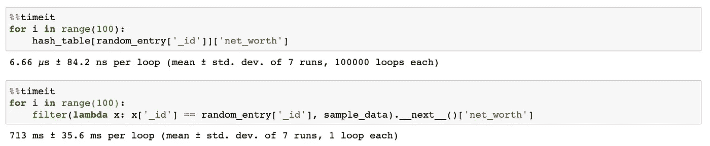

# 用 JavaScript 重新实现流行的 Python 功能

> 原文：<https://towardsdatascience.com/reimplementing-popular-python-functionalities-in-javascript-b3cfe8e7849f?source=collection_archive---------20----------------------->

## 学习如何应对一个新的世界，并充分利用现有的工具。


照片由[艾蒂安·德洛里欧](https://unsplash.com/@etiennedelorieux?utm_source=medium&utm_medium=referral)在 [Unsplash](https://unsplash.com?utm_source=medium&utm_medium=referral) 上拍摄

我的第一语言是 Python。我喜欢 Python 的多功能性、易用性和精彩的社区。

几个月前，我开始冒险深入 JavaScript 丛林，因为我已经开始构建 [ViTeach](http://www.viteach.de) (目前只有德语版本)。ViTeach 是一个数学平台，旨在使用机器学习和自然语言处理来快速跟踪和个性化数学学习。但是这篇文章不是为了宣传我的项目。这篇文章是关于我在使用 JavaScript 时错过的一些基本的 Python 功能。但不要担心，经过一段时间的语言适应后，事情开始变得非常相似。

在本文中，我们将讨论三种常见的模式/功能，对于来自 Python 的人来说，它们在 JavaScript 中并不十分明显:

*   **范围**
*   **列出理解**
*   **字典理解**(并使用结果来获得大型数组操作的性能提升)

# ①范围


Ashkan Forouzani 在 [Unsplash](https://unsplash.com?utm_source=medium&utm_medium=referral) 拍摄的照片

让我感到惊讶的第一件事是 JavaScript 没有 Python 钟爱的`range`的实现。Python 中的 range 函数返回一个所谓的 sequence 对象，这就是为什么我们必须将它解析为一个列表(或者循环遍历它)来打印出值(例如，在 Jupyter 笔记本中)。但是大多数情况下，您无论如何都只是迭代这些值，因此很少需要 step。`range`为 0 索引，取:

*   一个(最大)，
*   两个(最小和最大)，
*   或者三个参数(最小值、最大值和步长)。

请注意，`range`的参数是*位置参数* (args)，而不是*关键字参数* (kwargs)。

## 计算机编程语言

```
**IN: (One Argument - only max value)** list(range(10))
**OUT:** [0, 1, 2, 3, 4, 5, 6, 7, 8, 9]**IN: (Two Arguments - min and max value)** list(range(3,11))
**OUT:** [3, 4, 5, 6, 7, 8, 9, 10]**IN: (Three Arguments - min, max and step value)** list(range(7,34,3))
**OUT:** [7, 10, 13, 16, 19, 22, 25, 28, 31]
```

## Java Script 语言

尤普，JavaScript 中没有`range`函数。对于第一种情况(仅 max ),我们可以得到最接近的结果如下:

```
**IN:** [...Array(5).keys()]
**OUT:** [0,1,2,3,4]
```

真的吗？！？这里到底发生了什么？让我们仔细分析一下。首先，我们实例化一个长度为 5 的数组(`Array(5)`)。此时，数组的每个值都是`undefined`。然后我们通过`.keys()`得到每个元素的索引(即在数组中的位置)，最后通过`destructuring` ( `…`)操作符`destructure`将索引列表放到一个新的数组中，从而创建一个浅层副本。哇，那确实是一把。

第二种情况(min 和 max)和第三种情况(min、max 和 step)需要更多的自定义逻辑，这就是为什么我决定编写我的实现，并在此后的几乎每个项目中使用它。

```
const range = (min, max, steps = 1) => {**// Step 1)**
  const arr = Array.from(
    new Array(max - min), 
    (_, idx) => idx + min
  );**// Step 2)**
  return arr.filter((_, idx) => idx % steps === 0);
};**IN:** range(3,11)
**OUT:** [3, 4, 5, 6, 7, 8, 9, 10]**IN:** range(7,34,3)
**OUT:** [7, 10, 13, 16, 19, 22, 25, 28, 31]
```

让我们快速解释一下这是干什么的:

1.  `Array.from()`接受一个数组和一个映射函数，并将该函数应用于一个类似数组或可迭代对象的每个元素，想想 Python 中的`[func(idx,val) for (idx,val) in enumerate(arr)]`。我们给每个值加上最小值，现在有了一个从最小值到最大值的列表。注意，除了`new Array(max-min)`，我们还可以使用之前使用的函数(`[...Array(max-min).keys()]`)，但是正如我提到的，我发现语法有点奇怪。
2.  `arr.filter()`过滤我们的数组，使得结果数组只包含符合过滤标准的元素。在我们的例子中,`idx`,即数组模步长中的位置必须是 0(即该数必须是没有余数的整除数)。因此只取每第 n 个元素(其中 n =步长)

# ②列表理解


尼克·希利尔在 [Unsplash](https://unsplash.com?utm_source=medium&utm_medium=referral) 上拍摄的照片

对我来说，列表理解是 Python 的主要特征之一，也是 Python 编码方式的象征。它们允许去掉 for 循环，这通常会使代码更加易读和简洁。让我们看看一些常见的使用案例。

## 计算机编程语言

典型的情况是**从数组中过滤**元素，然后返回一个只包含满足条件的元素的数组(例如，类型检查)。

```
**IN:**
values = [1,2,3,5,"x",10]
[_ for _ in values if isinstance(_,int)]**OUT:** [1, 2, 3, 5, 10]
```

另一个主要用例是**对列表中的每个元素**应用一个函数，返回一个包含更新值的新列表，如下所示:

对列表中的每个元素应用一个函数

额外收获:你甚至可以像这样做嵌套列表理解:

```
**IN:**
matrix = [
  [1, 2], 
  [3, 4], 
  [5, 6], 
  [7, 8]
]multiply_by_two = [
  [cell * 2 for cell in row] for row in matrix
]**OUT:** [
  [2 , 4 ], 
  [6 , 8 ], 
  [10, 12], 
  [14, 16]
]
```

## Java Script 语言

pythonic 列表理解语法确实存在于 JavaScript 中，尽管只是在实验版本中。ECMAScript 4 曾讨论过这个问题，但在 ECMAScript 6 中被永久放弃了。他们可能会在未来带回某种形式的一般理解(即适用于所有可重复的作品)。但是现在，箭头函数和`**map, filter and find**` 就可以了。让我们回顾一下前面的例子。我将使用`_`作为标记“丢弃变量”的一种方式(因为下划线不会占用太多空间)。让我们从**过滤**开始:

```
**IN:**
const values = [1,2,3,5,"x",10]
values.**filter**(_ => Number.isInteger(_))**OUT:** [1, 2, 3, 5, 10]
```

`filter`的一个特例是`find`，我发现它非常有用。Find 返回匹配条件的第一个元素。

```
**IN:**
const values = [1,2,3,5,"x",10]
values.**find**(_ => _ > 4)**OUT:** 5
```

**注意:**如果没有元素满足条件:

*   `**find**` 将返回`**undefined**`**(**falsy**value)**
*   **而`**filter**`将返回`**[]**`**(**truthy value**)这在 Python 中尤其奇怪，在 Python 中空数组肯定是错误的——我提到过 JavaScript 有时很奇怪吗？)****

****接下来是对列表中的每个元素应用函数。通过`**map**`可以轻松实现该功能。****

******对数组中的每个元素应用 JavaScript 函数******

# ****③词典理解****

********

****照片由[粘土堤](https://unsplash.com/@claybanks?utm_source=medium&utm_medium=referral)在 [Unsplash](https://unsplash.com?utm_source=medium&utm_medium=referral) 拍摄****

****比列表理解稍微不常见的是字典理解，我发现它在构建映射对象时非常强大。假设有一个场景，在这个场景中，你有一个列表中的 **lot** 个对象，假设所有的对象都有**个唯一的 id**和其他一些数据，如下所示:****

```
**{
  '_id': '850f200c0b8f4b0ea80513e71fad93a0',
  'name': 'qHvbtkRxrj',
  'net_worth': 32000
}**
```

****假设您从数据库中获得了这个列表，并希望进行一些基于 id 的操作。然后你将不得不无数次地遍历这个列表。更简单的方法是将列表转换成哈希表，其中`_id`成为键，对象本身成为值。****

```
**hash_table = {
...,
'**850f200c0b8f4b0ea80513e71fad93a0**': {
  '_id': '**850f200c0b8f4b0ea80513e71fad93a0**',
  'name': 'qHvbtkRxrj',
  'net_worth': 32000
},
...
}**
```

****现在，当我们想要改变一个特定条目的净值时，我们可以通过它的 _id 快速查找，改变对象，因为对象的条目是通过引用存储的，因此改变了原始列表。****

******巨蟒******

******Python 中的字典理解******

****当然，您也可以使用新生成的 hash_table 来快速检索特定 _id 的`net_worth`。与一次又一次地查找 _ids 相比，使用散列表带来了巨大的性能提升 **(10⁵)** 。****

********

******通过使用哈希表提高因子 1⁰⁵的性能******

## ****Java Script 语言****

****JavaScript 中的字典理解比 Python 中的稍微复杂一点，但实现起来仍然相当简单。我们将使用`reduce`来达到预期的结果。`Reduce`取一个初始值，然后遍历数组中的所有值，不断更新初始值。****

******JavaScript 中的字典理解******

****在这篇文章中，你学习了如何在冒险进入一个新的、看似可怕的世界时找回一些工具。****