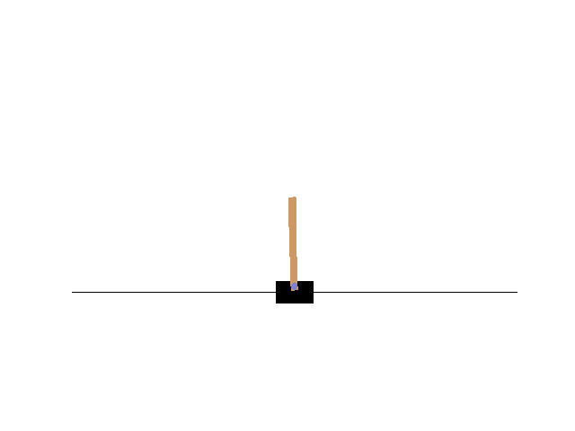

# 使用 TensorFlow2.x(加强)策略梯度

> 原文：<https://towardsdatascience.com/reinforce-policy-gradient-with-tensorflow2-x-be1dea695f24?source=collection_archive---------14----------------------->

## 使用 TensorFlow 2.x 实施增强(PG)

在本文中，我们将尝试理解称为加强的策略梯度算法背后的概念。然后，我们将查看 TensorFlow 2.x 中算法的代码。让我们首先了解什么是策略梯度，然后我们将了解一种特定的策略梯度方法，也称为增强。

## 什么/为什么是政策梯度？

到目前为止，我们一直在学习状态-动作对的 Q 值。策略梯度算法不是先学习 Q 值再找一个策略，而是直接学习一个策略。但是为什么呢？让我们找出答案

1.  学习策略导致更好的收敛，同时遵循梯度。而基于价值的方法在行动选择上可能会有很大的变化，即使在价值评估上有很小的变化。
2.  这些算法对于像自动飞行无人机或自动驾驶汽车这样的大量动作非常有用。
3.  可以学习随机政策。

# 算法和实现

加强是一种蒙特卡罗策略梯度方法，它在每一集之后进行更新。我们的神经网络将当前状态作为输入，输出所有动作的概率。我们可以通过调整代理网络的权重来优化我们的策略，以便在某个状态下选择更好的行动。通过对我们的目标函数执行梯度上升来调整这些权重。

让我们看看代码。

神经网络:

我们的模型实现如下。**请** **注意**最后一层包含 **softmax** **激活**，输出每个动作的概率。

动作选择:

1.  通过输入状态数组获得预测概率。
2.  我们利用 TensorFlow 概率库将概率转化为分布。
3.  然后我们从分布中抽取行动样本。
4.  然后我们作为一个整体回到行动。

为了更好地理解，让我们先来看看主要的训练。

主训练循环:

1.  我们维护了三个记录状态、奖励和行动的列表。
2.  每集之后都要训练模型。

学习功能:

1.  该函数将状态、动作和奖励列表作为参数。
2.  我们将从奖励列表的最后一个元素开始循环。
3.  然后，我们将计算每个州的预期累积奖励，就像我们在表格蒙特卡罗方法中所做的那样。
4.  然后，我们计算损失的梯度和应用优化。

损失函数:

1.  损失是所选行动的对数概率乘以该州的折现回报的负数。
2.  请注意，这里的负号意味着我们正在执行梯度上升。

代码就这么多了，你可以在这里找到完整代码[。让我们讨论一下政策梯度的一些弊端。](https://github.com/abhisheksuran/Atari_DQN/blob/master/Reinforce_(PG).ipynb)

## 缺点:

1.  很多时候，政策梯度收敛于局部极大值。
2.  政策梯度法需要很长时间的训练。

所以，本文到此结束。谢谢你的阅读，希望你喜欢并且能够理解我想要解释的东西。希望你阅读我即将发表的文章。哈里奥姆…🙏

# 参考资料:

 [## 强化学习

### 由阿尔伯塔大学提供。强化学习专业化包括 4 门课程探索权力…

www.coursera.org](https://www.coursera.org/specializations/reinforcement-learning)  [## 强化学习，第二版

### 显着扩大和更新的广泛使用的文本强化学习的新版本，最…

mitpress.mit.edu](https://mitpress.mit.edu/books/reinforcement-learning-second-edition)  [## 关于政策梯度的介绍

### 托马斯·西蒙尼尼对政策梯度的介绍

www.freecodecamp.org](https://www.freecodecamp.org/news/an-introduction-to-policy-gradients-with-cartpole-and-doom-495b5ef2207f/)  [## 机器学习的冒险——学习和探索机器学习

### 由 admin |深度学习、策略梯度、强化学习、TensorFlow 2.0 在最近的一系列帖子中，我…

adventuresinmachinelearning.com](https://adventuresinmachinelearning.com)